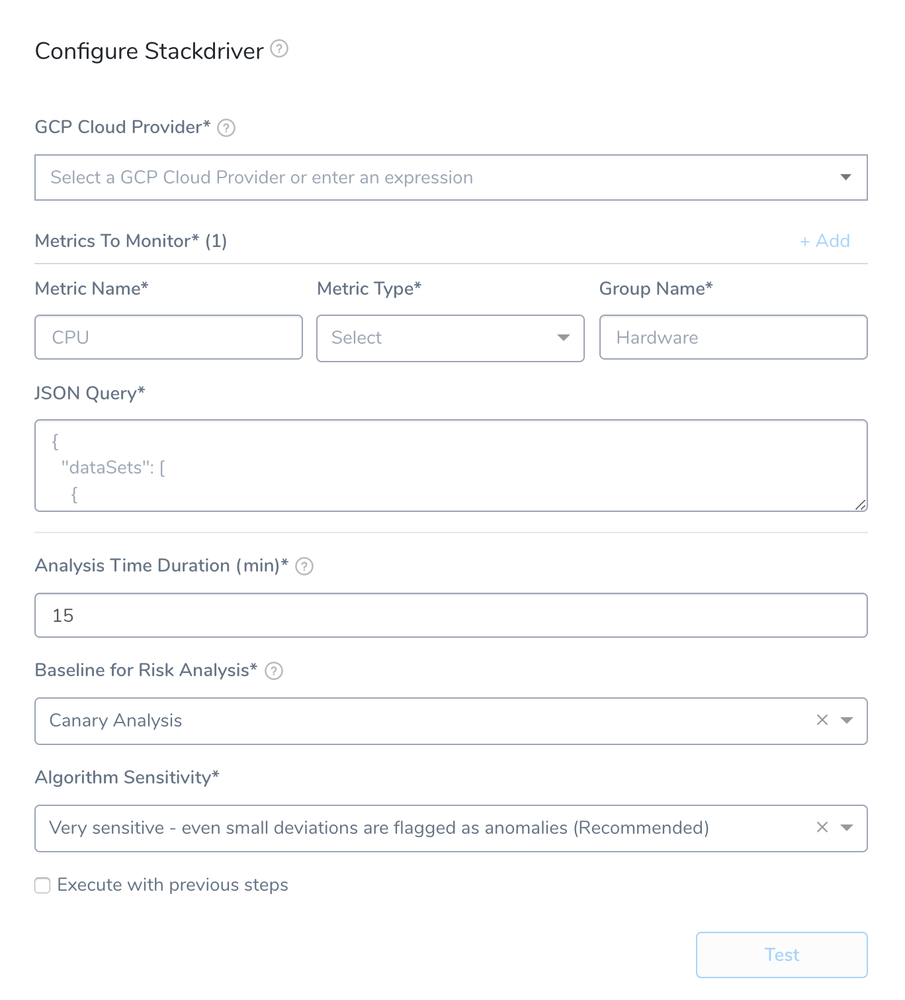
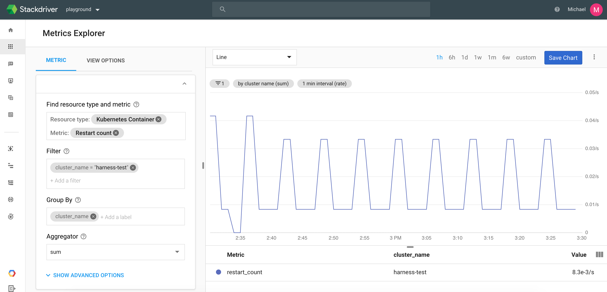
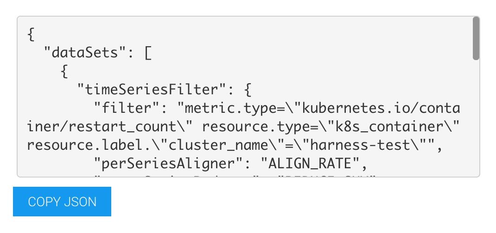
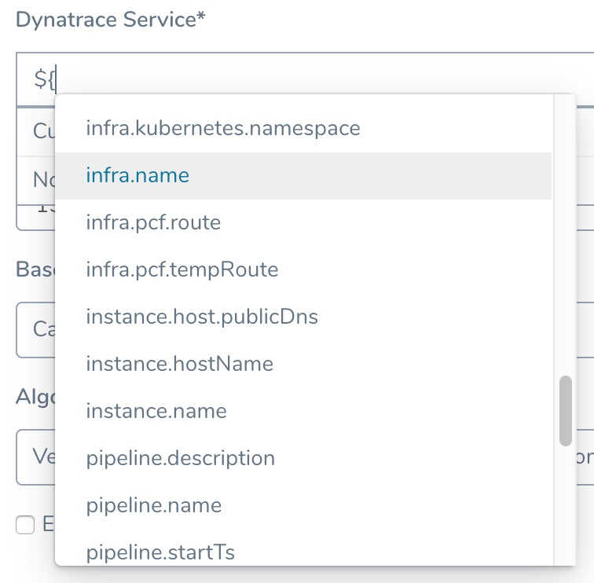

Harness can analyze Stackdriver data and analysis to verify, rollback, and improve deployments. To apply this analysis to your deployments, you set up Stackdriver as a verification step in a Harness Workflow.

This topic covers the process to set up Stackdriver Metrics in a Harness Workflow, and provides a summary of Harness verification results.

In order to obtain the names of the host(s), pod(s), or container(s) where your service is deployed, the verification provider should be added to your workflow *after* you have run at least one successful deployment.

### In this topic:

* [Before You Begin](#before_you_begin)
* [Visual Summary](#visual_summary)
* [Step 1: Set up the Deployment Verification](#step_1_set_up_the_deployment_verification)
* [Step 2: Metrics to Monitor](#step_2_metrics_to_monitor)
* [Step 3: Metric Name, Metric Type, and Group Name](#step_3_metric_name_metric_type_and_group_name)
* [Step 4: JSON Query](#step_4_json_query)
* [Step 5: Analysis Time Duration](#step_5_analysis_time_duration)
* [Step 6: Baseline for Risk Analysis](#step_6_baseline_for_risk_analysis)
* [Step 7: Execute with Previous Steps](#step_7_execute_with_previous_steps)
* [Step 8: Verify Your Settings](#step_8_verify_your_settings)
* [Review: Harness Expression Support in CV Settings](#review_harness_expression_support_in_cv_settings)
* [Step 9: View Verification Results](#step_9_view_verification_results)
* [Next Steps](#next_steps)

### Before You Begin

* Set up a Harness Application, containing a Service and Environment. See [Create an Application](https://docs.harness.io/article/bucothemly-application-configuration).
* See the [Stackdriver Verification Overview](../continuous-verification-overview/concepts-cv/stackdriver-and-harness-overview.md).

### Visual Summary

Here's an overview of Stackdriver Metrics setup for verification.



### Step 1: Set up the Deployment Verification

To verify your deployment with Stackdriver, do the following:

1. Ensure that you have added Google Cloud Platform as a Cloud Provider provider, as described in [Connect to Stackdriver](stackdriver-connection-setup.md).
2. In your Workflow, under **Verify Service**, click **Add Step**.
3. In the resulting **Add Step** settings, select **Performance Monitoring** > **Stackdriver**.
4. Click **Next**. The **Configure****Stackdriver** settings appear.
5. In **GCP Cloud Provider**, select the [Google Cloud Platform (GCP) Cloud Provider](https://docs.harness.io/article/whwnovprrb-cloud-providers#google_cloud_platform_gcp) you set up in Harness.
6. You can also enter variable expressions, such as: `${serviceVariable.stackdriver_connector_name}`.

### Step 2: Metrics to Monitor

In this section you define the Stackdriver metrics you want to monitor. For example, here is a Stackdriver Metrics Explorer configured to monitor Kubernetes container restarts, filtered by a cluster name and grouped by cluster.



To reproduce these settings in **Metrics To Monitor**, you simply copy its filter and group by details via its JSON.

### Step 3: Metric Name, Metric Type, and Group Name

In **Metric Name**, enter a name to identify the metric in Harness, such as **Restarts**. This is not the Stackdriver-specific name of a metric.

In **Metric Type**, select the type of metric to monitor, such as **Infra**.

In **Group Name**, enter a name for grouping the metrics in Harness, such as **PodRestarts**. The Group Name is useful when you want Harness to monitor multiple metrics, and be able to group them.

### Step 4: JSON Query

Paste in the JSON query from Stackdriver Metrics Explorer.

Make sure you provide `${host}` string for filtering in the query. For example: `resource.label.\"pod_name\"=\"${host}\""`.

In Stackdriver Metrics Explorer, once you have your metric query set up, click the **View as JSON** option.


Next, click **COPY JSON**.



In Harness Stackdriver Metrics, in **JSON Query**, paste in the JSON.

Here is an example using the `${host}` expression:


```
  "dataSets": [  
    {  
      "timeSeriesFilter": {  
        "filter": "metric.type=\"kubernetes.io/container/memory/limit_utilization\" resource.type=\"k8s_container\" resource.label.\"cluster_name\"=\"harness_test\" resource.label.\"pod_name\"=\"${host}\"",  
        "minAlignmentPeriod": "60s",  
        "unitOverride": "1",  
        "aggregations": [  
          {  
            "perSeriesAligner": "ALIGN_MEAN",  
            "crossSeriesReducer": "REDUCE_SUM",  
            "groupByFields": []  
          },  
          {  
            "crossSeriesReducer": "REDUCE_NONE"  
          }  
        ]  
      },  
      "targetAxis": "Y1",  
      "plotType": "LINE"  
    }  
  ],  
  "options": {  
    "mode": "COLOR"  
  },  
  "constantLines": [],  
  "timeshiftDuration": "0s",  
  "y1Axis": {  
    "label": "y1Axis",  
    "scale": "LINEAR"  
  }  
}
```
### Step 5: Analysis Time Duration

Set the duration for the verification step. If a verification step exceeds the value, the workflow [Failure Strategy](https://docs.harness.io/article/m220i1tnia-workflow-configuration#failure_strategy) is triggered. For example, if the Failure Strategy is **Ignore**, then the verification state is marked **Failed** but the workflow execution continues.

See [CV Strategies, Tuning, and Best Practices](../continuous-verification-overview/concepts-cv/cv-strategies-and-best-practices.md#analysis-time-duration).

### Step 6: Baseline for Risk Analysis

See [CV Strategies, Tuning, and Best Practices](../continuous-verification-overview/concepts-cv/cv-strategies-and-best-practices.md).

### Step 7: Execute with Previous Steps

Check this checkbox to run this verification step in parallel with the previous steps in **Verify Service**.

### Step 8: Verify Your Settings

Click **Test** to confirm your settings. In the testing assistant, select a host and click **Run**. When you have confirmed your settings, click **Submit**.

The Stackdriver verification step is added to your Workflow.

### Review: Harness Expression Support in CV Settings

You can use expressions (`${...}`) for [Harness built-in variables](https://docs.harness.io/article/7bpdtvhq92-workflow-variables-expressions) and custom [Service](https://docs.harness.io/article/eb3kfl8uls-service-configuration) and [Workflow](https://docs.harness.io/article/766iheu1bk-add-workflow-variables-new-template) variables in the settings of Harness Verification Providers.



Expression support lets you template your Workflow verification steps. You can add custom expressions for settings, and then provide values for those settings at deployment runtime. Or you can use Harness built-in variable expressions and Harness will provide values at deployment runtime automatically.

### Step 9: View Verification Results

Once you have deployed your Workflow (or Pipeline) using the Stackdriver verification step, you can automatically verify performance across your deployment. For more information, see [Add a Workflow](https://docs.harness.io/article/m220i1tnia-workflow-configuration) and [Add a Pipeline](https://docs.harness.io/article/zc1u96u6uj-pipeline-configuration).

#### Workflow Verification

To see the results of Harness machine-learning evaluation of your Stackdriver verification, in your workflow or pipeline deployment you can expand the **Verify Service** step and then click the **Stackdriver** step.


#### Continuous Verification

You can also see the evaluation in the **Continuous Verification** dashboard. The Workflow verification view is for the DevOps user who developed the workflow. The **Continuous Verification** dashboard is where all future deployments are displayed for developers and others interested in deployment analysis.

### Next Steps

* [Configuration as Code](https://docs.harness.io/article/htvzryeqjw-configuration-as-code)
* [Users and Permissions](https://docs.harness.io/article/ven0bvulsj-users-and-permissions)
* [CV Strategies, Tuning, and Best Practices](../continuous-verification-overview/concepts-cv/cv-strategies-and-best-practices.md)

