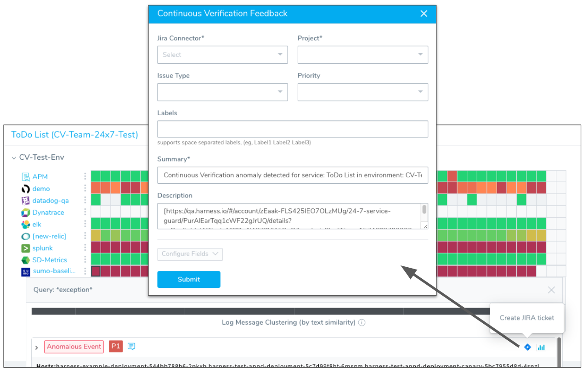
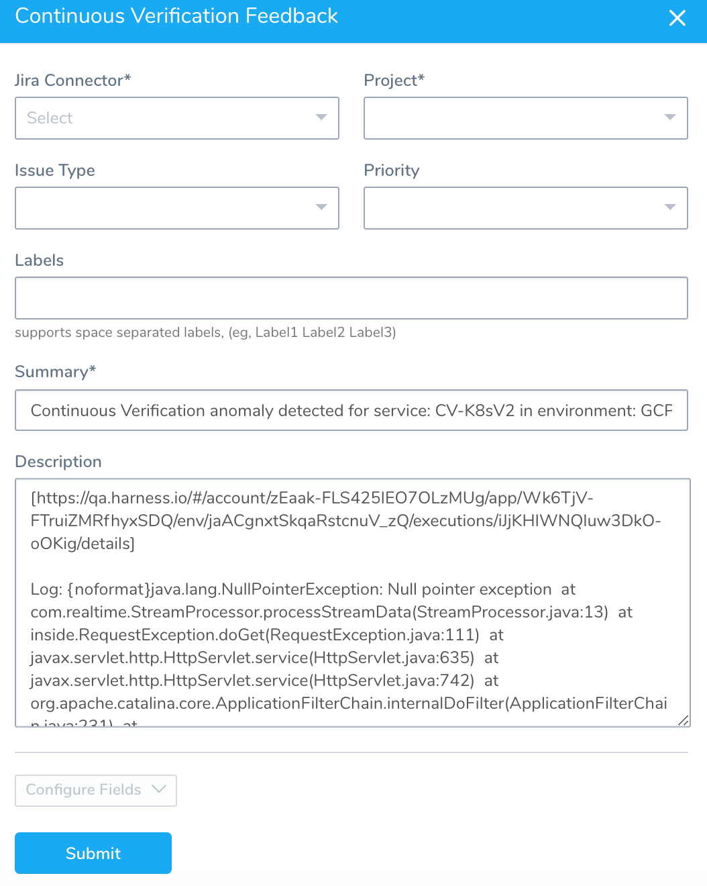
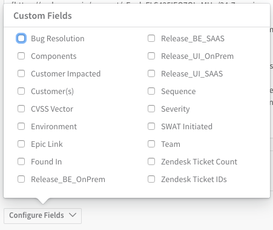
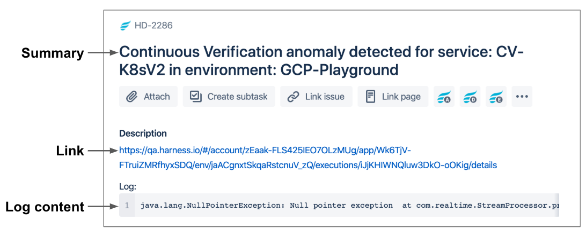
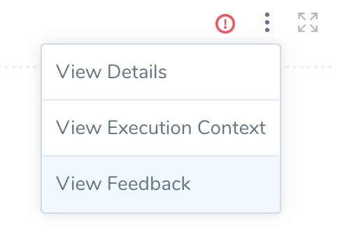
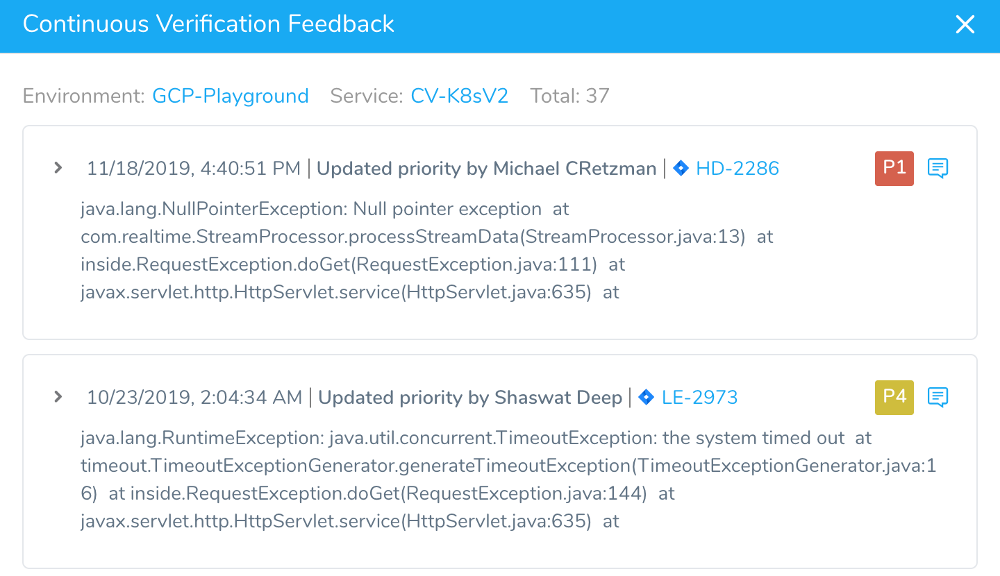
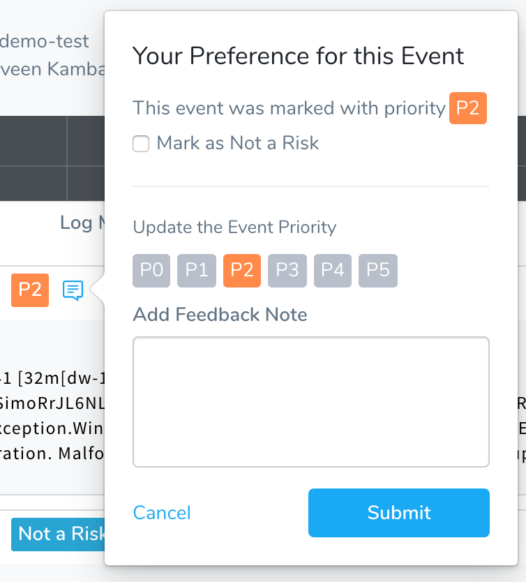

You can create a Jira ticket from a Harness Verification event, either in a deployment or in 24/7 Service Guard.

In this topic:

* [Review: Filing Jira Tickets and Refining Analysis Feedback](#review_filing_jira_tickets_and_refining_analysis_feedback)
* [Step 1: File a Jira Ticket on an Event](#step_1_file_a_jira_ticket_on_an_event)
* [Step 2: Summary](#step_2_summary)
* [Step 3: Description](#step_3_description)
* [Step 4: Jira Connector](#step_4_jira_connector)
* [Step 5: Project](#step_5_project)
* [Step 6: Issue Type](#step_6_issue_type)
* [Step 7: Priority](#step_7_priority)
* [Step 8: Labels](#step_8_labels)
* [Step 9: Custom Fields](#step_9_custom_fields)

### Review: Filing Jira Tickets and Refining Analysis Feedback

For deployments, filing Jira tickets on events is a great method for removing the causes of a deployment's failure.

For 24/7 Service Guard, filing Jira tickets on events is very powerful: it helps you get a jump on live production issues before they fail future deployments.

For information on refining event analysis feedback, see:

* [Harness Verification Feedback Overview](../continuous-verification-overview/concepts-cv/harness-verification-feedback-overview.md)
* [Refine 24/7 Service Guard Verification Analysis](refine-24-7-service-guard-verification-analysis.md)
* [Refine Deployment Verification Analysis](refine-deployment-verification-analysis.md)
* [Verification Event Classifications](https://docs.harness.io/article/339hy0kbnu-verification-event-classifications)

### Step 1: File a Jira Ticket on an Event

To create a Jira ticket from an event item, do the following:

1. To use Jira integration with your Harness deployment verifications and 24/7 Service Guard, you need to add a Jira account as a Harness Collaboration Provider, as described [Add Collaboration Providers](https://docs.harness.io/article/cv98scx8pj-collaboration-providers#jira).
2. View a deployment verification in **Continuous Deployments** or a live production verification in **24/7 Service Guard**:
	a. In a deployment, click a verify step to see its logs and events.
	b. 24/7 Service Guard, click a heatmap entry to see its logs and events.

   

3. If the event does not have a priority assigned to it, assign it a priority as described in:
	* [Refine 24/7 Service Guard Verification Analysis](refine-24-7-service-guard-verification-analysis.md)
	* [Refine Deployment Verification Analysis](refine-deployment-verification-analysis.md)
4. Once the event is assigned a priority, the Jira icon appears next to the event. Click the **Jira** icon.

The dialog for filing a Jira ticket appears.  

### Step 2: Summary

The **Summary** field contains information about Harness Service and Environment. For example:

`Continuous Verification anomaly detected for service: ToDo List in environment: CV-Test-Env`

This is because Verification Feedback is at the Harness Service and Environment level. Learn more about feedback in [Harness Verification Feedback Overview](../continuous-verification-overview/concepts-cv/harness-verification-feedback-overview.md).

### Step 3: Description

The **Description** field contains the following:

* Link to Deployment or 24/7 Service Guard log event.
* Log content.

Fill out the remaining Jira ticket fields.

### Step 4: Jira Connector

Select the Jira account to use by selecting the Jira Collaboration Provider set up for that account. For more information, see [Jira](https://docs.harness.io/article/cv98scx8pj-collaboration-providers#jira).

### Step 5: Project

Select a Jira project from the list. A Jira project is used to create the issue key and ID when the issue is created. The unique issue number is created automatically by Jira.

### Step 6: Issue Type

Select a Jira issue type from the list of types in the Jira project you selected.

### Step 7: Priority

Select a priority for the Jira issue. The list is generated from the Jira project you selected.

### Step 8: Labels

Add labels to the issue. These will be added to the Jira project you selected.

### Step 9: Custom Fields

Click **Configure Fields** to add custom fields.

When you are done, click **Submit**.

The Jira issue number is added to the event details:

Click the Jira issue link to open Jira and see the issue. The issue contains the summary, link, and log content that was displayed in the Continuous Verification Feedback dialog:

You can update this ticket using the Jira command in Workflows. For more information, see [Jira Integration](https://docs.harness.io/article/077hwokrpr-jira-integration).

Back in Harness, you can view all of the feedback for your event by clicking the **View Feedback** option:

The **Continuous Verification Feedback** dialog appears:

Once you have filed a Jira ticket, you might want to mark the event as **Not a Risk** so that it does not cause future deployment failures. Anomalous Events, with or without a priority, fail deployments.

Also, since the event is being resolved actively, it does not need to fail a deployment.

In the **Preferences** dialog, simply select **Mark as Not a Risk** and click **Submit**.

The **Anomalous Event** tag is crossed out and the **Not a Risk** tag is attached.

For details about event priorities and classifications, see [Verification Event Classifications](https://docs.harness.io/article/339hy0kbnu-verification-event-classifications).