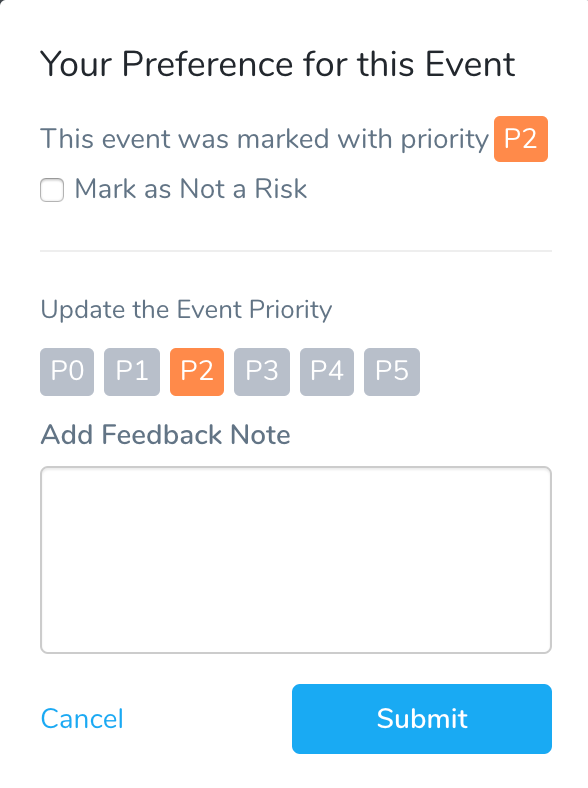
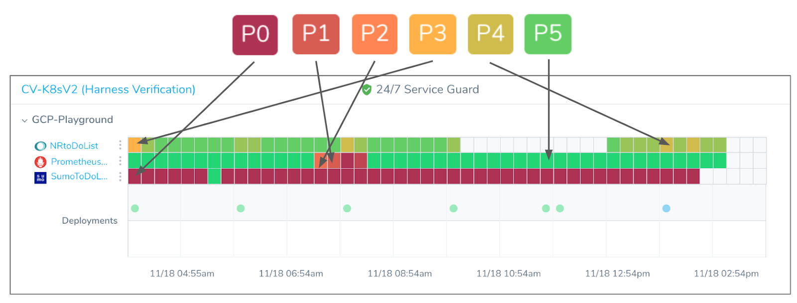
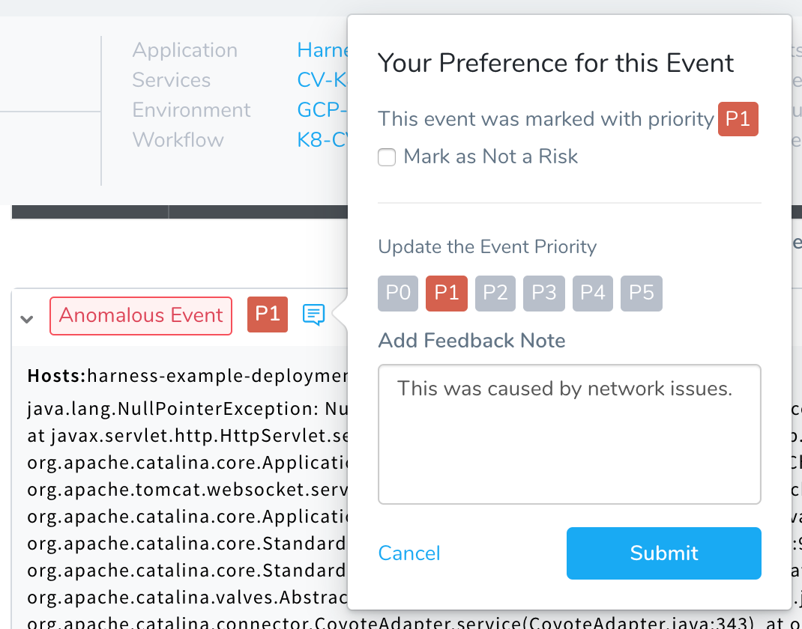
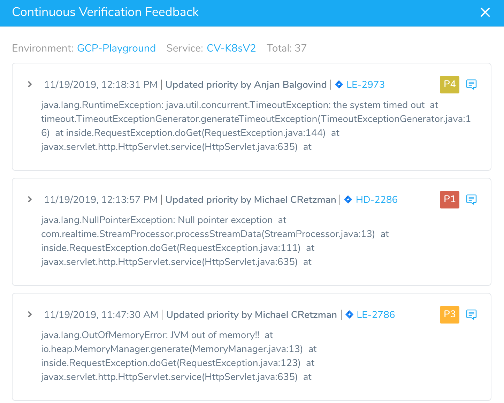
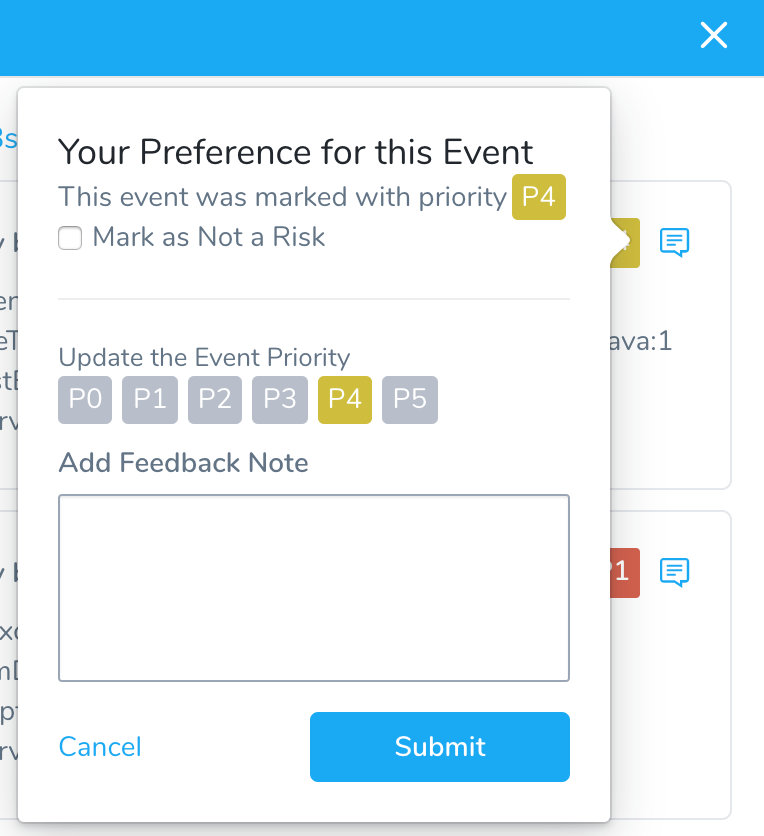

You can refine the priority or category of an event in the Workflow deployment.

For information on changing event priorities in 24/7 Service Guard, see [Refine 24/7 Service Guard Verification Analysis](refine-24-7-service-guard-verification-analysis.md). Event classifications are covered in [Verification Event Classifications](https://docs.harness.io/article/339hy0kbnu-verification-event-classifications). For an overview of verification analysis feedback, see [Harness Verification Feedback Overview](../continuous-verification-overview/concepts-cv/harness-verification-feedback-overview.md).In this topic:

* [Review: Permissions Required](#review_permissions_required)
* [Step 1: Change Event Priority in a Deployment](#step_1_change_event_priority_in_a_deployment)
* [Option: Remove from Baseline](#option_remove_from_baseline)
* [Option: Mark as Not a Risk](#option_mark_as_not_a_risk)
* [Option: Update the Event Priority](#option_update_the_event_priority)
* [Option: Add Feedback Note](#option_add_feedback_note)
* [Step 2: Review Deployment Verification Feedback](#step_2_review_deployment_verification_feedback)

### Review: Permissions Required

To mark an event as not a risk (**Mark as Not a Risk**) or change its priority setting (**P0**, **P1**, etc), a Harness User must be a member of a User Group with the following User Group **Application Permissions**:

|  |  |  |  |
| --- | --- | --- | --- |
| **Permission Types** | **Applications** | **Filters** | **Actions** |
| **Services** | `<Name of Application>` | `<Name of Service being deployed>` | **Update** |
| **Environments** | `<Name of Application>` | `<Name of Environment where Service is deployed>` | **Update** |

 For example, the User Group Application Permissions might look like this:

### Step 1: Change Event Priority in a Deployment

To change the priority of an event in a Deployment, do the following:

1. In Harness Manager, click **Continuous Deployments**.
2. Click the name of the Workflow deployment (or Pipeline containing the Workflow) that deployed the Service you are interested in reviewing.
3. In the deployment, click the verification step you want to refine to view its **Analysis**.

1. Review the **Analysis** to determine if the priority of any events need to be changed.
2. To change the risk assessment for an event, click the risk assessment icon:

The event details dialog appears:

1. Select a different priority setting. For details on the different verification settings, see [Verification Event Classifications](https://docs.harness.io/article/339hy0kbnu-verification-event-classifications).

The options in the dialog are described below.

### Option: Remove from Baseline

This option appears if the event was marked as **Not a Risk**.  

If you consider this event to be a risk, click Remove from baseline and assign a priority to the event.

### Option: Mark as Not a Risk

This option appears if the event was marked with a priority (P0-P5).

Priority events fail deployments (as do Anomalous Events) .If the event should not fail the deployment, select **Mark as Not a Risk**.

The next time this deployment is run, this event will be marked as a **Known Event** and added to the baseline for comparison with future deployments.

### Option: Update the Event Priority

This option is available if an event has a priority assigned to it (P0-P5).

**Update the Event Priority** lets you change the priority for the event. All priority events fail deployments, but using the priority levels helps to reveal the different levels in the Deployments page. The priority level colors are also reflected in the 24/7 Service Guard heatmap:

### Option: Add Feedback Note

You can add notes to each event using the **Add Feedback Note** option.

The note will remain with the event in future deployments.

### Step 2: Review Deployment Verification Feedback

Once you have changed the priority or classification of an event, the event is listed in the Continuous Deployment Feedback dialog for the verification step Analysis.

To review the Continuous Verification feedback, do the following:

1. In Harness Manager, click **Continuous Deployments** to open a deployment.
2. Click a deployment's name to open it, and then expand the deployment steps until you find the verification you want to review. Click the verification step to display its **Analysis**.
3. Click the more options menu (**︙**) and then click **View Feedback**.

The **Continuous Verification Feedback** dialog appears.

1. Review the Execution Analysis to determine if any events need to be changed.
2. To change the risk assessment for an event, click feedback icon.

The event title will change to indicate who updated it by adding your name to **Updated priority by &lt;User name&gt;**.

All future verifications will use the new priority setting for similar events (similar by text similarity).

