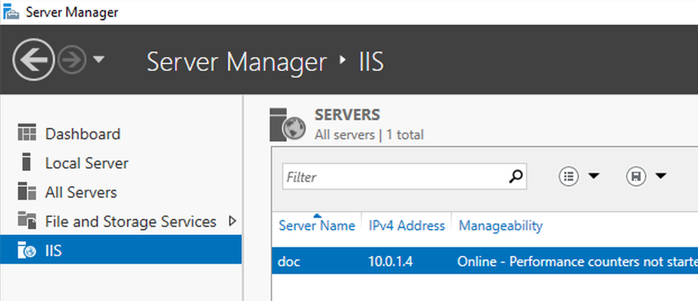
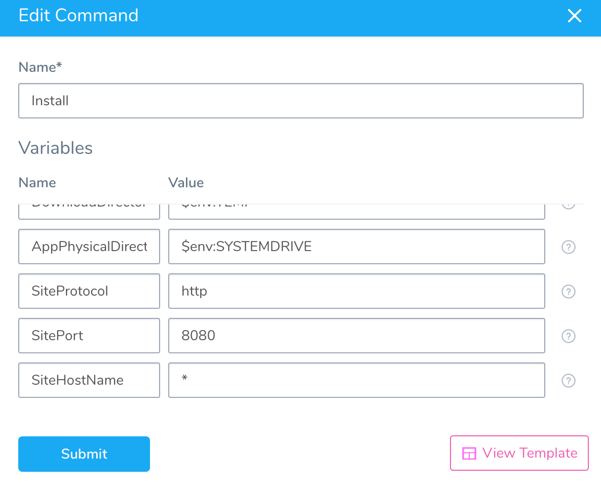

In this topic will we cover some of the Best Practices for IIS deployments using Harness, and some of the steps you can take to troubleshoot issues.

* [Best Practices](5-best-practices-and-troubleshooting.md#best-practices)
	+ [Testing Scripts](5-best-practices-and-troubleshooting.md#testing-scripts)
	+ [Using Tags for Instances](5-best-practices-and-troubleshooting.md#using-tags-for-instances)
	+ [Installing IIS from the Command Line](5-best-practices-and-troubleshooting.md#installing-iis-from-the-command-line)
* [Troubleshooting](5-best-practices-and-troubleshooting.md#troubleshooting)
	+ [Error: No delegates could reach the resource](5-best-practices-and-troubleshooting.md#error-no-delegates-could-reach-the-resource)
		- [Solutions](5-best-practices-and-troubleshooting.md#solutions)
	+ [Port Conflicts](5-best-practices-and-troubleshooting.md#port-conflicts)
* [Next Steps](5-best-practices-and-troubleshooting.md#next-steps)

### Best Practices

#### Testing Scripts

When modifying the default scripts, it is better to test test your scripts on a Windows instance using [PowerShell\_ise](https://docs.microsoft.com/en-us/windows-server/administration/windows-commands/powershell_ise) than deploying your workflow multiple times.

#### Using Tags for Instances

When configuring the Infrastructure Definition in **Environment**, instance Tags make identifying your instances easier. Assign the same tag to all instances and simply use that tag.

#### Installing IIS from the Command Line

Before deploying the IIS website, application, or virtual directory to your Windows instances, there must be at least an existing IIS Web Server Role on the instance.

The following script will prepare your Windows instance with the necessary IIS set up:


```
Start /w pkgmgr /iu:IIS-WebServerRole;IIS-WebServer;IIS-CommonHttpFeatures;IIS-StaticContent;IIS-DefaultDocument;IIS-DirectoryBrowsing;IIS-HttpErrors;IIS-ApplicationDevelopment;IIS-ASPNET;IIS-NetFxExtensibility;IIS-ISAPIExtensions;IIS-ISAPIFilter;IIS-HealthAndDiagnostics;IIS-HttpLogging;IIS-LoggingLibraries;IIS-RequestMonitor;IIS-Security;IIS-RequestFiltering;IIS-HttpCompressionStatic;IIS-WebServerManagementTools;IIS-ManagementConsole;WAS-WindowsActivationService;WAS-ProcessModel;WAS-NetFxEnvironment;WAS-ConfigurationAPI
```
You will see IIS installed in the Server Manager.



In the IIS listing, in ROLES and FEATURES, you can see the Web Server Role:


For more information, see [Installing IIS 7.0 from the Command Line](https://docs.microsoft.com/en-us/iis/install/installing-iis-7/installing-iis-from-the-command-line) from Microsoft.

### Troubleshooting

The following problems can occur when deploying your IIS website, application, or virtual directory.

#### Error: No delegates could reach the resource

You receive this error when deploying your workflow.


##### Solutions

* Ensure your artifact can be deployed via WinRM onto a Windows instance. It's possible to select the wrong artifact in Service.
* Ensure you have access to the deployment environment, such as VPC, subnet, etc.
* Ensure your WinRM Connection can connect to your instances, and that your instances have the correct ports open. See [Set Up WinRM on Instances and Network](1-delegate-and-connectors-for-iis.md#set-up-win-rm-on-instances-and-network).

#### Port Conflicts

Do not target the same port as another website. In the Harness **Service**, in **Variables**, ensure **${SitePort}** points to a port that isn't in use. In the following example, the port was changed to **8080** to avoid the error:



You can keep the same port and use host header names to host multiple IIS sites using the same port. For more information, search the Web for `use same port and use host header names to host multiple IIS sites`. There are multiple examples. 

### Next Steps

Now that you have a working deployment, you can use the Harness Continuous Verification machine learning to verify and improve your deployments. For more information, see [Continuous Verification](https://docs.harness.io/article/myw4h9u05l-verification-providers-list).

Enhance your IIS deployment workflow(s) with the multiple options available, including Failure Strategy, Rollback Steps, Barriers, and templating. For more information, see [Add a Workflow](https://docs.harness.io/article/m220i1tnia-workflow-configuration).

