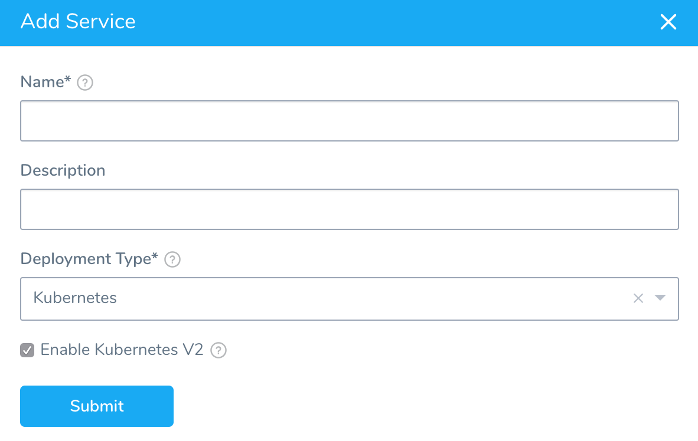

This content is for Harness [FirstGen](../../../getting-started/harness-first-gen-vs-harness-next-gen.md). Switch to [NextGen](https://docs.harness.io/category/qfj6m1k2c4).To add container images to Harness for your Kubernetes deployments, you add a Harness **Artifact Server**. The Artifact Server uses your container registry account to connect to your container registry (Docker registry, AWS ECR, Google GCR, Azure Container Registry, etc).

Once you have the Artifact Server set up, you add the container image artifact using a Harness Service **Artifact Source**.

In this topic:

* [Before You Begin](#before_you_begin)
* [Step 1: Add the Artifact Server](#step_1_add_the_artifact_server)
* [Step 2: Create the Harness Kubernetes Service](#step_2_create_the_harness_kubernetes_service)
* [Step 3: Add the Artifact Source](#step_3_add_the_artifact_source)
* [Next Steps](#next_steps)

### Before You Begin

Ensure you have reviewed and set up the following:

* [Connect to Your Target Kubernetes Platform](connect-to-your-target-kubernetes-platform.md). You must have a Harness Kubernetes Delegate running in your target Kubernetes cluster.
* [Kubernetes Deployments Overview](../concepts-cd/deployment-types/kubernetes-overview.md)

### Step 1: Add the Artifact Server

Harness supports all of the popular container registries. You add your container registry account as a Harness Artifact Server.

For steps on setting up each container registry, see [Add Artifact Servers](https://docs.harness.io/article/7dghbx1dbl-configuring-artifact-server).

In the following step, we use the Docker Registry Artifact Server.

### Step 2: Create the Harness Kubernetes Service

1. In Harness, click **Setup**, and then click **Add Application**.
2. Enter a name for the Application and click **Submit**.
3. Click **Services**, and then click **Add Service**. The **Add Service** settings appear.

1. In **Name**, enter a name for the Service.
2. In **Deployment Type**, select **Kubernetes**, and then ensure **Enable Kubernetes V2** is selected.
3. Click **Submit**. The new Harness Kubernetes Service is created.

### Step 3: Add the Artifact Source

To demonstrate how to add the Artifact Source, we use a Docker Registry Artifact Server.

For the settings for all Artifact Sources, see [Add Artifact Servers](https://docs.harness.io/article/7dghbx1dbl-configuring-artifact-server).

1. In the Harness Kubernetes Service, click **Add** **Artifact Source**, and select **Docker Registry**. The **Docker Registry** settings appear. Enter the following settings:
* In **Name**, let Harness generate a name for the source or enter a custom name.
* In **Source Server**, select the Artifact Server. In this example, we are using a Docker Registry with a connection to Docker Hub.
* In **Docker Image Name**, enter the image name. Official images in public repos such as Docker Hub need the label **library**. For example, **library/nginx**.
1. Click **SUBMIT**. The Artifact Source is added.

**Recommended** — View the build history for the artifact by clicking **Artifact History**, and then using **Manually Pull Artifact** to pull the artifact.

In addition to artifact sources taken from Artifact Servers, you can use a Shell Script to query a custom artifact repository. See [Custom Artifact Source](https://docs.harness.io/article/jizsp5tsms-custom-artifact-source).

### Next Steps

* [Pull an Image from a Private Registry for Kubernetes](pull-an-image-from-a-private-registry-for-kubernetes.md)

