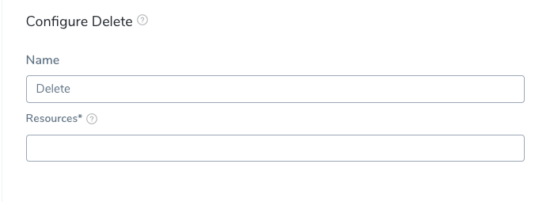
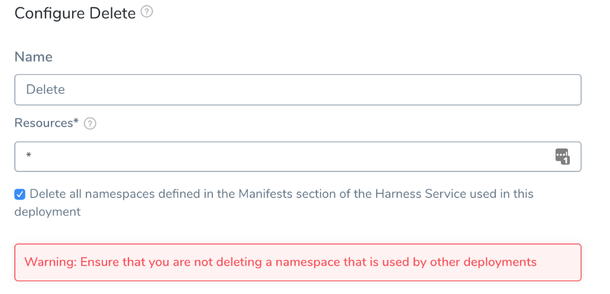
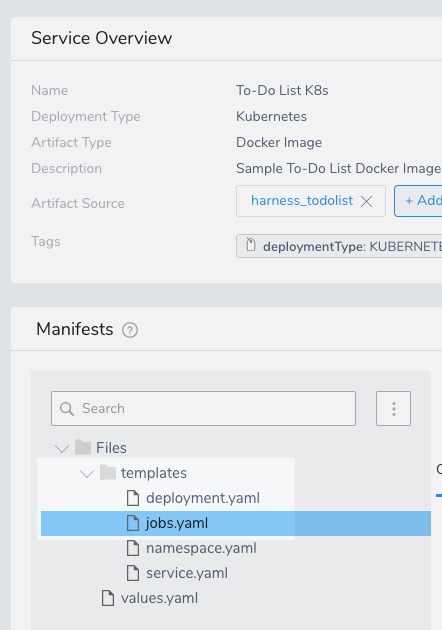
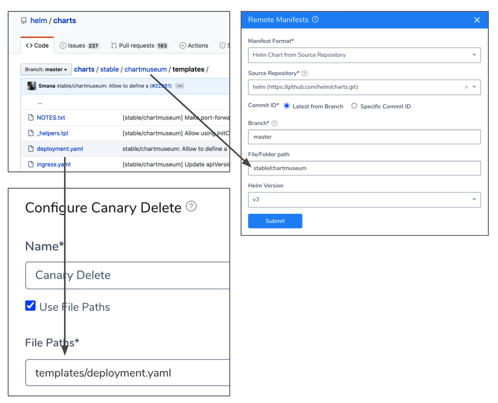

Remove any deployed Kubernetes resources with the Delete step.

### Before You Begin

* [Define Kubernetes Manifests](define-kubernetes-manifests.md)
* [Create a Kubernetes Canary Deployment](create-a-kubernetes-canary-deployment.md)
* [Create a Kubernetes Blue/Green Deployment](create-a-kubernetes-blue-green-deployment.md)
* [Create a Kubernetes Rolling Deployment](create-a-kubernetes-rolling-deployment.md)

### Step 1: Add Delete Step

In your Harness Workflow, click **Add Step**, and select **Delete**. The Delete settings appear:



You can add a Delete step anywhere in your Workflow, but typically it is added in the **Wrap Up** section.

Wherever you add a Delete step, the resource you want to delete must already exist in the cluster. For example, if the resource is added in Phase 2 of a Canary Workflow, the Delete step should not be placed in Phase 1.

### Step 2: Select Resources to Delete

In **Resources**, enter the resources to be deleted.

There are a few ways to specify the resource to be removed.

#### Harness Built-in Variables

Using the Harness built-in variable, `${k8s.canaryWorkload}`.

At runtime, this will resolve to something like:


```
Deployment/harness-example-deployment-canary
```
The deployed Kubernetes object must reach steady state for Harness to be able to resolve the `${k8s.canaryWorkload}` expression. Consequently, if the Canary Deployment step fails to deploy the workload to steady state, Harness cannot set the `${k8s.canaryWorkload}` expression and it will not execute successfully.

#### Resource Name

Using a resource name in the format `[namespace]/Kind/Name`, with `namespace` being optional.

You must add a `Kind` before the resource name, like `Deployment` in this example:

`Deployment/harness-example-deployment-canary`

#### Multiple Resources

Using a comma-separated list to delete multiple resources. For example:

`Deployment/harness-example-deployment-canary,ConfigMap/harness-example-config`

#### All Resources

Enter an asterisk (\*) in **Resources**.

You cannot use the asterisk as a wildcard to match arbitrary resources. It is simply used to indicate all resources.

Using an asterisk (\*) deletes all of the releases specified in the Infrastructure Definition **Release Name** setting used by the Workflow. The namespace is not deleted.

##### Delete Namespaces

If you want to delete the namespace(s) defined in the **Manifests** section of the Harness Service used in this deployment, click the **Delete all namespaces defined in the Manifests section of the Harness Service used in this deployment** checkbox.

[](./static/delete-kubernetes-resources-115.png)

Ensure that you are not deleting a namespace that is used by other deployments.

### Option: Enter the Path and Name of the Manifest

The Delete step will delete any resource in a Service **Manifest** section, Helm Source Repository, or Helm Repository explicitly.

The Delete step does not support resources in Kustomize or OpenShift Templates.

#### Service Manifest

Select the **Use File Paths** to enable this option.

You must provide the path and name of the file in **File Paths**, and Harness will delete the resource.

For resources in the Service **Manifests** section, enter the folder name and the file name of the manifest in the Harness Service deployed by this Workflow. For example, **templates/jobs.yaml**.



You can include multiple resource files by separating them with commas, for example:

**templates/jobs.yaml, templates/statefulSet.yaml**.

If you apply the ignore comment `# harness.io/skip-file-for-deploy` to a resource but do not use the resource in an Kubernetes Apply step, the resource is never deployed and does not need to be deleted.

#### Helm Source Repository

For resources in a Helm chart, provide the path and name of the file from the root folder of the repo.

For example, the following Service uses a remote manifest that points to a Helm chart at `https://github.com/helm/charts.git/stable/chartsmuseum`. In the chart's **templates** folder, there is a **deployment.yaml** file. In **File Path**, you reference **templates/deployment.yaml**.



#### Helm Chart Repository

For a Helm Chart Repository, you cannot see the resources as easily as a Helm Source Repository, but you can view the resources in the chart by extracting it or by viewing them in a deployment log.

For example, here is a deployment log showing the chart resources in **Fetch Files**, a Service **Remote Manifests** using the chart as a Helm Chart Repository, and Delete step deleting the **deployment.yaml** resource:


### Option: Delegate Selector

If your Workflow Infrastructure Definition's Cloud Provider uses a Delegate Selector (supported in Kubernetes Cluster and AWS Cloud Providers), then the Workflow uses the selected Delegate for all of its steps.

In these cases, you shouldn't add a Delegate Selector to any step in the Workflow. The Workflow is already using a Selector via its Infrastructure Definition's Cloud Provider.

If your Workflow Infrastructure Definition's Cloud Provider isn't using a Delegate Selector, and you want this Workflow step to use a specific Delegate, do the following:

In **Delegate Selector**, select the Selector for the Delegate(s) you want to use. You add Selectors to Delegates to make sure that they're used to execute the command. For more information, see [Select Delegates with Selectors](../../firstgen-platform/account/manage-delegates/select-delegates-for-specific-tasks-with-selectors.md).

Harness will use Delegates matching the Selectors you add.

If you use one Selector, Harness will use any Delegate that has that Selector.

If you select two Selectors, a Delegate must have both Selectors to be selected. That Delegate might also have other Selectors, but it must have the two you selected.

You can use expressions for Harness built-in variables or Account Default variables in **Delegate Selectors**. When the variable expression is resolved at deployment runtime, it must match an existing Delegate Selector.  
  
For example, if you have a Delegate Selector **prod** and the Workflow is using an Environment also named **prod**, the Delegate Selector can be `${env.name}`. This is very useful when you match Delegate Selectors to Application component names such as Environments, Services, etc. It's also a way to template the Delegate Selector setting.### Example 1: Deleting ${k8s.canaryWorkload}

Here is an example of the log from a Delete command:


```
Initializing..  
...  
Resources to delete are:   
- Deployment/harness-example-deployment-canary  
Done.
```
### Example 2: Deleting All Resources and Namespaces

Here is an example using **\*** and the **Delete all namespaces defined in the Manifests section of the Harness Service used in this deployment** setting:


```
All Resources are selected for deletion  
Delete Namespace is set to: true  
Fetching all resources created for release: release-44e74aca-279f-3b4a-bb15-06d750393a8d  
  
Resources to delete are:   
- adwait-12/Deployment/harness-example-deployment  
- adwait-12/Service/harness-example-svc  
- adwait-12/ConfigMap/release-44e74aca-279f-3b4a-bb15-06d750393a8d  
- adwait-12/ConfigMap/harness-example-2  
- adwait-12/ConfigMap/harness-example-1  
- adwait-12/Secret/harness-example-2  
- adwait-12/Secret/harness-example-1  
- adwait-12/Namespace/adwait-12  
Done.
```
### Notes

* **Canary Delete and Traffic Management** —If you are using the **Traffic Split** step or doing Istio traffic shifting using the **Apply step**, move the **Canary Delete** step from **Wrap Up** section of the **Canary** phase to the **Wrap Up** section of the Primary phase.  
Moving the Canary Delete step to the Wrap Up section of the Primary phase will prevent any traffic from being routed to deleted pods before traffic is routed to stable pods in the Primary phase. See [Create a Kubernetes Canary Deployment](create-a-kubernetes-canary-deployment.md) and [Set Up Kubernetes Traffic Splitting](set-up-kubernetes-traffic-splitting.md).

### Next Steps

* [Scale Kubernetes Pods](scale-kubernetes-pods.md)
* [Deploy Manifests Separately using Apply Step](deploy-manifests-separately-using-apply-step.md)
* [Kubernetes Workflow Variable Expressions](workflow-variables-expressions.md)

