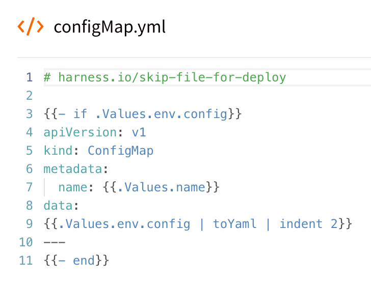

You might have manifest files for resources that you do not want to deploy as part of the main deployment.

Instead, you tell Harness to ignore these files and then apply them separately using the Harness Apply step.

Or you can simply ignore them until you wish to deploy them as part of the main deployment.

In this topic:

* [Before You Begin](#before_you_begin)
* [Visual Summary](#visual_summary)
* [Step 1: Ignore a Manifest](#step_1_ignore_a_manifest)
* [Option 1: Apply Ignored Resource](#option_1_apply_ignored_resource)
* [Next Steps](#next_steps)

### Before You Begin

* [Define Kubernetes Manifests](define-kubernetes-manifests.md)
* [Kubernetes Deployments Overview](../concepts-cd/deployment-types/kubernetes-overview.md)
* [Kubernetes Versioning and Annotations](https://docs.harness.io/article/ttn8acijrz-versioning-and-annotations)

### Visual Summary

The following image shows how you can ignore a Jobs manifest and then apply it separately using the Apply step.

### Step 1: Ignore a Manifest

To have a Workflow ignore a resource file in a Service **Manifests** section, you add the comment `# harness.io/skip-file-for-deploy` to the **top** of the file.

For more information on `harness.io/skip-file-for-deploy`, see [Kubernetes Versioning and Annotations](https://docs.harness.io/article/ttn8acijrz-versioning-and-annotations).For example, here is a ConfigMap file using the comment:

Now, when this Service is deployed by a Workflow, this ConfigMap resource will not be applied.

The comment `# harness.io/skip-file-for-deploy` must be at the **top** of the file. If it is on the second line it will not work and the resource will be deployed as part of the main Workflow rollout.

### Option 1: Apply Ignored Resource

The Workflow Apply step will apply any resource in a Service **Manifest** section explicitly. You must provide the path and name of the file in **Apply**, and Harness will deploy the resource.

For details on the Apply Step, see [Deploy Manifests Separately using Apply Step](deploy-manifests-separately-using-apply-step.md).

For example, the following image shows a Jobs resource in a Service **Manifest** section that uses the ignore comment `# harness.io/skip-file-for-deploy` so that the Workflow does not apply it as part of its main **Deploy** steps, and the **Apply** step that specifies the same Jobs resource:

The **File paths** field in the Apply step must include the folder name and the file name. In the above example, the folder **templates** is included with the file name **jobs.yaml**: `templates/jobs.yaml`.

You can include multiple resource files in the Apply step **File paths** field by separating them with commas, for example: `templates/jobs.yaml, templates/statefulSet.yaml`.

If you apply the ignore comment `# harness.io/skip-file-for-deploy` to a resource but do not use the resource in an Apply step, the resource is never deployed.

### Next Steps

* [Delete Kubernetes Resources](delete-kubernetes-resources.md)

