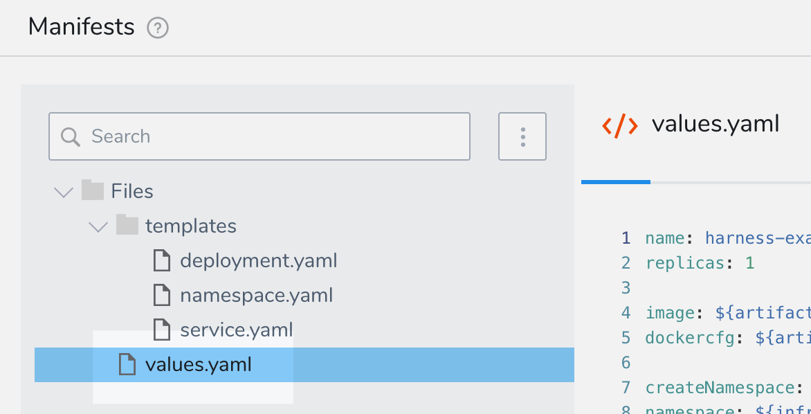
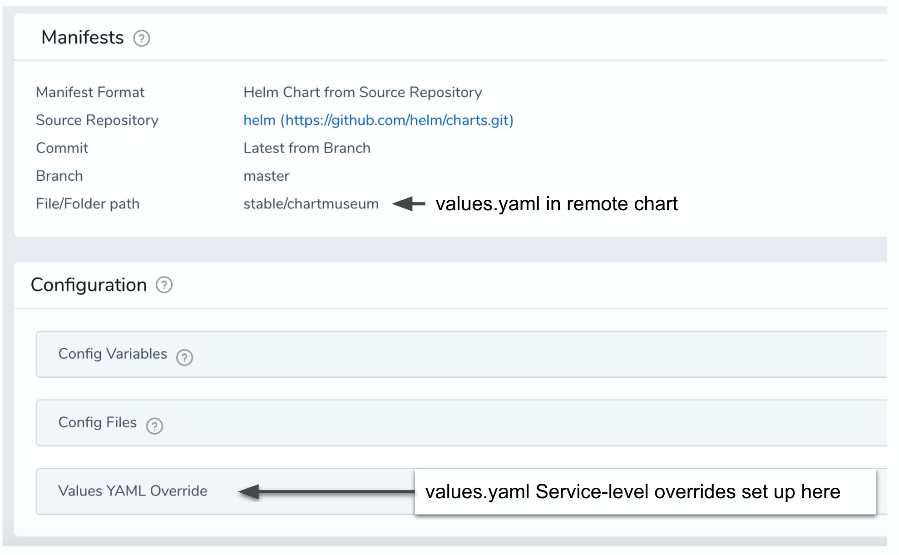
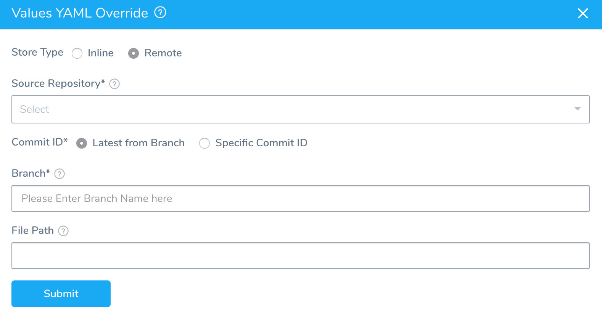
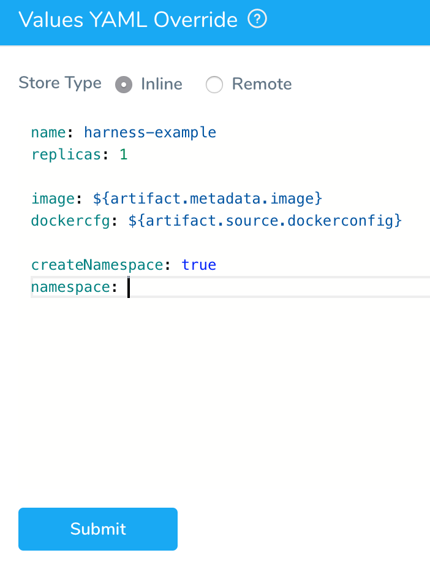
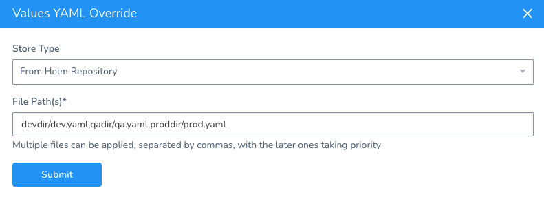
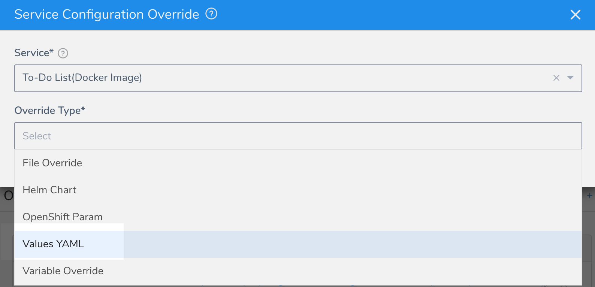
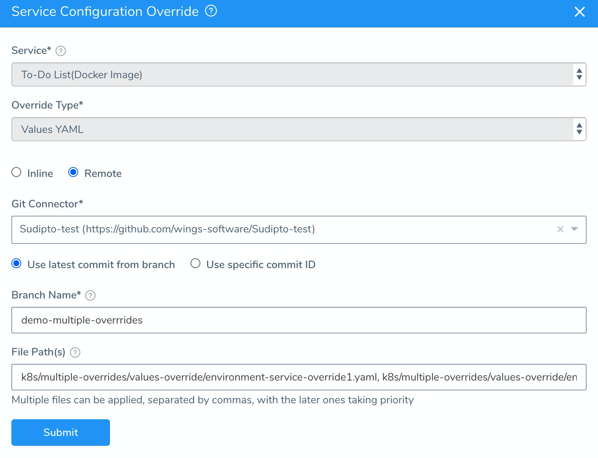
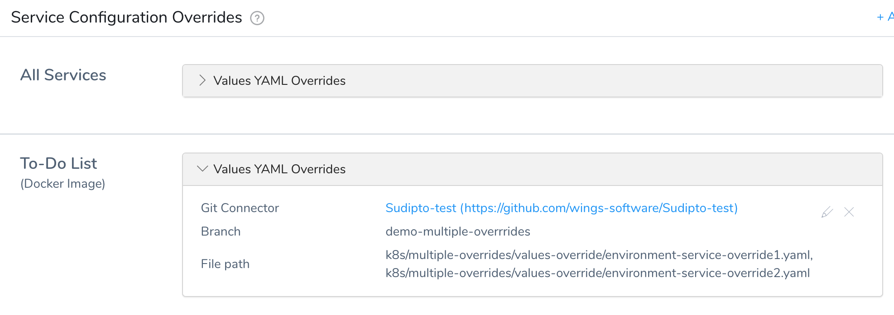

This content is for Harness [FirstGen](../../../getting-started/harness-first-gen-vs-harness-next-gen.md). Switch to [NextGen](https://docs.harness.io/article/t57uzu1i41).You can override the inline or remote values.yaml file(s) used in a Harness Kubernetes Service.

You can override values.yaml at the Harness Service and Environment levels, and also use Workflow variables to replace values.yaml file names or values at deployment runtime.

You can override using multiple values.yaml files. This is a common scenario where:

* You use one values.yaml for defaults and global configuration.
* Use a second values.yaml file for the specific configuration of the service you are deploying.
* Use one or more values.yaml files for deployment environments (QA, PROD, etc).

This topic will explain how to override using single and multiple values.yaml files at the Harness Service and Environment levels, including the use of Workflow variables, and explain the override hierarchy so that you understand how values.yaml files override each other.

In this topic:

* [Before You Begin](#before_you_begin)
* [Review: values.yaml Support](#review_values_yaml_support)
* [Step 1: Pick a Store Type](#step_1_pick_a_store_type)

* [Option: Use an Inline Override](override-values-yaml-files.md#option-use-an-inline-override)
* [Option: Use a Single Remote Override](override-values-yaml-files.md#option-use-a-single-remote-override)
* [Option: Use Multiple Override Files at the Service Level](override-values-yaml-files.md#option-use-multiple-override-files-at-the-service-level)
* [Option: Use Values YAML from inside the Chart](override-values-yaml-files.md#option-use-values-yaml-from-inside-the-chart)
* [Option: Override Files at the Environment Level](override-values-yaml-files.md#option-override-files-at-the-environment-level)
* [Option: Use Variable Expressions in Override File Settings](override-values-yaml-files.md#option-use-variable-expressions-in-override-file-settings)
* [Next Steps](#next_steps)

### Before You Begin

* [Link Resource Files or Helm Charts in Git Repos](link-resource-files-or-helm-charts-in-git-repos.md)
* [Upgrade to Helm 3 Charts in Kubernetes Services](upgrade-to-helm-3-charts-in-kubernetes-services.md)

### Review: values.yaml Support

Harness Kubernetes Services use values.yaml files in the following scenarios:

1. **Inline**, as part of Harness native manifest editor.

1. **Remotely**, as part of a Kubernetes spec in a Git repo or a Helm Chart in a Helm repository or Git repo:

You can override values.yaml files from any of these sources in the Harness Service or in any Harness Environment in the same Harness Application.

Environment-level values.yaml overrides are set up in the Environments of the same Application:

Let's look at an advanced scenario where a user needs to override values.yaml files at multiple levels with a specific hierarchy, represented as highest to lowest here:

1. Environment-level overrides for a specific Service (Service override specific Service 2)
2. Environment-level overrides for a specific Service (Service override specific Service 1)
3. Environment-level overrides (global) (Environment override all Services)
4. Service-level overrides (Service override 2)
5. Service-level override (common values.yaml—Service override 1)
6. Default values.yaml in Helm Charts (default)

This scenario can be implemented with a combination of Service-level and Environment-level overrides, as described in this topic.

#### How are Multiple values.yaml Files Managed by Harness?

Harness performs a diff and merges all values.yaml files, with the last values.yaml applied overwriting the earlier values.yaml.

The overwriting is granular. So if your first values.yaml file has a `key:value` that no latter values.yaml file has, that `key:value` is not overwritten.

### Step 1: Pick a Store Type

1. In the **Values YAML Override** section of a Harness Kubernetes Service, click **Add Values**.
2. In **Store Type**, select **Local** or **Remote**.

### Option: Use an Inline Override

1. Enter the YAML you want to use to override the Values YAML file (values.yaml).

1. Enter any new values and click **Submit**. The override is added to **Values YAML Override**.

### Option: Use a Single Remote Override

1. In **Source Repository**, select the Git repo you added as a [Source Repo Provider](https://docs.harness.io/article/ay9hlwbgwa-add-source-repo-providers).
2. For **Commit ID**, select either **Latest from Branch** and enter in the branch name, or **Specific Commit ID** and enter in the **commit ID**.
3. In **File Path(s)**, enter the path to the values.yaml file in the repo, including the repo name, like **helm/values.yaml**. This is a mandatory setting. You cannot leave **File Path(s)** empty.

Values in Services can also be overwritten in Harness Environments. For more information, see [Override Harness Kubernetes Service Settings](override-harness-kubernetes-service-settings.md).

### Option: Use Multiple Override Files at the Service Level

You can specify multiple values.yaml files in a remote repo in your override.

Let's look at an example:

1. In **Source Repository**, select the Git repo you added as a [Source Repo Provider](https://docs.harness.io/article/ay9hlwbgwa-add-source-repo-providers).
2. For **Commit ID**, select either **Latest from Branch** and enter in the branch name, or **Specific Commit ID** and enter in the **commit ID**.
3. In **File Path(s)**, enter the paths to the values.yaml files in the repo, including the repo name, like **k8****s/values.yaml**. This is a mandatory setting. You cannot leave **File Path(s)** empty.

Multiple files can be applied, separated by commas, with the later ones taking priority.

For example, let's say you wanted to include the following files with their override hierarchy represented from highest to lowest:

1. k8s/multiple-overrides/values-override/service-**override3**.yaml (highest)
2. k8s/multiple-overrides/values-override/service-**override2**.yaml
3. k8s/multiple-overrides/values-override/service-**override1**.yaml (lowest)

In **File Path(s)**, you would enter the following:

`k8s/multiple-overrides/values-override/service-override1.yaml, k8s/multiple-overrides/values-override/service-override2.yaml, k8s/multiple-overrides/values-override/service-override3.yaml`

### Option: Use Values YAML from inside the Chart

Currently, this feature is behind the feature flag `OVERRIDE_VALUES_YAML_FROM_HELM_CHART`. Contact [Harness Support](mailto:support@harness.io) to enable the feature.If you are using the Helm Chart from Helm Repository option in **Manifests**, you can override the chart in **Manifests** using one or more values YAML files inside the Helm chart.

In **Configuration**, in **Values YAML Override**, click the edit icon.

In **Store Type**, select **From Helm Repository**.

In **File Path(s)**, enter the file path to the override values YAML file.

Multiple files can be used. When you enter the file paths, separate the paths using commas.

The latter paths are given higher priority.

### Option: Override Files at the Environment Level

You can override the values.yaml settings of a Service in an Environment's **Service Configuration Overrides** settings.

1. In an Environment, in **Service Configuration Overrides**, click **Add Configuration Overrides**.
2. In **Service(s)**, click **All Services** or the name of a specific **Service**.
3. In **Override Type**, select **Values YAML**.
4. Select **Inline** or **Remote**. For **Inline**, enter the YAML you want to use to override the Service-level values.yaml file(s).
5. For **Remote**, in **Git Connector**, select the Git repo you added as a [Source Repo Provider](https://docs.harness.io/article/ay9hlwbgwa-add-source-repo-providers).
6. Select either **Use** **latest commit from branch** and enter in the branch name, or **Use specific commit ID** and enter in the **commit ID**.
7. In **Branch Name**, enter the branch name where the file(s) is located, such as **master**, **dev**, etc. Do not enter the full URL to the branch.
8. In **File Path(s)**, enter the path(s) to the values.yaml file(s) in the repo, including the repo name, like **k8****s/values.yaml**. Multiple files can be applied, separated by commas, with the later ones taking priority.  
This is a mandatory setting. You cannot leave **File Path(s)** empty.

When you're done, the override will look something like this:

Click **Submit**. The override is listed in the **Service Configuration Overrides** section:

### Option: Use Variable Expressions in Override File Settings

You can use [Harness variable expressions](https://docs.harness.io/article/9dvxcegm90-variables), such as [Workflow variables](https://docs.harness.io/article/766iheu1bk-add-workflow-variables-new-template), in the names and values of the values.yaml files you use as overrides.

For example, let's say you have listed three values.yaml files in the Service Configuration **Values YAML Override**.

In **File Path(s)**, you entered the following:

`k8s/multiple-overrides/values-override/service-override1.yaml, k8s/multiple-overrides/values-override/service-override2.yaml, k8s/multiple-overrides/values-override/service-override3.yaml`

But now you want to provide the path for the second file (k8s/multiple-overrides/values-override/service-override2.yaml) at deployment runtime.

In the Workflow that deploys the Service, you simply create a Workflow variable named **filePath**:

This Workflow variable has a default value, but you can simply leave it blank.

Now, in your Service Configuration **Values YAML Override**, in **File Path(s)**, you can replace the second file path with the Workflow variable expression `${workflow.variables.filePath}`:

Now, when you deploy the Workflow, you can provide the file path for that values.yaml override:

### Next Steps

* [Define Kubernetes Manifests](define-kubernetes-manifests.md)
* [Pass Variables between Workflows](https://docs.harness.io/article/gkmgrz9shh-how-to-pass-variables-between-workflows)
* [Passing Variables into Workflows and Pipelines from Triggers](https://docs.harness.io/article/revc37vl0f-passing-variable-into-workflows)

