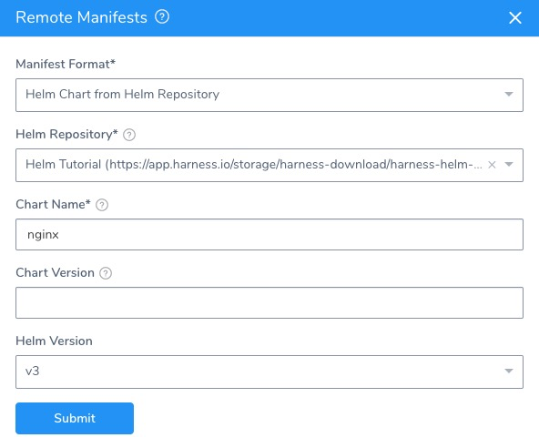
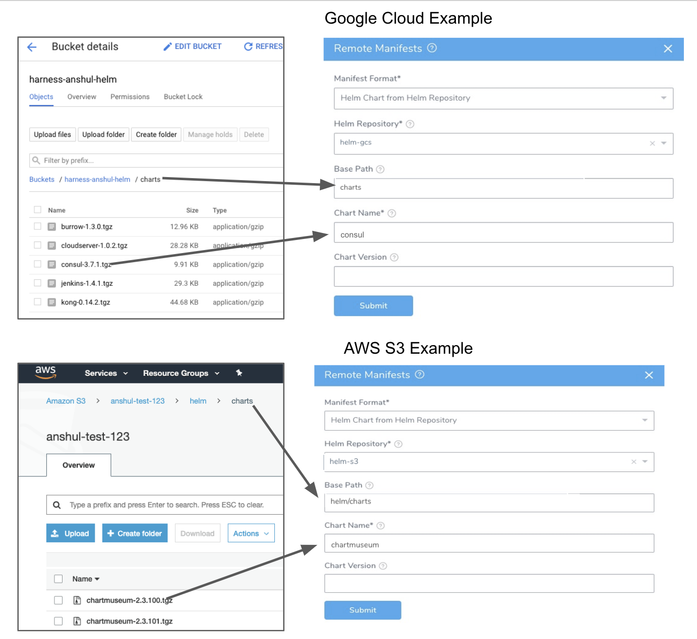
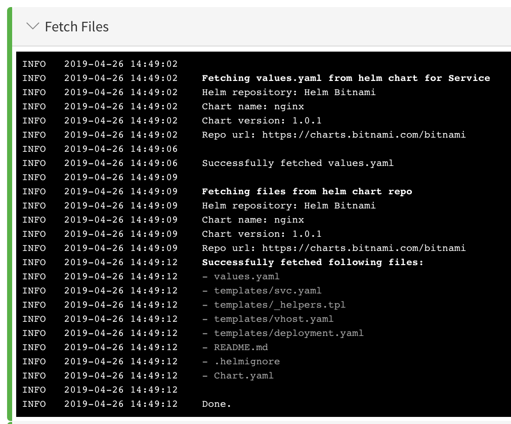
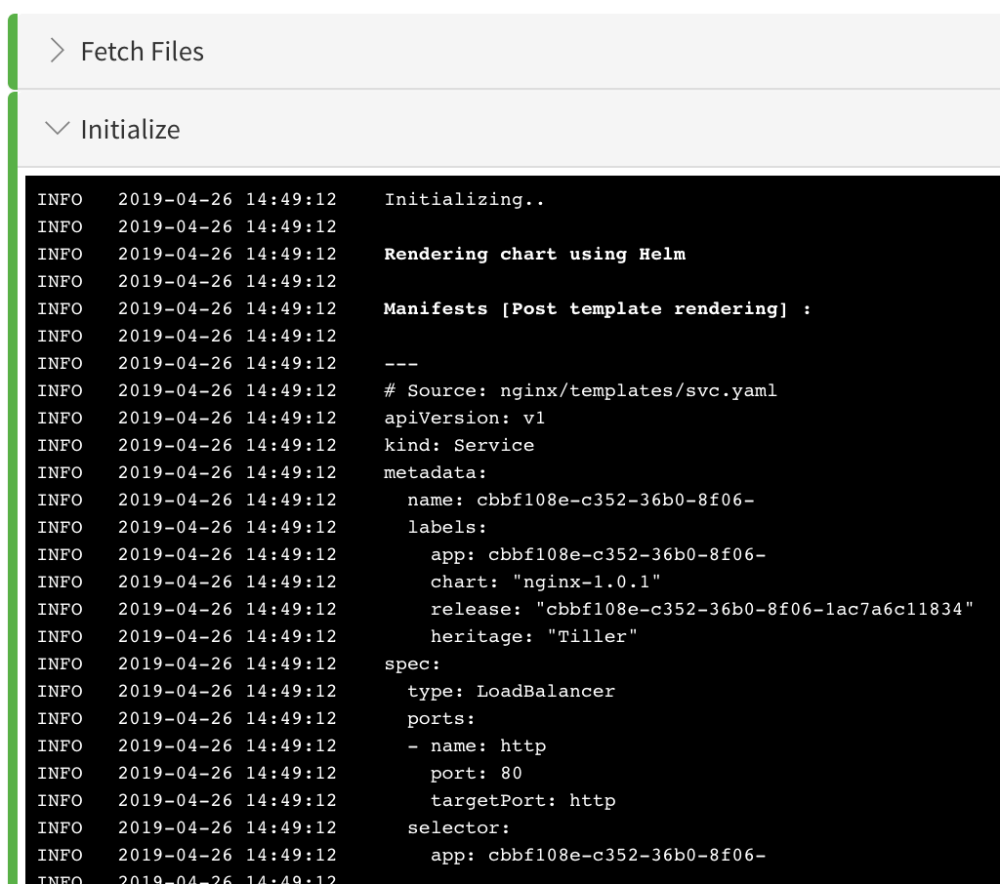

This content is for Harness [FirstGen](../../../getting-started/harness-first-gen-vs-harness-next-gen.md). Switch to [NextGen](https://docs.harness.io/article/cifa2yb19a).You can link remote Helm charts in a Helm Repository to your Harness Kubernetes Service, such as AWS S3, Google Cloud Storage (GCS), or a chart repo such as Bitnami.

You can also use Helm charts in a Git repo. For more information, see [Link Resource Files or Helm Charts in Git Repos](link-resource-files-or-helm-charts-in-git-repos.md).In this topic:

* [Before You Begin](#before_you_begin)
* [Migrating from a Harness Helm Deployment Type?](#migrating_from_a_harness_helm_deployment_type)
* [Step 1: Helm Repository Artifact Server](#step_1_helm_repository_artifact_server)
* [Step 2: Link the Service with a Helm Repository](#step_2_link_the_service_with_a_helm_repository)
* [Option: Skip Versioning for Service](#option_skip_versioning_for_service)
* [Option: Helm Command Flags](#option_helm_command_flags)
* [Option: Override Helm Chart Values YAML](use-a-helm-repository-with-kubernetes.md#option-override-helm-chart-values-yaml)
* [Example 1: Google GCS and AWS S3](#example_1_google_gcs_and_aws_s3)
* [Example 2: Workflow Variable Expression](#example_2_workflow_variable_expression)
* [Example 3: Deploying Kubernetes Service Linked to a Helm Repository](#example_3_deploying_kubernetes_service_linked_to_a_helm_repository)
* [Notes](#notes)
* [Next Steps](#next_steps)

### Before You Begin

* [Override Harness Kubernetes Service Settings](override-harness-kubernetes-service-settings.md)
* [Define Kubernetes Manifests](define-kubernetes-manifests.md)

### Migrating from a Harness Helm Deployment Type?

If you are migrating from a Harness Helm deployment type to the Kubernetes deployment type, be aware that Helm charts in Kubernetes V2 require that you set up a Harness [Helm Artifact Server](https://docs.harness.io/article/7dghbx1dbl-configuring-artifact-server) to connect to your remote Helm chart repo.

### Step 1: Helm Repository Artifact Server

Before you can link a Helm Repository to your Harness Kubernetes Service, you create a Harness Artifact Server to connect Harness with a Helm Repository.

See [Add Helm Repository Artifact Servers](https://docs.harness.io/article/0hrzb1zkog-add-helm-repository-servers).

### Step 2: Link the Service with a Helm Repository

1. In your Harness Kubernetes Service, in **Manifests**, click **Link Remote Manifests**. The **Remote Manifests** settings appear.
2. In **Manifest Format**, select **Helm Chart from Helm Repository**.
3. In **Helm Repository**, select the Helm Chart Repository you added as a Harness Artifact Server. For more information, see [Add Helm Repository Artifact Servers](https://docs.harness.io/article/0hrzb1zkog-add-helm-repository-servers).If you are using GCS or a storage service for your Helm Repository, you will see a **Base Path** setting.
4. In **Base Path** (GCS or a storage service only), enter the path to the charts' bucket folder or a Workflow variable expression.
	1. If you use a charts' bucket folder, simply enter the name of the folder. Whether you need to specify a single folder (e.g. `charts`) a folder path (e.g. `helm/charts`) depends on the Helm Chart Repository you added as a Harness Artifact Server.
	2. If you use a Workflow variable expression, you can enter in the expression as part of the path. For example, `/Myservice/Chart/${workflow.variables.branchName}/` or simply `${workflow.variables.chartFolder}`.For more information, see [Kubernetes Workflow Variable Expressions](workflow-variables-expressions.md) and [Variables and Expressions in Harness](https://docs.harness.io/article/9dvxcegm90-variables).
	1. If the chart is in the **root** folder of the repository location set in the Helm Chart Repository you added as a Harness Artifact Server, leave **Base Path** empty.
5. In **Chart Name**, enter the name of the chart in that repo. For example, we use **nginx**.  
In some cases, you might have different charts in different repos, and you do not want to create a new Harness Service for each chart. To address this, you have the following options:
* You can use a Service variable for the **Chart Name** setting. You can then supply the value at deployment runtime. See [Add Service Config Variables](https://docs.harness.io/article/q78p7rpx9u-add-service-level-config-variables). You can also override this setting using an Environment Service Override Variable. [Override a Service Configuration in an Environment](https://docs.harness.io/article/4m2kst307m-override-service-files-and-variables-in-environments).
* You can also override the Helm chart in the Service using a Helm chart override in an Environment. See [Override Harness Kubernetes Service Settings](override-harness-kubernetes-service-settings.md).
1. In **Chart Version**, enter the chart version to use. This is found in the **Chart.yaml** **version** label. For this guide, we will use **1.0.1**. If you leave this field empty Harness gets the latest chart.
2. In **Helm Version**, select the Helm version of your chart, such as **v3**.

When you are finished, the dialog will look like this:

### Option: Skip Versioning for Service

By default, Harness versions ConfigMaps and Secrets deployed into Kubernetes clusters. In some cases, you might want to skip versioning.

Typically, to skip versioning in your deployments, you add the annotation `harness.io/skip-file-for-deploy` to your manifests. See [Deploy Manifests Separately using Apply Step](deploy-manifests-separately-using-apply-step.md).

In some cases, such as when using public manifests or Helm charts, you cannot add the annotation. Or you might have 100 manifests and you only want to skip versioning for 50 of them. Adding the annotation to 50 manifests is time-consuming.

Instead, enable the **Skip Versioning for Service** option in **Remote Manifests**.

When you enable **Skip Versioning for Service**, Harness will not perform versioning of ConfigMaps and Secrets for the Service.

If you have enabled **Skip Versioning for Service** for a few deployments and then disable it, Harness will start versioning ConfigMaps and Secrets.

### Option: Helm Command Flags

You can extend the Helm commands that Harness runs when deploying your Helm chart.

Use **Enable Command Flags** to have Harness run Helm-specific Helm commands and their options as part of preprocessing. All the commands you select are run before `helm install/upgrade`.

Click **Enable Command Flags**, and then select commands from the **Command Flag Type** dropdown.

Next, in **Input**, add any options for the command.

The `--debug` option is not supported.For Kubernetes deployments using Helm charts from a Helm Repository, the following commands are supported (more might be added):

* TEMPLATE: `helm template` to render the helm template files.
* VERSION: `helm version` to validate Helm on the Delegate.
* FETCH: `helm fetch` (v1) `helm pull` (v2) to get the Helm chart.

You will see the outputs for the commands you select in the Harness deployment logs. The output will be part of pre-processing and appear before `helm install/upgrade`.

If you use Helm commands in the Harness Service and in a Workflow deploying that Service, the Helm commands in the Harness Service override the commands in the Workflow.

#### Harness Variable Expressions are Supported

You can use [Harness variable expressions](https://docs.harness.io/article/9dvxcegm90-variables) in any of the command options settings. For example, [Service Config variables](https://docs.harness.io/article/q78p7rpx9u-add-service-level-config-variables) and [Workflow variables](https://docs.harness.io/article/766iheu1bk-add-workflow-variables-new-template).

### Option: Override Helm Chart Values YAML

For the **Inline** and **Remote** options, see [Override Values YAML Files](override-values-yaml-files.md).If you are using the Helm Chart from Helm Repository option in **Manifests**, you can override the chart in **Manifests** using one or more values YAML files inside the Helm chart.

In **Configuration**, in **Values YAML Override**, click the edit icon.

In **Store Type**, select **From Helm Repository**.

In **File Path(s)**, enter the file path to the override values YAML file.

Multiple files can be used. When you enter the file paths, separate the paths using commas.

The latter paths are given higher priority.

See [Override Values YAML Files](override-values-yaml-files.md).

### Example 1: Google GCS and AWS S3

### Example 2: Workflow Variable Expression

Here is an example using a Workflow variable expression. You can see the variable created in the Workflow's **Workflow Variables** section, referenced using an expression in **Remote Manifests**, and then a value provided for the variable in the deployment dialog that matches the chart folder's name.

Click **Submit**. The Helm repo is added to **Manifests**.

### Example 3: Deploying Kubernetes Service Linked to a Helm Repository

When you deploy a Workflow using a Harness Kubernetes Service set up with a Helm Repository, you will see Harness fetch the chart:

Next, you will see Harness initialize using the chart:

Harness does not support the following objects when using Helm charts in Harness Kubernetes deployments: ClusterRoleBindingList, RoleBindingList, RoleList.  
If you use these objects in your chart, Harness will consider the chart invalid and fail the deployment.  
See the Kubernetes API docs for information on these deployments.The Helm version info is displayed in the Service dashboard:

### Notes

Helm Dependencies are supported with charts in Helm Repositories, not with Helm charts in Git repos.

### Next Steps

You can override the Helm Repository in a Harness Environment **Service Configuration Overrides** section. See [Override Harness Kubernetes Service Settings](override-harness-kubernetes-service-settings.md).

