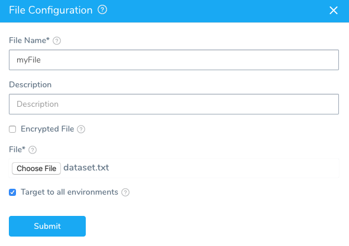

This content is for Harness [FirstGen](../../../getting-started/harness-first-gen-vs-harness-next-gen.md). Switch to [NextGen](https://docs.harness.io/category/kubernetes).

You can use files added to the **Config Files** section in your Kubernetes Service in your manifests, such as in a ConfigMap. You can reference unencrypted and encrypted files, and they can be single or multiline.


### Before You Begin

* [Using Harness Config Variables in Manifests](using-harness-config-variables-in-manifests.md)
* [Define Kubernetes Manifests](define-kubernetes-manifests.md)

### Review: Config File Reference Scope

You cannot reference a Service's Config File in the Pre-Deployment Phase of a Workflow. Canary and Multi-Service Workflows are the only Workflow types with the Pre-Deployment Phase.

The Pre-Deployment Phase does not use a Service and so it has no access to Service Config Files (or Config variables).

You can reference a Service's Config File in the Deployment Phase of the Workflow.

### Review: Config Files Encoding and References

Files added in the **Config Files** section are referenced using the `configFile.getAsString("fileName")` Harness expression:

* `configFile.getAsString("fileName")` - Plain text file contents.
* `configFile.getAsBase64("fileName")` - Base64-encoded file contents.

### Review: Use Base64 to Avoid New Lines

If you are going to use a Config File in a manifest, be aware that `${configFile.getAsString()}` can cause problems by adding new lines to your manifest (unless you have formatted the file very carefully).

Instead, use `${configFile.getAsBase64()}`. This will ensure that the contents of the file are rendered as a single line.

### Step 1: Add the File to Config Files

In this example, we will use a file in a ConfigMap object.

1. Add the unencrypted file to **Config Files**. In this example, the file is a base64 encoded file named `myFile`.

  Make sure you have the **update** permission on the Service or the Environment before you try to add the Service Config File. See [Managing Users and Groups (RBAC)](../../firstgen-platform/security/access-management-howtos/users-and-permissions.md) for more information about assigning permissions.

  

The base64 encoded file will be decoded when added to the manifest, as shown below.

### Step 2: Reference Config File

1. In the **values.yaml** in the Harness Service **Manifests** section, reference the Config File using `my_file: ${configFile.getAsBase64("myFile")}`.

  

### Step 3: Decode the File

1. In the manifest (in our example, a ConfigMap), decode the base64 Config File and indent it for the YAML syntax:

  ```
  data:  
    keyname: |  
  {{.Values.my_file | b64dec | indent 4}}
  ```
  
At runtime, the Config File is decoded and used as plaintext.

### Limitations

* Do not use Harness variables within the file used as a Config File. Harness does not do variable substitution of content within an uploaded Harness Config File.

