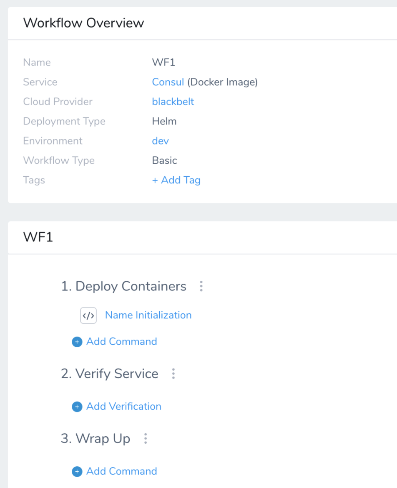
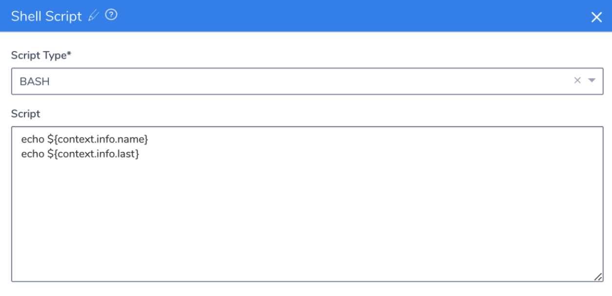
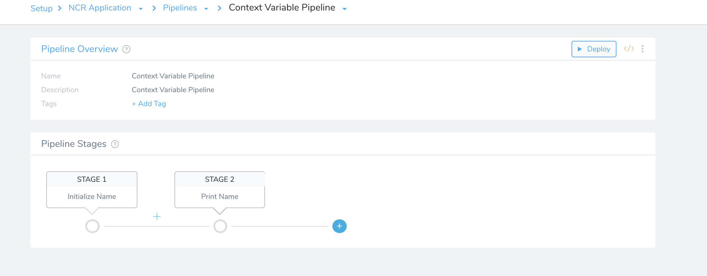
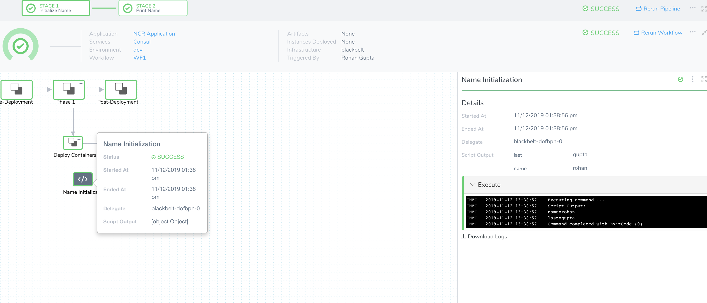
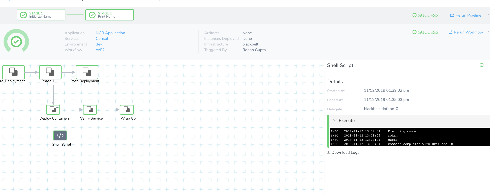

Harness variables can be used as parameters in many settings, and you can create and output variables using different Workflow steps. Once created, you can reference variables using expressions in steps in the same Workflow or across Workflows in a Pipeline.

Let's look at some examples:

* Passing Jenkins environment variables from a Build Workflow to populate configuration values in a subsequent Harness Workflow.
* Pass AWS resource attributes such as ARNs into a CloudFormation template.
* Pass the outputs of a Terraform provisioning Workflow into a JIRA ticket, and update the ticket throughout deployment stages.

In this topic:

* [Before You Begin](#before_you_begin)
* [Step 1: Publish Outputs](#step_1_publish_outputs)
* [Step 2: Echo Variables](#step_2_echo_variables)
* [Step 3: Pass the Variables in a Pipeline](#step_3_pass_the_variables_in_a_pipeline)
* [Review: Passing Variables between Workflows](#review_passing_variables_between_workflows)

### Before You Begin

To obtain an understanding of Harness variable expressions and the Workflow steps that use them, ensure you're read the following:

* [Variables and Expressions in Harness](https://docs.harness.io/article/9dvxcegm90-variables)
* [Add Service Config Variables](../setup-services/add-service-level-config-variables.md)
* [Set Workflow Variables](../workflows/add-workflow-variables-new-template.md)
* [Passing Variables into Workflows and Pipelines from Triggers](passing-variable-into-workflows.md)
* [Jira Integration](../workflows/jira-integration.md)
* [Using the HTTP Command](../workflows/using-the-http-command.md)
* [Using the Jenkins Command](../workflows/using-the-jenkins-command.md)
* [Use Terraform Outputs in Workflow Steps](https://docs.harness.io/article/8p2ze4u25w-use-terraform-outputs-in-workflow-steps)
* [Using CloudFormation Outputs in Workflow Steps](https://docs.harness.io/article/ez8bgluqg5-using-cloudformation-outputs-in-workflow-steps)

#### Prerequisites

This topic uses an existing Harness setup to explain passing variables. To follow along, you can set up the following in your account:

* 2 Harness Application Workflows
* 1 Harness Application Pipeline

### Step 1: Publish Outputs

To demonstrate publishing outputs, we'll create a Workflow and use the [Shell Script step](../workflows/capture-shell-script-step-output.md) to create and publish variables.

1. Create a Workflow, or use an existing workflow in your Application.
2. In your Workflow, add a Shell Script step.
3. In the **Script** section, declare some variables. For example:  

```
name=rohan  
export name  
  
last=gupta  
export last
```
4. In **Script Output**, list out all the environment variables that you want to reference later on. We'll use the variable names `name, last`.
5. Enable **Publish output in the context**.
6. In **Publish Variable Name**, enter a unique parent name for all of the output variables. This is the parent variable that you will use to call the `name` and `last` variables elsewhere.  
We'll use the name `info`.Do not use reserved words in **Publish Variable Name**, such as `var`. See [Variable Expression Limitations and Restrictions](https://docs.harness.io/article/9ob3r6v9tg-variable-expression-name-restrictions).
7. In **Scope**, select **Pipeline** so we can reference these variables in the second Workflow in the Pipeline. When you're done, the step will look like this:

   
  
8. Click **Submit**.

The Workflow should look something like this:



### Step 2: Echo Variables

Next, we'll create another Workflow that echos the variables you published in the first Workflow using the context variable you created.

1. Create a second Workflow and add a Shell Script step.
2. In **Script**, reference the outputs from the first Workflow Shell Script step by entering the following:  
  

```
echo {context.info.name} echo {context.info.last}
```
We use the `context` variable to reference variables in context. `context` is a built-in Harness variable. The `info` variable is what you have assigned to reference the env variables `name` and `last`.  
The Shell Script step will look something like this:


3. Click **Submit**.

You Workflow should look something like this:


### Step 3: Pass the Variables in a Pipeline

Now that we have a Workflow pushing variables and a Workflow echoing them, we can create a Pipeline using the Workflows.

1. Create a Pipeline with two stages. See [Create a Pipeline](../pipelines/pipeline-configuration.md).
2. For Stage 1, select the first Workflow you created, where the variables are published.
3. For Stage 2, select the second Workflow, where you echoed the variables. Your Pipeline will look something like this:

   


   
4. Deploy the Pipeline and review the execution logs. You'll see the Shell Script step in the first Workflow publish the variables:



Next, in stage 2 of the Pipeline, you'll see the Shell Script step in the second Workflow echo the variables.



### Review: Passing Variables between Workflows

Using this simple method of publishing variables, teams can tackle a wide variety of use cases.

If you want to share some ideas, join the [Harness Community](http://community.harness.io/).

