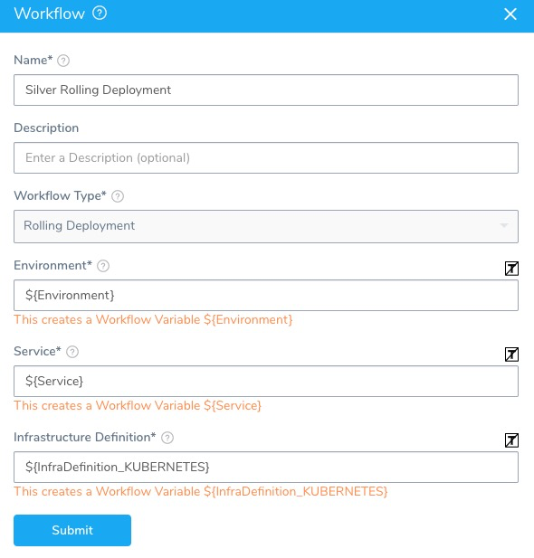
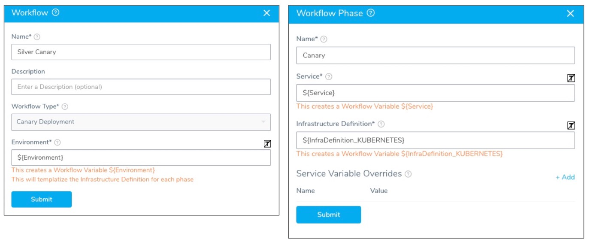
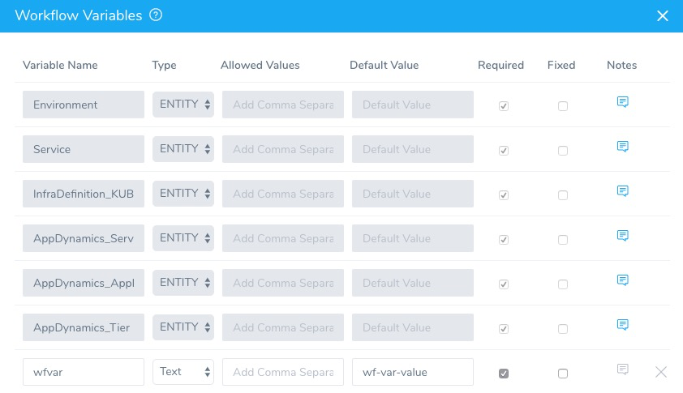
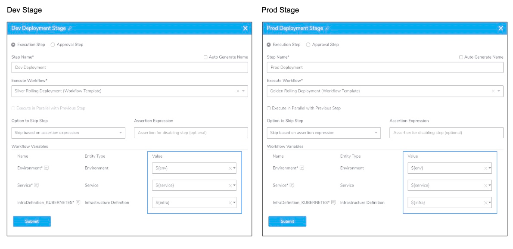
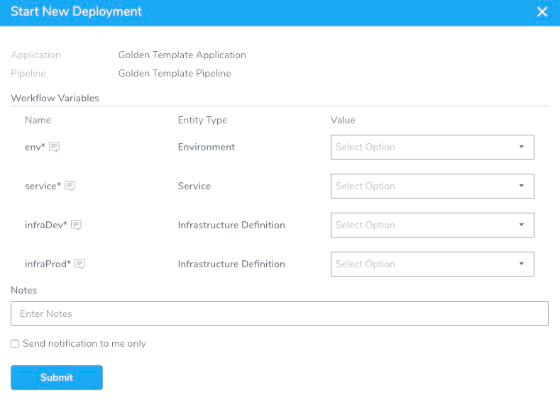
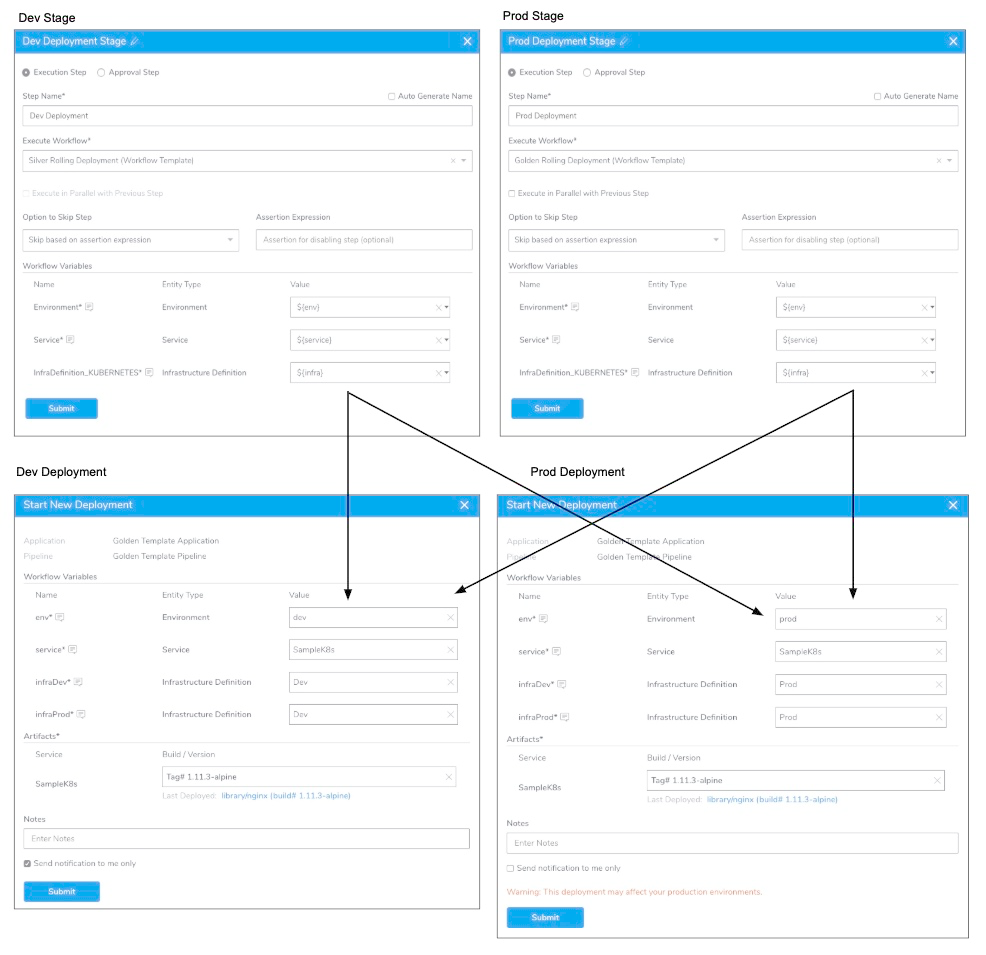

Pipeline templates allow you to use one Pipeline with multiple Services and Infrastructure Definitions and a single Environment.

You template a Pipeline by replacing these settings with variable expressions. Each time you run the Pipeline, you provide values for these expressions.

In this topic:

* [Before You Begin](#before_you_begin)
* [Visual Summary](#visual_summary)
* [Limitations](#limitations)
* [Step 1: Review Workflow Variables in Deployment](#step_1_review_workflow_variables_in_deployment)
* [Step 2: Template the Workflows](#step_2_template_the_workflows)
* [Step 3: Template the Pipeline](#step_3_template_the_pipeline)
* [Step 4: Deploy the Pipeline](#step_4_deploy_the_pipeline)
* [Limitations](#limitations)
* [Next Steps](#next_steps)

### Before You Begin

* [Pipelines](pipeline-configuration.md)
* [Workflows](../workflows/workflow-configuration.md)
* [Variables and Expressions in Harness](https://docs.harness.io/article/9dvxcegm90-variables)

### Visual Summary

Here's an example of two Pipelines Stages that have their Services, Environments, and Infrastructure Definitions settings replaced by variable expression.

At the bottom, the **Start New Deployment** settings for the Pipeline show how the expressions are replaced with values.

During deployment, these values will be applied to all of the Workflows in the Pipeline.

### Limitations

You cannot template multi-value (drop-down) **Allowed Values** Workflow variables.

### Step 1: Review Workflow Variables in Deployment

To template a Pipeline, you have to template one or more Workflows in the Pipeline. Let's review this Workflow template requirement.

To template a Workflow, you replace its Service, Environment, and Infrastructure Definition settings with variable expressions. Here's an example:

When you deploy a Workflow template, you are prompted to provide values for the variables. This is true whether you deploy a Workflow alone, as part of a Pipeline, or by a Trigger.

Here is an example of a Pipeline Stage that deploys the templated Workflow above:

As you can see, values are provided for each Workflow individually. Even in a Pipeline where all the Workflows are using the same Service, Environment, and Infrastructure Definition.

A better solution is to make a template out of the Pipeline. In these cases, you can template the variables for **all the Workflows** in the Pipeline.

With Pipeline templates, you can use one variable for each type of Workflow setting across the Pipeline. For example, you can use a single variable expression for all Services deployed in the Pipeline. When you run the Pipeline, you only need to supply one Service value.

### Step 2: Template the Workflows

To template a Pipeline, first you need to template settings in the Workflows the Pipeline will execute.

You can template all of the settings for the Workflows in your Pipeline. Also, you can simply template some of the Workflow settings.

When deciding what settings to template, consider how the Pipeline template will be used. If it will always deploy to the same Environment and Infrastructure Definition for every Workflow, then perhaps the **Service** setting is the only setting you need to template.

To template a Workflow, do the following:

1. Once you create the Workflow, open the Workflow settings.
2. Click the **[T]** button next to the **Service**, **Environment**, and **Infrastructure Definition** settings.

If you are running a Canary Workflow, you can template the **Environment** setting in the Workflow settings and the **Service** and **Infrastructure Definition** settings in the Phases of the Workflow.

If your Workflow contains Continuous Verification steps, you can template several of their settings also.

For example, here is an AppDynamics step in the Verify section of a Workflow:

For Continuous Verification steps, you will only add and configure them after your Workflow has been deployed once. This allows the step to compare deployments and flag anomalies.Once the settings are templated their related variables are listed in **Workflow Variables**. Here is an example where all Rolling Workflow and AppDynamics step settings are templated, and there is also a Workflow variable named **wfvar**:

### Step 3: Template the Pipeline

To template the Pipeline, as you add your Workflows in Pipeline Stages, you will enter variable expressions as values for one or more of the templated Workflow settings.

For example, here is a templated Workflow added to a Pipeline Stage with each of its templated settings replaced by a Pipeline variable expression, such as `${env}`.

The variable expression name `${env}` is arbitrary. You can use any name.

Variable names may only contain `a-z, A-Z, 0-9, _`. They cannot contain hyphens or or dots (`.`) between names. The following keywords are reserved, and cannot be used as a variable name or property.Again, not all of the Workflow variables in each Stage need to be replaced by a Pipeline variable expression. For any Workflow variables you want to make static, simply provide a value.

To template the entire Pipeline, use variable expressions for all Workflow variables in all Pipeline Stages. Use the same expression names for the same settings.

Here is an example of a Pipeline where both the Dev and Prod Stages use the same expressions for the same settings:

When this Pipeline is deployed, only three values need to be provided for both Stages of the Pipeline. This can be done with Pipelines of any size.

Alternatively, you can have one or more Stages in the Pipeline use different variable expressions for the same settings.

For example, below are two Pipeline Stages. The **Dev Rolling Deployment** Stage uses the expression `${infraDev}` for its Infrastructure Definition setting. The **Prod Rolling Deployment** Stage uses `${infraProd}` for its Infrastructure Definition setting.

When the Pipeline is deployed, both Infrastructure Definitions must be given a value.

The same is true if you execute this Pipeline using a Harness Trigger.

### Step 4: Deploy the Pipeline

When you deploy a templated Pipeline you supply values for any expressions.

Below are the **Dev** and **Prod** Stages in a Pipeline along with two **Start New Deployment** settings. The

Start New Deployment settings show different deployments of the same Pipeline template using different values.

One **Start New Deployment** replaces the expressions with values for the the **Development** infrastructure. Another **Start New Deployment** replaces the same expressions for the **Production** infrastructure.

Every deployment of the same Pipeline template can deploy to a different infrastructure by simply replacing the expressions.

Now more Services, Environments, and Infrastructure Definitions can be added to the Application and used in the same Pipeline template.

### Limitations

Pipeline templates have the following limitations.

#### Workflow Settings

You can only template the following Workflow settings in a Pipeline Stage:

* Service
* Environment
* Infrastructure Definition
* Some Verification step settings — For example, here are several AppDynamics settings templated:

  
  
* Custom Workflow variables — If your Workflows contain other Workflow variables, you can use expressions for those variables when you add the Workflow to a Stage in the Pipeline. When you deploy, you must provide values.

#### Variable Name Restrictions

Variable names may only contain `a-z, A-Z, 0-9, _`. They cannot contain hyphens or dots (`.`) between names. The following keywords are reserved, and cannot be used as a variable name or property: `or and eq ne lt gt le ge div mod not null true false new var return`.

#### Single Environment Across Pipeline

A Pipeline template may only have one Environment expression across all Stages. It must be the same expression.

If you attempt to use an expression in a Stage's **Environment** setting that is different from the other Stage(s) **Environment** setting, an error will occur:

`Error: Invalid argument(s): A Pipeline may only have one Environment expression across all Workflows.`

Simply change the Environment expression to match the other Environment expressions.

### Next Steps

* [Passing Variables into Workflows and Pipelines from Triggers](../expressions/passing-variable-into-workflows.md)
* [Deploy a Workflow to Multiple Infrastructures Simultaneously](https://docs.harness.io/article/bc65k2imoi-deploy-to-multiple-infrastructures)

