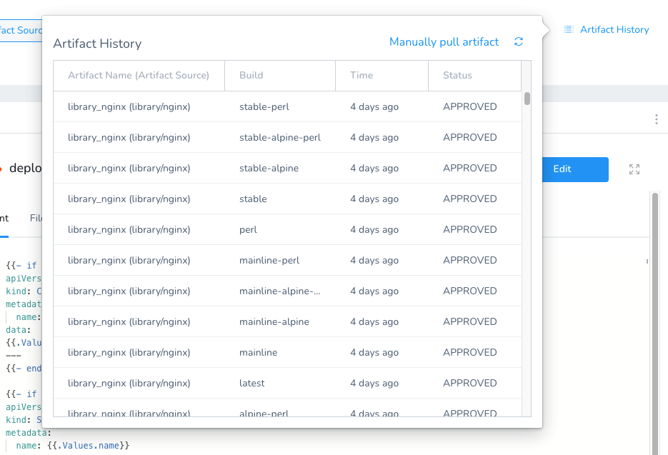
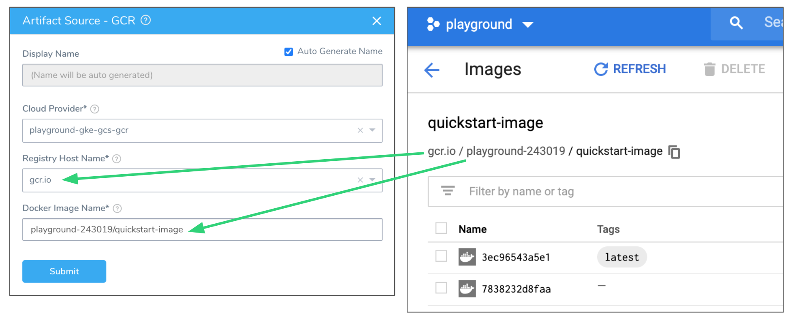

This topic describes how to add a Docker Artifact Source in a Harness Service.

Do not use Docker Registry to connect to a Docker resource on Artifactory. See [Artifactory](https://docs.harness.io/article/7dghbx1dbl-configuring-artifact-server#artifactory).For details on using Docker with Kubernetes, see [Add Container Images for Kubernetes Deployments](../../kubernetes-deployments/add-container-images-for-kubernetes-deployments.md). For details on using Docker with Helm, see [Helm Deployments Overview](../../concepts-cd/deployment-types/helm-deployments-overview.md).

### Before You Begin

* Read the [Create an Application](../applications/application-configuration.md) topic to get an overview of how Harness organizes Services.
* Read the [Add a Service](service-configuration.md) topic to understand the process to add a Service to an Application.
* Read [Configuration as Code](https://docs.harness.io/article/htvzryeqjw-configuration-as-code) to see how you can quickly configure your Harness Service using your existing YAML in Git.
* [Add Artifact Servers](https://docs.harness.io/article/7dghbx1dbl-configuring-artifact-server)

### Limitations

For pulling Docker images from Docker repos, Harness has the following limits:

* 10000 for private Docker repos
* 250 for public (no username or password required) Docker repos

### Review: Metadata Used for Docker Image

If the Artifact Source is **Docker**, at runtime the Harness Delegate will use the metadata to initiate a pull command from the deployment target host(s), and pull the artifact from the registry (Docker Registry, ECR, etc) to the target host.

To ensure the success of this artifact pull, the host(s) running the target host(s) **must** have network connectivity to the registry.

See [Service Types and Artifact Sources](service-types-and-artifact-sources.md).

### Review: Sorting of Artifacts

You add a Docker image to Harness by connecting to your repo using a [Harness Artifact Server](https://docs.harness.io/article/7dghbx1dbl-configuring-artifact-server), and then by entering its name in a Harness Service's Artifact Source **Docker Image Name** setting.

Once you enter the name and click **Submit**, Harness checks to make sure the artifact exists. To verify the name, Harness collects all of the artifacts from the repo you entered.

Many of the APIs do not support sorted results, and so the artifacts are returned in a random order. Consequently, Harness has to sort the artifacts after it collects them.

Harness sorts the artifacts alphanumerically and then displays them in the Harness Manager with the most recent artifacts listed first.

If you push a new artifact to your repo, or rename an artifact, and then refresh the list using the **Artifact History** feature in the Harness Service, the new artifact will be listed first.

### Step: Add a Docker Artifact Source

A Docker Image artifact can be used in a number of different Harness Service types (Kubernetes, Helm, etc). You can specify container commands for the artifact, enter configuration variables and files, and use YAML for specific Service types.

To specify a Docker Image Artifact Source for your Harness Service, do the following:

1. Ensure you have set up an Artifact Server. See [Add Artifact Servers](https://docs.harness.io/article/7dghbx1dbl-configuring-artifact-server).
2. In the **Service Overview**, click **Add Artifact Source** and select the type of artifact source for your service.  
The **Artifact Source** dialog appears with settings specific to the artifact source type you selected. For instructions on the artifact source you selected.

### Option 1: Docker Registry Artifact Source

Do not use Docker Registry to connect to a Docker resource on Artifactory. Use  [Artifactory](https://docs.harness.io/article/7dghbx1dbl-configuring-artifact-server#artifactory).The Docker Registry Artifact Source has the following fields.

|  |  |
| --- | --- |
| **Field** | **Description** |
| **Name** | You can enter a name or have Harness generate one for you automatically. |
| **Source Server** | In **Source Server**, select the name of the artifact source server you added in [Add an Artifact Server](https://docs.harness.io/article/7dghbx1dbl-configuring-artifact-server). |
| **Docker Image Name** | Click in **Docker Image Name** and enter the name of the artifact you want to deploy, such as **library/tomcat**.Wildcards are not supported. |

If you click **Artifact History,** you will see the build history that Harness pulled from the source server.

### Option 2: ECR Artifact Source

The ECR Artifact Source has the following fields.

|  |  |
| --- | --- |
| **Field** | **Description** |
| **Name** | You can enter a name or have Harness generate one for you automatically. |
| **Cloud Provider** | Select the name of the artifact source server you added in [Cloud Providers](https://docs.harness.io/article/whwnovprrb-infrastructure-providers). |
| **Region** | Select the region where the artifact source is located. |
| **Docker Image Name** | Click in **Docker Image Name** and select or enter the name of the artifact you want to deploy. By default, Harness automatically populates the field with the artifacts available from the ECR source server. Often, images in repos need to reference a path, for example: **app/myImage**. |

If you click **Artifact History,** you will see the build history that Harness pulled from the source server.

### Option 3: Azure Container Registry Artifact Source

The Azure Container Registry Artifact Source has the following fields.

|  |  |
| --- | --- |
| **Field** | **Description** |
| **Name** | You can enter a name or have Harness generate one for you automatically. |
| **Cloud Provider** | Select the name of the artifact source server you added in [Cloud Providers](https://docs.harness.io/article/whwnovprrb-infrastructure-providers). |
| **Subscription** | Harness will automatically pull the available GUIDs. Select an Azure Subscription GUID. If you don't see it, the API might have timed out. Enter the GUID and Harness will query for it. |
| **Azure Registry Name** | Harness will automatically pull the available names. Select a name. If you don't see it, the API might have timed out. Enter its name and Harness will query for it. |
| **Repository Name** | Harness will automatically pull the available repository names. Select a name. If you don't see it, the API might have timed out. Enter its name and Harness will query for it. |

If you click **Artifact History,** you will see the build history that Harness pulled from the source server.

### Option 4: GCR Artifact Source

The Google Cloud Container Registry (GCR) Artifact Source has the following fields.

|  |  |
| --- | --- |
| **Field** | **Description** |
| **Display** **Name** | You can enter a name or have Harness generate one for you automatically. |
| **Cloud Provider** | Select the name of the artifact source server you added in [Cloud Providers](https://docs.harness.io/article/whwnovprrb-infrastructure-providers). |
| **Registry Host Name** | Once you select a Cloud Provider, the list of registries is populated automatically. Select the registry where the artifact source is located. |
| **Docker Image Name** | Enter the name of the artifact you want to deploy. Images in repos need to reference a path starting with the project ID that the artifact is in, for example: **myproject-id/image-name**. |

Here is an example:

If you click **Artifact History,** you will see the build history that Harness pulled from the source server.

### Option 5: Artifactory Artifact Source

See [Artifactory Artifact Sources](https://docs.harness.io/article/63gnfa6i8z-artifactory-artifact-sources).

### Option 6: Nexus Artifact Source

See [Nexus Artifact Sources](https://docs.harness.io/article/rdhndux2ab-nexus-artifact-sources).

