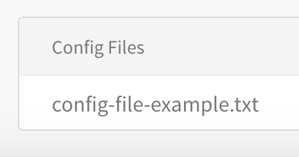
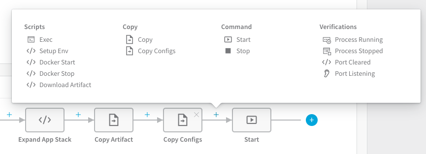
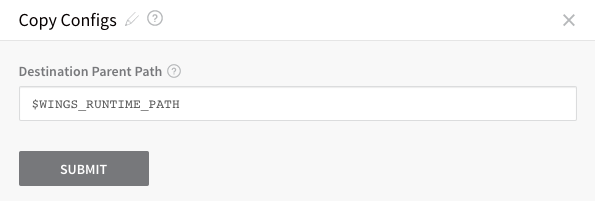
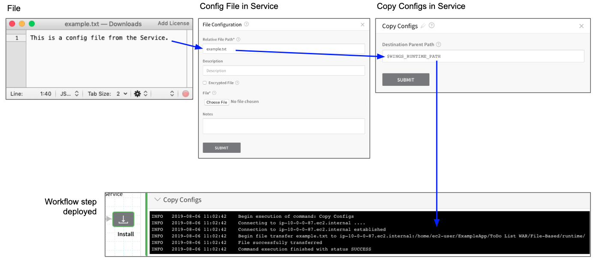

On the Services page, as a part of managing the Services you created, you can add Service Config Files that can be used throughout your configuration settings.

For information about how configuration files are used in a Kubernetes deployment, see [Kubernetes Deployments Overview](../../kubernetes-deployments/kubernetes-deployments-overview.md).

### Before You Begin

* Read the [Create an Application](../applications/application-configuration.md) topic to get an overview of how Harness organizes Services.
* Read the [Add a Service](service-configuration.md) topic to understand the process to add a Service to an Application.
* Read [Configuration as Code](https://docs.harness.io/article/htvzryeqjw-configuration-as-code) to see how you can quickly configure your Harness Service using your existing YAML in Git.

### Limitations

Files must be 1MB or less.

All file types are supported.

### Review: Required Permissions

Make sure you have the **update** permission on the Service before you try to add the Service Config File. See [Managing Users and Groups (RBAC)](https://docs.harness.io/article/ven0bvulsj-users-and-permissions) for more information about assigning permissions.

### Review: String and Base64 Options

Harness can encode your file as a string or Base64.

When selecting an option, consider the content of the file and which encoding method will work best.

Base64 encoding schemes are commonly used when there is a need to encode binary data (credentials are a common example), but they are also preferable when the file content contains special characters which cannot be parsed as a string.

If you try string encoding and receive an error like the following, try Base64:


```
Invalid values file. Error tokenizing YAML. Line 6, column 15: Found a mapping value where it is not allowed
```
### Review: Use Base64 to Avoid New Lines

If you are going to use a Config File in a spec or manifest, be aware that `${configFile.getAsString()}` can cause problems by adding new lines to your spec or manifest (unless you have formatted the file very carefully).

Instead, use `${configFile.getAsBase64()}`. This will ensure that the contents of the file are rendered as a single line.

### Step 1: Add Config Files

Files added in the **Config Files** section are referenced using the `configFile.getAsString("fileName")` Harness functor:

* `${configFile.getAsString("fileName")}` – standard text string.
* `${configFile.getAsBase64("fileName")}` – Base64 encoded.

For example, let's add a **Config Files** file named **config-file-example.txt**.



You would reference this file in a Workflow that uses this Service like this:


```
${configFile.getAsString("config-file-example.txt")}
```
For example, here is an a config file named **example.txt** containing the string `This is a config file from the Service` added to a Service and then referenced in the Workflow that uses the Service. Finally, in the completed Workflow deployment, you can see the contents of the file output.


### Step 2: Use Copy Configs Command

In most cases, use the **Copy Configs** command to copy the Config Files to your target hosts. You can add Copy Configs from the command menu in the Service:



 In Copy Configs, you can change the location on the target host(s) where the files are added:



By default, it uses the [Application Defaults](https://docs.harness.io/article/9dvxcegm90-variables#application_default_variables) path `$WINGS_RUNTIME_PATH`.

When the Workflow using this Service is deployed, the Copy Configs command copies the Service Config File to the target host:



### Review: Use Config Files in Delegate Profiles

The `${configFile.getAsString("fileName")}` and `${configFile.getAsBase64("fileName")}` expressions are not supported in [Delegate Profiles](https://docs.harness.io/article/yd4bs0pltf-run-scripts-on-the-delegate-using-profiles).

Instead, encode the file in base64 and then add the file to Harness as an [Encrypted File Secret](https://docs.harness.io/article/nt5vchhka4-use-encrypted-file-secrets).

Next, in the Delegate Profile script, reference the secret, pipe it to base64 and output it to the path where you need it:


```
echo ${secrets.getValue("secret_name")} | base64 -d > /path/to/file
```
### Notes

* If you sync your Harness Application as described in [Harness Application-Level Git Sync](https://docs.harness.io/article/6mr74fm55h-harness-application-level-sync), the Config Files are also synched to your remote repo.

