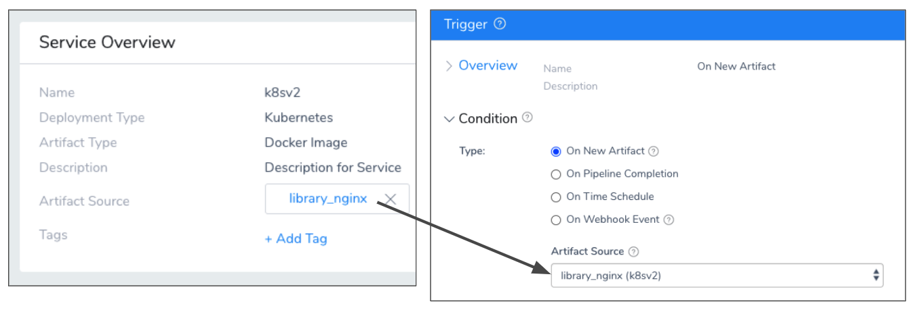
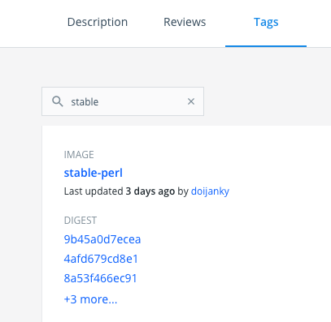
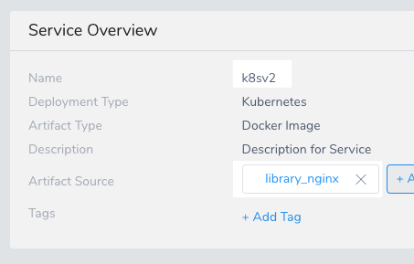

You can trigger Harness Workflow and Pipeline deployments in response to a new artifact being added to a repository.

For example, every time a new Docker image is uploaded to your Docker hub account, it triggers a Workflow that deploys it automatically.

### Before You Begin

* [Add a Service](../setup-services/service-configuration.md)
* [Workflows](../workflows/workflow-configuration.md)
* [Add Environment](../environments/environment-configuration.md)
* [Create a Pipeline](../pipelines/pipeline-configuration.md)
* [Add Artifact Servers](https://docs.harness.io/article/7dghbx1dbl-configuring-artifact-server)

### Limitations

#### One Artifact Triggers Deployment

If more than one artifact is collected during the polling interval (two minutes), only one deployment will be started and will use the last artifact collected.

#### All Artifacts Trigger Deployment

Currently, this feature is behind the feature flag `TRIGGER_FOR_ALL_ARTIFACTS`. Contact [Harness Support](mailto:support@harness.io) to enable the feature.All the artifacts collected during the polling interval will trigger a deployment, with one deployment triggered for each artifact collected.

#### Trigger is based on File Name

The Trigger is executed based on **file names** and not metadata changes.

### Step 1: Add a Trigger

Typically, Triggers are set up after you have successfully deployed and tested a Workflow or Pipeline.

To add a trigger, do the following:

1. Ensure that you have a Harness Service, Environment, and Workflow set up. If you want to Trigger a Pipeline, you'll need one set up also.
2. In your Harness Application, click **Triggers**.
3. Click **Add Trigger**. The **Trigger** settings appear.
4. In **Name**, enter a name for the Trigger. This name will appear in the **Deployments** page to indicate the Trigger that initiated a deployment.
5. Click **Next**.

### Step 2: Select the Artifact Source that Triggers Deployments

Next you can identity the Artifact Source that will initiate the Trigger when a new artifact is added.

You will select an Artifact Source from one of the Harness Services in the Application.

In addition, you can specify a build or tag to filter artifacts in the Artifact Source. For example, the above Artifact Source uses a publicly available Docker image of NGINX and its tags can be seen on Docker Hub:

The simplest way to see the build names for your artifacts, is to use **Artifact History** in the Harness Service.

Here you can see the build names.

Selecting the **Manually pull artifact** option in a Harness Service does not initiate a Trigger set up with **On New Artifact**.To specify the triggering artifact source, do the following:

1. In your Trigger, in **Condition**, in **Type**, click **On New Artifact**. The **Artifact Source** and **Build/Tag Filter** settings appear.
2. In **Artifact Source**, select the Harness Service Artifact Source that points to your Artifact repo. The names are listed with Artifact Source name (Service name).The Trigger is executed based on **file names** and not metadata changes.For example, the Artifact Source `library_nginx (k8sv2)` references a Service's Artifact Source like this:

   
   
3. In **Build/Tag Filter**, you can enter the build name or tag to use to identify the artifact. Look at your repo to see the tags applied to artifacts.

#### Wildcards and Regex

You can use wildcards in the Build/Tag Filter, and you can enable **Regex** to enter a build name or filter using [regex](https://regexr.com/).

For example, if the build is `todolist-v2.0.zip` :

* With **Regex** not enabled, `todolist*` or `*olist*`
* or, with **Regex** enabled, the regex `todolist-v\d.\d.zip`

If the regex expression does not result in a match, Harness ignores the value.

Harness supports standard Java regex. For example, if **Regex** is enabled and the intent is to match any branch, the wildcard should be `.*` instead of simply a wildcard `*`. If you wanted to match all of the files that end in `-DEV.tar` you would enter `.*-DEV\.tar`.When you are done, click **Next**.

Now you can select the Workflow or Pipeline to deploy whenever the Artifact Source you selected receives a new artifact matching your criteria.

### Step 3: Select the Workflow or Pipeline to Deploy

You can select the Workflow or Pipeline to execute when the Trigger's criteria is met (a new artifact is posted to the Artifact Source you selected in **Condition**).

When you select the Workflow or Pipeline, you are prompted to provide values for any required parameters.

1. In **Execution Type**, select **Workflow** or **Pipeline**.
2. In **Execute Workflow** or **Execute Pipeline**, select the Workflow or Pipeline to run.

If the Workflow or Workflows in the Pipeline you selected have Workflow variables, you are prompted to provided values for them.

### Step 4: Provide Values for Workflow Variables

If the Workflow or Pipeline you selected to deploy uses Workflow variables, you will need to provide values for these variables.

You can also use variable expressions for these values. See [Passing Variables into Workflows from Triggers](../expressions/passing-variable-into-workflows.md).

### Step 5: Select the Artifact to Deploy

Since Workflows deploy Harness Services, you are also prompted to provide the Artifact Source for the Service(s) the Workflow(s) will deploy.

There are three main settings:

#### From Triggering Artifact Source

Select this option to use the artifact identified in Artifact Source you selected in **Condition**.

Harness ties Artifact Sources to their Harness Services. If you have a Pipeline with three Workflows that deploy three Services that use the same Artifact Source (say, an artifact in a Nexus repo), you should not create three Triggers. You can simply create a Trigger on the first Service deployed. You can then get the `${artifact.buildNo}` [expression](https://docs.harness.io/article/aza65y4af6-built-in-variables-list#artifact) and [pass it on to the subsequent Workflows](../expressions/how-to-pass-variables-between-workflows.md).

#### Last Collected

Select this option to use the last artifact collected by Harness in the Harness Service. Artifact metadata is collected automatically every two minutes by Harness.

You can also manually collect artifact metadata using the Service's **Manually pull artifact** feature.

#### Last Successfully Deployed

The last artifact that was deployed by the Workflow you select.

### Best Practices

Do not trigger on the **latest** tag of an artifact, such as a Docker image. With **latest**, Harness only has metadata, such as the tag name, which has not changed, and so Harness does not know if anything has changed. The Trigger will not be executed. Do not use a static tag for Triggers, use an artifact source instead. Create a Trigger that deploys On New Artifact.

### Configure As Code

To see how to configure the settings in this topic using YAML, configure the settings in the UI first, and then click the **YAML** editor button.

### Related Topics

* [Passing Variables into Workflows from Triggers](../expressions/passing-variable-into-workflows.md)
* For information on using Triggers as part of Harness GitOps, see [Harness GitOps](../../harness-git-based/harness-git-ops.md).
* [Trigger Deployments when Pipelines Complete](trigger-a-deployment-on-pipeline-completion.md)
* [Schedule Deployments using Triggers](trigger-a-deployment-on-a-time-schedule.md)
* [Trigger Deployments using Git Events](trigger-a-deployment-on-git-event.md)
* [Trigger a Deployment using cURL](trigger-a-deployment-using-c-url.md)
* [Trigger a Deployment when a File Changes](trigger-a-deployment-when-a-file-changes.md)
* [Get Deployment Status using REST](get-deployment-status-using-rest.md)
* [Pause All Triggers using Deployment Freeze](freeze-triggers.md)

