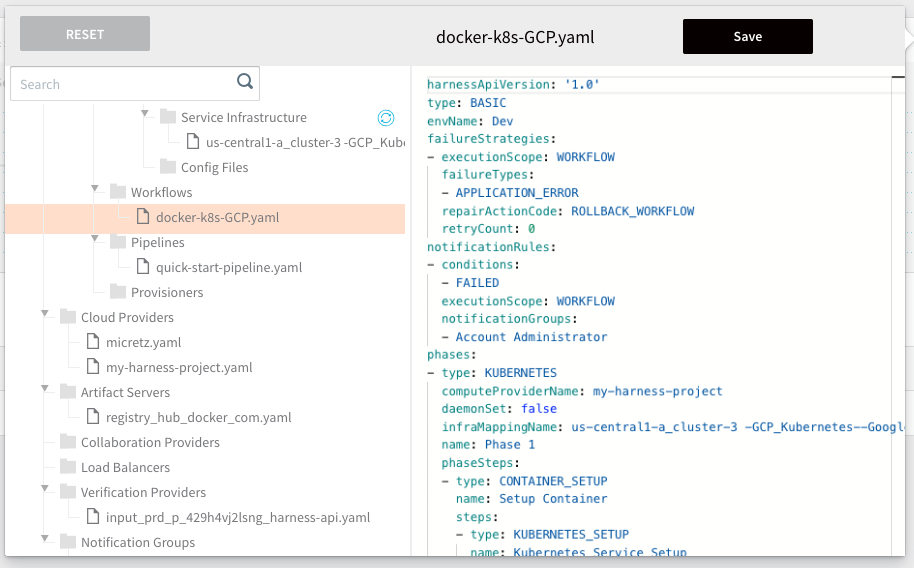

You can configure a Workflow using YAML. You can view the YAML using the main Code editor, as described in [Configuration as Code](../../../firstgen-platform/config-as-code/configuration-as-code.md), or you can jump directly to the YAML of a specific Workflow in the **Workflows** page.

In this topic:

* [Before You Begin](#before_you_begin)
* [Step: Configure a Workflow as Code](#configure_yaml)
* [Next Steps](#next_steps)

### Before You Begin

* [Workflows](workflow-configuration.md)
* [Add a Workflow](tags-how-tos.md)

### Step: Configure a Workflow as Code

To configure a Workflow as code, do the following:

1. In the **Workflows** page, click the code icon. The code editor appears, displaying your Workflow YAML.
2. Modify the YAML of the Workflow as needed, and then click **Save**. If you like, you can verify your change in the Harness Manager interface.

<!--
### Next Steps

* [Troubleshooting a Workflow](https://docs.harness.io/article/y00dt1l4jl-troubleshooting-a-workflow)

-->

