[Atlassian Jira](https://www.atlassian.com/software/jira) provides dev teams with project management and issue tracking throughout the software delivery lifecycle. Harness integrates with Jira to enable you to track the progress of deployments (by creating and updating Jira issues from Harness), and to approve deployment stages (using Jira issues as part of Workflow and Pipeline approvals).

For example, you could create a Jira issue when your deployment Pipeline execution starts, and update the same Jira ticket when each Workflow in the Pipeline complete successfully. And you can use the Jira issue's status to approve or reject a deployment.

### Add Jira as a Collaboration Provider

To use Jira integration in your Workflow or Pipeline, you need to add a Jira account as a Harness Collaboration Provider. For instructions and required permissions, see [Add Jira Collaboration Provider](https://docs.harness.io/article/bhpffyx0co-add-jira-collaboration-provider).

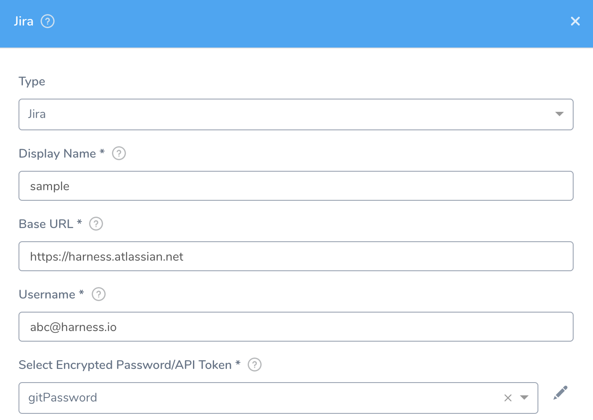

Once you have added a Jira account to Harness, you can integrate Jira into your Workflows and Pipelines.

### Create a Jira Issue Using a Workflow

You can create a Jira issue as a step in the execution of a Workflow. You can add a Jira step to any of the Workflow deployment steps (for example, Setup Container, Deploy Containers, Verify Service, and Wrap Up) and Rollback steps.

When you add a Workflow step that *creates* a Jira issue (as opposed to [updating](#update_a_jira_issue_using_a_workflow) an issue), the Workflow will create a new, independent Jira issue every time it is run.To create a Jira issue as part of a Workflow, do the following:

1. Add a Jira account as a Harness Collaboration Provider, as described in [Add Jira Collaboration Provider](https://docs.harness.io/article/bhpffyx0co-add-jira-collaboration-provider).
2. Create a new Harness Workflow, or open an existing Workflow.
3. In any of the deployment or rollback steps, click **Add Step**. The **Add Step** settings appear.

   
   
4. In **Collaboration**, click **Jira**. The **Jira** settings appear.

 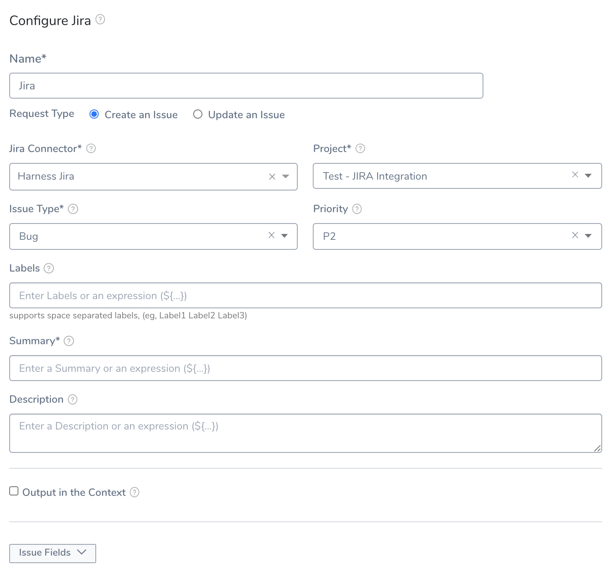

The Jira dialog has the following fields:

* **Title** – By default, the step is titled **Jira**. If you are creating a Jira issue, you might want to rename the step **Jira Creation**, for example.
* **Request Type** – Select **Create an Issue**. **Update an issue** is discussed in [Update an Issue in a Workflow](#update_a_jira_issue_using_a_workflow).
* **Jira Connector** – Select the Jira account to use, by selecting the Jira Collaboration Provider set up for that account. For more information, see [Add Jira Collaboration Provider](https://docs.harness.io/article/bhpffyx0co-add-jira-collaboration-provider).
* **Project** – Select a Jira project from the list. A Jira project is used to create the issue key and ID when the issue is created. The unique issue number is created automatically by Jira.
* **Issue Type** – Select a Jira issue type from the list of types in the Jira project you selected.
* **Priority** – Select a priority for the Jira issue. The list is generated from the Jira project you selected.
* **Labels** – Add labels to the issue. These will be added to the Jira project you selected.
* **Summary** – Required. Add a summary for the Jira issue you are creating. This is commonly called an issue title.
* **Description** – Add the issue description. You can enter text and expressions together.
* **Output in the Context** – Click this option to create and pass variables from this Jira issue to another step in this Workflow or to a Pipeline step. For more information, see [Jira Issue Variables](#jira_issue_variables).
* **Issue Fields** – You can enable this control to target specific fields within a Jira issue. For more information, see [Jira Custom Fields](#jira_custom_fields).Harness supports the following for Jira settings:  
  
– Enter all the values only in English-language. Summary, Description, and all other fields must be in English.  
– You can use expressions for all the fields except **Jira Connector**.

When the **Jira** dialog is complete, it will look something like this:

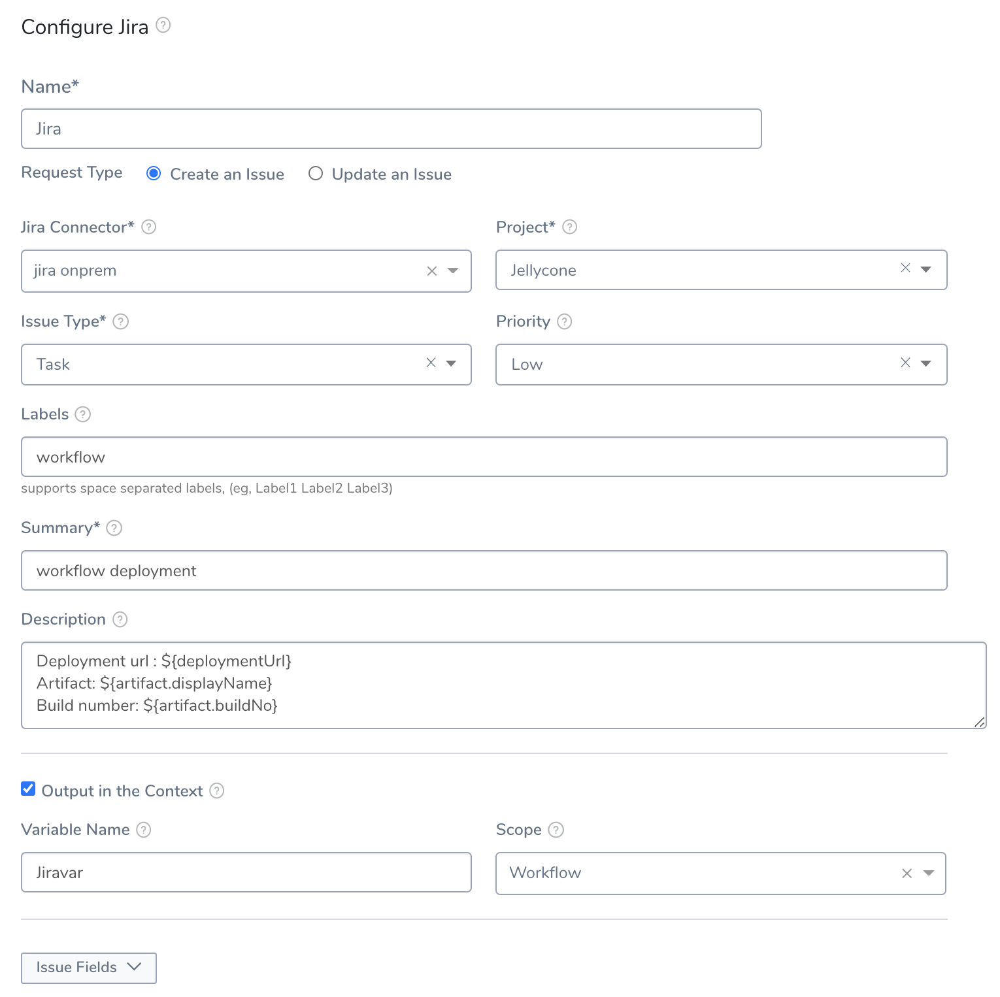Note the use of Harness variables in the **Summary** and **Description** fields:


```
Deployment url : ${deploymentUrl}  
Artifact: ${artifact.displayName}  
Build number: ${artifact.buildNo}
```
The variables will be replaced at runtime with deployment information. For general information on Harness variables, see [Variables and Expressions in Harness](https://docs.harness.io/article/9dvxcegm90-variables). For specifics, see [Jira Issue Variables](#jira_issue_variables) below.

When the Workflow is deployed, in the Harness Manager **Deployments** page, you can see a link to the Jira issue created by the Jira step:

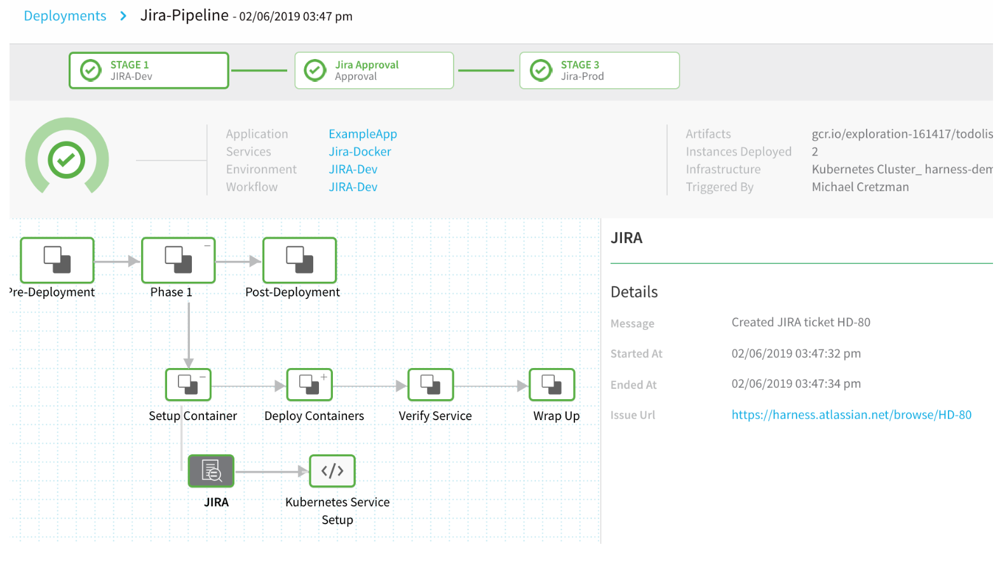Click the link to see the Jira issue that's been created:

Note how the Harness variables were replaced with values. Try it yourself.

### Jira Issue Variables

When you add a Jira step to a Workflow to create a Jira issue, you can create an output variable that can be used to reference that Jira issue in other Workflow steps or Pipelines that use that Workflow.

Using Jira issue variables involves three steps:

1. Identify a new or existing Jira issue using a Jira step in a Workflow.
2. Create an output variable in the step for the Jira issue.
3. Reference the Jira issue in a Workflow, Phase, or Pipeline using the output variable and a Jira issue property, such as an issue ID.

For example, to reference a Jira issue, in the Jira step in a Workflow, you create an output variable, such as **Jiravar**.

The output variable identifies the Jira issue you created. When you reference the Jira issue in another Workflow, Phase, or Pipeline step, you use the `issueId` property. For example, `${Jiravar.issueId}`.

Presently, the only Jira issue elements you can reference are the Jira issue Key or ID (using `issueId` or `issueKey`) and a Jira **Description** (using `issue.description`). Harness plans to later add variables for more Jira issue elements.To create a Jira issue variable, do the following:

1. In a Workflow, in any of the deployment or rollback steps, click **Add Step**. The **Add Step** settings appear.
2. In **Collaboration**, click **Jira**. The **Jira** dialog appears.
3. Click **Create an Issue** and fill out the Jira dialog. In this example, we create a new Jira issue, but you can also create an output variable if the **Update an Issue** settings are used.
4. Click **Output in the Context**. The **Variable Name** and **Scope** settings appear.
5. In **Variable Name**, enter a name for your variable, such as **Jiravar**.
6. In **Scope**, select **Pipeline**, **Workflow**, or **Phase**.  
  
The **Pipeline** scope is the widest, and includes the **Workflow** and **Phase** scopes. Next widest is **Workflow**, which includes any phases within that Workflow. And finally, **Phase** scopes the variable to the Workflow phase in which it was created.  
  
For example, a variable with a **Pipeline** scope can be used by any step in the Pipeline which uses this Workflow, such as an **Approval Step**. For this example, we will use the **Pipeline** scope.
7. Click **Submit**. The variable is created.

Next, let's reference the variable, named **Jiravar**, in another Workflow step, and then a Pipeline step.

1. In the same Workflow, in any of the deployment or rollback steps, click **Add Step**. The **Add Step** settings appear.
2. In **Collaboration**, click **Jira**. The **Jira** dialog appears. We will update the Jira issue in this step, so you might want to rename the step title to **Jira Update**.
3. Click **Update an Issue**. The settings for updating a Jira issue appear.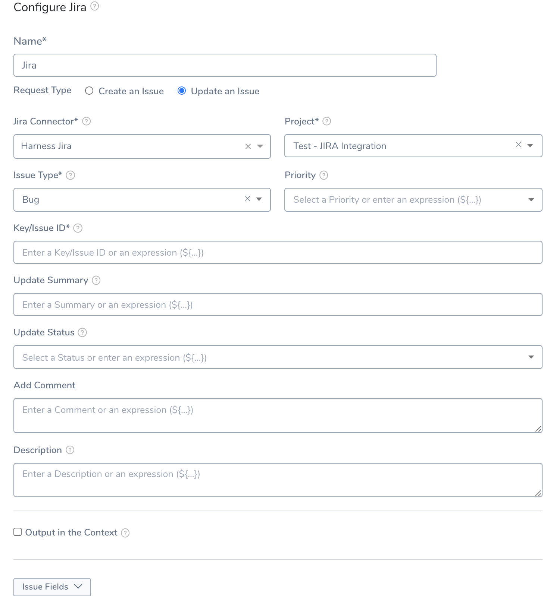
4. Select the same **Jira Connector** and **Project** that you used when you added the Jira step to create the issue.
5. In **Key/Issue ID**, enter the variable that references the Key or ID of the issue you created. You reference the **Key/ID** using the property `issueId`. In our example, we created a variable named **Jiravar**, so the variable reference is `${Jiravar.issueId}`.
6. Next, enter text to update the Jira issue referenced by `${Jiravar.issueId}` using the **Update Summary** and **Update Status** fields.
7. In **Description**, you can reference the **Description** of the Jira issue you output using `${Jiravar.issue.description}`.

Next, let's use the `${Jiravar.issueId}` variable in a Pipeline. For information on creating Pipelines, see [Pipelines](../pipelines/pipeline-configuration.md).

1. Create or use an existing Pipeline.
2. Add the Workflow using `${Jiravar.issueId}` variable to the Pipeline.
3. Click the **+** button to insert a stage into the Pipeline.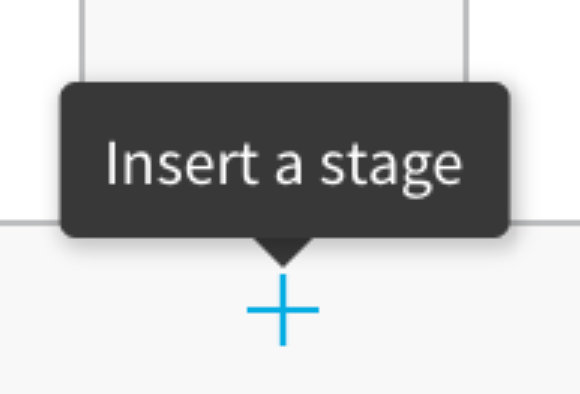The new stage settings appear.
4. Click **Approval Step**. The dialog changes to display the approval settings.
5. In **Ticketing System**, select **Jira Service Desk**. The **Jira** settings appear.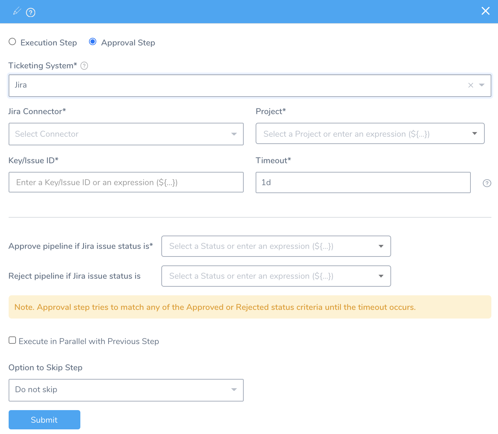
6. Select the **Jira Connector** and **Project** that you used when creating and updating the issue.
7. In **Key/Issue ID**, enter the Jira issue variable you created, `${Jiravar.issueId}`.
8. Fill out the rest of the **Approval Step** as described in [Jira Approvals](../approvals/jira-based-approvals.md).
9. Click **Submit**.


### Jira Custom Fields

Once you've filled in the **Jira** dialog's required fields for **Jira Connector**, **Project**, and **Issue Type**, the dialog's **Issue Fields** control is enabled.

1. Open **Issue Fields** pop-up to select additional fields within the Jira issue you're creating or updating.  
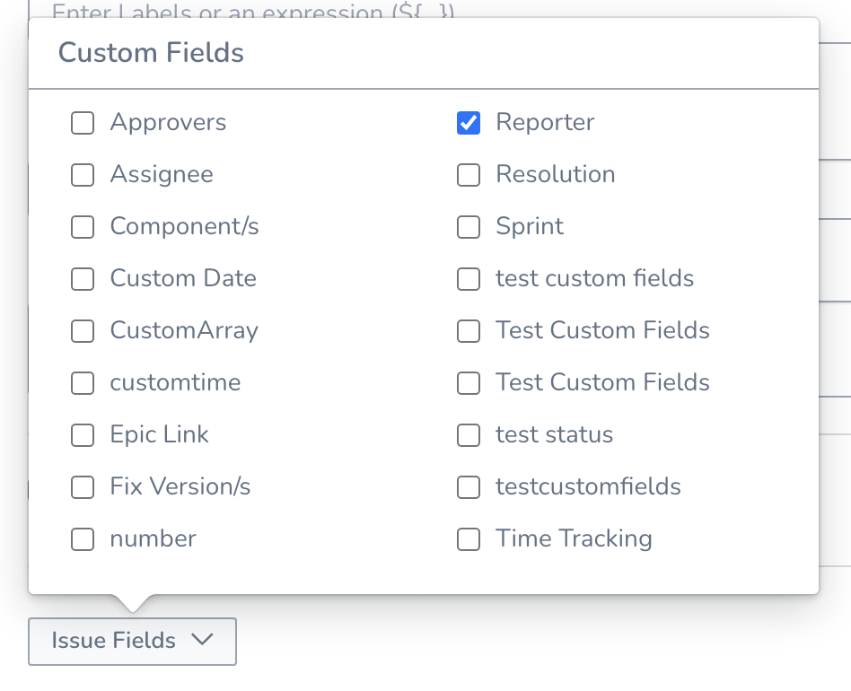
2. As you select fields, they're added below the pop-up. You can then configure these fields with the values you want to apply to the Jira issue you're targeting.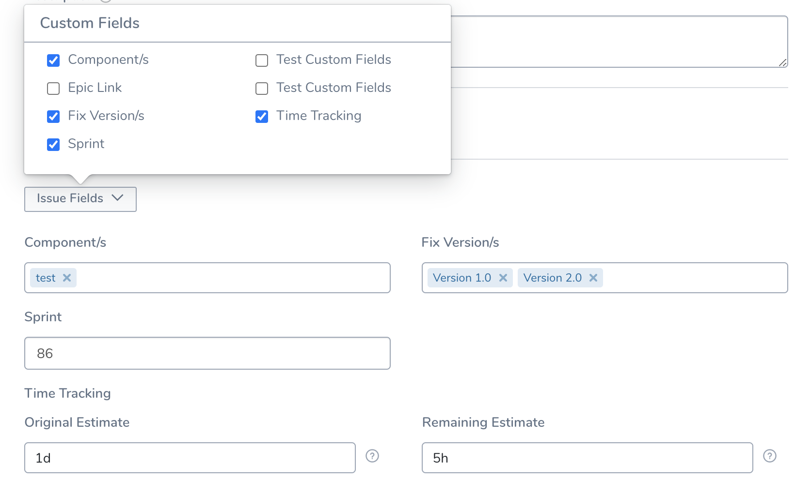
3. When your Project or Issue Type are templatized, **Issue Fields** lists **Name** and **Value**. Click **Add** and enter the details in the Name and Value field. You can enter text and expressions together.In Project if you enter variable expression, the project name gets converted to keys. For example, `CD NextGen` gets converted to `${workflow.variables.CDNG)`.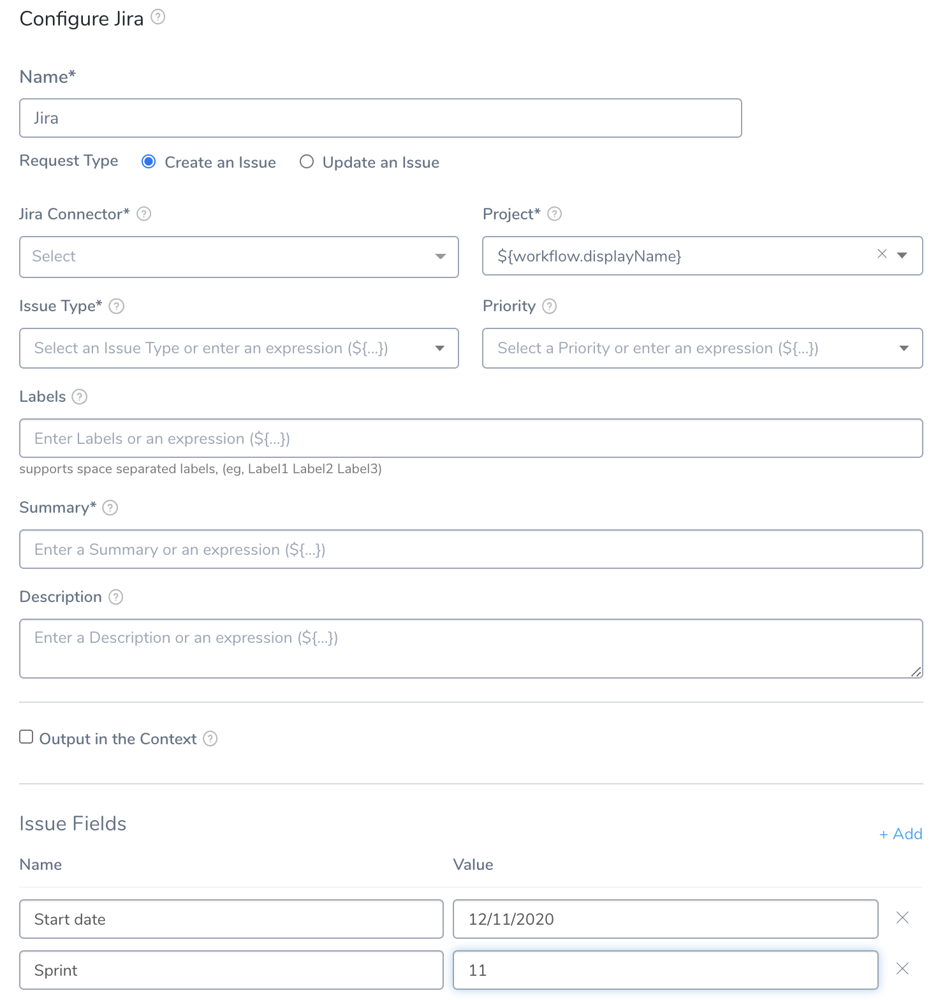

Harness supports only Jira fields of type `Option`, `Array`, `Any`, `Number`, `Date`, and `String`. Harness does not integrate with Jira fields that manage users, issue links, or attachments. This means that Jira fields like Assignee and Sprint are not accessible in Harness' Jira integration.

#### User Fields

Currently, this feature is behind the feature flag `ALLOW_USER_TYPE_FIELDS_JIRA`. Contact [Harness Support](mailto:support@harness.io) to enable the feature.When you select user-based fields from **Issue Fields**, such as **Reporter**, you can click in the fields produced and enter the first letters of a name. Harness will automatically search Jira for the name. Click the name to add it.

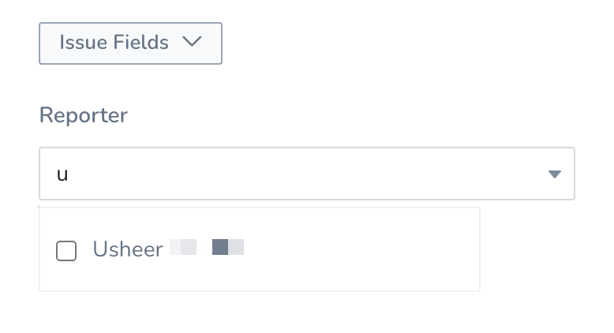You can use a Jira user's username or email.

User-based fields also support [Workflow Variables](add-workflow-variables-new-template.md).

#### Harness Expression Support in Issue Fields

In the **Issue Fields** section, all select and multi-select settings can use [Service](../setup-services/add-service-level-config-variables.md) and [Workflow variable expressions](add-workflow-variables-new-template.md).

Whether a field setting is select or multi-select depends on how you designed the field in Jira.

The variables must exist already and be resolvable at this point in the Workflow.

For example, if you use a Service variable in the Jira step in the **Pre-deployment** section of a Canary Workflow, the variable is not available. The Service is selected in the Phases of the Canary Workflow, and so that Service variable can only be used in those Phases.

Workflow variables can be used anywhere in the Workflow.

When you deploy your Workflow, you will provide values for any variables. If you are using variables for Custom Fields, you can enter in a comma-separated list for your Workflow variable value, such as `test, hello, goodbye`.

See:

* [What is a Harness Variable Expression?](https://docs.harness.io/article/9dvxcegm90-variables)
* [Add Service Config Variables](../setup-services/add-service-level-config-variables.md)
* [Set Workflow Variables](add-workflow-variables-new-template.md)

### Jira Date Field Support

Among the custom fields Harness supports are Baseline End Date and Start Date Time. If your Jira project uses these fields, they are available in Custom Fields:

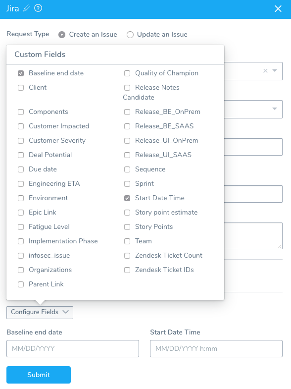Once you have selected these fields, the **Baseline end date** and **Start Date Time** settings appear.

Click in these fields to use the date and time selectors.

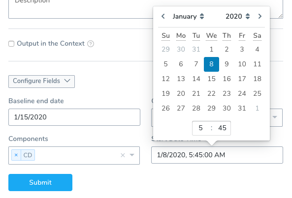You can also use advanced dates using Workflow variables and the `current()` function:

And you can use these together with operators:


### Update a Jira Issue Using a Workflow

You can update an existing Jira issue in two ways:

* [Update with Jira Keys/IDs](#update_by_ids)
* [Update with a Variable](#update_by_variable)


#### Update with Jira Keys/IDs

To update by explicit Keys/IDs, simply copy one or more Jira issue Keys/IDs from Jira. Then, in the Workflow Jira step's **Update an Issue** settings, paste them into the **Key/Issue ID** field.

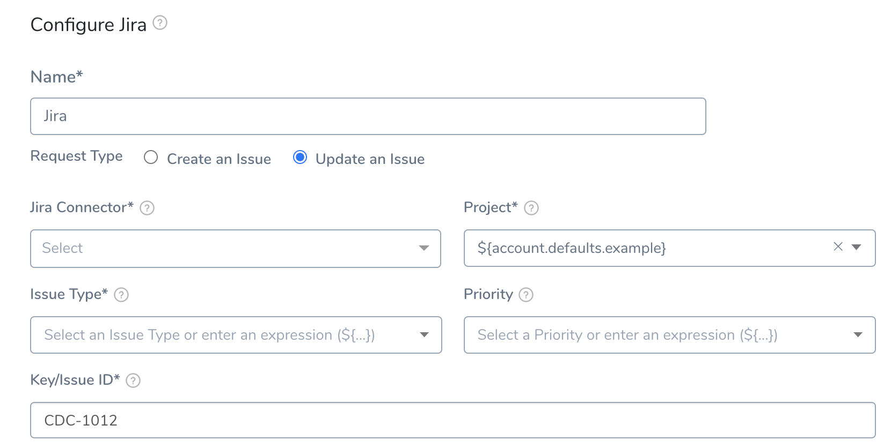To enter multiple issue IDs, you can use the characters `, : ;` or spaces as separators. Optionally, you can also enclose a group of issue IDs in the character pairs `{}` or `()` or `[]`.
#### Update with a Variable

As an alternative, you can use the `issueId` variable property to update one or more Jira issues that you created with Harness. Using the variable we [created earlier](#jira_issue_variables), this example shows the field entry `${Jiravar.issueId}`:


#### Example: Update by Variable

To update a Jira issue in a Workflow using the `issueId` variable property, do the following:

1. Create a new Jira issue using the **Jira** step in a Workflow, as described in [Create an Issue in a Workflow](#create_a_jira_issue_using_a_workflow).
2. In the **Jira** step, click **Output in the Context**. The **Variable Name** and **Scope** settings appear.
3. In **Variable Name**, enter a name for your variable, such as **Jiravar**.
4. In **Scope**, select **Pipeline**, **Workflow**, or **Phase**.
5. Click **Submit** to complete the Jira step.
6. Within the scope you set—which, in a Pipeline, can include another Workflow—click **Add Step**. The **Add Step** settings appear.
7. In **Collaboration**, click **Jira**. The **Jira** dialog appears. We will update the Jira issue in this step, so you might want to rename the step title to **Jira Update**.
8. Click **Update an Issue**. The settings for updating a Jira issue appear:
9. Select the same **Jira Connector** and **Project** that you used when you added the Jira step to create the issue.
10. In **Key/Issue ID**, enter the variable expression that references the **Key/ID**(s) of the issue(s) you created. You reference a **Key/ID** using the property `issueId` or `issueKey`. In our example, when you created an output variable (in the Workflow's Jira step) that created the Jira issue, the variable was named **Jiravar**. So the variable reference is `${Jiravar.issueId}`.  
  
Now this Jira step will update the same Jira issue(s).
11. Next, enter text to update the Jira issue(s) referenced by `${Jiravar.issueId}`, using the **Update Summary** and **Update Status** fields.
12. In **Description**, you can reference the description field of the same issue using the variable `${jiraVar.issue.description}`, and append information to it, like this:


Here's an example where the Jira step creates a new Jira issue, relying on the output variable **Jiravar**. The variable is scoped to **Pipeline**, to enable another Workflow to update the Jira issue.

Here's the Jira step in Harness that creates the Jira issue:

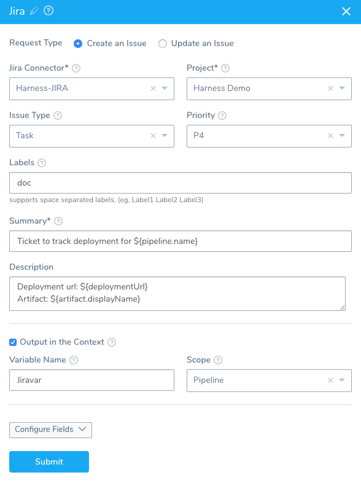Here's the newly created ticket in Jira:

Here's the Jira step to *update* the Jira issue. Note the comment in the **Add Comment** field: `Prod Workflow Complete`.

**Updating the issue Description:** If you leave the **Description** setting empty, the description from the issue referenced using `${Jiravar.issueId}` is maintained. If you add text to the **Description** field, that text overwrites the text in the issue. You can use the variable `${Jiravar.issue.description}` to reference the original description, and then append information. The `issue.description` expression references the original description in the issue referenced with `${Jiravar.issueId}`.During deployment, Harness Manager's **Deployments** page contains a link to the updated Jira issue:

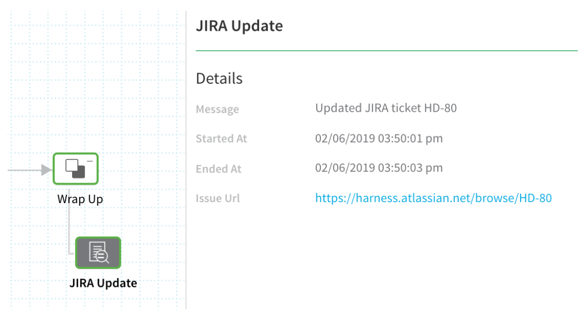Here's the updated Jira issue in Jira. Note the Comment: `Prod Workflow Complete`.


#### Example: Update by Artifact Tag

This second Workflow example uses a variable, combined with an artifact tag, to update a pair of Jira issues during deployment. In this example, the artifact is a an AMI.

See [AMI (Amazon Machine Image) Deployment](../../aws-deployments/ami-deployments/ami-deployment.md) for background information about AMI deployment in Harness.In the AWS Console, the highlighted AMI (`ui-integration-test-v5`) has been assigned a Tag consisting of a key/value pair. The key is named `jiraIds`, and its value is the pair of Jira issue IDs we want to update: `TJI-1234, TJI-1235`.

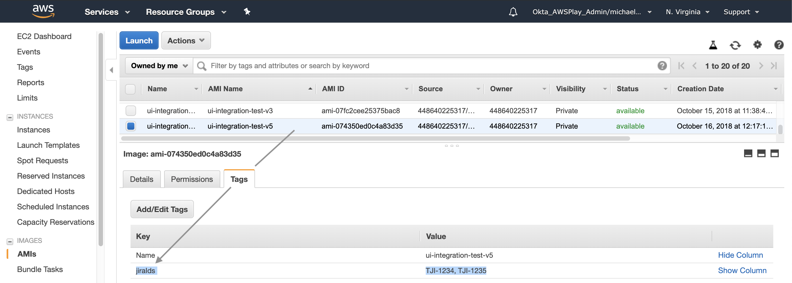In Harness, our Workflow to deploy this AMI contains a Jira step, which is executed after **Setup AutoScaling Group**:

In the Jira step, the **Key/Issue ID** field references the AMI's Tag key using the variable `${artifact.metadata.jiraIds}` . The **Add Comment** field specifies a simple test message to write to the linked Jira issues:

Once we run the deployment, upon successful setup of the Auto Scaling Group, the **Details** panel shows that Harness has updated the two intended Jira issues:


### Jira Resolution Support

You can update the resolution setting of a Jira Issue in the Jira step:

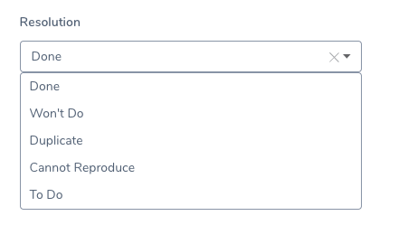To add the resolution setting, in the Jira step, click **Issue Fields**, and then select **Resolution**.

The **Resolution** setting is added. It is populated by the resolution settings in the Jira project you selected in **Project**.

Once you deploy the Workflow, the Jira issue's **Resolution** status is updated with the value you selected:

You can also add a Harness Service or Workflow variable expression. See [Add Service Config Variables](../setup-services/add-service-level-config-variables.md) and [Set Workflow Variables](add-workflow-variables-new-template.md).

### Jira Time Tracking Support

Harness does not support Jira Time Tracking **legacy mode**.You can update the time tracking setting of a Jira Issue in the Jira step. To add the Time tracking setting, do the following:

1. In the **Jira** step, click **Issue Fields**.
2. Select **Time tracking**.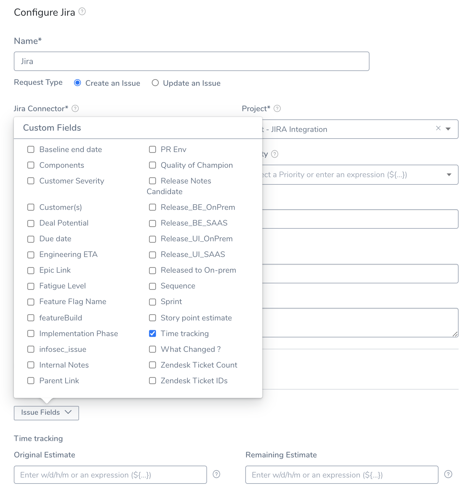
3. Enter **Original** and **Remaining Estimate**.
4. Click **Submit**.  
  
The Time tracking setting is added. Once you deploy the Workflow, the Jira issue's Time tracking status is updated with the value you selected.You can also add a Harness Service or Workflow variable expression. See [Add Service Config Variables](../setup-services/add-service-level-config-variables.md) and [Set Workflow Variables](add-workflow-variables-new-template.md).

### Jira-based Approvals

You can add approval steps in both Workflows and Pipelines, and can use Jira issues' Workflow statuses for approval and rejection criteria. For more information, see [Jira Approvals](../approvals/jira-based-approvals.md).

### Create Jira Issues from Verification Events

When a deployment fails, you can create a Jira issue directly from a deployment's verify step, or from 24/7 Service Guard. For details, see [File Jira Tickets on Verification Events](../../continuous-verification/tuning-tracking-verification/jira-cv-ticket.md).

