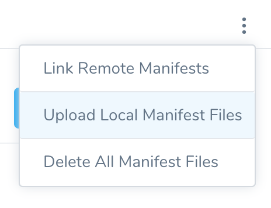
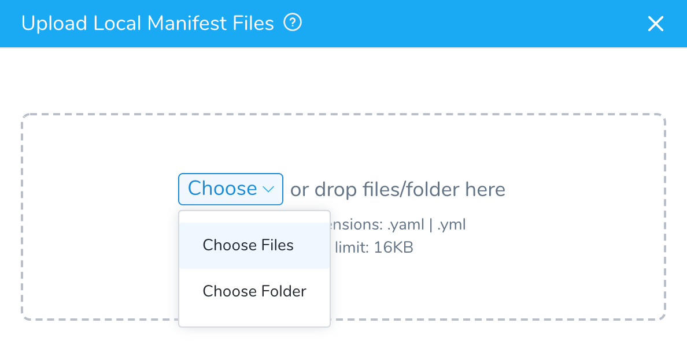
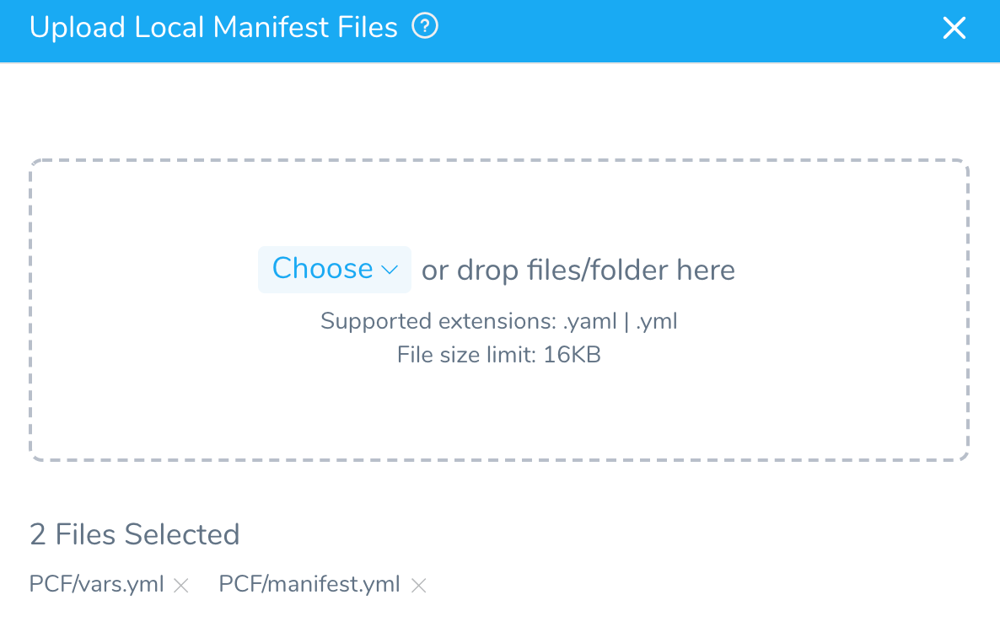
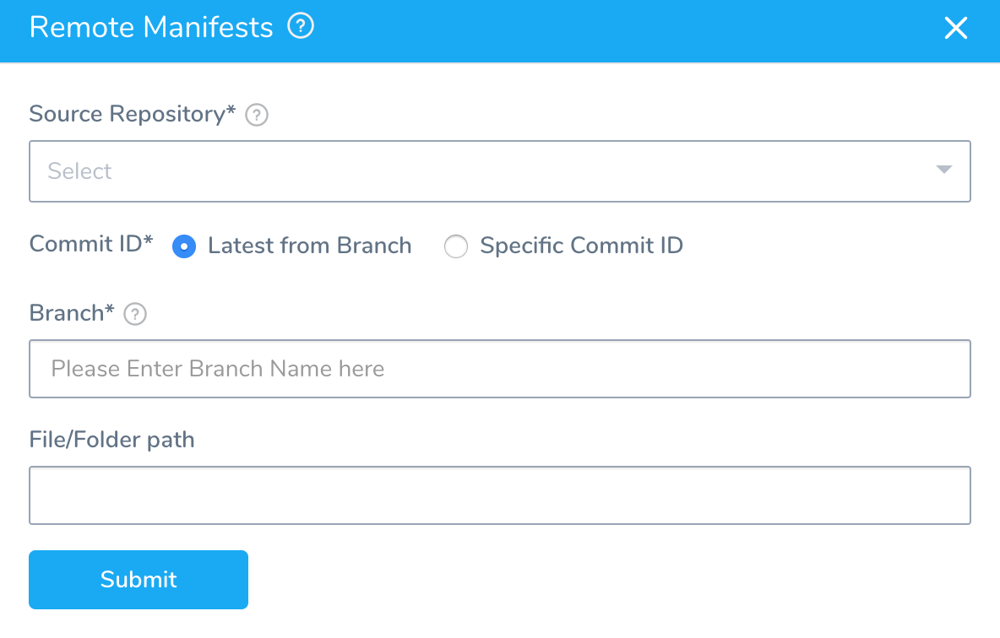
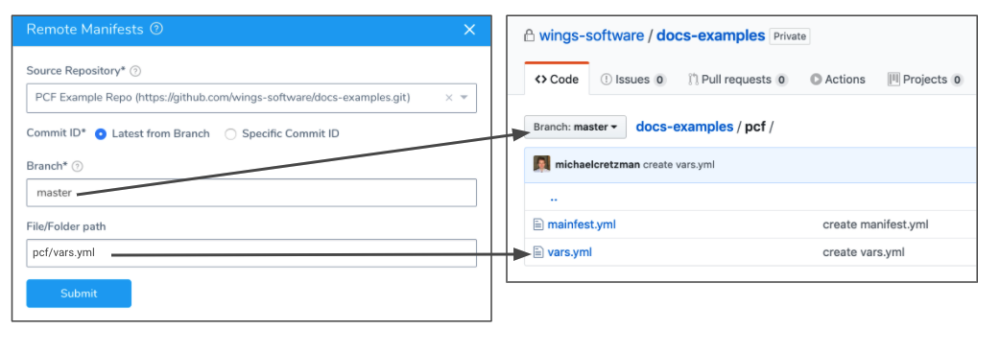

You can upload local and remote Tanzu Application Service (TAS, formerly PCF) Manifest and Variable files to your Harness TAS Service.

In this topic:

* [Before You Begin](#before_you_begin)
* [Step 1: Upload Local Manifest and Variable Files](#step_1_upload_local_manifest_and_variable_files)
* [Step 2: Upload Remote Manifest and Variable Files](#step_2_upload_remote_manifest_and_variable_files)
* [Next Steps](#next_steps)

### Before You Begin

* See [Connect to Your Target Tanzu Account](connect-to-your-target-pcf-account.md).
* See [Add Container Images for Tanzu Deployments](add-container-images-for-pcf-deployments.md).
* See [Adding and Editing Inline Tanzu Manifest Files](adding-and-editing-inline-pcf-manifest-files.md).

### Step 1: Upload Local Manifest and Variable Files

You can upload `manifest.yml` and `vars.yml`files from your local drive into your Harness Service.

Harness allows one manifest file and one or more variable files. At runtime, Harness will evaluate the files to identify which is the manifest file and which are the variable files.

From the options menu, click **Upload Local Manifest Files**.

The **Upload Local Manifest Files** dialog appears.

Choose the local folder or files using your file explorer or drag and drop the files into the dialog. The selected files are listed.

Click **Submit** to add the files.

If you are uploading a manifest.yml or vars.yml file into the same folder with the default manifest.yml and vars.yml files, you will see the following warning.

Simply click **Overwrite All** and then **Submit** to replace the default files.

### Step 2: Upload Remote Manifest and Variable Files

Harness checks out manifest files from your repo at deployment runtime. If any files in the repository contain non UTF-8 characters (binary, zip, etc), the checkout fails. For example, sometimes an operating system file such as .DS\_Store files get added to a repo.Once you have set up a Harness [Source Repro Provider](https://docs.harness.io/article/ay9hlwbgwa-add-source-repo-providers) using your remote Git repo, you can use TAS files from the remote repo in your TAS Service **Manifests** section.

To use remote files, do the following:

1. Create a [Harness Source Repro Provider](https://docs.harness.io/article/ay9hlwbgwa-add-source-repo-providers) that connects to the branch where your remote files are located.  
   When you set up the Source Repro Provider, you specify the repo URL and branch name:
   
2. In the TAS Service, in **Manifests**, click the options button, and then click **Link Remote Manifests**.
   
   The **Remote Manifests** dialog appears.
   
3. In **Source Repository**, select the Source Repo Provider you set up, and that points to the remote Git repo containing your manifest files.
4. In **Commit ID**, select **Latest from Branch** or **Specific Commit ID**.  
  
**Which one should I pick?** Make your selection based on what you want to happen at runtime. If you want to always use the latest files from a repo branch at runtime, select **Latest from Branch**. If you want to use the files as they were at a specific commit, select **Specific Commit ID**. Any changes from additional commits will not be used at runtime. To use changes from additional commits, you will have to update commit ID.

#### File/Folder Path Current Functionality

The file path you enter in **File/Folder Path** will be used as the manifest for this Service.

**Avoid listing a folder only:** If you enter a folder path only, Harness does not know which file in the folder to use, so Harness will list the files using Git and then select the last file listed. If the last file is invalid, Harness will select the second to last file, and so on. The order in which files are returned from Git is not constant, and so selecting the correct file is not always possible. Instead, provide the full path to the file.1. If you selected **Latest from Branch**, specify the **Branch** and **File/Folder** path to the remote manifest file (typically, a vars.yml file).
2. If you selected **Specific Commit ID**, specify the **Commit ID** and **File/Folder** path to the remote manifest files.

Click **Submit**. Your remote git repo is added as the source for **Manifests**.

#### File/Folder Path New Functionality

Currently, this feature is behind the feature flag `SINGLE_MANIFEST_SUPPORT`. Contact [Harness Support](mailto:support@harness.io) to enable the feature.The file path you enter in **File/Folder Path** will be used as the manifest for this Service.

Harness requires the path to the manifest or vars file you are using. 

If you enter a folder path and **no file**, deployment will fail.

### Next Steps

* [Using Harness Config Variables in Tanzu Manifests](using-harness-config-variables-in-pcf-manifests.md)
* [Define Your Tanzu Target Infrastructure](define-your-pcf-target-infrastructure.md)

