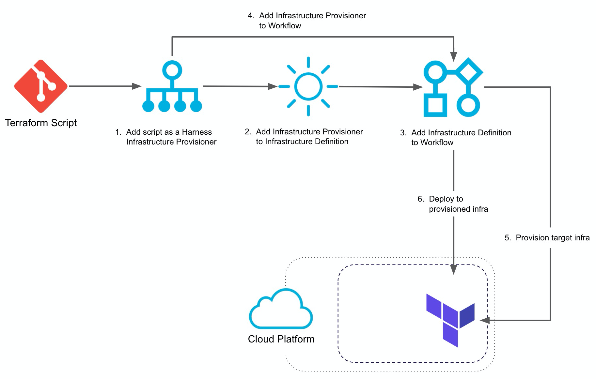
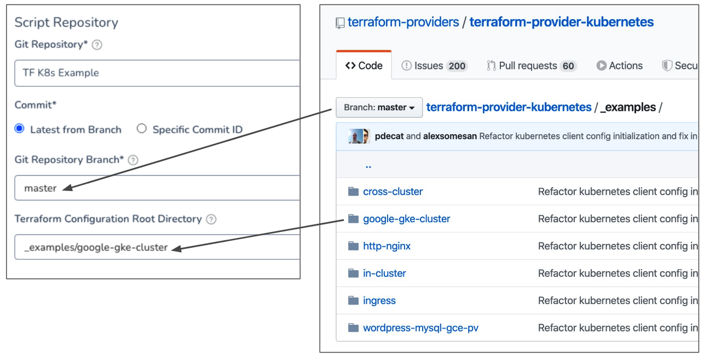
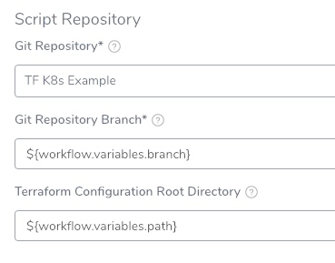
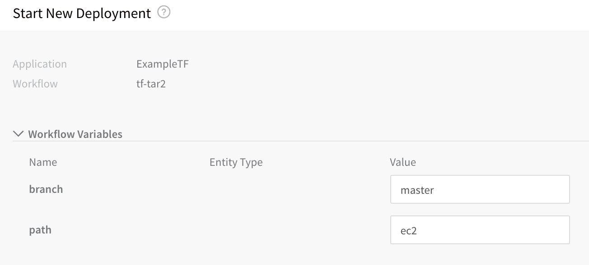
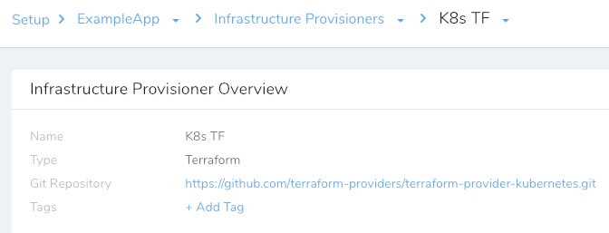

This topic describes how to set up a Harness Infrastructure Provisioner for Terraform.

Once the Harness Infrastructure Provisioner is set up, you can use it to do the following:

* Define a deployment target in a Harness Infrastructure Definition, provision the target infrastructure in a Workflow as part of its pre-deployment step, and then deploy to the target infrastructure.
* Provision any non-target infrastructure.

Harness supports first class Terraform provisioning for AWS-based infrastructures (SSH, ASG, ECS, Lambda), Google Kubernetes (GKE), Azure WebApps, and physical data centers via shell scripts.  
  
Harness Terraform Infrastructure Provisioner are only supported in Canary and Multi-Service Workflows. For AMI/ASG and ECS deployments, Terraform Infrastructure Provisioners are also supported in Blue/Green Workflows.In this topic:

* [Before You Begin](#before_you_begin)
* [Review: Terraform Syntax Support](#review_terraform_syntax_support)
* [Visual Summary](#visual_summary)
* [Step 1: Add a Terraform Provisioner](#step_1_add_a_terraform_provisioner)
* [Step 2: Select Your Terraform Script Repo](#step_2_select_your_terraform_script_repo)
* [Option: Use Expressions for Script Repository](#option_use_expressions_for_script_repository)
* [Step 3: Select Secret Manager for Terraform Plan](#step_3_select_secret_manager_for_terraform_plan)
* [Option: Skip Terraform Refresh When Inheriting Terraform Plan](#option_skip_terraform_refresh_when_inheriting_terraform_plan)
* [Step 4: Complete the Terraform Provisioner](#step_4_complete_the_terraform_provisioner)
* [Next Steps](#next_steps)

### Before You Begin

* Get an overview how how Harness supports Terraform: [Terraform Provisioning with Harness](../concepts-cd/deployment-types/terraform-provisioning-with-harness.md).
* Ensure you have your Harness account settings prepared for Terraform: [Set Up Your Harness Account for Terraform](terraform-delegates.md).

### Review: Terraform Syntax Support

Harness supports Terraform scripts written in Terraform syntax versions 11 and 12.

#### Terraform Syntax Support for Versions 13-1.0

Currently, this feature is behind the Feature Flag `TERRAFORM_CONFIG_INSPECT_VERSION_SELECTOR`. Contact [Harness Support](mailto:support@harness.io) to enable the feature.When this feature flag is enabled, Harness supports Terraform scripts written in Terraform syntax versions 11, 12, 13, 14, 15, and 1.0.

### Visual Summary

This topic describes step 1 in the Harness Terraform Provisioning implementation process displayed below.

The graphic shows how the scripts you add in this topic are used to provision the target infrastructure for a deployment:

Once you have completed this topic:

* If you are going to provision the deployment target infrastructure, move onto the next step: [Map Dynamically Provisioned Infrastructure using Terraform](mapgcp-kube-terraform-infra.md).
* If want to simply provision any non-target infrastructure, see [Terraform Provisioning with Harness](../concepts-cd/deployment-types/terraform-provisioning-with-harness.md).

### Step 1: Add a Terraform Provisioner

To set up a Terraform Infrastructure Provisioner, do the following:

In your Harness Application, click **Infrastructure Provisioners**.

Click **Add Infrastructure Provisioner**, and then click **Terraform**. The **Add Terraform Provisioner** dialog appears.

In **Name**, enter the name for this provisioner. You will use this name to select this provisioner in Harness Infrastructure Definitions and the Workflow steps Terraform Provision, Terraform Apply, and Terraform Destroy.

Click **Next**. The **Script Repository** section appears. This is where you provide the location of your Terraform script in your Git repo.

### Step 2: Select Your Terraform Script Repo

In **Script Repository**, in **Git Repository**, select the [Source Repo Provider](https://docs.harness.io/article/ay9hlwbgwa-add-source-repo-providers) you added for the Git repo where your script is located.

In **Commit**, select **Latest from Branch** or **Specific Commit ID**:

**Specific Commit ID** also supports [Git tags](https://git-scm.com/book/en/v2/Git-Basics-Tagging).* If you selected **Latest from Branch**, in **Git Repository Branch**, enter the repo branch to use. For example, **master**. For master, you can also use a dot (`.`).
* If you selected **Specific Commit ID**, in **Commit ID**, enter the Git commit ID or Git tag to use.

In **Terraform Configuration Root Directory**, enter the folder where the script is located. Here is an example showing the Git repo on GitHub and the **Script Repository** settings:

When you click **Next**, the **Plan Configuration** section is displayed.

Before you move onto **Plan Configuration**, let's review the option of using expressions in **Script Repository**.

### Option: Use Expressions for Script Repository

You can also use expressions in the **Git Repository Branch** and **Terraform Configuration Root Directory** and have them replaced by Workflow variable values when the Terraform Provisioner is used by the Workflow. For example, a Workflow can have variables for **branch** and **path**:

In **Script Repository**, you can enter variables as `${workflow.variables.branch}` and `${workflow.variables.path}`:

When the Workflow is deployed, you are prompted to provide values for the Workflow variables, which are then applied to the Script Repository settings:

This allows the same Terraform Provisioner to be used by multiple Workflows, where each Workflow can use a different branch and path for the **Script Repository**.

### Step 3: Select Secret Manager for Terraform Plan

In **Plan Configuration**, in **Terraform Plan Storage Configuration**, select a Secrets Manager to use for encrypting/decrypting and saving the Terraform plan file.

See [Add a Secrets Manager](https://docs.harness.io/article/uuer539u3l-add-a-secrets-manager).

A Terraform plan is a sensitive file that could be misused to alter cloud provider resources if someone has access to it. Harness avoids this issue by never passing the Terraform plan file as plain text.

Harness only passes the Terraform plan between the Harness Manager and Delegate as an encrypted file using a Harness Secrets Manager.

When the `terraform plan` command is run on the Harness Delegate, the Delegate encrypts the plan and saves it to the Secrets Manager you selected. The encrypted data is passed to the Harness Manager.

When the plan is going to be applied, the Harness Manager passes the encrypted data to the Delegate.

The Delegate decrypts the encrypted plan and applies it using the `terraform apply` command.

### Option 2: Skip Terraform Refresh When Inheriting Terraform Plan

To understand this setting, let's review some of the options available later when you will use this Terraform Infrastructure Provisioner with a [Terraform Provision](terraform-provisioner-step.md) or [Terraform Apply](using-the-terraform-apply-command.md) step in your Workflow.

When you add either of those steps, you can run them as a Terraform plan using their **Set as Terraform Plan** setting.

Next, you have the option of exporting the Terraform plan from one Terraform step (using the **Export Terraform Plan to Apply Step** setting) and inheriting the Terraform plan in the next Terraform step (using the **Inherit following configurations from Terraform Plan** setting).

Essentially, these settings allow you to use your Terraform Provision step as a [Terraform plan dry run](https://www.terraform.io/docs/commands/plan.html) (`terraform plan -out=tfplan`).

During this inheritance, Harness runs a Terraform refresh, then a plan, and finally executes the new plan.

If do not want Harness to perform a refresh, enable the **Skip Terraform Refresh when inheriting Terraform plan** option in your Terraform Infrastructure Provisioner.

When this setting is enabled, Harness will directly apply the plan without reconciling any state changes that might have occurred outside of Harness between `plan` and `apply`.

This setting is available because a Terraform refresh is not always an idempotent command. It can have some side effects on the state even when no infrastructure was changed. In such cases, terraform apply `tfplan` commands might fail.

### Step 4: Complete the Terraform Provisioner

When you are done, the **Terraform Provisioner** will look something like this:

Now you can use this provisioner in both Infrastructure Definitions and Workflows.

### Next Steps

* **Infrastructure Definitions:** use the Terraform Infrastructure Provisioner to define a Harness Infrastructure Definition. You do this by mapping your script outputs to the required Harness Infrastructure Definition settings. Harness supports provisioning for many different platforms. See the following:
	+ [Map Dynamically Provisioned Infrastructure using Terraform](mapgcp-kube-terraform-infra.md)
* **Workflows:**
	+ Once you have created the Infrastructure Definition and added it to a Workflow, you add a Terraform Provisioner Step to the Workflow to run your script and provision the infra: [Provision using the Terraform Provisioner Step](terraform-provisioner-step.md).
	+ You can also use the Terraform Infrastructure Provisioner with the Terraform Apply Workflow step to provision any non-target infrastructure. See [Using the Terraform Apply Command](using-the-terraform-apply-command.md).

