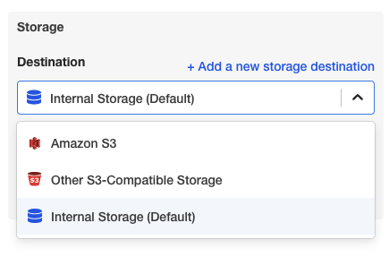
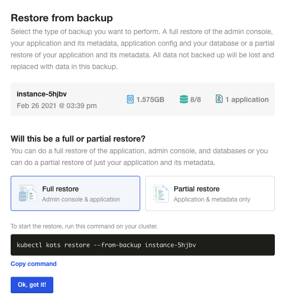

You can back up and recover Harness Self-Managed Enterprise Edition - Virtual Machine using KOTS snapshots.

KOTS has documented snapshots extensively in [Snapshots](https://kots.io/kotsadm/snapshots/overview/).

This topic provides a summary of the backup and recovery steps involved, and provides details on storage and Harness Self-Managed Enterprise Edition - Virtual Machine version requirements.

### Overview

You can back up and recover Harness Self-Managed Enterprise Edition - Virtual Machine using [KOTS snapshots](https://kots.io/kotsadm/snapshots/overview/).

There are two types of snapshots:

* **Full snapshots:** a snapshot of all objects including setup data and applications.
	+ Full snapshots are useful in disaster recovery and rolling back to previous versions of Harness Self-Managed Enterprise Edition - Virtual Machine.
	+ Full snapshots can restore fully or partially.
* **Partial snapshots:** a snapshot of application data only.
	+ Partial snapshots are useful for rolling back to previously installed versions of Harness Self-Managed Enterprise Edition - Virtual Machine.

You can automate both types of snapshots.

### Requirements

Ensure you meet the Harness Self-Managed Enterprise Edition - Virtual Machine version and other requirements below.

#### Harness Self-Managed Enterprise Edition - Virtual Machine Version Required

Automated backup and recovery is supported in the following Harness Self-Managed Enterprise Edition versions:

* 670XX and later. See [Harness Self-Managed Enterprise Edition Release Notes](https://docs.harness.io/article/0v512791gf-harness-on-prem-release-notes).

#### Storage Required

Snapshots are stored in an AWS S3 bucket or AWS S3-compatible storage (Harness recommends either), or in Internal Storage.

You will select and set up the storage option before creating a snapshot. This setup is described below.

#### Velero is Already Installed

Velero is installed and configured automatically in Harness Self-Managed Enterprise Edition - Virtual Machine installations. You do not have to install it.

### Step 1: Choose Storage Destination

You have the following options for snapshot storage:

* AWS S3 bucket
* AWS S3-compatible storage
* Internal Storage

Harness recommends using an S3 bucket or S3-compatible storage to accommodate large files.

A Harness Self-Managed Enterprise Edition - Virtual Machine **Production** installation has a minimum disk space requirement of 400G, so there should be enough space for Internal Storage. Still, Harness recommends an S3 bucket or S3-compatible storage to avoid any issues.

Storage destinations are described in the [KOTS documentation](https://kots.io/kotsadm/snapshots/storage-destinations/).

1. Log into the Harness Self-Managed Enterprise Edition - Virtual Machine KOTS admin tool.
2. Click **Snapshots**.
3. Click **Settings & Schedule**.
4. In **Storage**, select the storage method to use.
5. For **Amazon S3** and **Other S3-Compatible Storage**, enter in the location and credentials.  
For details on these settings, see [Compatible Backend Stores](https://kots.io/kotsadm/snapshots/storage-destinations/) from KOTS.
6. Click **Update storage settings**. The settings are updated.

Now that you have storage for your snapshots, you can create the snapshots.

### Step 2: Create Full or Partial Snapshots

1. In the KOTS admin tool, click **Full Snapshots (Instance)** or **Partial Snapshots (Application)**.
2. Click **Start a snapshot**. The snapshot begins. You can see its progress:
3. Click the **more options** (**︙**) button. The details of the snapshot appear.

That's it! You now have a snapshot you can use for recovery.

### Option: Automating Snapshots

Scheduling snapshots is covered in the KOTS [Schedules](https://kots.io/kotsadm/snapshots/schedule/) documentation. Here is a summary of the steps:

1. To automate snapshots, click **Settings & Schedule**.
2. Select **Full snapshots** or **Partial snapshots**.
3. Select **Enable automatic scheduled snapshots**.
4. In **Schedule**, select the schedule for the snapshot.
5. In **Retention policy**, define how long to keep snapshots.

The retention policy is described by KOTS:

> The default retention period for snapshots is 1 month. Setting the retention only affects snapshots created after the time of the change. For example, if an existing snapshot had a retention of 1 year and is already 6 months old, and a user then uses the UI to change the retention to 1 month, the existing snapshot will still be around for another 6 months.

1. Click **Update schedule**. The schedule is updated. To disable it, deselect **Enable automatic scheduled snapshots**.

### Option: Restore from a Full Snapshot

You can perform a full or partial restore from a Full Snapshot. This is why KOTS recommends Full Snapshots.

1. Click **Full Snapshots (Instance)**.
2. Click the restore button.

   
	 
	 **Restore from backup** appears.
	 
	 
	 
3. Select **Full restore** or **Partial restore**.
4. For **Full restore**, do the following:
	1. Copy the provided command and run it on any master node. You might need to log into the admin tool again after the restore.
	2. Click **Ok, got it**.
5. For **Partial restore**, do the following:
	1. Enter the slug **harness**.
	2. Click **Confirm and restore**. You might need to log into the admin tool again after the restore.

### Option: Restore from a Partial Snapshot

You can perform a partial restore using a Full or Partial Snapshot. The Full Snapshot steps are described above.

1. Click **Partial snapshots**.
2. Click the restore button.

   
	 
	 **Restore from Partial backup (Application)** appears.
	 
3. Enter the slug **harness**.
4. Click **Confirm and restore**. You might need to log into the admin tool again after the restore.

### Notes

See the [KOTS documentation](https://kots.io/kotsadm/snapshots/overview/) for more details on backup and recovery settings.

