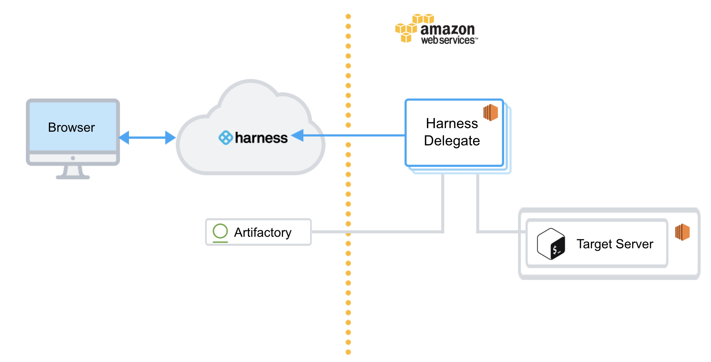
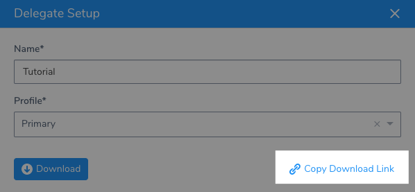
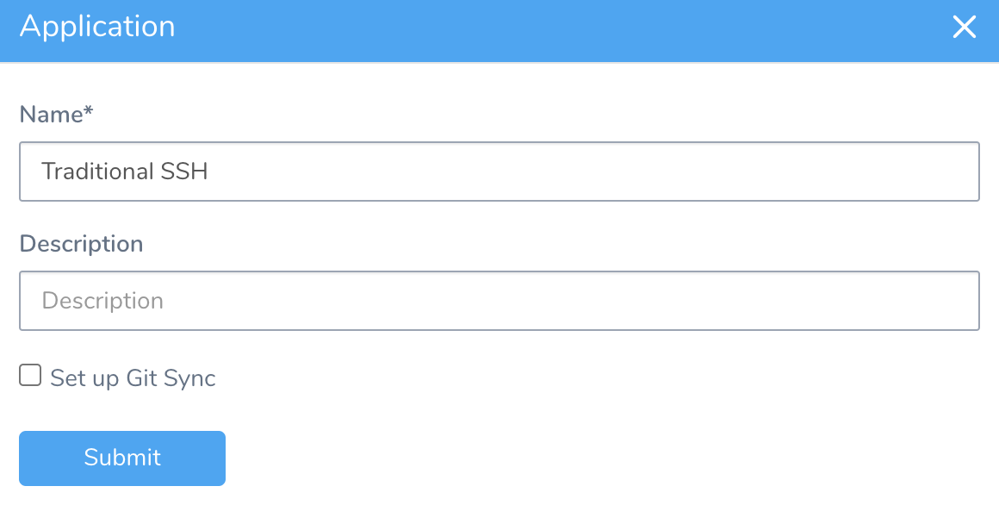
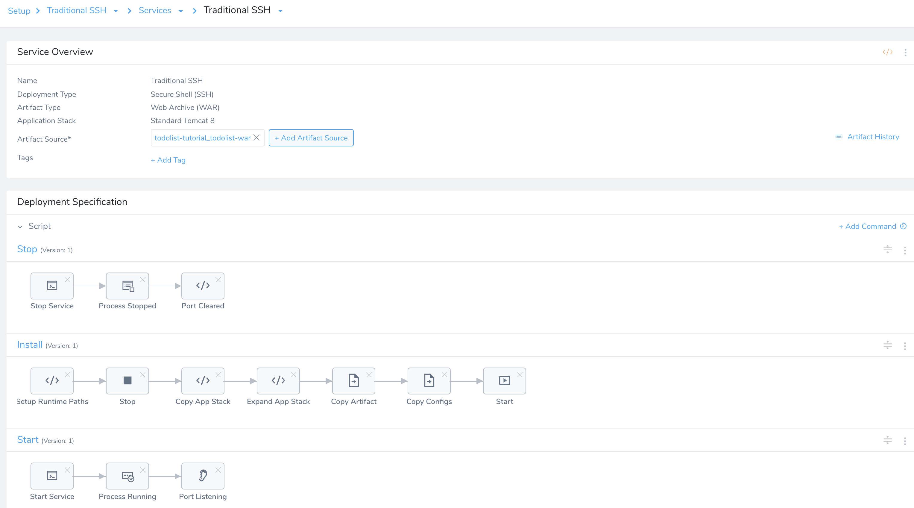
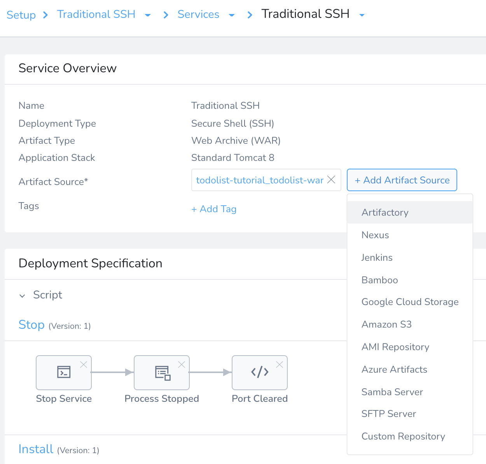
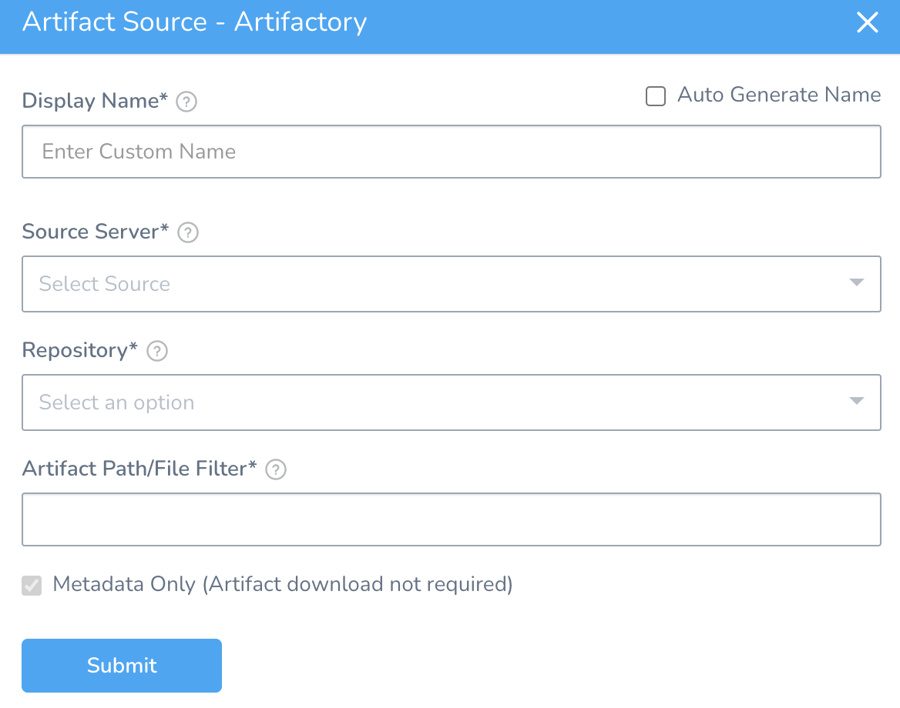
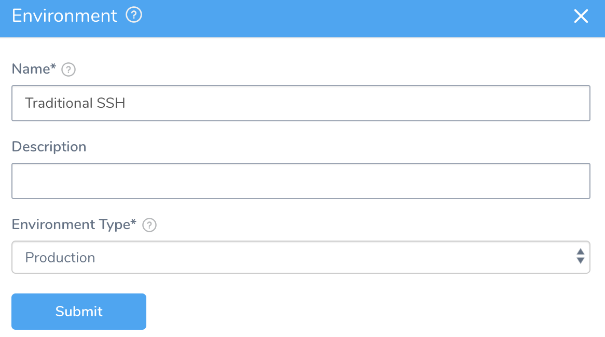
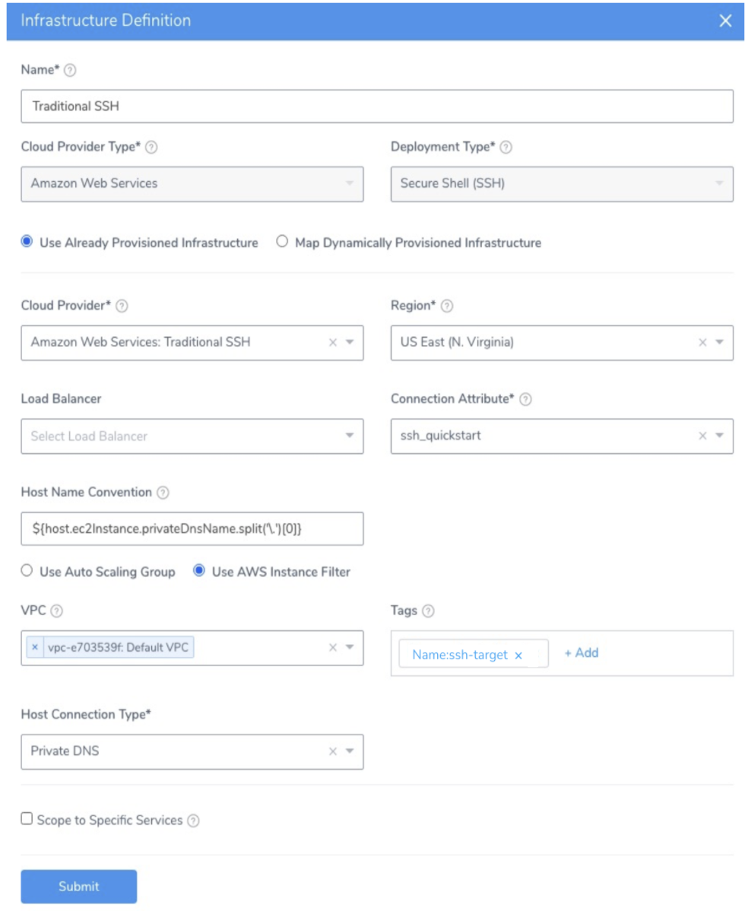
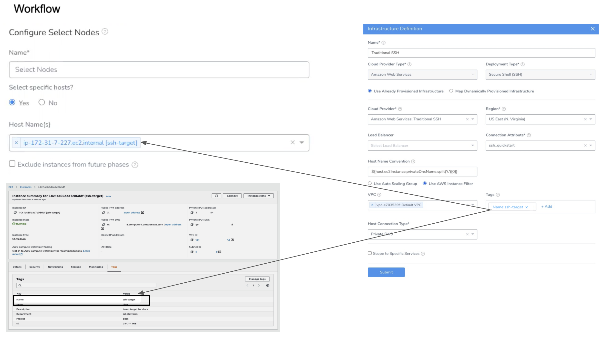

This quickstart shows you how to deploy application package files and a runtime environment such as Tomcat to target hosts using Harness.

This deployment is called traditional because it uses SSH (Secure Shell) scripts and a traditional runtime environment as opposed to containers and orchestration mechanisms, such as those in the [Kubernetes Quickstart](kubernetes-quickstart.md).

### Objectives

You'll learn how to:

* Install and run the Harness Shell Script Delegate on an EC2 host.
* Connect Harness with your AWS account.
* Connect Harness with Artifactory.
* Review the Default Script Commands.
* Specify the target hosts.
* Create and deploy a Harness SSH Basic Workflow.

### Before You Begin

* Review [Harness Key Concepts](../starthere-firstgen/harness-key-concepts.md) to establish a general understanding of Harness.
* Target host — In this guide, we use an AWS EC2 instance as the target host. Minimum t2.medium.
* EC2 Instance for Harness Shell Script Delegate — The EC2 instance for the Harness Delegate must meet the following requirements:
	+ Linux/UNIX server.
	+ ​Minimum 1 CPU.
	+ Minimum 8GB RAM. For example, an AWS EC2 instance type such as m5a.xlarge has 16GB of RAM, 8 for the Delegate and 8 for the remaining operations.
	+ Minimum 6GB Disk space.
	+ Inbound Access: SSH.
	+ Outbound Access: HTTP and HTTPS. This enables the Delegate to communicate with Harness and Artifactory.
	+ IAM role: AmazonEC2FullAccess. See [Policies Required: AWS EC2](https://docs.harness.io/article/wt1gnigme7-add-amazon-web-services-cloud-provider#policies_required_aws_ec2).
	+ If you wish to use an App Stack like Tomcat, then ensure that you have JAVA installed in your target AWS instance.
	+ Ensure that you have `netcat (nc)` installed on your target host. The Harness SSH Service Port Listening command uses `netcat`. You can use the following command to do the installation:  
	`yum install -y nc`

You can also simply deploy the artifact to your local computer instead of using an AWS EC2 instance. If you want to do this, install the Harness SSH Delegate on your local computer, use a [Physical Data Center Cloud Provider](https://docs.harness.io/article/stkxmb643f-add-physical-data-center-cloud-provider) instead of an AWS Cloud Provider, and when you set up the target infrastructure SSH key in Harness, use your local login information. You might also need to enable remote access on your computer.### Visual Summary

The following diagram shows the very simple topology for this tutorial:

### Step 1: Install and Launch the Shell Script Delegate

First, we'll install the Harness Shell Script Delegate on the EC2 instance you set up. Ensure that the EC2 instance meets the requirements in [Before You Begin](traditional-ssh-quickstart.md#before-you-begin).

To install the Delegate on your EC2 instance:

1. Sign into the Harness Manager.
2. Click **Setup**, and then click **Harness Delegates**.
3. Click **Download Delegate**, and then click **Shell Script**.
4. Enter a name for the Delegate, and select the **Primary** Profile.
5. Click **Copy Download Link**.
6. Log into your EC2 instance, paste the Shell Script Delegate command, and hit **Enter**.
7. Once the Delegate is downloaded, unzip it (`tar -zxvf harness-delegate.tar.gz`), change directories into the **harness-delegate** folder, and run the start command: `./start.sh`. Ignore any warning about the ulimit.

The Delegate will start and in a few moments, you will see it listed on the **Harness Delegates** page.

**Delegate Selectors** — As a best practice, add a Delegate Selector to the Delegate so you can quickly identify it.

1. In the Delegate listing on the **Harness Delegates** page, click **Custom** **Selector**.
2. In **Edit Selectors**, type in a Selector name such as `ssh-quickstart`, press **Enter**, and then click **Submit**.  
  
The Selector is added to the Delegate.

Next, we need to add the AWS cloud provider.

### Step 2: Add the AWS Cloud Provider

In this section, we will add a Harness AWS Cloud Provider to your Harness account to connect to AWS CodeDeploy, EC2, and S3.

#### Permissions

The AWS Cloud Provider will assume the IAM Role associated with the EC2 host running the Delegate you installed in your VPC.

1. In the Harness Manager, click **Setup**, and then click **Cloud Providers**.
2. Click **Add Cloud Provider**. The **Cloud Provider** settings appear. Enter the following settings:  
  


|  |  |
| --- | --- |
|  | 
	* **Type:** Select **Amazon Web Services**.
	* **Display Name:** Enter **Traditional SSH**.
	* **Credentials:** Select **Assume IAM Role on Delegate**.
	* **Delegate Selector:** Select the Delegate Selector you added to your Delegate, **ssh-quickstart**. |
3. Click **Test** and then **Submit**.

### Step 3: Add the Artifactory Artifact Server

For this tutorial, we'll use a Todo List app artifact, todolist.war, available in a public Harness Artifactory repo.

1. In Harness, click **Setup,** and then click **Connectors**.
2. Click **Artifact Servers**, and then click **Add Artifact Server**. Enter the following settings:  
  


|  |  |
| --- | --- |
|  | 
	* **Type:** Select **Artifactory**.
	* **Display Name:** Enter **Artifactory Public**.
	* **Artifactory URL**: Enter **https://harness.jfrog.io/artifactory**.
	* **Username/****Select Encrypted Password****:** Leave these settings empty. |
3. Click **Test** and then **Submit**. If the test fails, that means the Delegate can't connect to https://harness.jfrog.io/harness. Make sure that the EC2 instance hosting the Delegate can make outbound connections to https://harness.jfrog.io/harness.

### Step 4: Add Target Instance SSH Key to Harness

When you set up your target AWS instance, you created an SSH key file for connecting to it.

Harness uses this key to make a connection from the Harness Delegate to the target host during deployment. And so you must add the key to Harness Secrets.

First, you add the key as an Encrypted File Secret in Harness, and then use that file to add an SSH Key secret.

1. In Harness, in **Security**, in **Secrets Management**, click **Encrypted Files**.
2. Click **Add Encrypted File**. The **Add Encrypted File** settings appear.  
  


|  |  |
| --- | --- |
|  | 
	* **Secrets Manager**: Use the default setting.
	* **Name**: Enter **ssh\_quickstart**.
	* **File**: Upload your PEM file. |
3. Click **Submit**.

Next, use the Encrypted File to create an SSH Key in Harness.

1. In **Secrets Management**, click **SSH**.
2. Click **Add SSH Key.** The **SSH Configuration** settings appear.  
  


|  |  |
| --- | --- |
|  | 
	* **Name**: Enter **ssh\_quickstart**.
	* **Auth Scheme**: Leave the default.
	* **User Name**: Enter **ec2-user** (this is the default for AWS EC2 instances)
	* **Credentials**: Select **SSH Key File**.
	* **Select Encrypted SSH key Files**: Select the Harness Encrypted File you just added.
	* **Select Encrypted Passphrase**: Leave empty.
	* **SSH Port**: Leave the default, **22**. |

Now you're all set to use this SSH key when you set up the Infrastructure Definition in Harness, later in this quickstart.

### Step 5: Create an Application

1. Click **Setup**, and then click **Add Application**. The **Application** settings appear.
2. Enter the name for your Application, and click **Submit**. Your new Application appears.  
  
For more information, see [Create an Application](../continuous-delivery/model-cd-pipeline/applications/application-configuration.md).

### Step 6: Create a Harness SSH Service

To create a Service for an application package, do the following:

1. In your Application, click **Services**, and then click **Add Service**. The **Add Service** settings appear.
2. In **Name**, enter a name for the Service. You will use this name when selecting this Service in Harness Environments, Workflows, and other components. For more information, see [Services](../continuous-delivery/model-cd-pipeline/setup-services/service-configuration.md).
3. In **Deployment Type**, select **Secure Shell (SSH)**. All file-based Services are Secure Shell (SSH) deployments. The **Artifact Type** and **Application Stack** settings appear.
4. In **Artifact Type**, select Web Archive (WAR).
5. In **Application Stack**, select Tomcat. The app stack is used as a runtime environment for your application.  
Ensure your target hosts have JAVA installed.

#### Review: Default SSH Script Commands

The Service page has the following important sections:

* **Artifact Source** - The package files you want to be deployed are added here. In some cases an actual file is obtained, but in most cases metadata is sufficient.
* **Artifact History** - You can manually pull metadata on your artifacts to see their builds and versions.
* **Script** - The scripts to set up your files. These will typically include an application stack setup unless your target hosts already have the application stack set up.
* **Add Commands** - You can add new commands from an Application or Shared Template Library, or simply add a blank command and add Harness scripts to it.
* **Configuration** - You can add variables and files to use in your Service scripts. These can be encrypted by Harness, allowing you to use secrets. The variables and files can be overwritten in Environments and Workflows.

#### See Also

* [Add Scripts for Traditional (SSH) Deployments](../continuous-delivery/traditional-deployments/add-deployment-specs-for-traditional-ssh-deployments.md)

### Step 7: Add the Artifact Source

The Artifact Source for the Service lists the file(s) that you want to be copied to the target host(s). The Artifact History will manually pull artifact build and version metadata from the Artifact Source.

For more information, see [Add Artifact Servers](https://docs.harness.io/article/7dghbx1dbl-configuring-artifact-server) and [Add Cloud Providers](https://docs.harness.io/article/whwnovprrb-cloud-providers).

To add an artifact source, do the following:

1. In your Service, click **Add Artifact Source**.
2. Select the repo or cloud platform where the artifact is located. The Artifact Source settings appear. This topic uses Artifactory as an example.
3. In **Display Name**, enter a name for the Artifactory Server. This is the name you will use to identify this connection when adding an Artifact Source to a Harness Service.
4. In **Source Server**, select the Artifact Server you added to Harness.
5. In **Repository**, select the **todolist-tutorial**.
6. In **Artifact Path/File Filter**, enter the artifact path in the repository: **todolist.war**.  
Harness uses **Metadata Only** to download the file on the target host.  
Metadata is sufficient as it contains enough information for the target host(s) to obtain or build the artifact. Harness stores the metadata. During runtime, Harness passes the metadata to the target host(s) where it is used to obtain the artifact(s). Ensure that the target host has network connectivity to the Artifact Server. For more information, see [Service Types and Artifact Sources](../continuous-delivery/model-cd-pipeline/setup-services/service-types-and-artifact-sources.md).
7. Click **Submit**. The Artifact Source is listed.

### Step 8: Add an Environment to the Application

Add deployment Environments for the Services in your Application. These Environments will be deployed on the cloud providers you added as a connector. To add an Environment, do the following:

1. Click **Setup** and then select the Application that where you want to add the Environment.
2. In **Application Defaults**, click **Environments** and then click **Add** **Environment**. The **Add Pipeline** settings appear.
3. Enter a name and description for the Environment. For example, Traditional SSH.
4. In **Environment Type**, choose **Production** or **Non-Production**.
5. Click **Submit**.

### Step 9: Define Your Target Servers

As an example, we will create an Infrastructure Definition for an AWS EC2 target infrastructure.

To add an Infrastructure Definition, do the following:

1. In your Harness Application Environment, click **Add Infrastructure Definition**. The **Infrastructure Definition** settings appear.
2. In **Name**, enter the name you will use when you select this Infrastructure Definition in Workflows.
3. In **Cloud Provider Type**, select the type of Cloud Provider that this Infrastructure Definition will use for connections. For example, select **Amazon Web Services** for AWS EC2 infrastructures.
4. In **Deployment Type**, select the deployment type for the Services that will use this Infrastructure Definition. In this example, you are deploying SSH type Services like JAR, WAR, etc., you would select **Secure Shell (SSH)**.
5. Click **Use Already Provisioned Infrastructure**. If you were using a Harness [Infrastructure Provisioner](../continuous-delivery/model-cd-pipeline/infrastructure-provisioner/add-an-infra-provisioner.md), you would select **Map Dynamically Provisioned Infrastructure**.
6. In **Cloud Provider**, select **Amazon Web Services: Traditional SSH** to connect Harness to your deployment infrastructure.
7. Select your AWS **Region**, for example, US East (N. Virginia). When you select a region, more settings appear, such as **VPC** and **Tags**.
8. Select **Connection Attribute** to access the Target Host using a Harness SSH Key secret. This key is used by the Harness Delegate to SSH into the target host. See [Step 4: Add Target Instance SSH Key to Harness](traditional-ssh-quickstart.md#step-4-add-target-instance-ssh-key-to-harness).
9. In the **Host Name Convention**, you can leave the default expression.
10. Select **Use** **AWS Instance Filter**.
11. Select the **VPC** where the AWS instance you want to deploy to is located. Ensure that the Delegate host has connectivity to the VPC.
12. In **Tags**, add the AWS EC2 Tags that are assigned to your target host(s). You can check your hosts in EC2 to get their Tags and ensure that you are using the correct Tags here. For example, `ssh-target`.
13. In **Host Connection Type**, select **Private DNS** (default selection).
14. When you are finished, click **Submit**. The Infrastructure Definition is added.

For AWS Infrastructure Definitions, you can use [Workflow variables](../continuous-delivery/model-cd-pipeline/workflows/add-workflow-variables-new-template.md) in the **Tags** setting. This allows you to parameterize the **Tags** setting, and enter or select the AWS tags to use when you deploy any Workflow that uses this Infrastructure Definition.### Step 10: Set up a Basic SSH Workflow

Traditional (SSH) deployments involve obtaining an application package from an artifact source, such as a WAR file in an AWS S3 bucket, and deploying it to a target host, such as a virtual machine.

Typically, the Harness Basic Workflow is used for Traditional deployments, but Harness provides Canary and Rolling Workflows for Traditional deployments also.

In this topic, we will use the Basic Workflow to demonstrate a simple Traditional deployment.

#### Create a Workflow

To create a Basic Workflow for a Traditional deployment, do the following:

1. In your Harness Application, click **Workflows**.
2. In **Workflows**, click **Add Workflow**. The **Workflow** dialog appears.
3. In **Name**, enter a name for the Workflow.
4. In **Workflow Type**, select **Basic Deployment**.
5. In **Environment**, select the Environment where the Infrastructure Definition you defined for your deployment is located.
6. In **Service**, select the SSH Service to be deployed.
7. In **Infrastructure Definition**, select your target infrastructure.
8. Click **Submit**. The Workflow is created.

Let's look at the two default steps in the Workflow, **Select Nodes** and **Install**.

#### Select Target Node

The **Select Nodes** step selects the target hosts from the Infrastructure Definition you defined. You can choose to select a specific host or simply specify the number of instances to select with the Infrastructure Definition criteria.

The following image shows an **Infrastructure Definition** specifying an AWS Region, VPC, and Tags (**Name:ssh-target**), the EC2 instance that meets that criteria, and the host name in the Node Select dialog.

For details, see [Select Nodes Workflow Step](https://docs.harness.io/article/9h1cqaxyp9-select-nodes-workflow-step).

#### Install and Run the Application and Stacks

The Install step runs the command scripts in your Harness SSH and Service on the target host. See [Install Workflow Step](https://docs.harness.io/article/2q8vjxdjcq-install-workflow-step).

The Install step is added in the Basic Workflow as part of its **Deploy Service** section. The Install step is used after the [Select Nodes step](https://docs.harness.io/article/9h1cqaxyp9-select-nodes-workflow-step), which select the target nodes on which to run the Install step.

For details, see [Create a Basic Workflow for Traditional (SSH) Deployments](../continuous-delivery/traditional-deployments/create-a-basic-workflow-for-traditional-ssh-deployments.md).

### Step 11: Deploy and Review

The Basic Workflow is the most common deployment of Services deploying application packages. Once you've successfully deployed the Workflow, you can click the **Install** step to see the Service commands and scripts in the **Deployments** page.

You can expand logs for each script in the **Install** step to see the log of its execution by the Harness Delegate. For example, here is the **Copy Artifact** script copying the application package **todolist.war** to the runtime location set up in Application Defaults (`$HOME/${app.name}/${service.name}/${env.name}/runtime`):


```
Begin execution of command: Copy Artifact  
  
Connecting to ip-172-31-7-227.ec2.internal ....   
  
Connection to ip-172-31-7-227.ec2.internal established  
  
Begin file transfer todolist.war to ip-172-31-7-227.ec2.internal:/home/ec2-user/Traditional SSH/SSH Service Tomcat 8/Traditional SSH/runtime/tomcat/webapps  
  
Metadata only option set for ARTIFACTORY. Starting download of artifact: todolist-tutorial/todolist.war  
  
ARTIFACTORY: Download complete for artifact: todolist.war  
  
File successfully transferred to ip-172-31-7-227.ec2.internal:/home/ec2-user/Traditional SSH/SSH Service Tomcat 8/Traditional SSH/runtime/tomcat/webapps  
  
Command execution finished with status SUCCESS
```
### Next Steps

* [Traditional (SSH) Deployments How-tos](../continuous-delivery/traditional-deployments/traditional-deployments-overview.md)
* [Build and Deploy Pipeline How-tos](../continuous-delivery/build-deploy/build-and-deploy-pipelines-overview.md)

