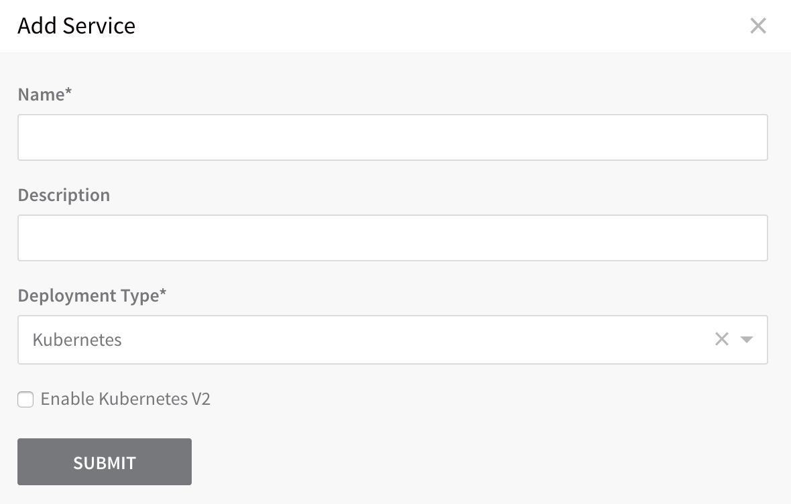
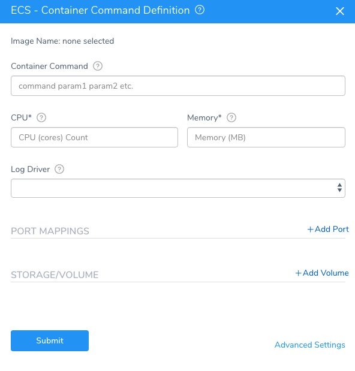
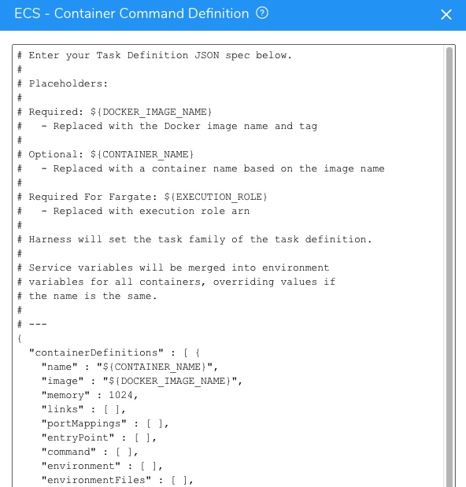
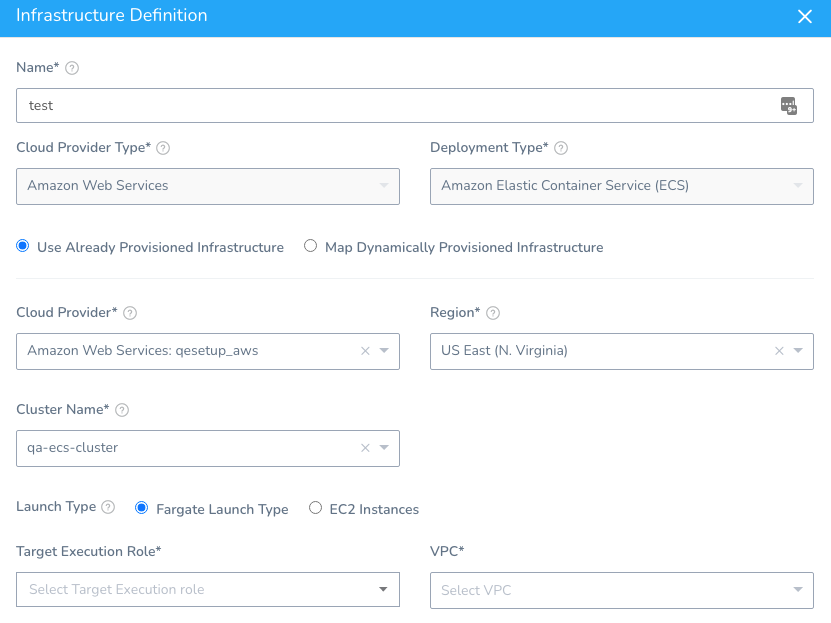
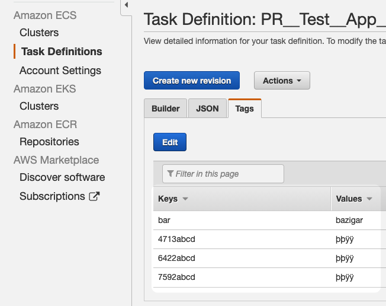
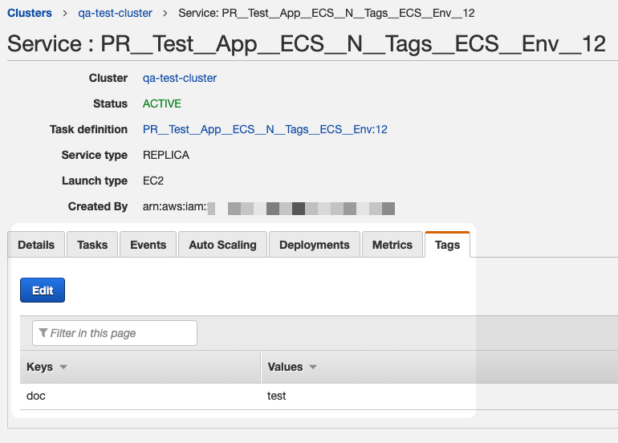
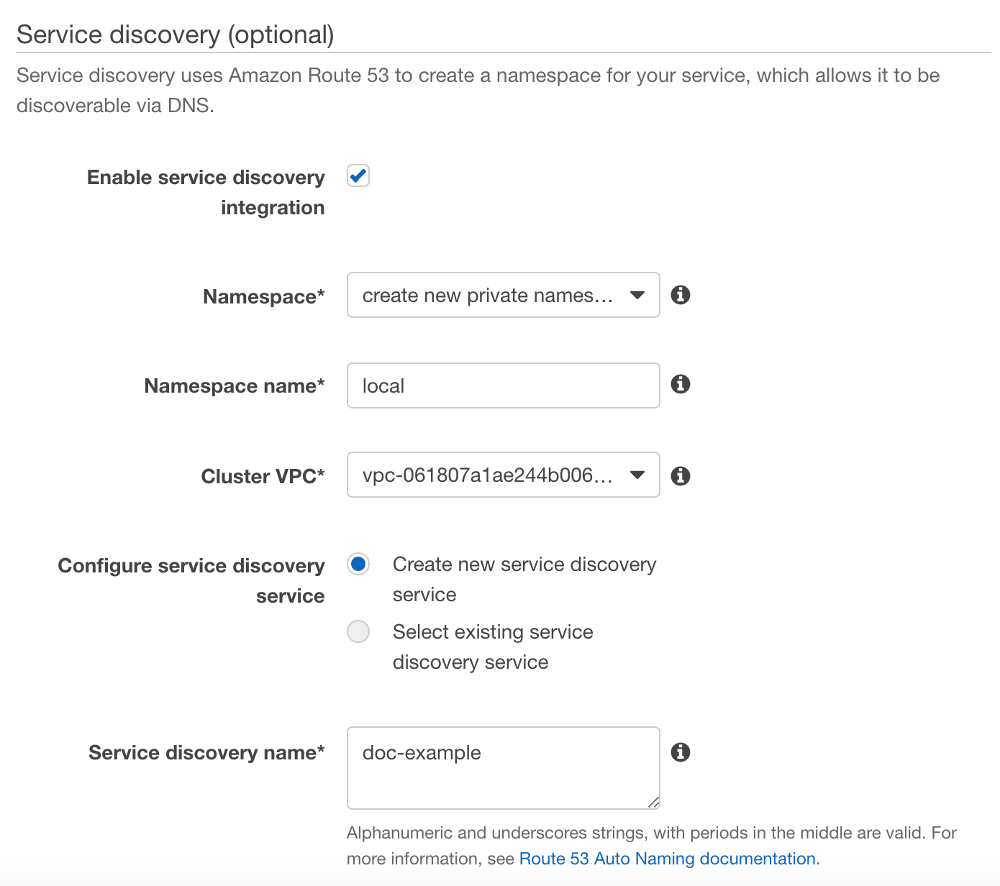

This topic covers setting up a Harness Application and Service for an ECS Deployment, including the ECS task and service definitions for various scenarios:

* [Create the Harness ECS Application](https://docs.harness.io/article/riu73ehy2m-ecs-services#create_the_harness_ecs_application)
* [Add a Harness ECS Service](https://docs.harness.io/article/riu73ehy2m-ecs-services#add_a_harness_ecs_service)
	+ [Task Definition](#task_definition)
	+ [awsvpc Network Mode](https://docs.harness.io/article/riu73ehy2m-ecs-services#awsvpc_network_mode)
	+ [Service Definition](#service_definition)
	+ [Replica Strategy](https://docs.harness.io/article/riu73ehy2m-ecs-services#replica_strategy)
	+ [Daemon Strategy](https://docs.harness.io/article/riu73ehy2m-ecs-services#daemon_strategy)
	+ [Service Discovery](https://docs.harness.io/article/riu73ehy2m-ecs-services#service_discovery)
	+ [Using Private Docker Registry Authentication](https://docs.harness.io/article/riu73ehy2m-ecs-services#using_private_docker_registry_authentication)
* [Review: Task Definitions and Amazon ECS Service Quotas](#review_task_definitions_and_amazon_ecs_service_quotas)
* [Next Step](https://docs.harness.io/article/riu73ehy2m-ecs-services#next_step)

### Create the Harness ECS Application

The Harness Application represents a logical group of the ECS setup and release process, including the ECS service and task definitions, ECS cluster environment, and deployment workflow steps particular to each service you are deploying. For more information on Harness Applications, see [Application Checklist](https://docs.harness.io/article/bucothemly-application-configuration).

To create a new Application, do the following:

1. In **Harness**, click **Setup**, and then click **Add Application**. The **Application** dialog appears.
2. Enter the name for your application, such as **ECS Demo Application**, and click **SUBMIT**. Your new Application appears.
3. Click the Application name. The Application entities appear.

#### ECS and Infrastructure Provisioners

You can add a Harness Infrastructure Provisioner for CloudFormation or Terraform to your Harness Application and use the Infrastructure Provisioner to define the ECS infrastructure on the fly.

For more information, see [Infrastructure Provisioners Overview](/article/o22jx8amxb-add-an-infra-provisioner).

### Add a Harness ECS Service

A Harness Service represents your microservice as the artifact source (for example, Docker image), ECS task and service definitions, and any runtime variables used for deployment. You define where the artifact comes from, and you define the container and service specs for the ECS cluster. In addition, you can use configuration variables and files for the service.

Harness Services are different from ECS services. Where a Harness Service describes your microservice, an ECS service is a specified number of task definition instances run and maintained simultaneously in an Amazon ECS cluster. For a detailed description of ECS services, see [Services](https://docs.aws.amazon.com/AmazonECS/latest/developerguide/ecs_services.html) from AWS.In this guide, we will cover the how the following common ECS features are implemented in Harness Services:

* Replica Strategy.
* Daemon Strategy.
* awsvpc Network Mode.
* Service Discovery.

Configurations for these features are also discussed in the Harness Environment and Workflows, later in this guide. For the Harness Service artifact example, we will use a Docker image publicly hosted on Docker Hub.

To create a Harness Service for ECS, do the following:

1. In **Harness**, click **Setup**. The list of Applications appears.
2. Click the name of the ECS Application you created. The Application appears.
3. Click **Services**. The **Services** page appears.
4. Click **Add Service**. The **Service** dialog appears.
5. In **Name**, enter a name for the service.
6. In **Deployment Type**, select **Amazon Elastic Container Service (ECS)**.
7. Click **SUBMIT**. The new service is listed.  
Next, we will add the artifact source for the service, a sample app publicly hosted on Docker Hub.
8. Click **Add Artifact Source**, and click **Docker Registry**.
9. The **Artifact Source** dialog appears.
10. In **Source Server**, select the Harness Artifact Server for the Docker Registry. For information on setting up a Harness Artifact Server, see [Add Artifact Servers](https://docs.harness.io/article/7dghbx1dbl-configuring-artifact-server).
11. In **Docker Image Name**, enter the name of the image.
12. Click **SUBMIT**. The Artifact Source is added.

Next, we will define the ECS task definition and service definition.

ECS private registry authentication for tasks using AWS Secrets Manager enables you to store your credentials securely and then reference them in your container definition. For information on using private registry authentication for tasks, see [Private Registry Authentication for Tasks](https://docs.aws.amazon.com/AmazonECS/latest/developerguide/private-auth.html) from AWS.#### Task Definition

If you are not very familiar with task and service definitions, see these examples from AWS: [Task Definitions for Amazon ECS](https://github.com/aws-samples/aws-containers-task-definitions), [Example Task Definitions](https://docs.aws.amazon.com/AmazonECS/latest/developerguide/example_task_definitions.html).You specify the ECS Task Definition in the Harness Service.

You can specify it inline, as described below, or using remote Git files, as described in [Use Remote ECS Task and Service Definitions in Git Repos](/article/oy6sxbgqvc-use-ecs-task-and-service-definitions-in-git-repos).

To specify the ECS Task Definition, do the following:

1. In the Harness Service, in **Deployment Specification**, expand **ECS** (if necessary). The **Task Definition** appears.
2. Click **Task Definition**. The **ECS Container Command Definition** settings appear.The simplified ECS Container Command Definition settings are for EC2 ECS clusters only. For **Fargate** (or advanced EC2) clusters, click **Advanced Settings** and use the JSON, as described below.  
Advanced Settings is required for Fargate because you must use the `${EXECUTION_ROLE}` placeholder, described below.You can specify the Task Definition using the fields in the dialog or click **Advanced Settings** to add or edit the JSON.

For a description of all available Task Definition parameters, see [Task Definition Parameters](https://docs.aws.amazon.com/AmazonECS/latest/APIReference/API_RegisterTaskDefinition.html) from AWS.

The Task Definition JSON uses the following placeholders.


|  |  |
| --- | --- |
| **Placeholder** | **Description** |
| `${DOCKER_IMAGE_NAME}` | Required. This placeholder is used with the image label in the JSON:`"image" : "${DOCKER_IMAGE_NAME}"`The placeholder is replaced with the Docker image name and tag at runtime. |
| `${CONTAINER_NAME}` | This placeholder is used with the name label in the JSON:`"name" : "${CONTAINER_NAME}"`The `${CONTAINER_NAME}` placeholder references the Docker image you added in the Service **Artifact Source**.The placeholder is replaced with a container name based on the **Artifact Source** Docker image name at runtime.You don't have to use this placeholder. You can hardcode the image name in the Task Definition. In this case, any **Artifact Source** Docker image is ignored. |
| `${EXECUTION_ROLE}` | Required for Fargate. This placeholder is used with the `executionRoleArn` label in the JSON.`"executionRoleArn" : "${EXECUTION_ROLE}"`At deployment runtime, the `${EXECUTION_ROLE}` placeholder is replaced with the ARN of the **Target Execution Role** used by the Infrastructure Definition of the Workflow deploying this Harness Service.You can also replace the `${EXECUTION_ROLE}` placeholder with another ARN manually in the Container Definition in the Service. This will override the **Target Execution Role** used by the Infrastructure Definition.Replacing the `${EXECUTION_ROLE}` placeholder manually is usually only done when using a private repo.In most cases, you can simply leave the placeholder as is.For more information, see [Amazon ECS Task Execution IAM Role](https://docs.aws.amazon.com/AmazonECS/latest/developerguide/task_execution_IAM_role.html) from AWS. |

If you have an existing Task Definition, you can paste it into the JSON. You can obtain the Task Definition from the ECS console:

You can also obtain the Task Definition using the AWS CLI ([describe-task-definition](https://docs.aws.amazon.com/cli/latest/reference/ecs/describe-task-definition.html)):

`aws ecs describe-task-definition --task-definition ecsTaskDefinitionName`

Ensure that the required placeholders `${DOCKER_IMAGE_NAME}` and `${EXECUTION_ROLE}` (for Fargate) are used.For some example Task Definitions, see [Example Task Definitions](https://docs.aws.amazon.com/AmazonECS/latest/developerguide/example_task_definitions.html) from AWS.

Once Harness deploys the ECS application, you can see the placeholders replaced in the Task Definition JSON:


```
...  
     "volumesFrom": [],  
  
      "image": "registry.hub.docker.com/library/nginx:stable-perl",      ...  
  
      "name": "library_nginx_stable-perl"  
  
    }
```
For Fargate, you will see the `executionRoleArn` placeholder replaced:


```
{  
  
  "ipcMode": null,  
  
  "executionRoleArn": "arn:aws:iam::4XXX0225XX7:role/ecsTaskExecutionRole",  
  
  "containerDefinitions": [  
  
    {  
  
...
```
##### Launch Types and Infrastructure Definitions

By definition, EC2 and Fargate support different Task Definition settings. Consequently, if you add launch type-specific settings to the Task Definition in the Harness Service, you must select the corresponding **Launch Type** in the Harness Infrastructure Definition used by the Harness Workflow that deploys that Service.

For example, the Fargate launch type Task Definition supports CPU and Memory settings:


```
{  
   "containerDefinitions": [   
      {   
...  
      }  
   ],  
   "cpu": "256",  
   "executionRoleArn": "arn:aws:iam::012345678910:role/ecsTaskExecutionRole",  
   "family": "fargate-task-definition",  
   "memory": "512",  
   "networkMode": "awsvpc",  
   "runtimePlatform": {  
        "operatingSystemFamily": "LINUX"  
    },  
   "requiresCompatibilities": [   
       "FARGATE"   
    ]  
}
```
When you select the Infrastructure Definition, you must also select **Fargate Launch Type** for the **Launch Type**. 

If you select EC2, Harness will ignore the CPU and Memory settings in your Task Definition.

If you are not very familiar with task and service definitions, see these examples from AWS: [Task Definitions for Amazon ECS](https://github.com/aws-samples/aws-containers-task-definitions), [Example Task Definitions](https://docs.aws.amazon.com/AmazonECS/latest/developerguide/example_task_definitions.html).

##### Tags Support

Currently, this feature is behind the Feature Flag `ECS_REGISTER_TASK_DEFINITION_TAGS`. Contact [Harness Support](mailto:support@harness.io) to enable the feature. Harness will remove Feature Flags for Harness Professional and Essentials editions. Once the feature is released to a general audience, it's available for Trial and Community Editions.You can add ECS tags to your task definition just as you would in the AWS console or CLI.

You can use Harness [Service](/article/q78p7rpx9u-add-service-level-config-variables) and [Workflow variables](/article/766iheu1bk-add-workflow-variables-new-template) in both keys and values.

For example:


```
...  
  "cpu" : "128",  
  "memory" : "256",  
  "tags" : [  {  
    "key": "4713abcd",  
    "value": "þþÿÿ"  
  },  
  {  
    "key": "6422abcd",  
    "value": "þþÿÿ"  
  },  
  {  
    "key": "7592abcd",  
    "value": "þþÿÿ"  
  },  
  {  
    "key": "${serviceVariable.foo}",  
    "value": "${serviceVariable.baz}"  
  }  
],  
  "inferenceAccelerators" : [ ]  
}  
...
```
When the Harness Service is deployed and the ECS task definition is registered, you will see the tags in AWS:

Tags must meet the ECS requirements. See [Tag restrictions](https://docs.aws.amazon.com/AmazonECS/latest/userguide/ecs-using-tags.html#tag-restrictions) from AWS.

#### awsvpc Network Mode

When configuring the Task Definition via the Harness Service **Task Definition**, you can set the **awsvpc** network mode by simply adding the `networkMode` parameter. For details Network Mode, see [networkMode](https://docs.aws.amazon.com/AmazonECS/latest/developerguide/task_definition_parameters.html#network_mode) in the AWS docs.

##### Example for awsvpc Network Mode

The following example shows the `networkMode` parameter with the **awsvpc** value.


```
...  
  
  "networkMode" : "awsvpc"  
  
}
```
When you look at the Task Definition created by Harness, you can see the **awsvpc** network mode at the bottom of the definition JSON:


```
 ...  
  
 "pidMode": null,  
  
  "requiresCompatibilities": [],  
  
  "networkMode": "awsvpc",  
  
  "cpu": null,  
  
  "revision": 2,  
  
  "status": "ACTIVE",  
  
  "volumes": []  
  
}
```
Task definitions that use the **awsvpc** network mode use the **AWSServiceRoleForECS** service-linked role, which is created for you automatically. For more information, see [Using Service-Linked Roles for Amazon ECS](https://docs.aws.amazon.com/AmazonECS/latest/developerguide/using-service-linked-roles.html) from AWS.

#### Service Definition

You can specify the ECS service configuration in the Harness Service **Service Definition**.

You can specify it inline, as described below, or using remote Git files, as described in [Use Remote ECS Task and Service Definitions in Git Repos](/article/oy6sxbgqvc-use-ecs-task-and-service-definitions-in-git-repos).

To specify the service configuration, do the following:

1. In the Harness Service, in **Deployment Specification**, expand **ECS** (if necessary). The **Service Definition** appears.

By default, the **Service Definition** uses a **Replica** strategy.If you have an existing service and you want to use its JSON in **Service Definition**, you can enter the JSON in **Service Definition**. You can enter in any parameter that is specified by the aws ecs [create-service](https://docs.aws.amazon.com/cli/latest/reference/ecs/create-service.html) command.

You can obtain the JSON using the AWS CLI using [describe-services](https://docs.aws.amazon.com/cli/latest/reference/ecs/describe-services.html):

`aws ecs describe-services --cluster clusterName --service ecsServiceName`

For information on all ECS Service definition parameters, see [Service Definition Parameters](https://docs.aws.amazon.com/AmazonECS/latest/developerguide/service_definition_parameters.html) from AWS.

The following sections describe how to configure the Service Definition for different ECS features.

If you add networking settings ([Network configuration](https://docs.aws.amazon.com/AmazonECS/latest/developerguide/service_definition_parameters.html#sd-networkconfiguration)) to the specification they will be overwritten at deployment runtime by the network settings you define for the target ECS cluster in the Harness Infrastructure Definition.##### Tags Support

Currently, this feature is behind the Feature Flag `ECS_REGISTER_TASK_DEFINITION_TAGS`. Contact [Harness Support](mailto:support@harness.io) to enable the feature. Harness will remove Feature Flags for Harness Professional and Essentials editions. Once the feature is released to a general audience, it's available for Trial and Community Editions.You can add ECS tags to your service definition just as you would in the AWS console or CLI.

You can use Harness [Service](/article/q78p7rpx9u-add-service-level-config-variables) and [Workflow variables](/article/766iheu1bk-add-workflow-variables-new-template) in both keys and values.

For example:


```
...  
{  
"placementConstraints":[ ],  
"placementStrategy":[ ],  
"healthCheckGracePeriodSeconds":null,  
"tags":[{  
    "key": "doc",  
    "value": "test"  
  }],  
"schedulingStrategy":"REPLICA",  
"propagateTags": "TASK_DEFINITION"  
}  
...
```
When the Harness Service is deployed and the ECS service is registered, you will see the tags in AWS:

Tags must meet the ECS requirements. See [Tag restrictions](https://docs.aws.amazon.com/AmazonECS/latest/userguide/ecs-using-tags.html#tag-restrictions) from AWS.

##### Capacity Provider Strategy Support

You can use a [Capacity provider strategy](https://docs.aws.amazon.com/AmazonECS/latest/developerguide/service_definition_parameters.html#sd-capacityproviderstrategy) in your ECS Service definition via the `capacityProviderStrategy` parameter.

Later, when you define a [Harness Infrastructure Definition](/article/yasp1dt3h5-ecs-environments) for the deployment of this ECS Service, you will select one of the following launch types:

* For `FARGATE` or `FARGATE_SPOT` strategies, select **Fargate Launch Type**.
* For the Auto Scaling group strategy, select `EC2 Instances`.

See [ECS Environments](/article/yasp1dt3h5-ecs-environments).

#### Replica Strategy

You specify the Replica strategy using the `schedulingStrategy` parameter. By default, when you create a Harness Service using the Docker Image type, the **Service Definition** will generate the JSON for the Replica strategy. There are no changes that you need to make.

##### Example Service Definition for Replica Strategy

The following example is the default JSON generated for the **Service Definition**, setting the scheduling strategy for Replica:


```
{  
  
"placementConstraints":[ ],  
  
"placementStrategy":[ ],  
  
"healthCheckGracePeriodSeconds":null,  
  
"schedulingStrategy":"REPLICA"  
  
}
```
#### Daemon Strategy

You specify the Daemon strategy using the `schedulingStrategy` parameter. By default, when you create a Harness Service using the Docker Image type, the Service Definition will generate the JSON for the Replica strategy. To set a Daemon strategy, you simply need to change the `schedulingStrategy` parameter to **DAEMON**.

##### Example Service Definition for Daemon Strategy

Here is an example of how to specify the Daemon scheduling strategy in **Service Definition**:


```
{  
  
"placementConstraints":[ ],  
  
"placementStrategy":[ ],  
  
"healthCheckGracePeriodSeconds":null,  
  
"schedulingStrategy":"DAEMON"  
  
}
```
#### Service Discovery

Harness does not create an ECS Service Discovery Service, but Harness registers the ECS services it creates with the Service Discovery Service.

If you have configured Service Discovery for an ECS service, Harness can deploy to that service, registering its DNS SRV records as needed. During rollback or in the case of an ECS task failing, ECS manages the DNS resolution, replacing A records, etc.

For a detailed description of Service Discovery concepts, see [Service Discovery](https://docs.aws.amazon.com/AmazonECS/latest/developerguide/service-discovery.html) from AWS. In you are new to Service Discovery, see [Tutorial: Creating a Service Using Service Discovery](https://docs.aws.amazon.com/AmazonECS/latest/developerguide/create-service-discovery.html) from AWS.

Here is what the ECS Service Discovery configuration looks like in AWS:

When you create the Service Discovery Service in ECS, you will specify a namespace and ECS will generate the DNS records (SRV and A records) for the ECS namespace in AWS Route 53. DNS Queries for the namespace are resolved by Route 53 and traffic is routed to the instances supporting the ECS cluster.

To specify the Service Discovery Service in the Harness **Service Definition**, add the `serviceRegistries` parameter to the Harness **Service Definition**. The `serviceRegistries` parameter is defined like this:


```
"serviceRegistries": [  
  
  {  
  
    "registryArn": "arn:aws:servicediscovery:us-east-1:00000000:service/srv-jwyz7x4igkxckqno",  
  
    "containerName": "${CONTAINER_NAME}",  
  
    "containerPort": ${serviceVariable.containerPort}  
  
    # "port":  
  
  }  
  
],
```
In this example, the Harness variable `${serviceVariable.containerPort}` is used for the `containerPort` value. You can simply enter the port number instead, such as **8080**. The `${serviceVariable.containerPort}` variable is created in the **Config Variables** section of the Service as **containerPort**, and referenced as **${serviceVariable.containerPort}** in the **Service Definition**. Using a **Config Variable** allows you to override the variable value when configuring the Harness Workflow that deploys the Service. For more information, see [Workflow Phases](https://docs.harness.io/article/m220i1tnia-workflow-configuration#workflow_phases).

The following list describes the fields and values needed for a Service Discovery Service in the Harness **Service Definition**:

* `registryArn` - The Amazon Resource Name (ARN) of the service registry. The currently supported service registry is Amazon Route 53 Auto Naming. To obtain the `registryArn` value, use the [aws ecs describe-services](https://docs.aws.amazon.com/cli/latest/reference/ecs/describe-services.html?highlight=registryarn) command.
* `containerName` - The `containerName` field is the container name value to be used for your Service Discovery Service, and already specified in the task definition in **Task Definition**. Typically, you simply use the variable `${CONTAINER_NAME}`. Harness verifies that the container name is specified in **Task Definition**.
* `containerPort` - The port value to be used for your Service Discovery Service.

You can override Services variables in the Harness Environment and Workflow. For more information see [Override a Service Configuration](https://docs.harness.io/article/n39w05njjv-environment-configuration#override_a_service_configuration) and [Workflow Phases](https://docs.harness.io/article/m220i1tnia-workflow-configuration#workflow_phases).

##### Which Service Parameters Do I Use?

Here are the guidelines for when to use the different service parameters in `serviceRegistries`:

* If the task definition for your service task uses the awsvpc network mode *and* a SRV DNS record is used, you must specify either a) `containerName` and `containerPort` or b) just `port` , *but not both*.
* If you use SRV DNS records, but *not* the awsvpc network mode, a `containerName` and `containerPort` combination is required.
* If you use awsvpc network mode *only* (no SRV record), you do *not* need the `containerName` and `containerPort`, but can use `port`. The `port` field is used only if both the awsvpc network mode *and* SRV records are used.

Here is an example where the service task does not use the awsvpc network mode but a SRV DNS record is used:


```
"serviceRegistries": [  
  
  {  
  
   "registryArn": "arn:aws:servicediscovery:us-east-1:000000000000:service/srv-jwyz2x4igkxckqno",   
  
   "containerName": "${CONTAINER_NAME}",   
  
   "containerPort": ${serviceVariable.containerPort}  
  
  }  
  
],
```
The value for `containerName` is `${CONTAINER_NAME}`. This maps to the name field in the **Task Definition**, itself replaced with a container name based on the image name:


```
{  
  
  "containerDefinitions" : [ {  
  
    "name" : "${CONTAINER_NAME}",  
  
    "image" : "${DOCKER_IMAGE_NAME}",  
  
...
```
The value for containerPort is 8080.


```
    "portMappings" : [ {  
  
      "containerPort" : 8080,  
  
      "protocol" : "tcp"  
  
    } ],
```
You can use Harness Environment variables to override the Service variables used in the Service Definition, thereby using the same Harness Service in multiple deployment environments. For more information, see [Override a Service Configuration](https://docs.harness.io/article/n39w05njjv-environment-configuration#override_a_service_configuration).#### Using Private Docker Registry Authentication

In the Harness Service, you can add the `RepositoryCredentials` property type in the **Task Definition** to specify the repository credentials for private registry authentication.

This process has the following steps:

1. Add the `secretsmanager:GetSecretValue` policy to the ECS task execution role. Here is the policy:


```
{  
  "Version": "2012-10-17",  
  "Statement": [  
    {  
      "Effect": "Allow",  
      "Action": [  
        "kms:Decrypt",  
        "secretsmanager:GetSecretValue"  
      ],  
      "Resource": [  
        "arn:aws:secretsmanager:region:aws_account_id:secret:secret_name",  
        "arn:aws:kms:region:aws_account_id:key:key_id"       
      ]  
    }  
  ]  
}
```
The action `kms:Decrypt` is required only if your key uses a custom KMS key and not the default key. The ARN for your custom key should be added as a resource. For more information, and details about ECS platform versions that support this feature, see [Private Registry Authentication for Tasks](https://docs.aws.amazon.com/AmazonECS/latest/developerguide/private-auth.html) from AWS.1. Add the [RepositoryCredentials](https://docs.aws.amazon.com/AWSCloudFormation/latest/UserGuide/aws-properties-ecs-taskdefinition-repositorycredentials.html) property type to the Harness Service as a part of the Task Definition in **Task Definition** like this:


```
"containerDefinitions": [  
  
  {  
  
    "name" : "${CONTAINER_NAME}",  
  
    "image" : "${DOCKER_IMAGE_NAME}",...  
  
    "repositoryCredentials": {  
  
      "credentialsParameter": "arn:aws:secretsmanager:region:aws_account_id:secret:secret_name"  
  
    }  
  
  ...  
  
  }  
  
]
```
1. In addition to specifying the `repositoryCredentials`, you must also specify the Task execution role in the Service **Task Definition** for the Task Definition using the property `executionRoleArn`. This role authorizes Amazon ECS to pull private images for your task. For more information, see [Private Registry Authentication Required IAM Permissions](https://docs.aws.amazon.com/AmazonECS/latest/developerguide/private-auth.html#private-auth-iam). For example:

`"executionRoleArn" : "arn:aws:iam::448000000317:role/ecsTaskExecutionRole",`

The Task execution role is specified when the Task Definition is created in ECS, or in AWS IAM (see [Amazon ECS Task Execution Role](https://docs.aws.amazon.com/AmazonECS/latest/developerguide/task_execution_IAM_role.html)). If you are creating the ECS Task Definition for the first time using Harness, create the role in IAM, and then add it in `executionRoleArn` in **Task Definition**.

### Link Task and Service Definitions in Git Repos

You can use your Git repo for the task and service definition files and Harness will use them at runtime.

You must use either inline or remote task and service definitions. You cannot use inline and remote together.

To use remote task and service definitions:

1. Ensure you have set up a Harness Source Repo Provider connection to your Git repo. See [Add Source Repo Providers](/article/ay9hlwbgwa-add-source-repo-providers).
2. In your Harness ECS Service, in **Deployment Specification**, click more options (︙), and then click **Link Remote Definitions**.

### Review: Task Definitions and Amazon ECS Service Quotas

This section discusses the impact Harness ECS deployments have on Amazon ECS service quotas.

Once created, an ECS Task Definition cannot be updated as it is immutable. As discussed in AWS [Updating a task definition](https://docs.aws.amazon.com/AmazonECS/latest/developerguide/update-task-definition.html), to update a Task Definition you need to make a revision.

In every new Harness ECS deployment, even if the task definition does not change, Harness must modify the task definition `image` property. For example, `"image": "registry.hub.docker.com/library/nginx:mainline"`.

Harness must make this change so it can deploy the new version of the artifact.

As there is no way to update the existing Task Definition, the only way to make the change is to create a new version of the Task Definition.

AWS has a limit on **Revisions per task definition family** of 1 million, as covered in AWS [Amazon ECS service quotas](https://docs.aws.amazon.com/AmazonECS/latest/developerguide/service-quotas.html). This limit is from AWS and Harness cannot change it.

There is the possibility of Harness deployments causing this limit to be reached. Especially if a Task Definition is shared by test, stage, and production deployments.

If the limit is reached, the ECS service name will have to be changed.

### Next Step

Now that you have set up your [Harness Artifact Server and Cloud Provider](/article/gpu36fl1y0-ecs-connectors-and-providers-setup) and [ECS Service](/article/riu73ehy2m-ecs-services), you can create the Harness Environment to identify your target ECS cluster:

* [4 - ECS Environments](/article/yasp1dt3h5-ecs-environments)

