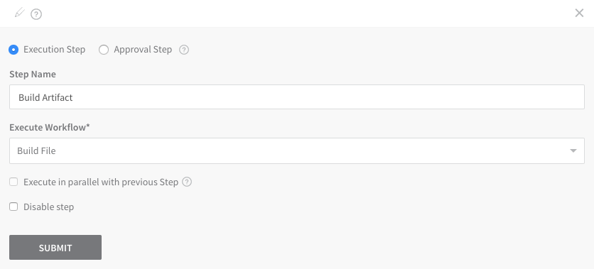
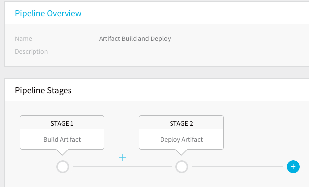
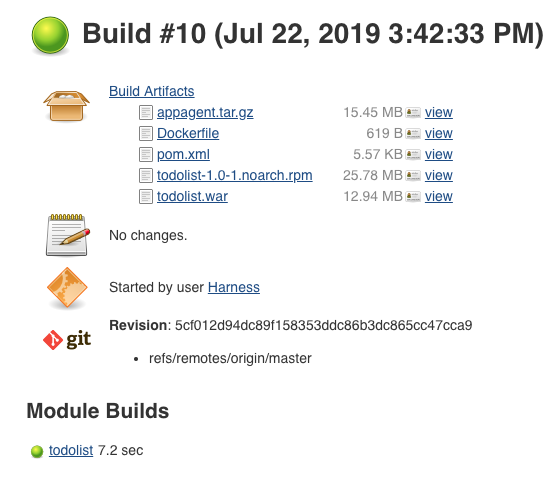

Pipelines define your release process using multiple Workflows and approvals in sequential and/or parallel stages. 

An Artifact Build and Deploy Pipeline simply runs your Build Workflow followed by your Deploy Workflow. The Deploy Workflow uses the Harness Service you set up to get the new build number.

In this topic:

* [Review: Use Build Workflows in a Pipeline](https://docs.harness.io/article/slkhuejdkw-6-artifact-build-and-deploy-pipelines#review_use_build_workflows_in_a_pipeline)
* [Step: Create the Build and Deploy Pipeline](https://docs.harness.io/article/slkhuejdkw-6-artifact-build-and-deploy-pipelines#step_create_the_build_and_deploy_pipeline)
* [Step: Add the Build Workflow](https://docs.harness.io/article/slkhuejdkw-6-artifact-build-and-deploy-pipelines#step_add_the_build_workflow)
* [See Also](https://docs.harness.io/article/slkhuejdkw-6-artifact-build-and-deploy-pipelines#see_also)

### Before You Begin

* [CI/CD with the Build Workflow](/article/wqytbv2bfd-ci-cd-with-the-build-workflow)

### Review: Use Build Workflows in a Pipeline

Here are some important things to remember when using a Build Workflow in a Pipeline:

* **No Artifact Selection** — If you use a Build Workflow in a Pipeline, you cannot select an artifact when you deploy the Pipeline. A Build Workflow tells Harness you will be building and collecting the artifact for the Pipeline. Harness will use that artifact for the Pipeline deployment.
* **Don't Execute in Parallel** — Do not execute a Build Workflow in a Pipeline in parallel with a Workflow that deploys the artifact built by the Build Workflow. The Build Workflow must complete before another Workflow in the Pipeline can deploy the artifact.
* **Always Put Build Workflow First** — The Build Workflow should always be the first stage in the Pipeline. This enables the rest of the Pipeline to use the artifact it builds and collects.

### Step: Create the Build and Deploy Pipeline

To create the Artifact Build and Deploy Pipeline, do the following:

1. In your Harness Application, click **Pipelines**, and then click **Add Pipeline**. The **Add Pipeline** settings appear.
2. In **Name**, enter a name for your Pipeline, such as **Artifact Build and Deploy**.
3. Click **Submit**. The new Pipeline is created.

### Step: Add the Build Workflow

Add the Build Workflow as the first stage in the Pipeline:

1. In **Pipeline Stages**, click the **plus** button. The **Pipeline Stage** settings appear.
2. In **Step Name**, enter a name for the Build Stage, such as **Build Artifact**.
3. In **Execute Workflow**, select the Build Workflow you created. When you are done, it will look something like this:
4. Click **Submit**. The stage is added to the Pipeline.
5. Use the same steps to add the Deploy Workflow to the Pipeline. When you are done, it will look something like this.
6. Click **Deploy** to run the Pipeline. Note that you do not need to select an artifact build number as the Deploy Workflow will obtain the latest build.
7. Click **Submit**.  
  
The Workflows are run in succession. First, the Build Workflow is run. Click the **Artifact Collection** step to see the metadata collected by Harness, including the build number.You can see the same build number in Jenkins.  
In this document, Jenkins job artifact is used as an example but Harness supports all the common [artifact source](/article/7dghbx1dbl-configuring-artifact-server) and [custom sources](/article/jizsp5tsms-custom-artifact-source).Next, the Deploy Workflow is run. Click the **Artifact Check** step to see the same build number that was collected by the **Artifact Collection** step. You can also see the build number next to the **Artifacts** heading.The Pipeline has run successfully. You can now build and deploy artifacts by running a single Pipeline.

### See Also

[Trigger Workflows and Pipelines](/article/xerirloz9a-add-a-trigger-2) — Triggers automate deployments using a variety of conditions, such as Git events, new artifacts, schedules, and the success of other Pipelines.

Now that you have an Artifact Build and Deploy Pipeline, you can create a Harness Trigger that runs the Pipeline in response to a Git push to the source repo. The Trigger provides a Webhook URL you can add to your Git repo.

When the push event happens, Git sends a HTTP POST payload to the Webhook's configured URL. The Trigger then executes Artifact Build and Deploy Pipeline.

Do not use **On New Artifact** Trigger to trigger a Build and Deploy Pipeline because you need to Build Workflow to build a new artifact.