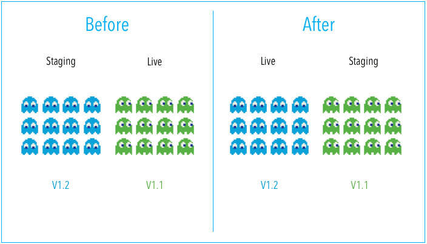
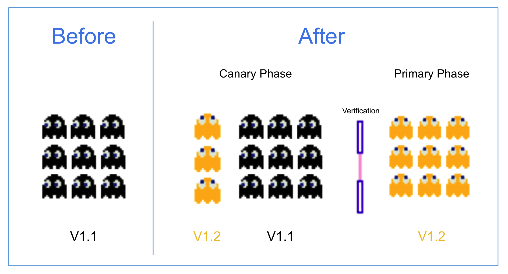
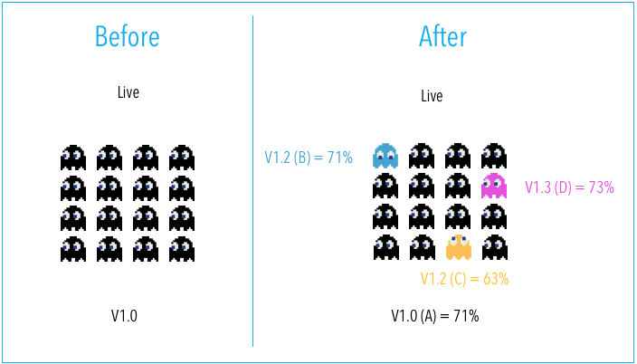

This content is for Harness [FirstGen](/article/1fjmm4by22). Switch to [NextGen](/article/0zsf97lo3c).You have likely heard terms like *blue/green* and *canary* when it comes to deploying code and applications into production. These are common deployment strategies, available in Harness as Workflow types, along with many others.

This topic will explain these strategies to give you an idea of how to approach deployments in Harness, and to help you decide what strategy is best for you.

In this topic:

* [Build Deployment](/article/325x7awntc-deployment-concepts-and-strategies#build_deployment)
* [Basic Deployment](/article/325x7awntc-deployment-concepts-and-strategies#basic_deployment)
* [Multi-Service Deployment](/article/325x7awntc-deployment-concepts-and-strategies#multi_service_deployment)
* [Rolling Deployment](/article/325x7awntc-deployment-concepts-and-strategies#rolling_deployment)
* [Blue/Green Deployment](/article/325x7awntc-deployment-concepts-and-strategies#blue_green_deployment)
* [Canary Deployment](/article/325x7awntc-deployment-concepts-and-strategies#canary_deployment)
* [A/B Testing](/article/325x7awntc-deployment-concepts-and-strategies#a_b_testing)
* [Which Deployment Strategy Should I Use?](/article/325x7awntc-deployment-concepts-and-strategies#which_deployment_strategy_should_i_use)
* [Next Steps](/article/325x7awntc-deployment-concepts-and-strategies#next_steps)

### Build Deployment

A Build Deployment runs a build process, such as a Jenkins job that creates a WAR file and deposits it in a repo, or builds an AMI in AWS EC2.

#### When to use Build Deployments

Typically, you use Build deployments as part of an Artifact Build and Deploy pipeline.

An Artifact Build and Deploy pipeline runs a build process, deposits the built artifact (or metadata) in the Artifact Source or Harness, and deploys the build to a deployment environment. It is a simple, but useful deployment commonly used for traditional file-based and AMI deployments.

See  [Build and Deploy Pipelines Overview](/article/181zspq0b6-build-and-deploy-pipelines-overview).

#### Build Workflow for Push Events

Build Workflows can also be used to build an artifact because the source has been updated.

For example, you might use a Trigger to execute the Workflow on a Webhook event, such as a Git push event. In this case, the artifact needs to be built before the Workflow can pick it up.

You simply add a Build Workflow at the beginning of the Pipeline to build the artifact so you always have the latest build.

See [Triggers](/article/xerirloz9a-add-a-trigger-2) for information on Webhook triggers.

### Basic Deployment

With Basic Deployment, all nodes within a single environment are updated at the same time with a single new service/artifact version.

#### When to use Basic Deployments

* Your app/service is not business, mission, or revenue critical
* You’re deploying off-hours and no one is using the app/service
* Your experimenting with deployments and it's okay if the app/service fails

##### Pros

* Simple and fast.
* Useful for learning Harness.

##### Cons

* Risk, outages, slower rollback.

Not too long ago, Basic deployment was how developers rolled out applications. Typically, someone in Ops updates the servers at midnight and then you hope all goes well.

Basic deployments are supported in Harness for a number of platforms as a way for you to experiment with deployments. They are not intended for production deployments because they are not as safe as Canary or Blue/Green deployments.

### Multi-Service Deployment

With Multi-Service Deployment, all nodes within a single environment are updated at the same time with *multiple* new services/artifacts.

#### When to use Multi-Service Deployments

* When your app has service/version dependencies.
* You’re deploying off-hours and no one is using the app/service.

##### Pros

* Simple, fast, and with less risk than Basic deployment.

##### Cons

* Risk, difficult to test/verify all service dependencies, outages, slow rollback.

### Rolling Deployment

With a Rolling Deployment, all nodes within a single environment are incrementally updated one-by-one or in N batches (as defined by a window size) with a new service/artifact version.

#### When to use Rolling Deployments

* When you need to support both new and old deployments.
* Load balancing scenarios that require reduced downtime.

One use of Rolling deployments is as the stage following a Canary deployment in a deployment pipeline. For example, in the first stage you can perform a Canary deployment to a QA environment and verify each group of nodes and, once successful, you perform a Rolling to production.

##### Pros

* Simple, relatively simple to rollback, less risk than Basic deployment.
* Gradual app rollout with increasing traffic.

##### Cons

* Verification gates between nodes difficult and slow.
* App/DB needs to support both new and old artifacts. Manual checks/verification at each increment could take a long time.
* Lost transactions and logged-off users are also something to take into consideration.

See  [Kubernetes Rolling Update Workflows](/article/5gouaz9w5r-kubernetes-rolling-update-workflows).

### Blue/Green Deployment

With Blue/Green Deployment, two identical environments called **blue** (staging) and **green** (production) run simultaneously with different versions or service/artifact.

QA and UAT are typically done on the blue environment. When satisfied, traffic is flipped (via a load balancer) from the green environment (current version) to the blue environment (new version).

You can then decommission the old environment once deployment is successful.

Some vendorscalls this a red/black deployment.

#### When to use Blue/Green Deployments

* When you want to perform verification in a full production environment.
* When you want zero downtime.

##### Pros

* Simple, fast, well understood, and easy to implement: switch is almost instantaneous.
* Less risk relative to other deployment strategies.
* Rapid rollback (flip traffic back to old environment)

##### Cons

* Replicating a production environment can be complex and expensive (i.e. microservice downstream dependencies).
* QA/UAT test coverage may not identify all anomalies & regressions in blue environment.
* An outage or SPOF could have wide-scale business impact before rollback kicks in.
* Current transactions and sessions will be lost due to the physical switch from one machine serving the traffic to another one.
* Database compatibility (schema changes, backward compatibility).

See:

* [ECS Blue/Green Workflows](/article/7qtpb12dv1-ecs-blue-green-workflows)
* [AMI Blue/Green Deployment](/article/vw71c7rxhp-ami-blue-green)
* [Kubernetes Blue/Green Workflows](/article/zim6pw6hd5-blue-green-workflows)
* [Pivotal Cloud Foundry Deployments](/article/6m7w43yw4u-pcf-tutorial-overview)

### Canary Deployment

With Canary Deployment, all nodes in a single environment are incrementally updated in small phases, with each phase requiring a verification/gate to proceed to the next phase.

#### When to use Canary Deployments

When you want to verify whether the new version of the application is working correctly in your production environment.

This is currently the most common way to deploy apps/services into production.

**Pros:**

* Deploy in small phases (e.g. 2%, 10%, 25%, 50,%, 75%, 100%).
* Lowest risk relative to all other deployment strategies (reduce business exposure).
* Test in production with real users & use cases.
* Run & compare two service versions side-by-side.
* Cheaper than blue/green, because there is no need to have two production environments.
* Fast and safe rollback.

**Cons:**

* Scripting canary deployments can be complex (Harness automates this process).
* Manual verification can take time (Harness automates this process with Continuous Verification).
* Required monitoring and instrumentation for testing in production (APM, Log, Infra, End User, etc).
* Database compatibility (schema changes, backward compatibility).

This is a standard Canary deployment:

For Kubernetes, Harness does this a little different.

In Phase 1 we do a canary to the same group but we leave the production version alone. We just use other instances. Then we delete our canary version in Phase 1.

In Phase 2 we do a rolling deployment with the production version and scale down the older version.

For examples, see:

* [AMI Canary Deployment](/article/agv5t7d156-ami-canary)
* [Create a Kubernetes Canary Deployment](/article/2xp0oyubjj-create-a-kubernetes-canary-deployment)

### A/B Testing

Different versions of the same service/artifact run simultaneously as “experiments” in the same environment (typically production) for a period of time. Experiments are either controlled by the deployment of distinct artifacts or through the use of feature flags/toggling and/or AB testing tools (e.g. Optimizely).

User traffic is commonly routed to each different version/experiment based on specific rules or user demographics (e.g. location, interests, etc). Measurements and comparisons are then performed across experiments to see which returned the best result.

After experiments are concluded, the environment is typically updated with the optimal service version/experiment.

The biggest difference between AB testing and the other strategies is that AB testing deploys many versions of the same service/artifact to an environment with no immediate goal of updating all nodes with a specific version. It’s about testing multiple ideas vs. deploying one specific tested idea.

#### Pros

Fast, easy and cheap way to test new features in production. Lots of tools exist to enable this.

#### Cons

* Experiments can sometimes break app/service/user experience.
* Scripting AB tests can be complex.
* Database compatibility (schema changes, backward compatibility)

### Which Deployment Strategy Should I Use?

It depends entirely on the type of application/service and environment. Most Harness customers are currently using blue/green or canary deployments for mission-critical applications.

In many cases, customers are migrating from blue/green to canary so they can test in production with minimal business impact.

You can also combine many of the above deployment strategies into a single strategy. For example, at Harness, we have customers doing multi-service canary deployments.

### Next Steps

* [Harness Key Concepts](/article/4o7oqwih6h-harness-key-concepts)

