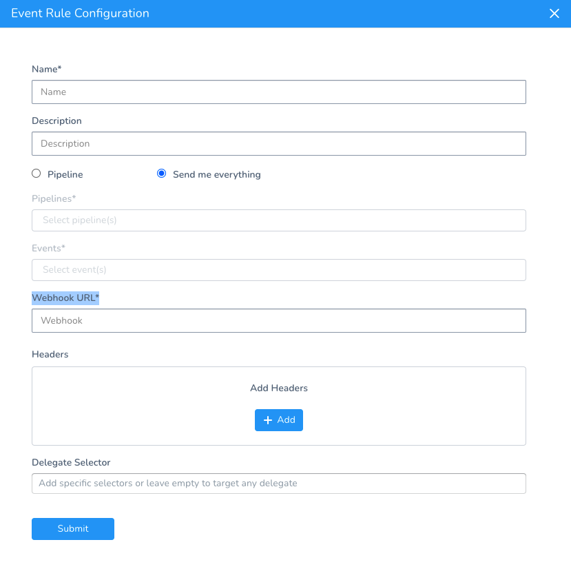
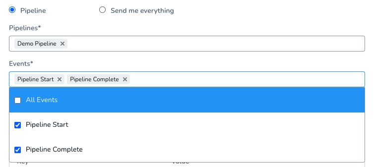

To help you analyze how Pipelines are performing, Harness can send key Pipeline deployment events to a URL endpoint as a JSON payload. Next, you can use other tools to consume and build dashboards for the events.

In this topic:

* [Before You Begin](https://docs.harness.io/article/scrsak5124-publish-pipeline-events-to-an-http-endpoint#before_you_begin)
* [Supported Platforms and Technologies](https://docs.harness.io/article/scrsak5124-publish-pipeline-events-to-an-http-endpoint#undefined)
* [Review: Events Published](https://docs.harness.io/article/scrsak5124-publish-pipeline-events-to-an-http-endpoint#review_events_published)
* [Step 1: Add Event Rule](https://docs.harness.io/article/scrsak5124-publish-pipeline-events-to-an-http-endpoint#step_1_add_event_rule)
* [Option: Pipeline or Send Me Everything](https://docs.harness.io/article/scrsak5124-publish-pipeline-events-to-an-http-endpoint#option_pipeline_or_send_me_everything)
	+ [Pipeline](https://docs.harness.io/article/scrsak5124-publish-pipeline-events-to-an-http-endpoint#pipeline)
	+ [Send Me Everything](https://docs.harness.io/article/scrsak5124-publish-pipeline-events-to-an-http-endpoint#send_me_everything)
* [Step 2: Enter the HTTP Endpoint URL](https://docs.harness.io/article/scrsak5124-publish-pipeline-events-to-an-http-endpoint#step_2_enter_the_http_endpoint_url)
* [Option: Add Headers](https://docs.harness.io/article/scrsak5124-publish-pipeline-events-to-an-http-endpoint#option_add_headers)
* [Option: Delegate Selector](https://docs.harness.io/article/scrsak5124-publish-pipeline-events-to-an-http-endpoint#option_delegate_selector)
* [Step 3: Enable the Rule](https://docs.harness.io/article/scrsak5124-publish-pipeline-events-to-an-http-endpoint#step_3_enable_the_rule)
* [Step 4: Test the Event Rule](https://docs.harness.io/article/scrsak5124-publish-pipeline-events-to-an-http-endpoint#step_4_test_the_event_rule)
* [Review: Event Rules using GraphQL](https://docs.harness.io/article/scrsak5124-publish-pipeline-events-to-an-http-endpoint#review_event_rules_using_graph_ql)
* [Notes](https://docs.harness.io/article/scrsak5124-publish-pipeline-events-to-an-http-endpoint#notes)

### Before You Begin

* [Create a Pipeline](/article/zc1u96u6uj-pipeline-configuration)
* [Monitor Deployments in Dashboards](/article/c3s245o7z8-main-and-services-dashboards)

### Supported Platforms and Technologies

See [Supported Platforms and Technologies](/article/220d0ojx5y-supported-platforms).

### Review: Events Published

Currently, Harness publishes the following events:

* PIPELINE START
* PIPELINE COMPLETE
* PIPELINE PAUSED
* PIPELINE CONTINUED

Harness will be adding more events soon.

### Step 1: Add Event Rule

In your Application, in **Event Rules**, click **Add**.


The **Event Rule Configuration** settings appear.



Enter a name for the event rule.

### Option: Pipeline or Send Me Everything

You can select to send specific events for specific Pipelines or all events for all Pipelines.

#### Pipeline

In **Pipelines**, select the Pipelines you want events for, or select **All Pipelines**.

In **Events**, select the event types you want to publish or select **All Events**.



#### Send Me Everything

This option sends all events that Harness currently publishes.

When Harness supports more events, these events will also be published.

### Step 2: Enter the HTTP Endpoint URL

In **Webhook URL**, enter the HTTP endpoint URL where Harness will publish the events for this rule.

This is the URL you will use to consume events.

### Option: Add Headers

Add any HTTP headers that you want to send with the events.

### Option: Delegate Selector

By default, Harness will select any available Delegate. You might want to use a specific Delegate because you know it has access to the endpoint URL.

In **Delegate Selector**, select the Selector for the Delegate(s) you want to use.

You add Selectors to Delegates to make sure that they're used to execute the command. For more information, see [Select Delegates with Selectors](/article/c3fvixpgsl-select-delegates-for-specific-tasks-with-selectors).

Harness will use Delegates matching the Selectors you add.

If you use one Selector, Harness will use any Delegate that has that Selector.

If you select two Selectors, a Delegate must have both Selectors to be selected. That Delegate might also have other Selectors, but it must have the two you selected.

You can use expressions for Harness built-in variables or Account Default variables in **Delegate Selectors**. When the variable expression is resolved at deployment runtime, it must match an existing Delegate Selector.### Step 3: Enable the Rule

You can enable and disable a rule using the toggle button.

### Step 4: Test the Event Rule

You can test an event rule if the rule is enabled or disabled.

To test the rule, click **Test**.

Here is a Pipeline Start event payload example:


```
{  
  "id": "123-456-789-123-456",  
  "version": "v1",  
  "eventType": "pipeline_start",  
  "data": {  
    "application": {  
      "id": "Ze3W2gzaS7aQ-h8MKzJ-fA",  
      "name": "app name"  
    },  
    "pipeline": {  
      "id": "Ze3W2gzaS7aQ-h8MKzJ-fA",  
      "name": "Dummy Pipeline"  
    },  
    "triggeredBy": {  
      "uuid": "lv0euRhKRCyiXWzS7pOg6g",  
      "name": "Admin",  
	     "email": "john.doe@harness.io"  
    },  
    "triggeredByType": "USER",  
    "startedAt": 1626951572549,  
    "services": [  
      {  
        "id": "sySeUbIXSE6CIh_aTXCA8g"  
      }  
    ],  
    "environments": [  
      {  
        "id": "ULwtK2C1ROCwPD--1g_uag"  
      }  
    ],  
    "infraDefinitions": [  
      {  
        "id": "foHTHGmMTVSHmojA2PCLCw"  
      }  
    ],  
    "executionId": "XN9OQ3S6Rli2yBYXFwSCBQ"  
  }  
}
```
Here is a Pipeline Complete event payload example:


```
{  
  "id": "123-456-789-123-456",  
  "version": "v1",  
  "eventType": "pipeline_end",  
  "data": {  
    "application": {  
      "id": "Ze3W2gzaS7aQ-h8MKzJ-fA",  
      "name": "app name"  
    },  
    "pipeline": {  
      "id": "Ze3W2gzaS7aQ-h8MKzJ-fA",  
      "name": "Dummy Pipeline"  
    },  
    "triggeredBy": {  
      "uuid": "lv0euRhKRCyiXWzS7pOg6g",  
      "name": "Admin",  
    "email": "john.doe@harness.io"  
    },  
    "triggeredByType": "USER",  
    "startedAt": 1626951572549,  
    "services": [  
      {  
        "id": "sySeUbIXSE6CIh_aTXCA8g"  
      }  
    ],  
    "environments": [  
      {  
        "id": "ULwtK2C1ROCwPD--1g_uag"  
      }  
    ],  
    "infraDefinitions": [  
      {  
        "id": "foHTHGmMTVSHmojA2PCLCw"  
      }  
    ],  
    "executionId": "XN9OQ3S6Rli2yBYXFwSCBQ",  
    "completedAt": 1626951580029,  
    "status": "SUCCESS"  
  }  
}
```
You can see various Pipeline event details in both payloads example. The Ids correspond to Harness entities in the Harness Application such as Services and Environments.

To perform analysis on Pipeline performance, you can use the `startedAt` and `completedAt` timestamps (in milliseconds).

### Review: Event Rules using GraphQL

You can create and query the event rules for an Application using the Harness GraphQL API.

See [Publish Pipeline Events to an HTTP Endpoint using the API](/article/cfrqinjhci-publish-pipeline-events-to-an-http-endpoint-using-the-api).

### Notes

* The Event Rules do not appear in the Configure As Code YAML.
* If you delete an Application, its Event Rules are also deleted.

