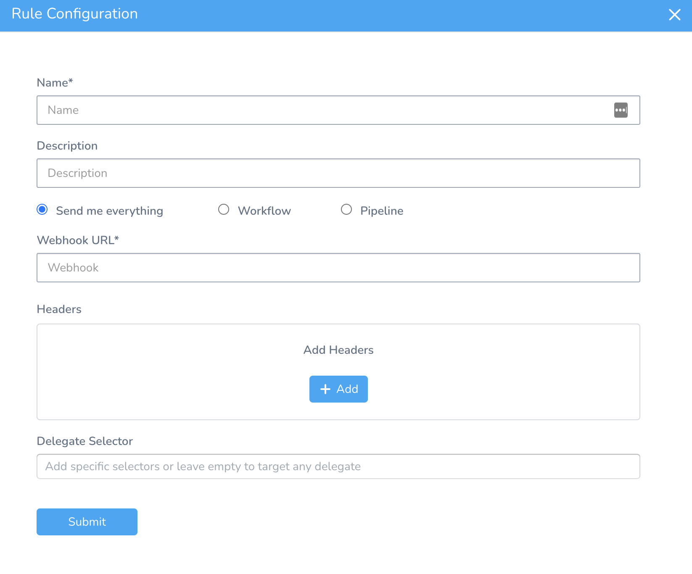

To help you analyze how Workflows are performing, Harness can send key Workflow deployment events to a URL endpoint as a JSON payload. Next, you can use other tools to consume and build dashboards for the events.

This topic explains how to publish Workflow events. For information on how to publish Pipeline events, see [Publish Pipeline Events to an Http Endpoint](/article/scrsak5124-publish-pipeline-events-to-an-http-endpoint).

In this topic:

* [Before You Begin](#before_you_begin)
* [Supported Platforms and Technologies](#supported_platforms_and_technologies)
* [Review: Events Published](#review_events_published)
* [Step 1: Add Event Rule](#step_1_add_event_rule)
	+ [Option: Send Me Everything](#option_send_me_everything)
	+ [Option: Workflow](#option_workflow)
	+ [Option: Pipeline](#option_pipeline)
* [Step 2: Select Events](#step_2_select_events)
* [Step 3: Enter the Webhook URL](#step_3_enter_the_webhook_url)
* [Step 4: Add Headers](#step_4_add_headers)
* [Step 5: Delegate Selector](#step_5_delegate_selector)
* [Step 6: Enable the Rule](#step_6_enable_the_rule)
* [Step 7: Test the Event Rule](#step_7_test_the_event_rule)
* [Notes](#notes)

### Before You Begin

* [Create a Workflow](/article/o86qyexcab-tags-how-tos)
* [Supported Platforms and Technologies](/article/220d0ojx5y-supported-platforms)

### Review: Events Published

Currently, Harness publishes the following events:

* WORKFLOW START
* WORKFLOW COMPLETE
* WORKFLOW PAUSE
* WORKFLOW CONTINUE

Harness will be adding more events soon.

### Step 1: Add Event Rule

In your Application, in **Event Rules**, click **Add**.

The **Rule Configuration** settings appear.

Enter a name for the event rule.

#### Option: Send Me Everything

Select **Send me everything** to send all the events that Harness currently publishes.

#### Option: Workflow

Select **Workflow** to send events for specific Workflows. In **Workflows**, select the Workflows you want events for, or select **All Workflows**.


#### Option: Pipeline

Select **Pipeline** to send events for specific Pipelines. For more information, see [Publish Pipeline Events to an HTTP Endpoint](/article/scrsak5124-publish-pipeline-events-to-an-http-endpoint).

### Step 2: Select Events

In **Events**, select the event types you want to publish or select **All Events**.


### Step 3: Enter the Webhook URL

In **Webhook URL**, enter the HTTP endpoint URL where Harness will publish the events for this rule.

This is the URL you will use to consume events.

### Step 4: Add Headers

Add any HTTP headers that you want to send with the events.

### Step 5: Delegate Selector

By default, Harness will select any available Delegate. You might want to use a specific Delegate because you know it has access to the endpoint URL.

In **Delegate Selector**, select the Selector for the Delegate(s) you want to use.

You add Selectors to Delegates to make sure that they're used to execute the command. For more information, see [Select Delegates with Selectors](/article/c3fvixpgsl-select-delegates-for-specific-tasks-with-selectors).

Harness will use Delegates matching the Selectors you add.

If you use one Selector, Harness will use any Delegate that has that Selector.

If you select two Selectors, a Delegate must have both Selectors to be selected. That Delegate might also have other Selectors, but it must have the two you selected.

You can use expressions for Harness built-in variables or Account Default variables in **Delegate Selectors**. When the variable expression is resolved at deployment runtime, it must match an existing Delegate Selector.Click **Submit**.

### Step 6: Enable the Rule

By default, the Rule you just created is disabled. You can enable the rule using the toggle button.


### Step 7: Test the Event Rule

You can test an event rule to see if the rule is enabled or disabled.

To test the rule, click **Test**.

Here is a Workflow Start event payload example:


```
{  
                    "id": "86afca34-4cb1-4859-b1c6-11f398f55a4b",  
                    "eventType": "workflow_start",  
                    "data": {  
                        "pipeline": {  
                            "name": "K8s Prod Pipeline",  
                            "id": "T4XKvdmXRM-zjyfyMHBlxg"  
                        },  
                        "application": {  
                            "name": "Harness Sample App",  
                            "id": "V9DxliUiS_SVzmNPkkR5Ow"  
                        },  
                        "workflow": {  
                            "name": "To-Do List K8s Rolling",  
                            "id": "smcCVuvCT4SCyayxG85U8w"  
                        },  
                        "environments": [  
                            {  
                                "id": "5Rx44pB4RC-eAt2SB10l_A"  
                            }  
                        ],  
                        "workflowExecution": {  
                            "id": "Ji0GRNDvSKCaiNmrLT8Fmg"  
                        },  
                        "pipelineExecution": {  
                            "id": "j_V2nAroRbCdy8tmiy6eoA"  
                        },  
                        "startedAt": 1644938260133,  
                        "infraDefinitions": [  
                            {  
                                "id": "MfxXXKPdRjysPEE_KZCaHA"  
                            }  
                        ],  
                        "services": [  
                            {  
                                "id": "2U9X2Z3YTBmQOvUMaWDy-Q"  
                            }  
                        ],  
                        "triggeredBy": {  
                            "name": "Admin",  
                            "uuid": "lv0euRhKRCyiXWzS7pOg6g",  
                            "email": "admin@harness.io"  
                        }  
                    },  
                    "version": "v1"  
                },  
                "query": {}  
            },  
            "eventName": "wfEvents",  
            "createdAt": 1644938267179,  
            "expiry": 1647530267,  
            "id": "1644938267179-LU/fwFNTueqnFVx315rU7A=="  
        }
```
Here is a Workflow Complete event payload example:


```
{  
                    "id": "0c3eecb7-e9cf-400a-b3b1-be6ce9d2bf9f",  
                    "eventType": "workflow_end",  
                    "data": {  
                        "pipeline": {  
                            "name": "K8s Prod Pipeline",  
                            "id": "T4XKvdmXRM-zjyfyMHBlxg"  
                        },  
                        "completedAt": 1644938268018,  
                        "application": {  
                            "name": "Harness Sample App",  
                            "id": "V9DxliUiS_SVzmNPkkR5Ow"  
                        },  
                        "workflow": {  
                            "name": "To-Do List K8s Rolling",  
                            "id": "smcCVuvCT4SCyayxG85U8w"  
                        },  
                        "environments": [  
                            {  
                                "id": "5Rx44pB4RC-eAt2SB10l_A"  
                            }  
                        ],  
                        "workflowExecution": {  
                            "id": "Ji0GRNDvSKCaiNmrLT8Fmg"  
                        },  
                        "pipelineExecution": {  
                            "id": "j_V2nAroRbCdy8tmiy6eoA"  
                        },  
                        "startedAt": 1644938260133,  
                        "infraDefinitions": [  
                            {  
                                "id": "MfxXXKPdRjysPEE_KZCaHA"  
                            }  
                        ],  
                        "services": [  
                            {  
                                "id": "2U9X2Z3YTBmQOvUMaWDy-Q"  
                            }  
                        ],  
                        "triggeredBy": {  
                            "name": "Admin",  
                            "uuid": "lv0euRhKRCyiXWzS7pOg6g",  
                            "email": "admin@harness.io"  
                        },  
                        "status": "FAILED"  
                    },  
                    "version": "v1"  
                },  
                "query": {}  
            },  
            "eventName": "wfEvents",  
            "createdAt": 1644938276855,  
            "expiry": 1647530276,  
            "id": "1644938276855-zy4xu3CNdCFbm/gn9QCJog=="  
        }
```
You can see various Workflow event details in both payload examples. The Ids correspond to Harness entities in the Harness Application such as Services and Environments.

To perform analysis on Workflow performance, you can use the `startedAt` and `completedAt` timestamps (in milliseconds).

### Notes

* The Event Rules do not appear in the Configure As Code YAML.
* If you delete an Application, its Event Rules are also deleted.

