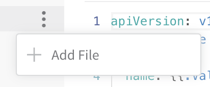
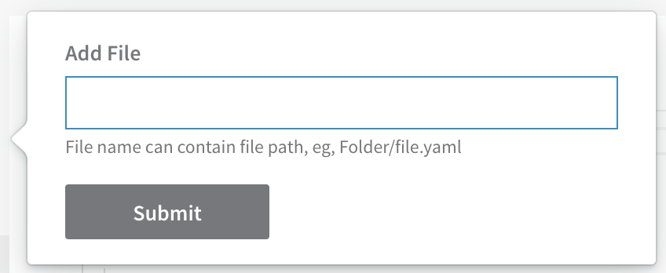
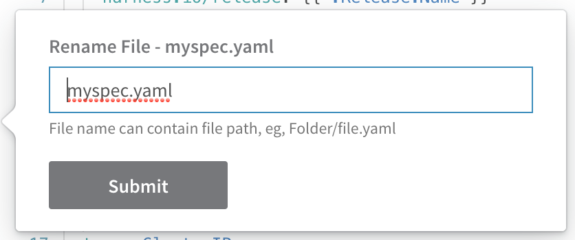

This content is for Harness [FirstGen](/article/1fjmm4by22). Switch to [NextGen](/category/qfj6m1k2c4).Harness provides full file management for your Kubernetes configuration files. You can add, edit, and manage all of the files in your Harness Kubernetes Service.

In this topic:

* [Before You Begin](#before_you_begin)
* [Step 1: Manually Add Configuration Files](#step_1_manually_add_configuration_files)
* [Step 2: Edit Resource Files](#step_2_edit_resource_files)
* [Step 3: Create and Manage Folders](#step_3_create_and_manage_folders)
* [Next Steps](#next_steps)

### Before You Begin

* [Define Kubernetes Manifests](/article/2j2vi5oxrq-define-kubernetes-manifests)
* [Upload Kubernetes Resource Files](/article/2vcxg26xiu-upload-kubernetes-resource-files)

### Step 1: Manually Add Configuration Files

For information on uploading files, see [Upload Kubernetes Resource Files](/article/2vcxg26xiu-upload-kubernetes-resource-files). Once the files are uploaded into Harness, you can create more files inline, as described below.

1. In your Harness Kubernetes Service, click the more options button (**︙**) next to any existing file or folder.
   
   The **Add File** dialog appears.
   
2. Enter a file name and click **Submit**. To add a folder at the same time, enter the folder name followed by the file name, such **myfolder/service.yaml**.

Now you can edit the file and paste in your manifest.

To add more files to that folder, use the same folder name when you create the files.

### Step 2: Edit Resource Files

1. In your Harness Kubernetes Service **Manifests** section, select a file and click the **Edit** button.
2. Enter your YAML, and then click **Save**.

Harness validates the YAML in the editor at runtime.You can use Go templating for inline manifest files. See [Use Go Templating in Kubernetes Manifests](/article/mwy6zgz8gu-use-go-templating-in-kubernetes-manifests).

The inline values.yaml file used in a Harness Service does not support Helm templating, only Go templating. Helm templating is fully supported in the remote Helm charts you add to your Harness Service.

### Step 3: Create and Manage Folders

1. Click the more options button (︙) and click **Rename File**. The **Rename File** dialog opens.
   
2. Enter a folder name before the file name, including a forward slash, such as **myfolder/**.
3. Click **SUBMIT**. The folder is created and the file is added to it.

To add other existing files to that folder, rename them and use the same folder name.

### Next Steps

* [Upload Kubernetes Resource Files](/article/2vcxg26xiu-upload-kubernetes-resource-files)

