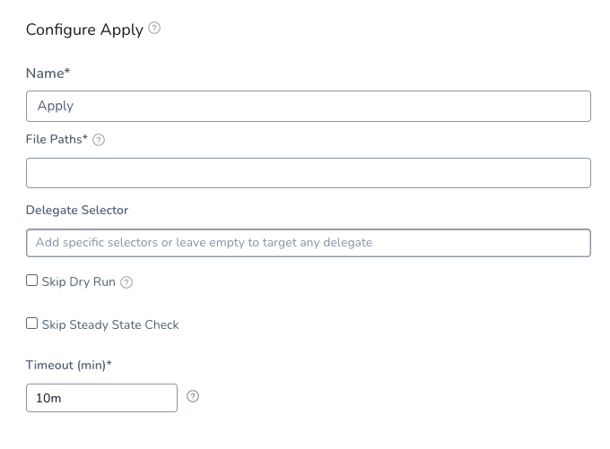
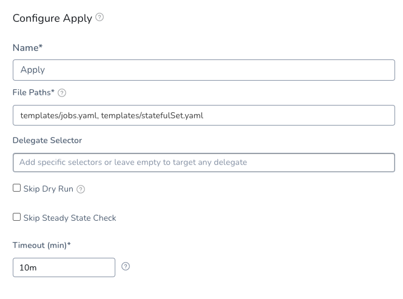
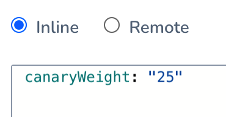
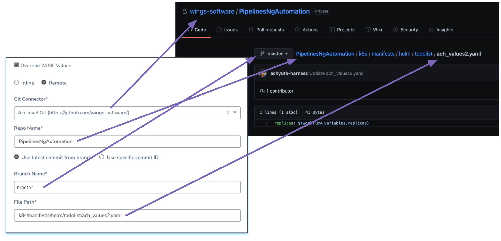

By default, the Harness Kubernetes Workflow will deploy all of the resources you have set up in the Service **Manifests** section.

Deploying Kubernetes Jobs? See [Run Kubernetes Jobs](/article/qpv2jfdjgm-run-kubernetes-jobs).In some cases, you might have resources that you do not want to deploy as part of the main Workflow deployment, but want to apply as another step in the Workflow. For example, you might want to deploy an additional resource only after Harness has verified the deployment of the main resources in the Service **Manifests** section.

Workflows include an **Apply** step that allows you to deploy any resource you have set up in the Service **Manifests** section.

### Before You Begin

* [Ignore a Manifest File During Deployment](/article/vv25jkq4d7-ignore-a-manifest-file-during-deployment)
* [Define Kubernetes Manifests](/article/2j2vi5oxrq-define-kubernetes-manifests)
* [Kubernetes Versioning and Annotations](/article/ttn8acijrz-versioning-and-annotations)

### Review: What Workloads Can I Deploy?

See [What Can I Deploy in Kubernetes?](/article/6ujb3c70fh).

### Step 1: Ignore the Workload

Typically, you will instruct Harness to ignore the workload that you want to deploy separately using the **Apply Step**.

To have a Workflow ignore a resource file in a Service Manifest section, you add the comment `# harness.io/skip-file-for-deploy` to the **top** of the file. For example, here is a ConfigMap file using the comment:

Now, when this Service is deployed by a Workflow, this ConfigMap resource will not be applied by default.

The comment `# harness.io/skip-file-for-deploy` must be at the **top** of the file. If it is on the second line it will not work and the resource will be deployed as part of the main Workflow rollout.

### Step 2: Add the Apply Step

In your Kubernetes Workflow, click **Add Step**, and then select **Apply**.



### Step 3: Enter the Path and Name of the Manifest

The Workflow Apply step will apply any resource in a Service **Manifest** section explicitly. You must provide the path and name of the file in **Apply**, and Harness will deploy the resource.

For example, the following image shows a Jobs resource in a Service **Manifest** section that uses the ignore comment `# harness.io/skip-file-for-deploy` so that the Workflow does not apply it as part of its main **Deploy** steps, and the **Apply** step that specifies the same Jobs resource:

[](./static/deploy-manifests-separately-using-apply-step-190.png)The **File paths** field in the Apply step must include the folder name and the file name. In the above example, the folder **templates** is included with the file name **jobs.yaml**: `templates/jobs.yaml`.

You can include multiple resource files in the Apply step **File paths** field by separating them with commas, for example: `templates/jobs.yaml, templates/statefulSet.yaml`:

If you apply the ignore comment `# harness.io/skip-file-for-deploy` to a resource but do not use the resource in an Apply step, the resource is never deployed.If you use a remote manifest in your Harness Service, in **File paths** enter a path relative to the path you specified for the manifest in the Harness Service.

Harness variables such as [Workflow variables](/article/766iheu1bk-add-workflow-variables-new-template) are supported in the **File Paths** setting.

### Option: Manifest Options

#### Export Manifest

If you enable this option, Harness does the following at runtime:

* Downloads manifests (if remote).
* Renders manifests in logs.
* Performs a dry run unless the **Skip Dry Run** option is enabled.
* Export the deployment manifests to the variable `${k8sResources.manifests}`.
* **Does not deploy the manifests.** To deploy the manifests, you must add another Kubernetes step of the same type (Canary, Rolling, Apply, Stage Deployment) an enable the **Inherit Manifest** option to deploy a copy of the exported manifests.

If **Export Manifest** is enabled, the manifests are not deployed. You can use the **Inherit Manifest** option in a subsequent Kubernetes step to deploy a copy of the exported manifests.

The exported manifests can be written to storage on the Delegate where the step is run. For example, you can add a [Shell Script](/article/1fjrjbau7x-capture-shell-script-step-output) step to echo and write the manifest to a file:


```
echo "${k8sResources.manifests}" > /opt/harness-delegate/test/canaryPlan
```
If you use `${k8sResources.manifests}` in a script ensure that your script expects multiline output. You can use `cat` command to concatenate the lines.If you have the 3rd party tool that check compliance, it can use the exported manifests.

To deploy the manifests, a copy of the exported manifests can be inherited by the next Kubernetes step (Canary, Rolling, Apply, Stage Deployment) using the **Inherit Manifest** option.

If **Export Manifest** is enabled in multiple Kubernetes steps of the same type in the same Workflow Phase, the last step overrides the exported manifests. This is important because the next Kubernetes step to inherit a copy of the exported manifests will only use the exported manifests from last Kubernetes step with **Export Manifest** is enabled.

#### Inherit Manifest

Enable this option to inherit and deploy a copy of the manifests exported from the previous Kubernetes step (Canary, Rolling, Apply, Stage Deployment) using the **Export Manifest** option.

The **Inherit Manifest** option will only inherit the exported manifest from the last Kubernetes step of the same type and in the same Workflow Phase.

For example, if you enable the **Inherit Manifest** option in a **Canary Deployment** step, then it will only inherit a copy of the manifests exported from the last **Canary Deployment** step with the **Export Manifest** option enabled in the same Workflow Phase.

### Option: Delegate Selector

If your Workflow Infrastructure Definition's Cloud Provider uses a Delegate Selector (supported in Kubernetes Cluster and AWS Cloud Providers), then the Workflow uses the selected Delegate for all of its steps.

In these cases, you shouldn't add a Delegate Selector to any step in the Workflow. The Workflow is already using a Selector via its Infrastructure Definition's Cloud Provider.

If your Workflow Infrastructure Definition's Cloud Provider isn't using a Delegate Selector, and you want this Workflow step to use a specific Delegate, do the following:

In **Delegate Selector**, select the Selector for the Delegate(s) you want to use. You add Selectors to Delegates to make sure that they're used to execute the command. For more information, see [Select Delegates with Selectors](/article/c3fvixpgsl-select-delegates-for-specific-tasks-with-selectors).

Harness will use Delegates matching the Selectors you add.

If you use one Selector, Harness will use any Delegate that has that Selector.

If you select two Selectors, a Delegate must have both Selectors to be selected. That Delegate might also have other Selectors, but it must have the two you selected.

You can use expressions for Harness built-in variables or Account Default variables in **Delegate Selectors**. When the variable expression is resolved at deployment runtime, it must match an existing Delegate Selector.  
  
For example, if you have a Delegate Selector **prod** and the Workflow is using an Environment also named **prod**, the Delegate Selector can be `${env.name}`. This is very useful when you match Delegate Selectors to Application component names such as Environments, Services, etc. It's also a way to template the Delegate Selector setting.### Option: Skip Dry Run

By default, Harness uses the `--dry-run` flag on the `kubectl apply` command, which prints the object that would be sent to the cluster without really sending it. If the **Skip Dry Run** option is selected, Harness will not use the `--dry-run` flag.

### Option: Skip Steady State Check

If you select this, Harness will not check to see if the workload has reached steady state.

### Option: Skip Rendering of Manifest Files

By default, Harness uses Go templating and a values.yaml for templating manifest files. See [Use Go Templating in Kubernetes Manifests](/article/mwy6zgz8gu-use-go-templating-in-kubernetes-manifests).

In some cases, you might not want to use Go templating because your manifests use some other formatting.

Use the **Skip Rendering K8s manifest files** option if you want Harness to skip rendering your manifest files using Go templating.

### Option: Override YAML Values

You can override values in the Values YAML file you are using with this **Apply** step.

For example, if the Apply step is deploying a Kubernetes Job by referencing the jobs.yaml in the Harness Service used by this Workflow, you can override values in the values.yaml used in the Service.

By adding or overriding values in the values.yaml, you can pass parameters into the Job being deployed.

Another example is traffic splitting. Let's say your Ingress object uses a values.yaml for the `canary-weight` annotation value. Here you can see the values.yaml `canaryWeight` values referenced:


```
nginx.ingress.kubernetes.io/canary-weight: {{ .Values.canaryWeight }}
```
In the Apply step, you simply need to override this value to set the weight. For example:

You can override values.yaml values using inline or remote values.

#### Inline Override

Enable **Override YAML Values**, and then click **Inline**.

In **Values YAML**, enter the YAML label and value you want to use. For example:


```
replicas: 2
```
You can use [Workflow variables](/article/766iheu1bk-add-workflow-variables-new-template) in the value. For example:


```
replicas: ${workflow.variables.replicas}
```
#### Remote Override

Enable **Override YAML Values**, and then click **Remote**.

In **Git Connector**, select the Harness Git Connector that connects Harness with your Git provider. See [Add Source Repo Providers](/article/ay9hlwbgwa-add-source-repo-providers).

In **Repo Name**, enter the name of the repo in your Git account.

Select a branch or commit Id.

In **Branch Name**, enter the repo branch to use. In **Commit ID**, enter the commit Id to use.

In **File Path**, enter the path to the values file that contains the values you want to use.

Here's an example:

You can use [Workflow variables](/article/766iheu1bk-add-workflow-variables-new-template) in the value. For example:


```
replicas: ${workflow.variables.replicas}
```
### Apply Step Examples

The Apply Step is primarily used for deploying Jobs controllers, but it can be used for other resources. Typically, when you want to deploy multiple workloads (Deployment, StatefulSet, and DaemonSet) you will use separate Workflows for each.Deploying a resource out of sync with the main resource deployment in a Workflow can be useful if a specific resource requires some external service processing that is orchestrated around your main rollout, such as database migration.

One reason why a Job controller object is a good use of the Apply step is that represents a finite task that runs to completion rather than managing an ongoing desired state. You can run a Job to do perform work outside of the primary object deployment, such as large computation and batch-oriented tasks.

In another example, let's say you have two services, serviceA calls serviceB to populate a product page. The main Workflow rollout deploys serviceB successfully and then the Apply step deploys serviceA next, ensuring serviceA only calls serviceB after serviceB is deployed successfully.

Another example of the use of the Apply step is service mesh traffic shifting. Your main Workflow rollout can deploy your services and then an Apply step can apply the resource that modifies the service mesh for the deployed services (for example, in an Istio-enabled cluster, `VirtualService`).

### Notes

* The **Apply** step applies to Service Manifests that are local or added remotely using the **Kubernetes Resource Specs in YAML format** option. See [Link Resource Files or Helm Charts in Git Repos](/article/yjkkwi56hl-link-resource-files-or-helm-charts-in-git-repos).
* The Apply step does not version ConfigMap and Secret objects. ConfigMap and Secret objects are overwritten on each deployment. This is the same as when ConfigMap and Secret objects are marked as unversioned in typical rollouts (`harness.io/skip-versioning: "true"`). See [Kubernetes Versioning and Annotations](/article/ttn8acijrz-versioning-and-annotations).
* You can use Harness variables in your manifests and values.yaml files. For example, Harness [Workflow variables](/article/766iheu1bk-add-workflow-variables-new-template).
* In some cases, you might want to deploy a Service but skip its versioning. By default, release history is stored in the Kubernetes cluster in a ConfigMap. This ConfigMap is essential for release tracking, versioning, and rollback. If you want Harness to skip versioning for the Service, use the **Skip Versioning for Service** option in **Remote Manifests**. See [Option: Skip Versioning for Service](/article/yjkkwi56hl-link-resource-files-or-helm-charts-in-git-repos#option_skip_versioning_for_service).

### Next Steps

* [Delete Kubernetes Resources](/article/78oginrhsh-delete-kubernetes-resources)
* [Ignore a Manifest File During Deployment](/article/vv25jkq4d7-ignore-a-manifest-file-during-deployment)

