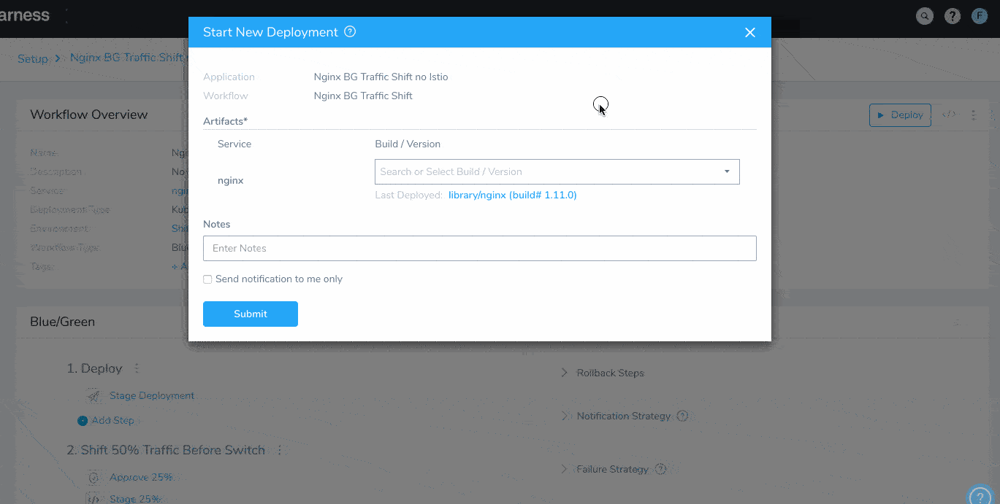
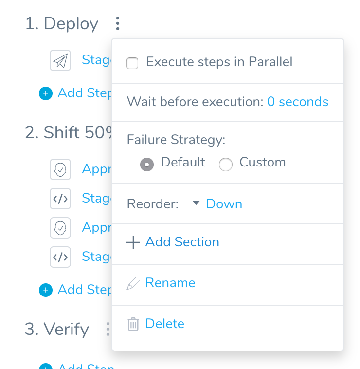
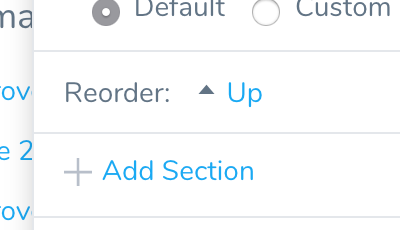

This topic describes how to progressively increase traffic to new application versions using Ingress resources, Harness annotations, and the [Apply](/article/4vjgmjcj6z-deploy-manifests-separately-using-apply-step) step.

**Using Istio already?** Follow the steps in [Set Up Kubernetes Traffic Splitting](/article/1qfb4gh9e8-set-up-kubernetes-traffic-splitting).  
  
For standard Canary and Blue/Green Kubernetes deployments, see [Create a Kubernetes Canary Deployment](/article/2xp0oyubjj-create-a-kubernetes-canary-deployment) and [Create a Kubernetes Blue/Green Deployment](/article/ukftzrngr1-create-a-kubernetes-blue-green-deployment).[Kubernetes Annotations](/article/ttn8acijrz-versioning-and-annotations) are used to ignore the Ingress manifests during the main deployment, and to specify weights for each Ingress resource (0, 25, 50). Each Ingress resource is then applied using a separate Apply strep.

This technique can be use with [Blue/Green](/article/ukftzrngr1-create-a-kubernetes-blue-green-deployment) and [Canary](/article/2xp0oyubjj-create-a-kubernetes-canary-deployment) deployments. For this topic, we will modify standard Harness Kubernetes Blue/Green deployment.

For applications that are implemented using service mesh, such as Istio, see [Set Up Kubernetes Traffic Splitting](/article/1qfb4gh9e8-set-up-kubernetes-traffic-splitting).

In this topic:

* [Before You Begin](#before_you_begin)
* [Visual Summary](#visual_summary)
* [Step 1: Review Blue/Green Service Swap](#step_1_review_blue_green_service_swap)
* [Step 2: Review Traffic Splitting with Ingress](#step_2_review_traffic_splitting_with_ingress)
* [Step 3: Create the Harness Service](#step_3_create_the_harness_service)
* [Step 4: Create the Primary Service Manifest](#step_4_create_the_primary_service_manifest)
* [Step 5: Create the Stage Service Manifest](#step_5_create_the_stage_service_manifest)
* [Step 6: Add the Ingress Manifests](#step_6_add_the_ingress_manifests)
* [Step 7: Define Your Kubernetes Target Infrastructure](#step_7_define_your_kubernetes_target_infrastructure)
* [Step 8: Create the Blue/Green Workflow](#step_8_create_the_blue_green_workflow)
* [Step 9: Add Workflow Sections](#step_9_add_workflow_sections)
* [Step 10: Add Apply Steps](#step_10_add_apply_steps)
* [Option 1: Add Approval Steps](#option_1_add_approval_steps)
* [Step 11: Deploy the Workflow](#step_11_deploy_the_workflow)
* [Option: Rollback Steps](https://docs.harness.io/article/tkubd954r6-traffic-splitting-without-istio#option_rollback_steps)
* [Option: Delegate Selector Setting](https://docs.harness.io/article/tkubd954r6-traffic-splitting-without-istio#option_delegate_selector_setting)
* [Notes](#notes)
* [Next Steps](#next_steps)

### Before You Begin

* You will need Kubernetes cluster with an Ingress controller deployed that supports traffic splitting, such as the [NGINX Ingress Controller](https://kubernetes.github.io/ingress-nginx/deploy/).
* [Create a Kubernetes Canary Deployment](/article/2xp0oyubjj-create-a-kubernetes-canary-deployment)
* [Delegate Installation and Management](/article/h9tkwmkrm7-delegate-installation)
* [Set up Kubernetes Ingress Rules](/article/tot87l7e6k-set-up-kubernetes-ingress-rules)

### Visual Summary

Here's a recording of what your completed deployment will look like, including approval steps:



### Step 1: Review Blue/Green Service Swap

When you create a Harness Service for a Blue/Green deployment, you need to include a manifest for each of the Kubernetes services used in Blue/Green.

Harness refers to the two services as primary and stage Kubernetes services, distinguished using the following **mandatory** annotations:

* **Primary** - `annotations: harness.io/primary-service: "true"`
* **Stage** - `annotations: harness.io/stage-service: "true"`

When the Workflow is deployed, Harness modifies the `selector` at runtime to add `harness.io/color` with values `blue` and `green`.

Harness uses these to redirect traffic from the stage service to the primary service (current version).

After the route update where the primary and stage service is swapped, the primary service routes requests to the new app version based on the `harness.io/color` selector. Here is a log of the swap:


```
Begin execution of command Kubernetes Swap Service Selectors  
  
Selectors for Service One : [name:colors-blue-green-primary]  
app: colors-blue-green  
harness.io/color: blue  
  
Selectors for Service Two : [name:colors-blue-green-stage]  
app: colors-blue-green  
harness.io/color: green  
  
Swapping Service Selectors..  
  
Updated Selectors for Service One : [name:colors-blue-green-primary]  
app: colors-blue-green  
harness.io/color: green  
  
Updated Selectors for Service Two : [name:colors-blue-green-stage]  
app: colors-blue-green  
harness.io/color: blue  
  
Done
```
With this method, only one version of the application is servicing the requests at anytime.

For more information, see [Create a Kubernetes Blue/Green Deployment](/article/ukftzrngr1-create-a-kubernetes-blue-green-deployment).

### Step 2: Review Traffic Splitting with Ingress

In Traffic Splitting Without Istio deployment, first we deploy the new version of the app and use the **stage service** to send traffic to it.

Next we increase the **stage service** traffic to 25% and then 50% so it receives half the traffic. Now the new and old versions are sharing traffic equally.

Once the swap occurs, and the stage service is now routing to the old app version, we will decrease the traffic to the stage service (and old version) to 25% and then 0%.

To increase and decrease traffic, we are using the weight-based traffic splitting of the [NGINX Ingress controller](https://www.nginx.com/products/nginx/kubernetes-ingress-controller). To control the weights, we use this controller's [nginx.ingress.kubernetes.io/canary-weight](https://kubernetes.github.io/ingress-nginx/user-guide/nginx-configuration/annotations/#canary) annotation in our Ingress manifests.

Here's how the Ingress weights will be used on the Kubernetes **stage** service:

1. Before the swap:
	1. Stage service receives weight of 25%.
	2. Stage service receives weight of 50%.
2. After the swap:
	1. Stage service receives weight of 25%.
	2. Stage service receives weight of 0%.

### Step 3: Create the Harness Service

1. Create the Harness Kubernetes Service you will use for your artifact and manifests.
2. Add a container artifact using the steps in [Add a Docker Artifact Source](/article/gxv9gj6khz-add-a-docker-image-service).

In the following steps we will supplement the default files generated by Harness. The following files will be used but will not be changed:

* deployment.yaml
* namespace.yaml
* values.yaml
1. Remove the default **service.yaml** file. We will be replacing this file in the steps below.

### Step 4: Create the Primary Service Manifest and Ingress

1. In the templates folder, create a file named **service-primary.yaml**.
2. Add the following YAML to service-primary.yaml:


```
apiVersion: v1  
kind: Service  
metadata:  
  name: {{.Values.name}}-svc-primary  
  annotations:  
    harness.io/primary-service: "true"  
spec:  
  type: {{.Values.serviceType}}  
  ports:  
  - port: {{.Values.servicePort}}  
    targetPort: {{.Values.serviceTargetPort}}  
    protocol: TCP  
  selector:  
    app: {{.Values.name}}
```
Note the `-primary​` suffix in the name and `harness.io/primary-service: "true"` annotation.

Next, create the Ingress manifest for the primary service. Add a new file named ingress.yaml and add the following:


```
apiVersion: extensions/v1beta1  
kind: Ingress  
metadata:  
  name: {{.Values.name}}-svc​-primary​  
    
  labels:  
    app: {{.Values.name}}  
  annotations:  
    kubernetes.io/ingress.class: "nginx"  
spec:  
  rules:  
  - host: {{.Values.name}}.com  
    http:  
      paths:  
      - backend:  
          serviceName: {{.Values.name}}-svc​-primary  
          servicePort: 80
```
Next, we'll create the Kubernetes manifest for the stage service.

### Step 5: Create the Stage Service Manifest

1. In the templates folder, create a file named **service-stage.yaml**.
2. Add the following YAML to service-stage.yaml:


```
apiVersion: v1  
kind: Service  
metadata:  
  name: {{.Values.name}}-svc-stage  
  annotations:  
    harness.io/stage-service: "true"  
spec:  
  type: {{.Values.serviceType}}  
  ports:  
  - port: {{.Values.servicePort}}  
    targetPort: {{.Values.serviceTargetPort}}  
    protocol: TCP  
  selector:  
    app: {{.Values.name}}
```
Note the `-stage` suffix in the name and `harness.io/stage-service: "true"` annotation.

### Step 6: Add the Ingress Manifests

There are three Ingress manifests to add. Harness will ignore them in the main deployment step (**Stage Development** step) because they start with the comment:

`# harness.io/skip-file-for-deploy`

See [Ignore a Manifest File During Deployment](/article/vv25jkq4d7-ignore-a-manifest-file-during-deployment) for more information on ignoring manifests.

Each Ingress manifest will also contain the [nginx.ingress.kubernetes.io/canary-weight](https://kubernetes.github.io/ingress-nginx/user-guide/nginx-configuration/annotations/#canary) annotation. Here is an example from one Ingress manifest:


```
# Enable canary and send 0% of traffic to version 2  
nginx.ingress.kubernetes.io/canary: "true"  
**nginx.ingress.kubernetes.io/canary-weight: "0"**
```
Copy and paste the following three Ingress manifests into three new files in **templates**.

1. For each new file, click the **templates** folder, and then click **Add File**:


Add the following three files:

#### ingress-traffic-split0.yaml


```
# harness.io/skip-file-for-deploy  
apiVersion: extensions/v1beta1  
kind: Ingress  
metadata:  
  name: {{.Values.name}}-svc-stage  
    
  labels:  
    app: {{.Values.name}}  
  annotations:  
    kubernetes.io/ingress.class: "nginx"  
  
    # Enable canary and send 0% of traffic to version 2  
    nginx.ingress.kubernetes.io/canary: "true"  
 **nginx.ingress.kubernetes.io/canary-weight: "0"**spec:  
  rules:  
  - host: {{.Values.name}}.com  
    http:  
      paths:  
      - backend:  
          serviceName: {{.Values.name}}-svc-stage  
          servicePort: 80
```
#### ingress-traffic-split25.yaml


```
# harness.io/skip-file-for-deploy  
apiVersion: extensions/v1beta1  
kind: Ingress  
metadata:  
  name: {{.Values.name}}-svc-stage  
    
  labels:  
    app: {{.Values.name}}  
  annotations:  
    kubernetes.io/ingress.class: "nginx"  
  
    # Enable canary and send 25% of traffic to version 2  
    nginx.ingress.kubernetes.io/canary: "true"  
 **nginx.ingress.kubernetes.io/canary-weight: "25"**spec:  
  rules:  
  - host: {{.Values.name}}.com  
    http:  
      paths:  
      - backend:  
          serviceName: {{.Values.name}}-svc-stage  
          servicePort: 80
```
#### ingress-traffic-split50.yaml


```
# harness.io/skip-file-for-deploy  
apiVersion: extensions/v1beta1  
kind: Ingress  
metadata:  
  name: {{.Values.name}}-svc-stage  
    
  labels:  
    app: {{.Values.name}}  
  annotations:  
    kubernetes.io/ingress.class: "nginx"  
  
    # Enable canary and send 50% of traffic to version 2  
    nginx.ingress.kubernetes.io/canary: "true"  
 **nginx.ingress.kubernetes.io/canary-weight: "50"**spec:  
  rules:  
  - host: {{.Values.name}}.com  
    http:  
      paths:  
      - backend:  
          serviceName: {{.Values.name}}-svc-stage  
          servicePort: 80
```
That's all the configuration needed in the Harness Service.

### Step 7: Define Your Kubernetes Target Infrastructure

There are no Harness Infrastructure Definition settings specific to Kubernetes Blue/Green deployment. Create or use the Infrastructure Definition that targets your cluster, as described in [Define Your Kubernetes Target Infrastructure](/article/u3rp89v80h-define-your-kubernetes-target-infrastructure).

Ensure that the Kubernetes cluster includes an Ingress controller that supports traffic splitting, such as the [NGINX Ingress controller](https://kubernetes.github.io/ingress-nginx/deploy/) we are using as an example.

### Step 8: Create the Blue/Green Workflow

1. In your Application, click **Workflows**, and then click **Add Workflow**. The Workflow settings appear. Enter the following settings:


|  |  |
| --- | --- |
|  | * **Name:** Enter a name for your Workflow.
* **Workflow Type:** Select **Blue/Green Deployment**.
* **Environment:** Select the Environment that contains your target Infrastructure Definition.
* **Service:** Select the Service containing your Ingress and service manifests.
* **Infrastructure Definition:** Select the Infrastructure Definition for your target Kubernetes cluster.
 |

The Workflow is created with the default Blue/Green steps.

When we are done with the following steps the Workflow will look like this:


### Step 9: Add Workflow Sections

Workflow sections help you organize your steps. We'll add one section before the **Verify** section, and one after the **Route Update** section.

To add a section, click the options button (**︙**) next to any section and then click **Add Section**.



Enter the name **Shift 50% Traffic Before Switch** and click **Submit**.

The new section is added to the bottom of the Workflow. Use the Reorder option to move the section to right above **Verify**.



Add another section named **Shift Remaining Traffic After Switch** and move it to right before the **Wrap Up** step.

When you're done, the Workflow will look like this:


### Step 10: Add Apply Steps

Next we'll add the Apply steps for the Ingress objects to defined in your Harness Service.

1. In the new **Shift 50% Traffic Before Switch** section, click **Add Step**, and select the **Apply** step.
2. Enter the following settings to apply the `ingress-traffic-split25.yaml` file from the Harness Service and click **Submit**:


|  |  |
| --- | --- |
|  | * **Name:** enter Configure **Stage 25%**.
* **File Paths:** enter `templates/ingress-traffic-split25.yaml`.
* **Delegate Selector:** see [Option: Delegate Selector Setting](#option_delegate_selector_setting).
* For the rest of the settings, you can leave the defaults.

 |

This step will increase the traffic routed to the stage service and the new app version by 25%.

Next, you will add a step to increase the traffic routed to the stage service and the new app version by 50%.

1. Below this step, add another Apply step to apply the `ingress-traffic-split50.yaml` file from the Harness Service and click **Submit:**


|  |  |
| --- | --- |
|  | * **Name:** Enter Configure **Stage 50%**.
* **File Paths:** Enter `templates/ingress-traffic-split50.yaml`.
* **Delegate Selector:** see [Option: Delegate Selector Setting](#option_delegate_selector_setting).
* For the rest of the settings, you can leave the defaults.
 |

Now you can add the steps for decreasing the traffic routed to the stage service and the old version of the app. The first step decreases the traffic to 25%:

1. In the **Shift Remaining Traffic After Switch** section, add an Apply step for the `templates/ingress-traffic-split25.yaml` file from the Harness Service and click **Submit:**


|  |  |
| --- | --- |
|  | * **Name:** Enter Configure **Stage 25%**.
* **File Paths:** Enter `templates/ingress-traffic-split25.yaml`.
* **Delegate Selector:** see [Option: Delegate Selector Setting](#option_delegate_selector_setting).
* For the rest of the settings, you can leave the defaults.
 |

Finally, you add a step to decrease the traffic routed to the stage service and the old app version to 0%:

1. Below this step, add another Apply step to apply the `ingress-traffic-split0.yaml` file from the Harness Service and click **Submit:**


|  |  |
| --- | --- |
|  | * **Name:** Enter Configure **Stage 0%**.
* **File Paths:** Enter `templates/ingress-traffic-split0.yaml`.
* **Delegate Selector:** see [Option: Delegate Selector Setting](#option_delegate_selector_setting).
* For the rest of the settings, you can leave the defaults.
 |

You can actually run the deployment now. The following step add Approval steps between each traffic increase and decrease so you can approve of the changes.

### Option 1: Add Approval Steps

Add Approve steps in between each Apply step to ensure that traffic is not increased or decreased without your approval.

Here is an example of the Approve step for the 25% increase:


|  |  |
| --- | --- |
|  | * **Name:** Enter **Approve 25%**.
* **Ticketing System:** Select **Harness UI**.
* **User Groups:** Select a group in which you are a member, such as **Account Administrator**.
 |

Create Approve steps before each of the remaining Apply steps. When you're done the Workflow will look like this:


### Step 11: Deploy the Workflow

Now that your Workflow is complete, you can deploy it. If you added the Approve steps, be sure to approve each one.

Here's a recording of what your deployment will look like:


### Option: Rollback Steps

To make the Workflow more robust, you can add an ingress-traffic-split0.yaml in an Apply step in the Workflow Rollback Steps.

If there is a failure and rollback, Harness returns the services to the original state.

When thinking of rollback, it's important to keep in mind at which point in deployment the primary service is the new version or the old version. On deployment success, it is the new version, on rollback it is the old version.

In all rollback cases we want stage traffic to end up at 0 and primary traffic to end up at 100.

When using the ingress-traffic-split0.yaml in Rollback steps, the following happens:

* **Failure before the swap** — Stage traffic goes back to 0 and primary to 100. This is because stage was deployed and primary has not been touched.
* **Failure after the swap** — The new deployment is now primary, so Harness swaps back. This makes the old deployment primary. Stage traffic is now 0 and primary is 100.

### Option: Delegate Selector Setting

If your Workflow Infrastructure Definition's Cloud Provider uses a Delegate Selector (supported in Kubernetes Cluster and AWS Cloud Providers), then the Workflow uses the selected Delegate for all of its steps.

In these cases, you shouldn't add a Delegate Selector to any step in the Workflow. The Workflow is already using a Selector via its Infrastructure Definition's Cloud Provider.

If your Workflow Infrastructure Definition's Cloud Provider isn't using a Delegate Selector, and you want this Workflow step to use a specific Delegate, do the following:

In **Delegate Selector**, select the Selector for the Delegate(s) you want to use. You add Selectors to Delegates to make sure that they're used to execute the command. For more information, see [Select Delegates with Selectors](/article/c3fvixpgsl-select-delegates-for-specific-tasks-with-selectors).

Harness will use Delegates matching the Selectors you add.

If you use one Selector, Harness will use any Delegate that has that Selector.

If you select two Selectors, a Delegate must have both Selectors to be selected. That Delegate might also have other Selectors, but it must have the two you selected.

You can use expressions for Harness built-in variables or Account Default variables in **Delegate Selectors**. When the variable expression is resolved at deployment runtime, it must match an existing Delegate Selector.  
  
For example, if you have a Delegate Selector **prod** and the Workflow is using an Environment also named **prod**, the Delegate Selector can be `${env.name}`. This is very useful when you match Delegate Selectors to Application component names such as Environments, Services, etc. It's also a way to template the Delegate Selector setting.### Notes

* **Conflicting Service Error:** If you deployed the standard Blue/Green Workflow before configuring it with the Ingress steps, and then deployed it with the Ingress steps, you might get the following error:  

```
Found conflicting service [harness-example-svc] in the cluster. For blue/green deployment, the label [harness.io/color] is required in service selector. Delete this existing service to proceed
```
  
This is because the services changed between deployments. You can delete the first service using a Delete step or you can use a different name for your app.
* **Traffic splitting Apply steps must be in the same Workflow phase as the Canary deployment step:** Do not add the Apply steps to separate phases.

### Next Steps

* [Set Up Kubernetes Traffic Splitting](/article/1qfb4gh9e8-set-up-kubernetes-traffic-splitting)
* [Create a Kubernetes Blue/Green Deployment](/article/ukftzrngr1-create-a-kubernetes-blue-green-deployment)
* [Set up Kubernetes Ingress Rules](/article/tot87l7e6k-set-up-kubernetes-ingress-rules)

