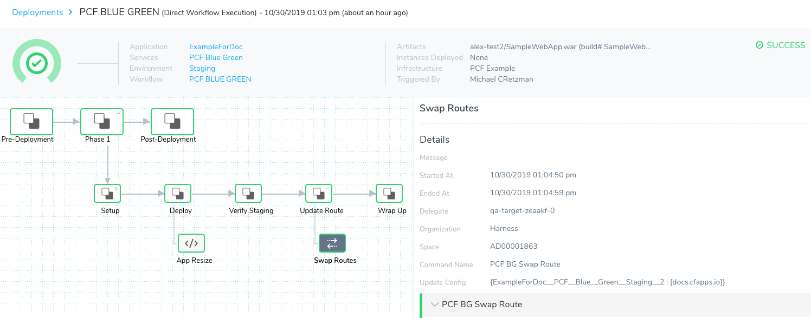
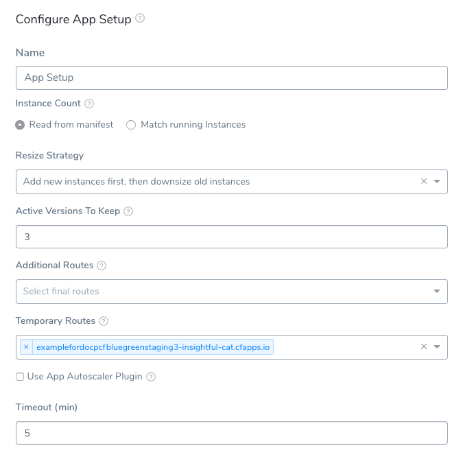
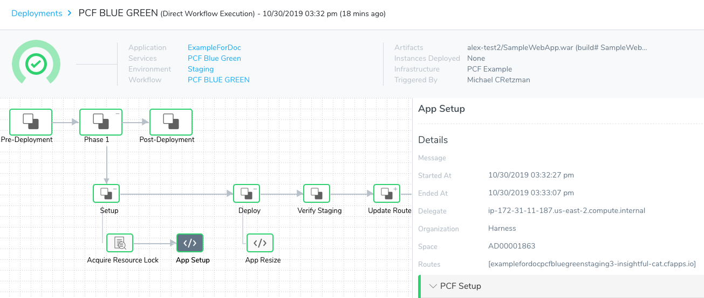
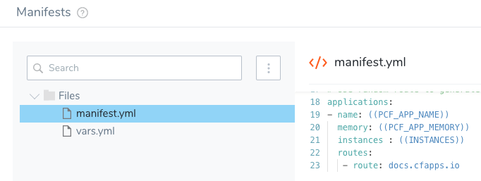
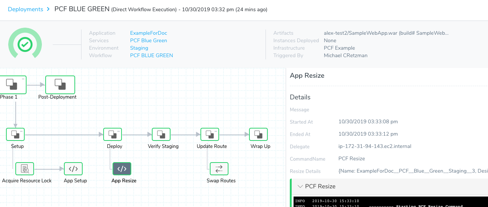
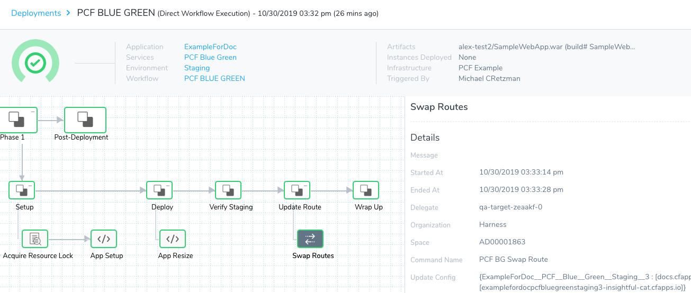

Harness Tanzu Application Service (formerly PCF) Blue/Green deployments use the route(s) in the TAS manifest.yml and a temporary route you specify in the Harness Workflow.

The Workflow deploys the app using the temporary route first using the **App Setup** command. Next, in the **App Resize** command, Harness maintains the number of instances at 100% of the `instances` specified in the manifest.yml.

For Blue/Green deployments, the **App Resize** step is always 100% because it does not change the number of instances as it did in the Canary deployment. In Blue/Green, you are simply deploying the new app to the number of instances set in the **App Setup** step and keeping the old app at the same number of instances (100% count).

Once that deployment is successful, the Workflow **Swap Routes** command switches the networking routing, directing production traffic (Green) to the new app and stage traffic (Blue) to the old app.

In this topic:

* [Before You Begin](https://docs.harness.io/article/52muxcsr1v-create-a-blue-green-pcf-deployment#before_you_begin)
* [Visual Summary](https://docs.harness.io/article/52muxcsr1v-create-a-blue-green-pcf-deployment#visual_summary)
* [Step 1: Specify the TAS Service Routes](https://docs.harness.io/article/52muxcsr1v-create-a-blue-green-pcf-deployment#step_1_specify_the_tas_service_routes)
* [Step 2: Set Up a TAS Blue/Green Workflow](https://docs.harness.io/article/52muxcsr1v-create-a-blue-green-pcf-deployment#step_2_set_up_a_tas_blue_green_workflow)
* [Step 3: App Setup](https://docs.harness.io/article/52muxcsr1v-create-a-blue-green-pcf-deployment#step_3_app_setup)
* [Step 4: App Resize](https://docs.harness.io/article/52muxcsr1v-create-a-blue-green-pcf-deployment#step_4_app_resize)
* [Step 5: Verify Staging](https://docs.harness.io/article/52muxcsr1v-create-a-blue-green-pcf-deployment#step_5_verify_staging)
* [Step 6: Swap Routes](https://docs.harness.io/article/52muxcsr1v-create-a-blue-green-pcf-deployment#step_6_swap_routes)
* [Step 7: Deploy a TAS Blue/Green Workflow](https://docs.harness.io/article/52muxcsr1v-create-a-blue-green-pcf-deployment#step_7_deploy_a_tas_blue_green_workflow)
* [App Versioning without Numbering](https://docs.harness.io/article/52muxcsr1v-create-a-blue-green-pcf-deployment#app_versioning_without_numbering)
* [App Name Variables and Blue Green Deployments](https://docs.harness.io/article/52muxcsr1v-create-a-blue-green-pcf-deployment#app_name_variables_and_blue_green_deployments)
* [Next Steps](https://docs.harness.io/article/52muxcsr1v-create-a-blue-green-pcf-deployment#next_steps)

### Before You Begin

* See [Connect to Your Target Tanzu Account](/article/nh4afrhvkl).
* See [Define Your Tanzu Target Infrastructure](/article/r1crlrpjk4).

### Visual Summary

Here's the output after a successful Blue/Green TAS Deployment.



### Step 1: Specify the TAS Service Routes

In the manifest.yml in your Harness TAS Service, you can specify the route(s) to use for the Blue/Green deployment. For example:


```
  ...  
  routes:  
  - route: example.com
```
Each route for the app is created if it does not already exist.

As you will see when you set up the Blue/Green Workflow, you specify a temporary route in the App Setup command's **Temporary Routes** setting:



### Step 2: Set Up a TAS Blue/Green Workflow

To explain TAS Blue/Green Workflow commands and settings, we will create a Blue/Green Workflow that uses a temporary route and, if it is successful, deploys 100% of instances using the primary route.

To implement this Blue/Green Workflow, do the following:

1. In your Harness Application, click **Workflows**.
2. In **Workflows**, click Add Workflow. The **Workflow** dialog appears.
3. In **Name**, enter a name for the Workflow.
4. In **Workflow Type**, select **Blue/Green Deployment**.
5. In **Environment**, select the Environment you created for TAS.
6. In **Service**, select a Harness TAS Service you have created. The Service manifest.yml must contain a `route`. The route can be an existing route or not. If the doesn't exist, Harness will create it for you. This is the route that will be used at the final stage of the Blue/Green deployment. The temporary route for the prior stage will be selected in the **App Setup** step of Workflow.
7. In **Infrastructure Definition**, select the Infrastructure Definition that describes the target TAS space.
8. Click **Submit**.

The new Blue/Green Workflow is displayed, along with the preconfigured steps:


### Step 3: App Setup

Click **App Setup** to see the default, preconfigured command:


None of the settings in this dialog are mandatory, but for Blue/Green Workflows, the **Match running instances**, **Additional Routes**, and **Temporary Routes** settings are important.

If you select **Match running instances**, Harness will ignore the number of instances set in the Service's manifest.yml `instances` property and use the number of currently running instances as the desired instance count during deployment.

The first time you deploy this Workflow, there is no reason to select **Match running instances** as there are no current running instances.

**Additional Routes** is automatically populated with the routes Harness can find using the Infrastructure Definition you selected for this Workflow

**Additional Routes** has two uses in Blue/Green deployments:

* Select the routes that you want mapped to the app in addition to the routes already mapped in the app in the manifest in your Harness Service.
* You can also omit routes in the manifest in your Harness Service, and simply select them in **Additional Routes**. The routes selected in **Additional Routes** will be used as the final (green) routes for the app.

**Temporary Routes** is automatically populated with the routes Harness can find using the Infrastructure Definition you selected for this Workflow.

In **Temporary Routes**, you can select one or more temporary routes for Harness to use when it creates the TAS app. Later, in the **Swap State** step, Harness will replace these routes with the routes in the manifest.yml `routes` property in your Service.

If you do not select a route in **Temporary Routes**, Harness will create one automatically.

For information on using the **Use App Autoscaler Plugin** settings, see [Use the App Autoscaler Service](/article/4xh8u7l86h-use-the-app-autoscaler-service).

In **Timeout**, set how long you want the Harness Delegate to wait for the TAS cloud to respond to API requests before timing out.

In **Delegate Selectors**, select the Selector for the Delegate(s) you want to use. You add Selectors to Delegates to make sure that they're used to execute the command. For more information, see [Select Delegates with Selectors](/article/c3fvixpgsl-select-delegates-for-specific-tasks-with-selectors).

Harness will use Delegates matching the Selectors you add.

If you use one Selector, Harness will use any Delegate that has that Selector.

If you select two Selectors, a Delegate must have both Selectors to be selected. That Delegate might also have other Selectors, but it must have the two you selected.

You can use expressions for Harness built-in variables or Account Default variables in **Delegate Selectors**. When the variable expression is resolved at deployment runtime, it must match an existing Delegate Selector.  
  
For example, if you have a Delegate Selector **prod** and the Workflow is using an Environment also named **prod**, the Delegate Selector can be `${env.name}`. This is very useful when you match Delegate Selectors to Application component names such as Environments, Services, etc. It's also a way to template the Delegate Selector setting.#### Version Management

Currently, this feature is behind the Feature Flag `CF_APP_NON_VERSIONING_INACTIVE_ROLLBACK`. Contact [Harness Support](mailto:support@harness.io) to enable the feature.For details on how Harness manages Tanzu app names and how this feature impacts naming, see [Tanzu App Naming](/article/hzyz7oc5k9-tanzu-app-naming-with-harness).

**When are the apps renamed?** The new app version is named during the **App Setup** step and according to the option you selected in **Version Management**, but the previous app version is not renamed until the **Swap Route** step in order to avoid errors with any monitoring tools you have pointed at the app version receiving production traffic.### Step 4: App Resize

Click **App Resize** to see the default settings.


For Blue/Green deployments, the **App Resize** step is always 100% because it does not change the number of instances as it did in the Canary deployment. In Blue/Green, you are simply deploying the new app to the number of instances set in the **App Setup** step and keeping the old app at the same number of instances.

#### App Resize V2 or Default App Resize

Currently, this feature is behind a Feature Flag. Contact [Harness Support](mailto:support@harness.io) to enable the feature. Feature Flags can only be removed for Harness Professional and Essentials editions. Once the feature is released to a general audience, it's available for Trial and Community Editions.  
  
See [New features added to Harness](https://changelog.harness.io/?categories=fix,improvement,new) and [Features behind Feature Flags](https://changelog.harness.io/?categories=early-access) (Early Access) for Feature Flag information.You can choose one of the following resize options:

* **App Resize V2:** the number enter in **Advanced Settings** for **Desired Instances - Old App** determines how many instances of the old app will remain running.
* **Default App Resize:** the number enter in **Advanced Settings** for **Desired Instances - Old App** determines how many instances of the old app are downsized.

### Step 5: Verify Staging

There are no commands in **Verify Staging** because you have not set up verification steps in this tutorial, and you would not add them in the initial deployment because there are no other deployments for the steps to use in comparison.

Later, when you are developing Blue/Green Workflows, add verification steps to verify the deployment of your app using the temporary route(s). This way, Harness will only proceed to the **Swap Routes** step if verification does not detects failures. For more information about verifying deployments, see [Continuous Verification](https://docs.harness.io/category/gurgsl2gqt-continuous-verification).

### Step 6: Swap Routes

The final step in the TAS Blue/Green Workflow is the **Swap Routes** command.


This command will swap the route(s) used by the deployed app from the temporary route(s) to the route(s) specified in the manifest.yml in your Service.

**Previous app renamed.** During the **Swap Route** step, the previous app version is renamed according to the option you selected in **Version Management** in the **App Setup** step. The previous app version is not renamed until the **Swap Route** step in order to avoid errors with any monitoring tools you have pointed at the app version receiving production traffic.For detail on **Swap Routes** is a Workflow's **Rollback Steps**, see [Blue/Green Rollback](#blue_green_rollback).### Step 7: Deploy a TAS Blue/Green Workflow

Now that the Blue/Green Workflow is configured, from the breadcrumb menu, click back to the main Workflow page.

You can now deploy the Blue/Green Workflow.

1. Click **Deploy**.
2. In **Start New Deployment**, select an artifact to deploy, and click **Submit**.

The TAS Blue/Green Workflow deploys.

Here you can see the **App Step** command deployed:



When this step is deployed, the output will look something like this:


```
---------- Starting PCF App Setup Command  
  
# Fetching all existing applications   
# Existing applications:   
ExampleForDoc__PCF__Blue__Green__Staging__2  
  
# Processing Apps with Non-Zero Instances  
# No Change For Most Recent Application: ExampleForDoc__PCF__Blue__Green__Staging__2  
  
# No applications were eligible for deletion  
  
# Creating new Application  
# Manifest File Content:   
---  
applications:  
- name: ExampleForDoc__PCF__Blue__Green__Staging__3  
  memory: ((PCF_APP_MEMORY))  
  instances: 0  
  path: /home/ubuntu/harness-delegate/./repository/pcfartifacts/11uZOBMRQoSbDqr_WfRuaQ/1572474750133SampleWebApp.war  
  random-route: true  
  
  
# CF_HOME value: /home/ubuntu/harness-delegate/./repository/pcfartifacts/11uZOBMRQoSbDqr_WfRuaQ  
# Performing "login"  
API endpoint: api.run.pivotal.io  
Authenticating...  
OK  
  
Targeted org Harness  
Targeted space AD00001863  
...  
Getting app info...  
Creating app with these attributes...  
+ name:        ExampleForDoc__PCF__Blue__Green__Staging__3  
  path:        /home/ubuntu/harness-delegate/repository/pcfartifacts/11uZOBMRQoSbDqr_WfRuaQ/1572474750133SampleWebApp.war  
+ instances:   0  
+ memory:      350M  
  routes:  
+   examplefordocpcfbluegreenstaging3-insightful-cat.cfapps.io  
...  
# Application created successfully  
# App Details:   
NAME: ExampleForDoc__PCF__Blue__Green__Staging__3  
INSTANCE-COUNT: 0  
ROUTES: [examplefordocpcfbluegreenstaging3-insightful-cat.cfapps.io]  
  
 ----------  PCF Setup process completed successfully  
# Deleting any temporary files created
```
The route specified in the Service manifest.yml is `docs.cfapps.io`:



Note that in the **App Setup** step, a temporary route has been used: `examplefordocpcfbluegreenstaging3-insightful-cat.cfapps.io`.

Here you can see the **App Resize** command deployed:



When this step is deployed, the output will look something like this:


```
---------- Starting PCF Resize Command  
  
# Upsizing new application:  
APPLICATION-NAME: ExampleForDoc__PCF__Blue__Green__Staging__3  
CURRENT-INSTANCE-COUNT: 0  
DESIRED-INSTANCE-COUNT: 6  
# Application upsized successfully   
  
# Application state details after upsize:    
NAME: ExampleForDoc__PCF__Blue__Green__Staging__3  
INSTANCE-COUNT: 6  
ROUTES: [examplefordocpcfbluegreenstaging3-insightful-cat.cfapps.io]  
  
Instance Details:  
Index: 0  
State: STARTING  
Disk Usage: 0  
CPU: 0.0  
Memory Usage: 0  
  
Index: 1  
State: STARTING  
Disk Usage: 0  
CPU: 0.0  
Memory Usage: 0  
  
Index: 2  
State: STARTING  
Disk Usage: 0  
CPU: 0.0  
Memory Usage: 0  
  
Index: 3  
State: STARTING  
Disk Usage: 0  
CPU: 0.0  
Memory Usage: 0  
  
Index: 4  
State: STARTING  
Disk Usage: 0  
CPU: 0.0  
Memory Usage: 0  
  
Index: 5  
State: STARTING  
Disk Usage: 0  
CPU: 0.0  
Memory Usage: 0  
  
# BG Deployment. Old Application will not be downsized.  
--------- PCF Resize completed successfully
```
Note that 100% of the instances specified in the Service manifest.yml have been deployed (6).

Here you can see the **Swap Routes** command deployed:



When this step is deployed, the output will look something like this:


```
--------- Starting PCF Route Update  
  
# Adding Routes  
APPLICATION: ExampleForDoc__PCF__Blue__Green__Staging__3  
ROUTE:   
[  
docs.cfapps.io  
]  
  
# Unmapping Routes  
APPLICATION: ExampleForDoc__PCF__Blue__Green__Staging__3  
ROUTES:   
[  
examplefordocpcfbluegreenstaging3-insightful-cat.cfapps.io  
]  
# Unmapping Routes was successfully completed  
  
# Adding Routes  
APPLICATION: ExampleForDoc__PCF__Blue__Green__Staging__2  
ROUTE:   
[  
examplefordocpcfbluegreenstaging3-insightful-cat.cfapps.io  
]  
  
# Unmapping Routes  
APPLICATION: ExampleForDoc__PCF__Blue__Green__Staging__2  
ROUTES:   
[  
docs.cfapps.io  
]  
# Unmapping Routes was successfully completed  
  
--------- PCF Route Update completed successfully
```
Note how the new app receives the `docs.cfapps.io` route from the Service manifest.yml and the old route receives the temporary route `examplefordocpcfbluegreenstaging3-insightful-cat.cfapps.io`.

The Blue/Green deployment is complete.

### Blue/Green Rollback

The **Rollback Steps** section in the Workflow contains two default steps, Swap Routes and App Rollback.

When **Swap Routes** is used in a Workflow's **Rollback Steps**, the app that was active before deployment is restored to its original state with the same instances and routes it had before deployment.

The failed app is deleted.

####  Upsize inactive Service Option

Currently, this feature is behind a Feature Flag. Contact [Harness Support](mailto:support@harness.io) to enable the feature. Feature Flags can only be removed for Harness Professional and Essentials editions. Once the feature is released to a general audience, it's available for Trial and Community Editions.  
  
See [New features added to Harness](https://changelog.harness.io/?categories=fix,improvement,new) and [Features behind Feature Flags](https://changelog.harness.io/?categories=early-access) (Early Access) for Feature Flag information.When the **Upsize inactive Service** option in Swap Routes is enabled, on Blue/Green rollback Harness upsizes the previous stage service from 0 to its original count and maps it back to the stage route.

Harness returns the services to their pre-deployment state.

### App Versioning without Numbering

Currently, this feature is behind a Feature Flag. Contact [Harness Support](mailto:support@harness.io) to enable the feature. Feature Flags can only be removed for Harness Professional and Essentials editions. Once the feature is released to a general audience, it's available for Trial and Community Editions.  
  
See [New features added to Harness](https://changelog.harness.io/?categories=fix,improvement,new) and [Features behind Feature Flags](https://changelog.harness.io/?categories=early-access) (Early Access) for Feature Flag information.When you deploy an app it maintains its name without adding any suffix to the name to indicate its release version. A suffix are added to the previous version of the app.

The first time you deploy the app, Harness creates the app with the name you entered in **App Setup**.

When deploying new versions of that app, Harness uses the same name for the app and renames the previous version of the app with suffix `_INACTIVE`.

For example, if the app is named **OrderService**, the first deployment will use the name **OrderService**. When the next version of the app is deployed, the new version is named **OrderService** and the previous version is now named **OrderService\_INACTIVE**.

During rollback, the new app version is deleted and the previous app is renamed without the suffix.

#### Blue/Green Rollback

A TAS Blue/Green deployment keeps the new app version (receiving prod traffic) and the previous, inactive version (receiving stage traffic) running.

During rollback of a new version, prod traffic is swapped back to the previous app version and it is renamed by removing the suffix. The failed version is given the stage traffic.

### App Name Variables and Blue Green Deployments

Some Tanzu variables display different information as the [Blue Green deployment](https://docs.harness.io/article/52muxcsr1v-create-a-blue-green-pcf-deployment) progresses through its steps.

See [App Name Variables and Blue Green Deployments](https://docs.harness.io/article/ojd73hseby-pcf-built-in-variables#app_name_variables_and_blue_green_deployments).

### Next Steps

* [Run CF CLI Commands and Scripts in a Workflow](/article/xai5fs8gko-run-cf-cli-commands-and-scripts-in-a-workflow)

