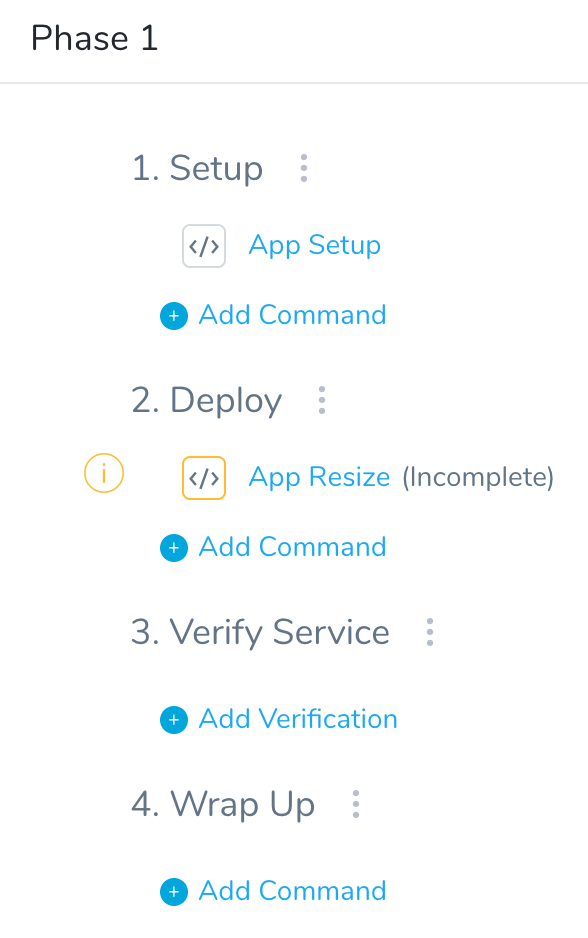
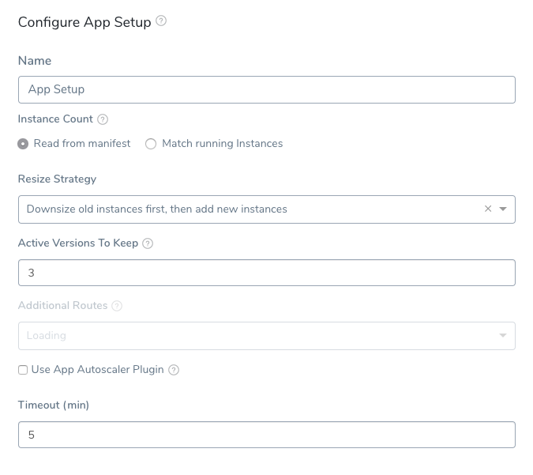
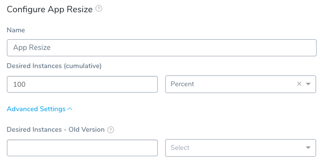
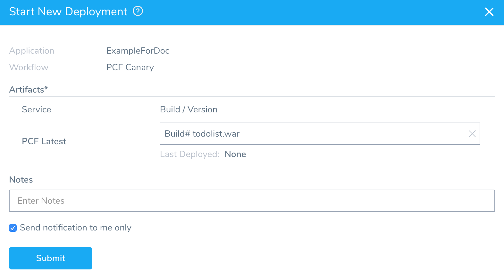
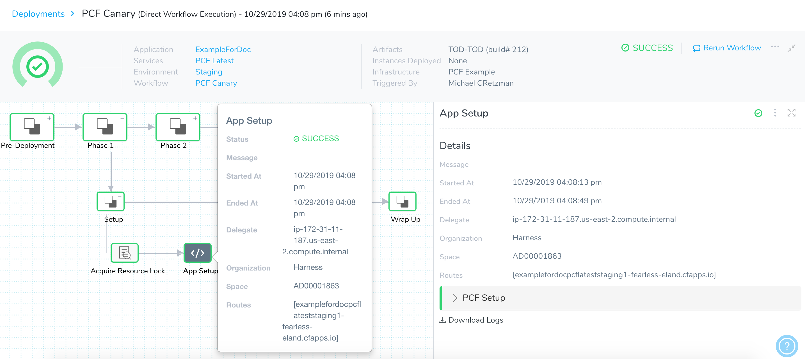
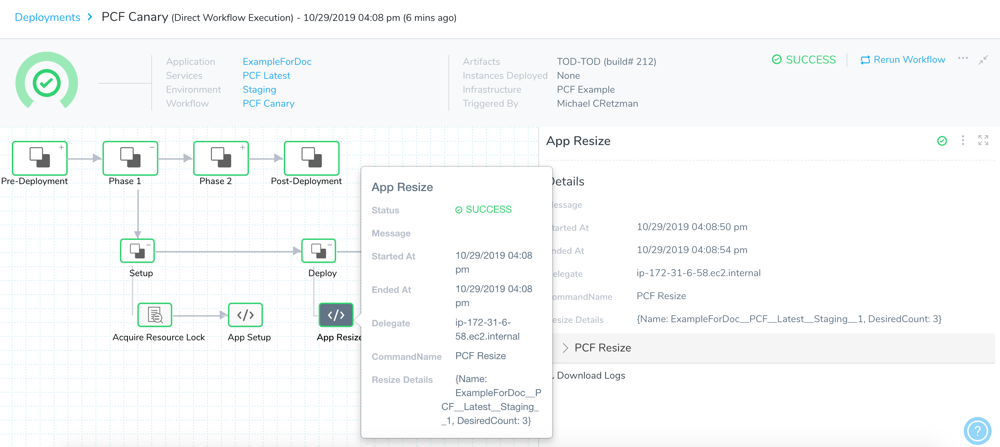
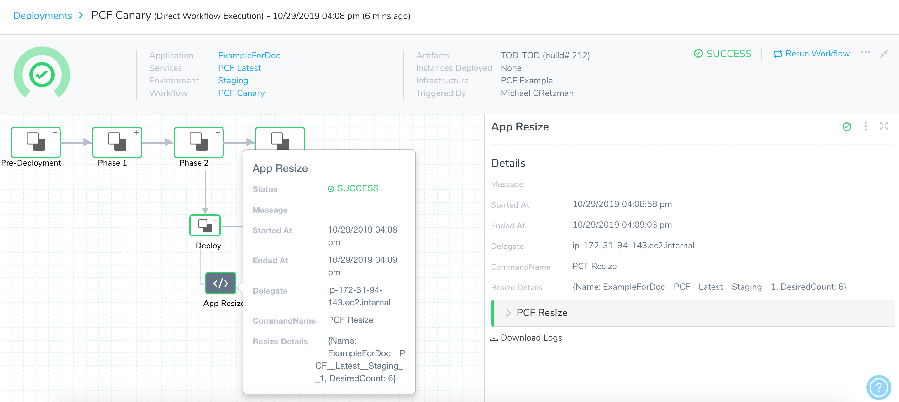

Tanzu Application Service (formerly PCF) Canary deployments contain two or more phases that deploy app instances gradually, ensuring the stability of a small percentage of instances before rolling out to your desired instance count.

In this topic:

* [Before You Begin](#before_you_begin)
* [Visual Summary](#visual_summary)
* [Review: App Resizing in Canary Deployments](#review_app_resizing_in_canary_deployments)
* [Review: Canary Workflow Phases](#review_canary_workflow_phases)
* [Step 1: Add the Canary Workflow](#step_1_add_the_canary_workflow)
* [Step 2: Configure Canary Phase 1](#step_2_configure_canary_phase_1)
* [Step 3: Configure App Setup for Phase 1](#step_3_configure_app_setup_for_phase_1)
* [Step 4: Configure App Resize for Phase 1](#step_4_configure_app_resize_for_phase_1)
* [Step 5: Configure Canary Phase 2](#step_5_configure_canary_phase_2)
* [Step 6: Configure App Resize for Phase 2](#step_6_configure_app_resize_for_phase_2)
* [Step 7: Deploy a Canary PCF Workflow](#step_7_deploy_a_canary_pcf_workflow)
* [App Versioning without Numbering](https://docs.harness.io/article/99bxiqfi1u-create-a-canary-pcf-deployment#app_versioning_without_numbering)
* [Next Steps](#next_steps)

### Before You Begin

* See [Connect to Your Target Tanzu Account](/article/nh4afrhvkl).
* See [Define Your Tanzu Target Infrastructure](/article/r1crlrpjk4).

### Visual Summary

Here is an example of a successful TAS Canary deployment containing two phases:


### Review: App Resizing in Canary Deployments

To understand how app resizing works in a Canary deployment, let's look at an example of a 3 phase deployment.

#### First Deployment

Let's look at the very first deployment. There are no running instances before deployment, and so there is nothing to downsize.

1. Phase 1 is set to 25% for new instances (**Desired Instances (cumulative)** in App Resize step).
2. Phase 2 is set to 50% for new instances.
3. Phase 3 is set to 100% for new instances.

Now, let's imagine the TAS manifest specified in the Harness Service requests **4 instances** and there is no autoscaler plugin configured.

Here's what will happen each time you deploy:

First deployment:

1. Phase 1 deploys 1 new instance.
2. Phase 2 deploys 2 new instances.
3. Phase 3 deploys all 4 desired instances.

#### Second Deployment

Now, let's look at what happens with the second deployment:

1. **There are 4 running instances now.** These were deployed by the first deployment. All downsize percentages refer to this number.
2. Phase 1 deploys new app version to 1 instance and downsizes old app version to 3 instance. Downsize is 25%. It results in 25% of 4 which is 1 instance.  
Current state: 1 new versioned instance and 3 old versioned instances running.
3. Phase 2 deploys new version to 2 instances and downsizes to 2 instances. Downsize is 50% of the number of old versioned instances (4). So 2 instances are downsized.  
Current state: 2 new versioned instances and 2 old versioned instance running.
4. Phase 2 deploys to new version to 4 instances and downsizes to 0 old instances.  
Final state: 4 new instances and 0 old instances.

If you do not enter a value for the number of instances for the old version, Harness uses the number of new instances as its guide. For example, if you deployed 4 new instances and then select **50 Percent** in **Desired Instances - Old Version**, Harness downsizes the old app version to 50% of 4 instances.#### What about Autoscaler?

If you were using an App Autoscaler plugin, it would be applied at the end of the deployment. For example, if Autoscaler is set to min 8 and max 10, Harness will set the desired number of instances to the minimum value. So the total number of new instances is 8.

#### Downsize or Retain Instances

Currently, this feature is behind a Feature Flag. Contact [Harness Support](mailto:support@harness.io) to enable the feature. Feature Flags can only be removed for Harness Professional and Essentials editions. Once the feature is released to a general audience, it's available for Trial and Community Editions.  
  
See [New features added to Harness](https://changelog.harness.io/?categories=fix,improvement,new) and [Features behind Feature Flags](https://changelog.harness.io/?categories=early-access) (Early Access) for Feature Flag information.You can choose one of the following resize options in the App Resize step settings:

* **Retain instances:** the number entered in **Advanced Settings** for **Desired Instances - Old App** determines how many instances of the old app will remain running.
* **Downsize instances:** the number entered in **Advanced Settings** for **Desired Instances - Old App** determines how many instances of the old app are downsized.

### Review: Canary Workflow Phases

To explain TAS Canary Workflow steps and settings, we will create a Canary Workflow that deploys a new app to 50% of instances and, if it is successful, deploys it to 100% of the instances.

The Canary Workflow will contains two phases:

1. Phase 1:
	1. **App Setup** command: 6 instances set up. The number of instances defined in the manifest.yml via the vars.yml variable value for instances:
	2. **App Resize** command: 50% desired instances. This ensures that the app deploys on a small number of instances before moving on to Phase 2.
2. Phase 2:
	1. **App Resize** command: 100% of instances.

### Step 1: Add the Canary Workflow

To implement this Canary workflow, do the following:

1. In your Harness application, click **Workflows**. The **Workflows** page appears.
2. Click **Add Workflow**. The **Workflow** dialog appears.
3. In **Name**, enter a name that describes what the Workflow does. For example, for a simple Canary deployment, **Canary TAS**.
4. In **Workflow Type**, select **Canary Deployment**.
5. In **Environment**, select the Environment containing the Infrastructure Definition for the target space where you will deploy your TAS app.
6. When the **Workflow** dialog is finished, click **SUBMIT**. The TAS Canary Workflow appears.

First, we will set up **Phase 1**, where we will deploy 50% of the 6 instances defined in our Service's **Manifests** section.

### Step 2: Configure Canary Phase 1

To configure the Canary phases, do the following:

1. In the Workflow, in **Deployment Phases**, click **Add Phase**. The **Workflow Phase** dialog appears.
2. In **Service**, ensure you select the Harness Service that contains the manifest for the TAS app you want to deploy.
3. In **Infrastructure Definition**, select the [Infrastructure Definition](https://docs.harness.io/article/n39w05njjv-environment-configuration#step_2_add_infrastructure_definition) that defines the target space where you want to deploy your app.
4. Click **Submit**. Phase 1 appears.



Now we configure this phase to deploy 50% of the TAS app instances we have set in the Service manifest.yml.

### Step 3: Configure App Setup for Phase 1

1. Click **App Setup**. The **App Setup** dialog appears.



You don't need to change any settings in App Setup, but let's review the default settings:


|  |  |
| --- | --- |
| **Setting** | **Description** |
| **Match running instances** | The first time you deploy this Workflow, this setting isn't used because we have no running instances.In future deployments, you might wish to select this setting. For Canary Workflows, it isn't relevant because you will be setting the desired instance count for the phase. |
| **Resize Strategy** | Specify the order in which you want Harness to downsize and add old and new instances.The first time you deploy this Workflow, this setting isn't used because we have no running instances. |
| **Active Versions To Keep** | Enter the number of previous app versions to downsize and keep. You can upsize these versions later if needed. The most recent app version will not be downsized. |
| **Additional Routes** | Select any routes that you want to map to your app, in addition to the routes specified in the manifest in your Harness Service. |
| **Delegate Selectors** | Select the Selector for the Delegate(s) you want to use. You add Selectors to Delegates to make sure that they're used to execute the command. For more information, see [Select Delegates with Selectors](/article/c3fvixpgsl-select-delegates-for-specific-tasks-with-selectors).Harness will use Delegates matching the Selectors you add.If you use one Selector, Harness will use any Delegate that has that Selector.If you select two Selectors, a Delegate must have both Selectors to be selected. That Delegate might also have other Selectors, but it must have the two you selected.You can use expressions for Harness built-in variables or Account Default variables in **Delegate Selectors**. When the variable expression is resolved at deployment runtime, it must match an existing Delegate Selector.For example, if you have a Delegate Selector **prod** and the Workflow is using an Environment also named **prod**, the Delegate Selector can be `${env.name}`. This is very useful when you match Delegate Selectors to Application component names such as Environments, Services, etc. It's also a way to template the Delegate Selector setting. |
| **Use App Autoscaler Plugin** | Enable this setting if you have the [App Autoscaler](https://docs.pivotal.io/application-service/2-7/appsman-services/autoscaler/using-autoscaler-cli.html) service running in your target Pivotal space and bound to the app you are deploying.For more information on using the plugin with Harness, see [App Autoscaler CLI Plugin](/article/4xh8u7l86h-use-the-app-autoscaler-service). |
| **Timeout** | Set how long you want the Harness Delegate to wait for the TAS cloud to respond to API requests before timing out. |
| **Version Management** | For details on how Harness manages Tanzu app names and how this feature impacts naming, see [Tanzu App Naming](/article/hzyz7oc5k9-tanzu-app-naming-with-harness). |

1. Click **Submit** or close the dialog.

Next, we will resize the number of instances to 50% of the instance count set in your Service manifest.yml.

### Step 4: Configure App Resize for Phase 1

1. Click **App Resize**. The **App Resize** dialog appears.
2. In **Desired Instances**, enter **50** and choose **Percent**. The app will deploy on 3 instances successfully before the Workflow moves onto Phase 2.
3. Click **SUBMIT**.

#### Downsize or Retain Instances

Currently, this feature is behind a Feature Flag. Contact [Harness Support](mailto:support@harness.io) to enable the feature. Feature Flags can only be removed for Harness Professional and Essentials editions. Once the feature is released to a general audience, it's available for Trial and Community Editions.  
  
See [New features added to Harness](https://changelog.harness.io/?categories=fix,improvement,new) and [Features behind Feature Flags](https://changelog.harness.io/?categories=early-access) (Early Access) for Feature Flag information.You can choose one of the following resize options:

* **Retain instances:** the number entered in **Advanced Settings** for **Desired Instances - Old App** determines how many instances of the old app will remain running.
* **Downsize instances:** the number entered in **Advanced Settings** for **Desired Instances - Old App** determines how many instances of the old app are downsized.

### Step 5: Configure Canary Phase 2

Next, we'll add Phase 2 where we will deploy to 100% of the instances specified in the Service manifest.yml.

1. From the breadcrumb menu, click back to the main Canary Workflow page.
2. In **Deployment Phases**, under **Phase 1**, click **Add Phase**. The **Workflow Phase** dialog appears.
3. Select the same Service and [Infrastructure Definition](https://docs.harness.io/article/n39w05njjv-environment-configuration#step_2_add_infrastructure_definition) that you selected in Phase 1, and then click **Submit**.

The **Phase 2** steps appear.


These step will be executed when the Phase 1 steps are successful.

### Step 6: Configure App Resize for Phase 2

1. Click **App Resize**. The **App Resize** settings appear.
  
  In Phase 1, the app successfully deployed to 50% of the instances set in the Service manifest.yml. In Phase 2, you can deploy it to 100% of the instances.
2. In **Desired Instances**, enter **100** and choose **Percent**, and then click **Submit**. This will deploy the new app to 100% of the instances you set up in Phase 1. The Phase 2 steps are now complete.

If your manifest does not specify the number of instances, Harness defaults to 2 instances.

In **Advanced Settings**, you can specify **Desired Instances - Old Version**. This allows you to manage how many instances of the old app version to keep running.

Harness downsizes the number of instances hosting the previous version to achieve the number of instances you request. For example, if you enter 40% for the old app version, then the old app version will have 40% instances up at the end of the step. Harness downsizes the old app instances by 60% to get the 40% you requested.

If you do not enter a value, Harness uses the number of new instances as its guide. For example, if you deployed 4 new instances and then select **50 Percent** in **Desired Instances - Old Version**, Harness downsizes the old app version to 50% of 4 instances.

If you are using the App Autoscaler plugin, then autoscaling is applied after the final phase of deployment. After all phases are completed and the number of old version instances has reached the desired number, then the final number of instances will be as configured as defined by the Autoscaler.### Step 7: Deploy a Canary TAS Workflow

Now that the Canary Workflow is configured, from the breadcrumb menu, click back to the main Canary Workflow page. You can see both Phases are complete.


You can now deploy the Canary Workflow.

1. Click **Deploy**.
2. In **Start New Deployment**, select an artifact to deploy.



1. Click **Submit** to deploy your app.

Here you can see the **App Setup** step in Phase 1:



When this step is deployed, the output will look something like this:


```
---------- Starting PCF App Setup Command  
  
# Fetching all existing applications   
# No Existing applications found  
  
# Creating new Application  
# Manifest File Content:   
---  
applications:  
- name: ExampleForDoc__PCF__Latest__Staging__0  
  memory: ((PCF_APP_MEMORY))  
  instances: 0  
  path: /home/ubuntu/harness-delegate/./repository/pcfartifacts/VsOd7PkCTgWyl0SEEZ5E0w/1572389711331todolist.war  
  random-route: true  
...  
  
name:              ExampleForDoc__PCF__Latest__Staging__0  
requested state:   started  
routes:            examplefordocpcflateststaging0-anxious-wolverine.cfapps.io  
last uploaded:     Tue 29 Oct 22:55:40 UTC 2019  
stack:             cflinuxfs3  
buildpacks:        client-certificate-mapper=1.11.0_RELEASE container-security-provider=1.16.0_RELEASE java-buildpack=v4.24-offline-https://github.com/cloudfoundry/java-buildpack.git#a2dd394 java-opts java-security jvmkill-agent=1.16.0_RELEASE open-jdk-like-jre=...  
  
type:            web  
instances:       0/0  
memory usage:    350M  
...  
There are no running instances of this process.  
# Application created successfully  
# App Details:   
NAME: ExampleForDoc__PCF__Latest__Staging__0  
INSTANCE-COUNT: 0  
ROUTES: [examplefordocpcflateststaging0-anxious-wolverine.cfapps.io]  
  
  
 ----------  PCF Setup process completed successfully  
# Deleting any temporary files created
```
Note that since this is the first time this Workflow is deployed, there are no running instances.

Next is the **App Resize** step in Phase 1:



When this step is deployed, the output will look something like this:


```
---------- Starting PCF Resize Command  
  
# Downsizing previous application version/s  
# No Application is available for downsize  
# Upsizing new application:  
APPLICATION-NAME: ExampleForDoc__PCF__Latest__Staging__0  
CURRENT-INSTANCE-COUNT: 0  
DESIRED-INSTANCE-COUNT: 3  
# Application upsized successfully   
  
# Application state details after upsize:    
NAME: ExampleForDoc__PCF__Latest__Staging__0  
INSTANCE-COUNT: 3  
ROUTES: [examplefordocpcflateststaging0-anxious-wolverine.cfapps.io]  
  
Instance Details:  
Index: 0  
State: STARTING  
Disk Usage: 0  
CPU: 0.0  
Memory Usage: 0  
  
Index: 1  
State: STARTING  
Disk Usage: 0  
CPU: 0.0  
Memory Usage: 0  
  
Index: 2  
State: STARTING  
Disk Usage: 0  
CPU: 0.0  
Memory Usage: 0  
  
--------- PCF Resize completed successfully
```
Note the `DESIRED-INSTANCE-COUNT: 3` and `INSTANCE-COUNT: 3` information. This is the result of setting 50% in **Desired Instances**.

In Phase 2 we see the final step, **App Resize**:



When this App Resize step is deployed, the output will look something like the following:


```
---------- Starting PCF Resize Command  
  
# Downsizing previous application version/s  
# No Application is available for downsize  
# Upsizing new application:  
APPLICATION-NAME: ExampleForDoc__PCF__Latest__Staging__1  
CURRENT-INSTANCE-COUNT: 3  
DESIRED-INSTANCE-COUNT: 6  
# Application upsized successfully   
  
# Application state details after upsize:    
NAME: ExampleForDoc__PCF__Latest__Staging__1  
INSTANCE-COUNT: 6  
ROUTES: [examplefordocpcflateststaging1-fearless-eland.cfapps.io]  
  
Instance Details:  
Index: 0  
State: STARTING  
Disk Usage: 138027008  
CPU: 0.0  
Memory Usage: 7250563  
  
Index: 1  
State: STARTING  
Disk Usage: 0  
CPU: 0.0  
Memory Usage: 0  
  
Index: 2  
State: STARTING  
Disk Usage: 0  
CPU: 0.0  
Memory Usage: 0  
  
Index: 3  
State: STARTING  
Disk Usage: 0  
CPU: 0.0  
Memory Usage: 0  
  
Index: 4  
State: STARTING  
Disk Usage: 0  
CPU: 0.0  
Memory Usage: 0  
  
Index: 5  
State: STARTING  
Disk Usage: 0  
CPU: 0.0  
Memory Usage: 0  
  
--------- PCF Resize completed successfully
```
You can see that the app was deployed to 100% of the instances set in the manifest.yml (6).

### App Versioning without Numbering

Currently, this feature is behind a Feature Flag. Contact [Harness Support](mailto:support@harness.io) to enable the feature. Feature Flags can only be removed for Harness Professional and Essentials editions. Once the feature is released to a general audience, it's available for Trial and Community Editions.  
  
See [New features added to Harness](https://changelog.harness.io/?categories=fix,improvement,new) and [Features behind Feature Flags](https://changelog.harness.io/?categories=early-access) (Early Access) for Feature Flag information.When you deploy an app it maintains its name without adding any suffix to the name to indicate its release version. A suffix are added to the previous version of the app.

The first time you deploy the app, Harness creates the app with the name you entered in **App Setup**.

When deploying new versions of that app, Harness uses the same name for the app and renames the previous version of the app with suffix `_INACTIVE`.

For example, if the app is named **OrderService**, the first deployment will use the name **OrderService**. When the next version of the app is deployed, the new version is named **OrderService** and the previous version is now named **OrderService\_INACTIVE**.

During rollback, the new app version is deleted and the previous app is renamed without the suffix.

### Next Steps

* [Create a Blue/Green Tanzu Deployment](/article/52muxcsr1v-create-a-blue-green-pcf-deployment)
* [Run CF CLI Commands and Scripts in a Workflow](/article/xai5fs8gko-run-cf-cli-commands-and-scripts-in-a-workflow)

