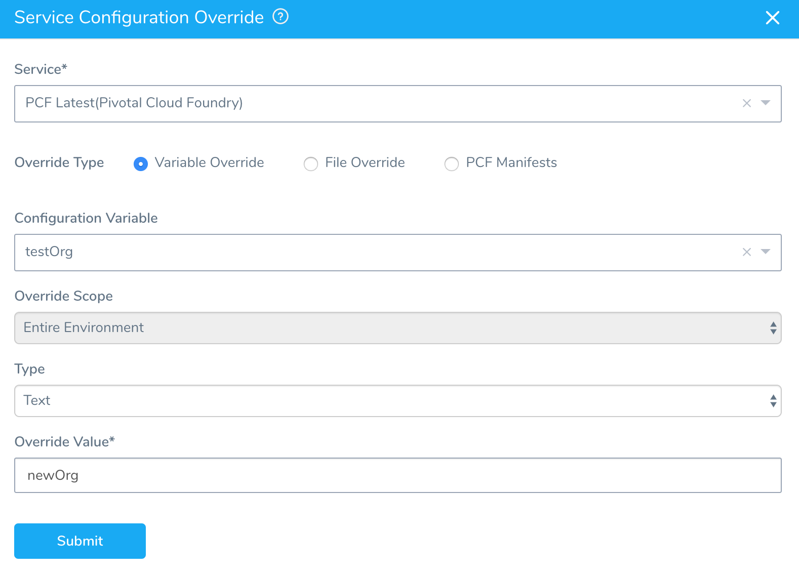
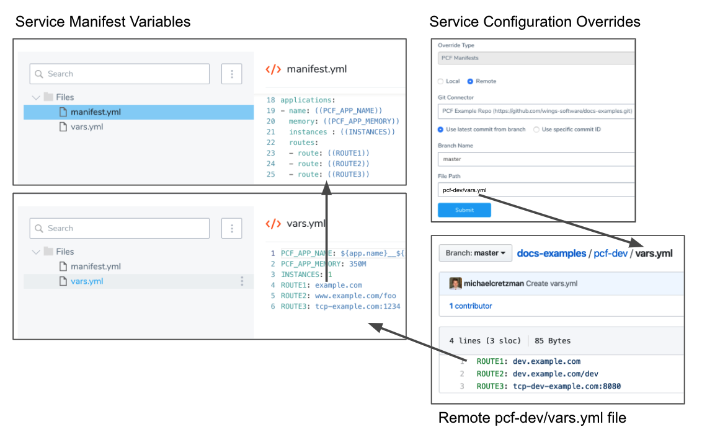
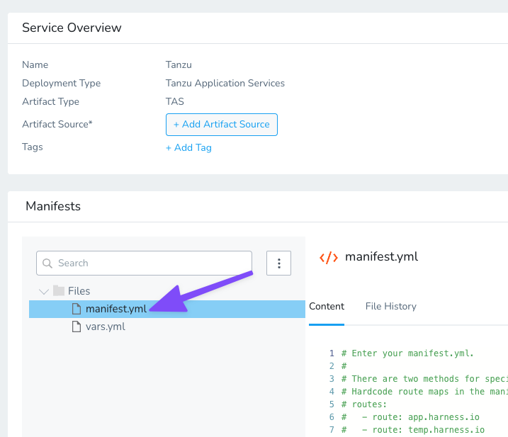

A Tanzu Application Service (formerly PCF) Service and Environment are used together when you set up a Harness Workflow to deploy your TAS app. You can configure your Environment to override settings of the Harness TAS Services that use the Environment, thereby making the Environment dictate TAS manifest values.

For example, a TAS Service uses a manifest.yml file that specifies specific routes, but an Environment might need to change the routes because it is deploying the app in the manifest to a QA space.

In this topic:

* [Before You Begin](https://docs.harness.io/article/r0vp331jnq-override-pcf-manifests-and-config-variables-and-files#before_you_begin)
* [Option 1: Variable Override](https://docs.harness.io/article/r0vp331jnq-override-pcf-manifests-and-config-variables-and-files#option_1_variable_override)
* [Option 2: TAS Manifests Override](https://docs.harness.io/article/r0vp331jnq-override-pcf-manifests-and-config-variables-and-files#option_2_tas_manifests_override)
	+ [Overwrite using Local Values](https://docs.harness.io/article/r0vp331jnq-override-pcf-manifests-and-config-variables-and-files#overwrite_using_local_values)
	+ [Overwrite using Remote Values](https://docs.harness.io/article/r0vp331jnq-override-pcf-manifests-and-config-variables-and-files#overwrite_using_remote_values)
* [Review: Multiple Manifests at the Highest Level will Fail Deployment](https://docs.harness.io/article/r0vp331jnq-override-pcf-manifests-and-config-variables-and-files#review_multiple_manifests_at_the_highest_level_will_fail_deployment)
* [Review: Variable Precedence](https://docs.harness.io/article/r0vp331jnq-override-pcf-manifests-and-config-variables-and-files#review_variable_precedence)
* [Next Steps](https://docs.harness.io/article/r0vp331jnq-override-pcf-manifests-and-config-variables-and-files#next_steps)

### Before You Begin

* See [Connect to Your Target Tanzu Account](/article/nh4afrhvkl).
* See [Define Your Tanzu Target Infrastructure](/article/r1crlrpjk4).

### Option 1: Variable Override

You can overwrite Service variables when one or more Services are paired with this Environment in a Workflow.

To overwrite a Service variable, do the following:

1. In the Harness Service, note the name of the Service variable in **Config Variables**.
2. In the Harness Environment, click **Service Configuration Override**. The **Service Configuration Override** dialog appears.
3. In **Service**, select the Harness Service that contains the variable you want to overwrite. If you select **All Services**, you will have to manually enter the name of the variable you want to overwrite. The following steps use a single Service.  
  
When you have selected a Service, the **Override Type** options appear.
4. Click **Variable Override**.
5. In **Configuration Variable**, select the variable you want to overwrite.
6. In **Override Scope**, the only option is **Entire Environment**, currently.
7. In **Type**, select **Text** or **Encrypted Text**.
8. In **Override Value**, if you selected **Text** in **Type**, enter a new value. If you selected **Encrypted Text**, select an existing Encrypted Text secret. Encrypted Text secrets are set up in Harness [Secrets Management](/article/au38zpufhr-secret-management).  
  
When you are done, the dialog will look something like this:
9. Click **Submit**. The override is added to the Environment:

### Option 2: TAS Manifests Override

The most commonly-used override is for TAS manifests. You can override the entire manifest.yml of a Service or any of its values.

To overwrite any property in an inline or remote manifest, the manifest.yml must use vars.yml for the property value.For example, if you hardcode `route: example.com` in your inline or remote manifest.yml, you cannot overwrite it in **Service Configuration Overrides**. You must use a variable like `route: ((ROUTE1))` in manifest.yml and then provide a value for the variable like `ROUTE1: example.com` in vars.yml.

For example, here are inline manifest.yml and vars.yml files using variables for routes. These variables are then overwritten in **Service Configuration Overrides**:

You can only perform one overwrite of a single Service. If you attempt to add a second overwrite of the same Service, you will receive this error: `Can’t add, this override already exists. Please use the edit button to update.`

To overwrite a TAS manifest, do the following:

1. In the Harness Service, note the name(s) of the Service vars.yml property in **Manifests** that you want to overwrite. If you are using remote manifest files, go to your remote repro and note the name(s).
2. In the Harness Environment, click **Service Configuration Override**. The **Service Configuration Override** dialog appears.
3. In **Service**, select the Harness Service that contains the variable you want to overwrite. If you select **All Services**, you will have to manually enter the name of the variable you want to overwrite. The following steps use a single Service.  
The **Override Type** options appear.
4. Click **TAS Manifests**.
5. Click **Local** or **Remote**. The steps for each option are below.

#### Overwrite using Local Values

You can overwrite values in the vars.yml configured in your Service. It does not matter if the vars.yml in your Service is inline and remote.

To overwrite the variable values configured in your Harness Service, you can simply enter the vars.yml variables you want to overwrite, and enter new values. Here is an example overwriting routes in an inline vars.yml:

#### Overwrite using Remote Values

Typically, a single manifest.yml is used in a Service and then remote vars.yml files are used to supply different variable values.

To overwrite manifest property values using remote files, you simply point to a remote Git folder that contains the manifest.yml or vars.yml files containing the new values.

For example, here is a Service with an inline manifest.yml and vars.yml, and it uses the remote Git repo folder **pcf-dev/vars.yml** file to overwrite the vars.yml values:

The remote vars.yml file does not need to supply all of the variables for the vars.yml file it is overwriting. You can simply overwrite the variables you want.

As you can see in the above example, the remote vars.yml file only overwrites the **routes** in the inline vars.yml file.

##### File Path

If the manifest you select is incorrect due to missing attributes or special characters, deployment will continue and Harness will use the next manifest available at Service level.

If the manifest you select is incorrect due to missing attributes or special characters, deployment will fail.

### Review: Multiple Manifests at the Highest Level will Fail Deployment

Currently, this feature is behind the feature flag `SINGLE_MANIFEST_SUPPORT`. Contact [Harness Support](mailto:support@harness.io) to enable the feature.Manifests can defined at the following levels, from highest to lowest priority:

1. **Environment level for a specific Service:** defined at Environment level with its scope set to a specific Service.
2. **Environment level for All Services:** defined at Environment level with its scope set to All Services.
3. **Service level manifest:** the app manifest set up in the Harness Service.See:
	* [Adding and Editing Inline Tanzu Manifest Files](https://docs.harness.io/article/3ekpbmpr4e)
	* [Upload Local and Remote Tanzu Resource Files](https://docs.harness.io/article/i5jxqsbkt7-upload-local-and-remote-pcf-resource-files)

Whenever manifests are present at multiple levels, the manifest present at the level having **highest priority** is set as the final manifest.

For example, if you have a manifest override defined at Environment level with its scope set to a specific Service, it is the final manifest. No other manifests in the Environment or Service will be used.

If there are multiple manifests at the level used by Harness (the highest level with a manifest set), Harness will fail deployment.

Harness performs this check for **Application Manifest** and **Autoscalar Manifest**. It does not apply to **Variable Manifests**.

### Review: Variable Precedence

If multiple variables of the same name are defined in different places, such as a Service's **Manifests** or **Config Variables** sections or an Environment's **Service Configuration Overrides** section, the variables get overwritten according to the following precedence, from highest to lowest:

1. **Service Configuration Overrides** variables for a specific Service are of the greatest precedence, and override all others.
2. **Service Configuration Overrides** variables for all Services.
3. Variables in a Service **Config Variables** section.
4. Variables defined in inline or remote files in Service **Manifests** section.

For more information, see [Override a Service Configuration](/article/n39w05njjv-environment-configuration#override_a_service_configuration).

Variable precedence is different from app or autoscalar manifest precedence.

#### App and Autoscalar Manifests Precedence

App and autoscalar manifests are defined at the following levels, from highest to lowest priority:

1. **Environment level for a specific Service:** defined at Environment level with its scope set to a specific Service.
2. **Environment level for All Services:** defined at Environment level with its scope set to All Services.
3. **Service level manifest:** the app manifest set up in the Harness Service.  
See:
	* [Adding and Editing Inline Tanzu Manifest Files](https://docs.harness.io/article/3ekpbmpr4e)
	* [Upload Local and Remote Tanzu Resource Files](https://docs.harness.io/article/i5jxqsbkt7-upload-local-and-remote-pcf-resource-files)

### Next Steps

* [Create a Basic Tanzu Deployment](/article/c92izkztka-create-a-basic-pcf-deployment)
* [Create a Canary Tanzu Deployment](/article/99bxiqfi1u-create-a-canary-pcf-deployment)
* [Create a Blue/Green Tanzu Deployment](/article/52muxcsr1v-create-a-blue-green-pcf-deployment)

