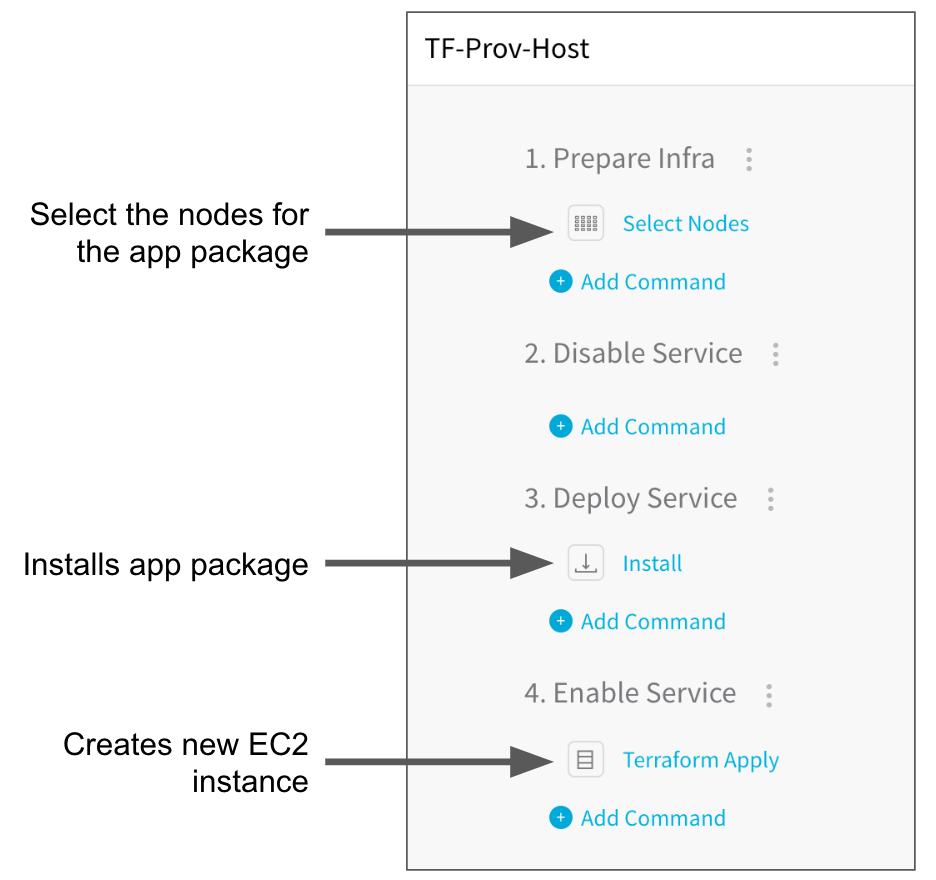
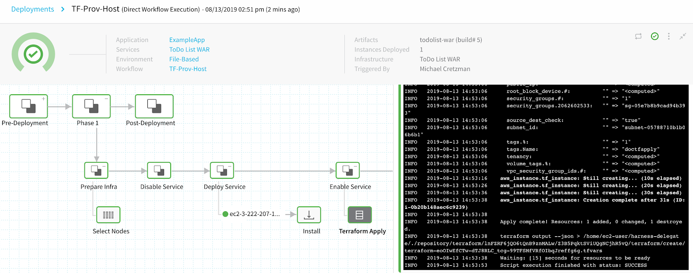
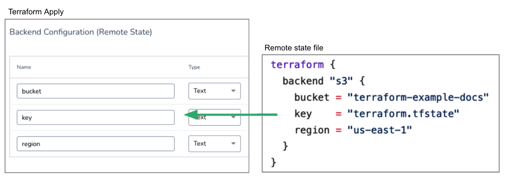

This topic describes how to use the Terraform Apply step to perform Terraform operations at any point in your Workflow.

### Before You Begin

Before reading about the Terraform Apply step, we recommend you read about the Harness Terraform Infrastructure Provisioner and related Terraform Provision step in [Provision using the Terraform Provision Step](/article/uxwih21ps1-terraform-provisioner-step). This will help you see the scope of Terraform support in Harness.

Also, setting up the Terraform Apply step is nearly identical to setting up the Terraform Provision step, and this document will not repeat the steps. 

### Review: Terraform Apply Overview

The Terraform Apply step performs a [terraform apply](https://www.terraform.io/docs/commands/apply.html) command using the Terraform template (config.tf) you set up in a Harness Terraform Infrastructure Provisioner.

Terraform Apply can be applied as an independent step to any Workflow. Terraform Apply steps can also be used together to perform multiple operations on the same infrastructure and Terraform workspace.

The Terraform Apply step is separate from the Terraform Provision step used in Pre-deployment steps in a Workflow, although you can have both in the same Workflow and have both run operations on the same infrastructure and Terraform workspace.

#### Terraform Apply and Workflow Rollback

Terraform Apply is intended for ad hoc provisioning anywhere in a Workflow. Consequently, the Terraform Apply step does not participate in a Workflow rollback when the Workflow fails.

Any provisioning performed by Terraform Apply is not rolled back. Only provisioning performed by the [Terraform Provision Step](/article/uxwih21ps1-terraform-provisioner-step) is rolled back.

To delete the ad hoc provisioned infrastructure in the case of a Workflow failure, add the Terraform Destroy step to the Workflow **Rollback Steps** section. See [Remove Provisioned Infra with Terraform Destroy](/article/4egyxnse9r-terraform-destroy).

#### What Can I do with Terraform Apply?

Terraform Apply can be used to perform the many tasks offered by [Terraform Providers](https://www.terraform.io/docs/providers/). For example:

* Provision infrastructure.
* Execute scripts on local and remote hosts.
* Copy files from one server to another.
* Query AWS for resource information.
* Push files to Git.
* Read data from APIs as JSON.
* Read image metadata from a Docker registry.
* Create a certificates for a development environment.
* Create DNS records.
* Inject containers with sensitive information such as passwords.

#### Terraform Apply and Terraform Provision Steps

Harness also includes a Terraform Provision step that uses a Harness Infrastructure Provisioner to provision target deployment infrastructure, but the Terraform Provision step has the following limitations: 

* Supported in Canary and Multi-Service Workflows only.
* Support for AMI Blue/Green Workflows only.
* May be applied in a Workflow's Pre-deployment Steps only and is intended to provision deployment target infrastructure.

The Terraform Apply step can be applied anywhere in your Workflow and can be used to perform most Terraform operations.

#### Using Terraform Apply with Terraform Provision

While it is not necessary to use the Terraform Apply step with the standard Terraform Provision step in your Workflow, using them together can be an efficient method for provisioning and managing resources. 

This scenario might involve the following steps:

1. The target environment is dynamically provisioned using the Terraform Provision step in the Pre-Deployment steps of your Workflow.
2. The Workflow deploys your application to the dynamically provisioned target infrastructure.
3. The Terraform Apply step performs operations on the deployed hosts, services, etc.

For information on the Terraform Provision step, see [Provision using the Terraform Provision Step](/article/uxwih21ps1-terraform-provisioner-step).

#### Target Platform Roles and Policies

If you use the Terraform Apply step to provision infrastructure on a target platform, such as AWS, the provisioning is performed by the Harness Delegate(s) in one of two ways:

* Provisioning is performed by the Delegate(s) associated with the Harness Cloud Provider specified in the Workflow Infrastructure Definition.
* Provisioning is performed by the Delegate(s) selected in the Terraform Apply step's **Delegate Selector** settings, described below.

The platform roles and policies needed to provision infrastructure must be present on the platform account used with the Delegate via Cloud Provider or the roles assigned to the Delegate host.

For example, if you want to provision AWS ECS resources, you would add the IAM roles and policies needed for creating AWS ECS resources to the account used by the Harness AWS Cloud Provider.

For a list of these roles and policies, see the related Terraform module for your target platform. For example, the [Terraform AWS ECS Cluster Required Permissions](https://registry.terraform.io/modules/infrablocks/ecs-cluster/aws/latest#required-permissions).

### Step 1: Create your Terraform Configuration File

In this example, we create an AWS EC2 instance as a completely separate function of a Basic Workflow whose primary function is to deploy an application package in EC2.

This example shows the independence of the Terraform Apply step, and how it can be used to augment any Workflow and perform independent functions.

This procedure assumes you have read about the Harness Terraform Infrastructure Provisioner and related Terraform Provision step in [Terraform Provisioning with Harness](/article/hh52ews03d-terraform-provisioning-with-harness). This will help you see the scope of Terraform support in Harness.Create your Terraform configuration file (config.tf) in your Git repo. The file used in this example creates an AWS EC2 instance using an AMI:


```
variable "region" {}  
variable "access_key" {}  
variable "secret_key" {}  
variable "tag" {}  
  
provider "aws" {  
  region  = "${var.region}"  
  access_key = "${var.access_key}"  
  secret_key = "${var.secret_key}"  
}  
  
resource "aws_instance" "tf_instance" {  
   subnet_id     = "subnet-05788710b1b06b6b1"  
   security_groups = ["sg-05e7b8bxxxxxxxxx"]  
   key_name        = "doc-delegate1"  
   ami           = "ami-0080e4c5bc078760e"  
   instance_type = "t2.micro"  
   associate_public_ip_address = "true"  
  tags {  
    Name = "${var.tag}"  
   }  
}
```
The access and secret keys will be provided when you add the Terraform Apply step to your Workflow. In Harness, you create secrets in Harness [Secrets Management](/article/au38zpufhr-secret-management) and then you can use them in other Harness components.

You can also use a Terraform Apply step with the [HashiCorp Vault](https://www.terraform.io/docs/providers/vault/index.html) provider to access Vault credentials for a Terraform configuration.

### Step 2: Add a Terraform Infrastructure Provisioner

In Harness, add a Terraform Infrastructure Provisioner that uses the Terraform configuration file. This process is described in detail in the [Add Terraform Scripts](/article/ux2enus2ku-add-terraform-scripts) topic.

Later, when you are adding the Terraform Apply step that uses this Terraform Infrastructure Provisioner, the inputs for your config.tf file are added. You can add tfvar files also. See [Provision using the Terraform Provision Step](/article/uxwih21ps1-terraform-provisioner-step).

Once your Terraform Infrastructure Provisioner is added, you can use it in the Terraform Apply step in your Workflow.

### Step 3: Add Terraform Apply to the Workflow

In your Workflow, in any section, click **Add Command**. The **Add Command** dialog appears.

In **Add Command**, select **Terraform Apply**. The **Terraform Apply** settings appear.

The steps for filling out the dialog are the same as those for the Terraform Provision step described in [Provision using the Terraform Provision Step](/article/uxwih21ps1-terraform-provisioner-step).

You simply select the Terraform Infrastructure Provisioner you set up earlier using the Terraform script, fill in the input values, and select other settings like Workspace.

Refer to [Provision using the Terraform Provision Step](/article/uxwih21ps1-terraform-provisioner-step) for details on each setting.

Let's look at an example where the Terraform Apply step is added as an independent step to a Workflow that deploys an application package (TAR file) to an EC2 instance.

The Workflow will deploy the application package as intended, and it will also execute the Terraform Apply step to create a separate EC2 instance.

The steps for installing the application package are described in the [Traditional Deployments](/article/6pwni5f9el) guide. Let's look at the Terraform Apply Step.

The Terraform script listed earlier will create an EC2 instance. This script is used by the Terraform Infrastructure Provisioner that the Terraform Apply step will use.

In the Terraform Apply step you supply the values for the input variables in the Terraform script.

Click **Populate Variables** and Harness will pull all of the input variables from the Terraform script you added to the Terraform Infrastructure Provisioner you selected.

It can table a moment to populate the variables.

You can see that the AWS access and secret keys are inputs in this configuration. You can use [Harness Secrets Management](https://docs.harness.io/article/au38zpufhr-secret-management) to provide encrypted text secrets in the Terraform Apply step.

When the Workflow is deployed, you can see the traditional deployment of the application package succeed and the Terraform Apply step executed successfully.

Here is the Terraform Apply step output (with some lines omitted):


```
Branch: master  
Normalized Path: create  
terraform init   
Initializing provider plugins...  
...  
* provider.aws: version = "~> 2.23"  
  
Terraform has been successfully initialized!  
...  
terraform apply -input=false tfplan  
  
aws_instance.tf_instance: Creating...  
  ami:                          "" => "ami-0080e4c5bc078760e"  
  arn:                          "" => "<computed>"  
  ...  
  instance_type:                "" => "t2.micro"  
	...  
  key_name:                     "" => "doc-delegate1"  
  ...  
  security_groups.#:            "" => "1"  
  security_groups.2062602533:   "" => "sg-05e7b8bxxxxxxxxx"  
  source_dest_check:            "" => "true"  
  subnet_id:                    "" => "subnet-05788710b1b06b6b1"  
  tags.%:                       "" => "1"  
  tags.Name:                    "" => "doctfapply"  
  tenancy:                      "" => "<computed>"  
  volume_tags.%:                "" => "<computed>"  
  vpc_security_group_ids.#:     "" => "<computed>"  
  
aws_instance.tf_instance: Still creating... (10s elapsed)  
  
aws_instance.tf_instance: Still creating... (20s elapsed)  
  
aws_instance.tf_instance: Still creating... (30s elapsed)  
  
aws_instance.tf_instance: Creation complete after 31s (ID: i-0b20b148aec6c9239)  
  
Apply complete! Resources: 1 added, 0 changed, 1 destroyed.  
  
terraform output --json > /home/ec2-user/harness-delegate/./repository/terraform/lnFZRF6jQO6tQnB9znMALw/Z3B5PqktSViUQgNCjhR5vQ/terraform/create/terraform-eoOIwEfCTw-dTJ8RLC_tcg-99TFSMfVRfOIbqJreffg6g.tfvars  
  
Waiting: [15] seconds for resources to be ready  
  
Script execution finished with status: SUCCESS
```
The output looks like a standard `terraform apply` output.

As you can see, the Terraform config.tf file was run on the Delegate using Terraform and created the AWS EC2 instance. This was all performed as an auxiliary step to the Workflow, showing the independence of the Terraform Apply step.

### Option: AWS Cloud Provider, Region, Role ARN

Currently, this feature is behind the Feature Flag `TERRAFORM_AWS_CP_AUTHENTICATION`. Contact [Harness Support](mailto:support@harness.io) to enable the feature.If you want to use a specific AWS role for this step's provisioning, you can select the AWS Cloud Provider, Region, and Role ARN. You can select any of these options, or all of them.

These options allow you to use different roles for different Terraform steps, such as one role for the Terraform Plan step and a different role for the Terraform Provision or Apply steps.

* **AWS Cloud Provider:** the AWS Cloud Provider selected here is used for authentication.  
At a minimum, select the **AWS Cloud Provider** and **Role ARN**. When used in combination with the AWS Cloud Provider option, the Role ARN is assumed by the Cloud Provider you select.  
The **AWS Cloud Provider** setting can be templated.You need to select an AWS Cloud Provider even if the Terraform Infrastructure Provisioner you selected uses a manually-entered template body. Harness needs access to the AWS API via the credentials in the AWS Cloud Provider.
* **Region:** the AWS region where you will be provisioning your resources. If not region is specified, Harness uses `us-east-1`.
* **Role ARN:** enter the Amazon Resource Name (ARN) of an AWS IAM role that Terraform assumes when provisioning. This allows you to tune the step for provisioning a specific AWS resource. For example, if you will only provision AWS S3, then you can use a role that is limited to S3.  
At a minimum, select the **AWS Cloud Provider** and **Role ARN**. When used in combination with the AWS Cloud Provider option, the Role ARN is assumed by the Cloud Provider you select.  
You can also use [Harness variable expressions](/article/9dvxcegm90-variables) in **Role ARN**. For example, you can create a Service or Workflow variable and then enter its expression in **Role ARN**, such as `${serviceVariables.roleARN}` or `${workflow.variables.roleArn}`.

#### Environment Variables

If you use the **AWS Cloud Provider** and/or **Role ARN** options, do not add the following environment variables in the step's **Environment Variables** settings:

* `AWS_ACCESS_KEY_ID`
* `AWS_SECRET_ACCESS_KEY`
* `AWS_SESSION_TOKEN`

Harness generates these keys using the the **AWS Cloud Provider** and/or **Role ARN** options. If you also add these in **Environment Variables**, the step will fail.

### Option: Inherit Configurations from Terraform Plan

You can use the **Inherit following configurations from Terraform Plan** setting to inherit the Terraform plan from a prior Terraform Provision step that has the **Set as Terraform Plan** option selected.

Harness runs the Terraform provision again and points to the plan, runs a Terraform refresh, then a plan, and finally executes the new plan. Technically, this is a different plan.

If you want use the actual plan because of security or audit requirements, in the prior Terraform Provision step select both the **Set as Terraform Plan** and **Export Terraform Plan to Apply Step**.

If you want to avoid the Terraform refresh, in your Terraform Infrastructure Provisioner, enable the **Skip Terraform Refresh when inheriting Terraform plan** setting. See [Skip Terraform Refresh When Inheriting Terraform Plan](/article/ux2enus2ku-add-terraform-scripts#option_2_skip_terraform_refresh_when_inheriting_terraform_plan).

### Option: Remote and Local State with Terraform Apply Step

In **Backend Configuration (Remote State)**, Harness enables you to use Terraform remote and local state files, and you can use multiple Terraform Apply steps with the same state files.

The general guidelines for using the same remote or local state files are:

* **Remote state files**: to use the same remote state file, Terraform Apply steps must use the **Backend Configuration (Remote state)** setting.
* **Local state files:** to use the same local state file, Terraform Apply steps must use the same Environment, Terraform Infrastructure Provisioner, and workspace. The Environment is specified when you create the Workflow that will contain the Terraform Apply step(s).

#### Using Remote State with Terraform Apply

To use the same remote state file, Terraform Apply steps must use the **Backend Configuration (Remote state)** setting and the same Terraform Infrastructure Provisioner.

You add the backend configs (remote state variables) for remote state in the **Backend Configuration (Remote state)** settings.

If you have two Terraform Apply steps that use the same Terraform Infrastructure Provisioner and the same workspace, then they are both using the same remote state file. 

A workspace is really a different state file. If you have two Terraform Apply steps that use the same Terraform Infrastructure Provisioner but different workspaces, then they are using separate state files.

For example, if you have a Pipeline with a Build Workflow containing a Terraform Apply step followed by a Canary Workflow containing a Terraform Apply step, in order for both steps to use the same remote state file, the following criteria must be met:

* Both Terraform Apply steps must use the same Infrastructure Provisioner.
* Both Terraform Apply steps must use the same workspace.

#### Using Local State with Terraform Apply

If you do not use the **Backend Configuration (Remote state)** setting, by default, Terraform uses the local backend to manage [state](https://www.terraform.io/docs/state/) in a local [Terraform language](https://www.terraform.io/docs/configuration/syntax.html) file named terraform.tfstate on the disk where you are running Terraform (typically, the Harness Delegate(s)). 

An individual local state file is identified by Harness using a combination of the Harness Environment, Terraform Infrastructure Provisioner, and workspace settings.

In fact, the local state is stored by Harness using an entity ID in the format EnvironmentID+ProvisionerID+WorkspaceName. This combination uses the Environment selected for the Workflow (or empty), and the Provisioner and workspace (or empty) selected in the **Terraform Apply** step.

For two Terraform Apply steps to use the *same* local state file, they must use the same criteria:

* Environment (via their Workflow settings).
* Terraform Infrastructure Provisioner.
* Workspace.

For example, let's imagine one Terraform Apply step in a Build Workflow with no Environment set up and another Terraform Apply step in a Canary Workflow that uses an Environment.

The local backend state file that was created in the first Terraform Apply step is not used by the second Terraform Apply step because they do not use the same Environment. In fact, the Build Workflow uses no Environment.

Consequently, a [Terraform Destroy](https://docs.harness.io/article/9pvvgcdbjh-terrform-provisioner#terraform_destroy) step in the Canary Workflow would not affect the Terraform local state created by the Build Workflow. In this case, it is best to use a separate Terraform Infrastructure Provisioner for each Terraform Apply step.

In order for a Terraform Destroy step to work, the **Provisioner** and **Workspace** settings in it must match those of the Terraform Apply step whose operation(s) you want destroyed. Consequently, it must also be part of a Workflow using the same Environment.

### Option: Additional Settings

There are additional settings for Targets, Workspace, Delegate Selectors, and Terraform Environment Variables.

These are the same settings you will find in the Terraform Provision step.

For details on these features, see [Provision using the Terraform Provision Step](/article/uxwih21ps1-terraform-provisioner-step).

### Option: Local State and Delegates

If the local state file criteria described above are met, Harness ensures that the same local state file is used regardless of which Harness Delegate performs the deployment.

You might have multiple Delegates running and a Workflow containing a Terraform Apply step that uses a local state file. Harness manages the local state file to ensure that if different Delegates are used for different deployments of the Workflow, the same local state file is used. 

This allows you to deploy a Workflow, or even multiple Workflows, using the same local state file and not worry about which Delegate is used by Harness.

If you like, you can ensure that Terraform Apply steps use the same Delegate using the [Delegate Selector](https://docs.harness.io/article/9pvvgcdbjh-terrform-provisioner) setting in the Terraform Apply steps.

### Option: Terraform Environment Variables

If the Terraform script used in the Terraform Infrastructure Provisioner you selected uses environment variables, you can provide values for those variables here.

For any environment variable, provide a name, type, and value.

Click **Add**.

Enter a name, type, and value for the environment variable. For example: **TF\_LOG**, **Text**, and `TRACE`.

If you select Encrypted Text, you must select an existing Harness [Encrypted Text secret](/article/ygyvp998mu-use-encrypted-text-secrets).

You can use Harness [Workflow variables](/article/766iheu1bk-add-workflow-variables-new-template) and [expression variables](/article/9dvxcegm90-variables) for the name and value.

### Terraform Plan Human Readable

Harness provides expressions to view the plan in a more human readable format:

* `${terraformApply.tfplanHumanReadable}`
* `${terraformDestroy.tfplanHumanReadable}`

### Next Steps

* [Infrastructure Provisioners Overview](/article/o22jx8amxb-add-an-infra-provisioner)
* [Secrets Management](/article/au38zpufhr-secret-management)

 

