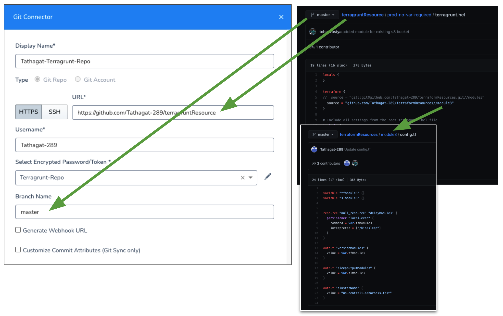

The first step in integrating your Terragrunt files and processes is setting up the necessary Harness account components: Delegates, Cloud Providers, and Source Repo Providers.

This topic describes how to set up these components for Terragrunt.

Once your account is set up, you can begin integrating your Terragrunt files. See [Add Terragrunt Configuration Files](/article/mkjxbkglih-add-terragrunt-configuration-files).

In this topic:

* [Before You Begin](https://docs.harness.io/article/ulhl7sjxva-set-up-your-harness-account-for-terragrunt#before_you_begin)
* [Visual Summary](https://docs.harness.io/article/ulhl7sjxva-set-up-your-harness-account-for-terragrunt#visual_summary)
* [Step 1: Set Up Harness Delegates](https://docs.harness.io/article/ulhl7sjxva-set-up-your-harness-account-for-terragrunt#step_1_set_up_harness_delegates)
	+ [Delegate Selectors](https://docs.harness.io/article/ulhl7sjxva-set-up-your-harness-account-for-terragrunt#delegate_selectors)
	+ [Permissions](https://docs.harness.io/article/ulhl7sjxva-set-up-your-harness-account-for-terragrunt#permissions)
* [Step 2: Install Terragrunt and Terraform on Delegates using Delegate Profiles](https://docs.harness.io/article/ulhl7sjxva-set-up-your-harness-account-for-terragrunt#step_2_install_terragrunt_and_terraform_on_delegates_using_delegate_profiles)
* [Step 3: Set Up the Cloud Provider](https://docs.harness.io/article/ulhl7sjxva-set-up-your-harness-account-for-terragrunt#step_3_set_up_the_cloud_provider)
* [Step 4: Connect Harness to Your Script Repo](https://docs.harness.io/article/ulhl7sjxva-set-up-your-harness-account-for-terragrunt#step_4_connect_harness_to_your_script_repo)
* [Next Steps](https://docs.harness.io/article/ulhl7sjxva-set-up-your-harness-account-for-terragrunt#next_steps)

### Before You Begin

* [Harness Key Concepts](https://docs.harness.io/article/4o7oqwih6h-harness-key-concepts)
* Get an overview of how Harness integrates Terragrunt: [Terragrunt Provisioning with Harness](/article/a6onutvbem-terragrunt-provisioning-with-harness).
* [Delegate Installation and Management](https://docs.harness.io/article/h9tkwmkrm7-delegate-installation)
* [Add Cloud Providers](https://docs.harness.io/article/whwnovprrb-cloud-providers)
* [Add Source Repo Providers](https://docs.harness.io/article/ay9hlwbgwa-add-source-repo-providers)

### Visual Summary

Here's a 6 minute video walkthrough of Harness-Terragrunt integration that shows how each component is used:

<!-- Video:
https://harness-1.wistia.com/medias/rpv5vwzpxz-->
<docvideo src="https://www.youtube.com/embed/HYSi2LAaYdc?feature=oembed" />

### Step 1: Set Up Harness Delegates

A Harness Delegate performs the Terragrunt provisioning in your Terragrunt files. When installing the Delegate for Terragrunt provisioning, consider the following:

* The Delegate should be installed where it can connect to the target infrastructure. Ideally, this is the same subnet.
* The Delegate should have Terragrunt and Terraform installed on its host. For details on supported versions, see [Terragrunt Provisioning with Harness](/article/a6onutvbem-terragrunt-provisioning-with-harness).
* If you are provisioning the subnet dynamically, then you can put the Delegate in the same VPC and ensure that it can connect to the provisioned subnet using security groups.
* The Delegate must also be able to connect to your file repo. The Delegate will pull the files and related scripts at deployment runtime.
* While all Harness Delegates can use Terragrunt, you might want to select a Delegate type (Shell Script, Kubernetes, ECS, etc) similar to the type of infrastructure you are provisioning.
	+ If you are provisioning AWS AMIs and ASGs, you'll likely use Shell Script Delegates on EC2 instances or ECS Delegates.
	+ If you are provisioning Kubernetes clusters, you will likely use Kubernetes Delegates.
1. To install a Delegate, follow the steps in [Delegate Installation and Management](https://docs.harness.io/article/h9tkwmkrm7-delegate-installation). Once the Delegate is installed, it will be listed on the Harness Delegates page.

#### Delegate Selectors

If needed, add a Delegate Selector to your Delegates. When you add a **Terragrunt** **Provisioner** step to your Harness Workflows, you can use the Delegate Selector to ensure specific Delegates perform the operations.

If you do not specify a Selector in the **Terragrunt** **Provisioner** step, Harness will try all Delegates and then assign the Terragrunt tasks to the Delegates with Terragrunt installed.

To add Selectors, see [Delegate Installation and Management](https://docs.harness.io/article/h9tkwmkrm7-delegate-installation).

#### Permissions

The Harness Delegate requires permissions according to the deployment platform and the operations of the Terragrunt and Terraform scripts.

In many cases, all credentials are provided by the account used to set up the Harness Cloud Provider.

In some cases, access keys, secrets, and SSH keys are needed. You can add these in Harness [Secrets Management](https://docs.harness.io/article/au38zpufhr-secret-management). You can then select them in the **Terragrunt** **Provisioner** step in your Harness Workflows.

For ECS Delegates, you can add an IAM role to the ECS Delegate task definition. For more information, see  [Trust Relationships and Roles](https://docs.harness.io/article/h9tkwmkrm7-delegate-installation#trust_relationships_and_roles).

### Step 2: Install Terragrunt and Terraform on Delegates using Delegate Profiles

The Delegate should have Terragrunt and Terraform installed on its host. For details on supported versions, see [Terragrunt Provisioning with Harness](/article/a6onutvbem-terragrunt-provisioning-with-harness).

You can install Terragrunt and Terraform on the Delegate using Delegate Profiles.

For example, here is a Delegate Profile script to install Terragrunt and Terraform:


```
##terraform update  
set +x  
apt-get update  
apt-get install wget  
apt-get -y install git  
wget https://releases.hashicorp.com/terraform/0.13.3/terraform_0.13.3_linux_amd64.zip apt-get install unzip  
unzip terraform_0.13.3_linux_amd64.zip  
cp terraform /usr/bin/  
terraform --version  
  
wget https://github.com/gruntwork-io/terragrunt/releases/download/v0.28.0/terragrunt_linux_amd64  
mv terragrunt_linux_amd64 terragrunt  
chmod u+x terragrunt  
mv terragrunt /usr/local/bin/terragrunt  
terragrunt --version
```
See [Run Scripts on Delegates using Profiles](/article/yd4bs0pltf-run-scripts-on-the-delegate-using-profiles).

The Delegate needs to be able to obtain any providers you specify in modules. For example, `provider "acme"`. On the Delegate, Terraform will download and initialize any providers that are not already initialized.

### Step 3: Set Up the Cloud Provider

Add a Harness Cloud Provider to connect Harness to your target platform (AWS, Kubernetes cluster, etc).

Later, when you use Terragrunt to define a Harness Infrastructure Definition, you will also select the Cloud Provider to use when provisioning.

When you create the Cloud Provider, you can enter the platform account information for the Cloud Provider to use as credentials, or you can use the Delegate(s) running in your infrastructure to provide the credentials for the Cloud Provider.

If you are provisioning infrastructure on a platform that requires specific permissions, the account used by the Cloud Provider needs the required policies. For example, to create AWS EC2 AMIs, the account needs the **AmazonEC2FullAccess** policy. See the list of policies in [Add Cloud Providers](https://docs.harness.io/article/whwnovprrb-cloud-providers).

When the Cloud Provider uses the installed Delegate for credentials (via its Delegate Selector), it assumes the permissions/roles used by the Delegate (service accounts, etc).

### Step 4: Connect Harness to Your Script Repo

To use your Terragrunt and Terraform files in Harness, you host the files in a Git repo and add a Harness Source Repo Provider that connects Harness to the repo. For steps on adding the Source Repo Provider, see [Add Source Repo Providers](https://docs.harness.io/article/ay9hlwbgwa-add-source-repo-providers).

Here is an example of a Source Repo Provider and the GitHub repo for Terragrunt. The Terragrunt configuration file in the repo points to a Terraform module in another repo.



### Next Steps

* [Add Terragrunt Configuration Files](/article/mkjxbkglih-add-terragrunt-configuration-files)

