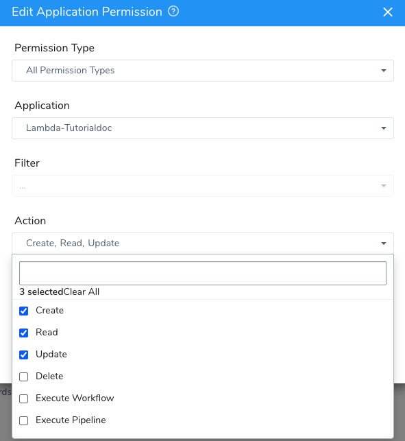
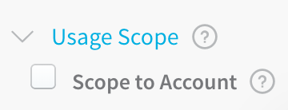
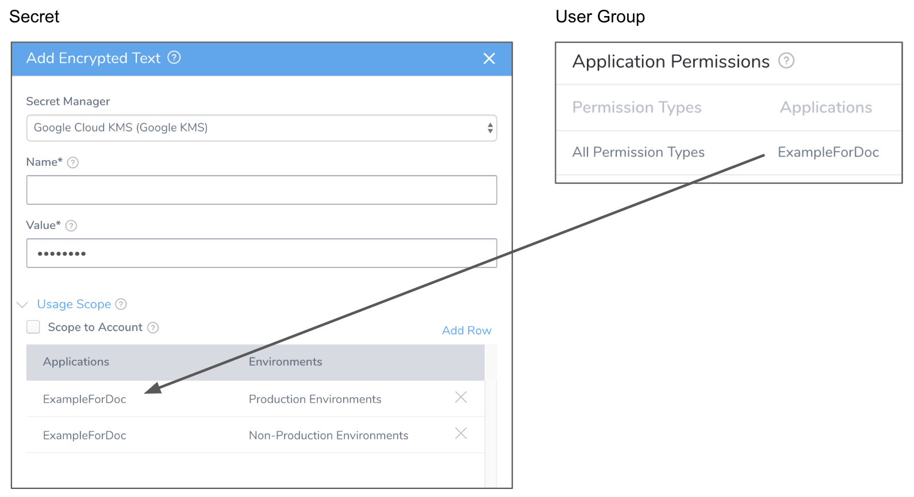

Harness secrets are restricted to the scope of their Secret Managers. They cannot be used outside of their Secrets Managers' scope. See [Scope Secret Managers to Applications and Environments](scope-secret-managers-to-applications-and-environments.md).

You can further limit the scope of a secret within the scope of its Secret Manager. You can restrict the usage of a secrets to specific Harness User Groups, Harness Applications, and Environments.

Also, you can scope a secret to be used in a [Harness Delegate Profile](../../account/manage-delegates/use-a-secret-in-a-delegate-profile.md) only.

This topic discusses how a secret's scope is determined, and how to further limit its scope from that of its Secrets Manager.

In this topic:

* [Before You Begin](#before_you_begin)
* [Review: Secret Scope](#review_secret_scope)
* [Option 1: Scope to Account](#option_1_scope_to_account)
* [Option 2: Applications and Environments](#option_2_applications_and_environments)
* [Next Steps](#next_steps)

### Before You Begin

* See [Harness Key Concepts](../../../starthere-firstgen/harness-key-concepts.md).
* See [Secrets Management Overview](secret-management.md).

### Review: Secret Scope

When creating secrets, it's important to understand their scope in your Harness account.

Harness secrets are managed and scoped using the following settings:

* Harness User Group Account Permission **Manage Secrets**:
	+ Required to add secrets for Account-level settings (Cloud Providers, Connectors, etc) and to any Applications on which the user has the Application Permissions **Create**, **Read**, and **Update**.  
	If this permission is not enabled, the users within the User Groups will be able to view the secrets only.
* Harness User Group **Application Permissions**:
	+ Add the Actions **Create**, **Read**, and **Update** to the Applications and Environments where Users in the User Group may use secrets.

* **Secret Manager Usage Scope**—When you create a Harness Encrypted Text or File secret, you select the Secret Manager for the secret. By default, Harness secrets inherit the same scope as the secret manager where they are stored. See [Scope Secret Managers to Applications and Environments](scope-secret-managers-to-applications-and-environments.md).
* **Secret** **Usage Scope**—Each secret has **Usage Scope** settings for Applications and Environments. For Encrypted Text and Files, you also have **Scope to Account**:  
You have two options:
	+ **Scope to Account:** Use allows the secret to be used in a Harness [Delegate Profile](../../account/manage-delegates/delegate-installation.md) only.
	+ **Applications and Environments:** Scope the usage to specific Applications and their Production and Non-Production Environments.

If you choose to apply scoping rules to a secret, then the Applications and Environments in the secret's scope must be entirely contained within the scope applied to its Secrets Manager. See [Scope Secret Managers to Applications and Environments](scope-secret-managers-to-applications-and-environments.md).Since User Group permissions are the broadest method for controlling secret usage, set those permissions first.

A user can only create a secret according to the scope set by its Harness User Group Account and Application permissions.

For example, if you have access to Application A only, you can create a secret scoped to Application A.

If you have access to Application A and B, you may still narrow the secret's scope to Application A, B, or both.

If the scope of a secret is only Application A, then only users with Read permission for Application A may see that secret. Users with Write permission to Application A may edit it also.

The following table explains the secret Usage Scope options and how they apply to Harness RBAC:

|  |  |
| --- | --- |
| Usage Scope Scenario | Result |
| **Scope to Account** is selected. | The secret can be used in a Harness [Delegate Profile](../../account/manage-delegates/delegate-installation.md) only.The secret can be managed by members of User Groups with the following [Account Permission](../access-management-howtos/users-and-permissions.md) enabled:* **Manage Secrets**

Or the following Application Permission:* **All Permissions Types** and all items under **Action**
 |
| **No Usage Scope**:* **Scope to Account** is not selected.
* No Application and Environment are selected.
 | The secret can be used in a Harness [Delegate Profile](../../account/manage-delegates/delegate-installation.md) only.The secret can be managed by members of User Groups with the following [Account Permission](../access-management-howtos/users-and-permissions.md) enabled:* **Manage Secrets**
 |
| A single Application and Environment are selected. | The secret can be used in that Application and Environment.The secret cannot be used in a Harness [Delegate Profile](../../account/manage-delegates/delegate-installation.md).The secret can only be managed by the user that created it, and members of User Groups with the following [Account Permission](../access-management-howtos/users-and-permissions.md) enabled:* **Manage Secrets**

If the Environment is deleted from your Harness Application, the secret will revert to **No Usage Scope**. |
| Multiple or All Applications and Environments are selected. | The secret can be used in those Applications and Environments.The secret cannot be used in a Harness [Delegate Profile](../../account/manage-delegates/delegate-installation.md).The secret can only be managed by the user that created it, and members of User Groups with the following [Account Permission](../access-management-howtos/users-and-permissions.md) enabled:* **Manage Secrets**
 |

### Option 1: Scope to Account

If your Harness User account is part of a User Group with the **Manage Secrets** Account Permission enabled, you will see the **Scope to Account** option in the Encrypted Text and File dialogs.

Select **Scope to Account** to make this encrypted file secret available to Delegate Profile scripts only. Only secrets scoped to the account are available to use in Delegate Profiles.

For more information, see [Managing Users and Groups (RBAC)](../access-management-howtos/users-and-permissions.md) and [Delegate Profiles](../../account/manage-delegates/delegate-installation.md#delegate-profiles).

### Option 2: Applications and Environments

You might want to restrict which Harness User Groups can use a secret. Restrictions are set up using the secret's Usage Scope and the User Group's Application Permissions.

For example, in the following image, the **Usage Scope** of the secret is limited to the **ExampleForDoc** Application, and a User Group's **Application Permissions** are also limited to **ExampleForDoc**:

This limits the User Group to using only that secret (assuming that no other secrets **Usage Scopes** include **ExampleForDoc**).

it is important to remember that in order for a user to use the secret, the user's User Group must also have **Applications Permissions** (Create, Read, Update) set for the same Applications and Environments (or all Applications and Environments).

If you select the **Scope to Account** setting, the secret can be used in a Delegate Profile, as described in [Using Secrets](secret-management.md#using-secrets).

