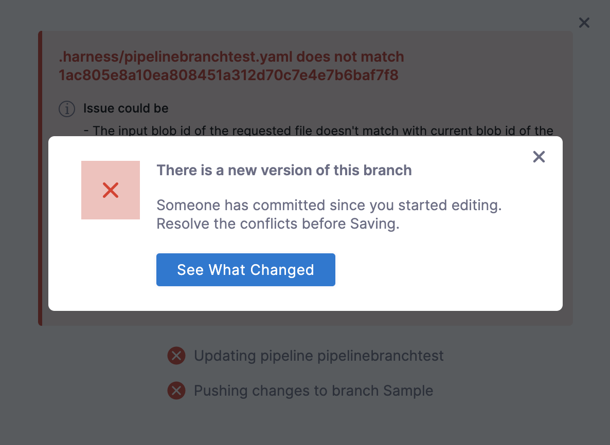

Entity caching reduces delays in loading your remote entities on the Harness UI. Caching is especially useful when there are multiple-level nestings like pipeline templates, stage templates, and step templates. Loading such multiple-level nestings can be time consuming involving numerous network calls, there by reducing the performance.

Harness maintains a local cache of the remote entities there by improving their load time on the UI similar to the inline entities.

Harness uses cache to save and load the following entities:
- Remote pipelines
- Remote templates

:::note
The Git cache is only used to render entities faster on the Harness UI, not to improve pipeline execution. Harness always fetches entities from Git during pipeline executions to avoid using the stale data.
:::

You can reload the entities from Git and update cache any time. 

## Entity cache lifecycle 

Harness UI uses the following cache lifecycle to render any remote entity:
1. The first time you load a remote entity on Harness, it fetches it from Git, renders it on the UI, and updates the cache. Harness loads this entity from the cache after this.
2. Harness indicates an active cache with a green tick if an entity's cache has been updated in the last two hours.

    

   When any entity's cache was last updated more than 2 hours ago, Harness displays an orange tick against it indicating a stale cache.

   

   Click on the refresh option to refresh cache.

   

3.  Harness clears the cache for any entity that hasn't been loaded on the Harness UI in the previous 72 hours. The entity is loaded from Git after cleanup, and Harness updates its cache.
   
## Caching entities saved on multiple branches

To ensure isolation between caches for different pipelines for different branches, cache for each entity is maintained separately for each branch. 
For example, if you have a stage template saved in separate branches in Git, Harness maintains a separate cache corresponding to each branch for the stage template. When this cache step is encountered during your pipeline execution, the cache corresponding to a unique key is requested from the server. The server then looks for a cache with this key and returns the cache (if available). 

## Committing changes

When you commit changes to an entity that has been cached, Harness displays a warning if the cached version of the entity differs from that in Git.
To view the differences, click **See What Changed**.

You can do one of the following when there are differences:
- Commit your changes from the UI and override the configurations in Git.
- Discard your changes done on the UI and reload the configurations from Git.

