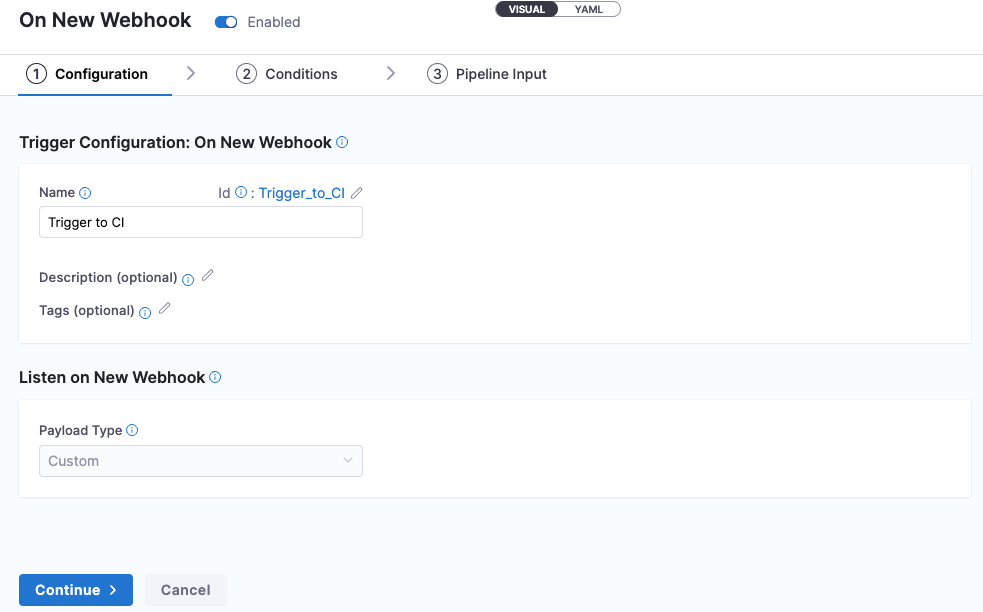

You can use a custom webhook trigger when passing an image from a non-Harness CI system. 

## Before you begin

Make sure you have: 
* A pipeline with a CD stage
* An artifact in an artifact repository

## Configure runtime input for your artifact tag and image path for a stage.

1. Edit the **Service** of a desired stage in a pipeline.
2. In the **Edit Service** page, edit the **Artifacts** section using the pencil icon.
   
   

3. In **Artifact Location** > **Artifact Details**, select **Runtime input** for **Image Path** and **Tag** fields.
   
   

4. Click **Submit**.
   
## Create a custom trigger.

1. In your Harness pipeline, click **Triggers**.
2. Click **New Trigger**.
3. In **Webhook**, select **Custom**.
   
    

4. Name the new trigger and click **Continue**.
   
    

5. Specify the **Conditions** for running the pipeline and click **Continue**. 
   
    For example, execute pipeline if the source/target branch name matches a pattern.

    

6. In **Pipeline Input**, define payload fields so that Harness can map them to the **Image Path** and **Tag** fields.

    

7. Click **Create Trigger**. 
   
## Trigger the pipeline from an thrid-party CI system.

1. Copy and paste the webhook trigger payload as a cURL command on an editor and edit the body fields.

    

    Sample cURL command with image and tag fields:
   
    ```
    curl -X POST -H 'content-type: application/json' -H 'X-Api-Key: sample_api_key' --url 'https://app.harness.io/gateway/pipeline/api/webhook/custom/v2?accountIdentifier=<your_account_identifier>&orgIdentifier=default&projectIdentifier=CD_Docs&pipelineIdentifier=Container&triggerIdentifier=Trigger_to_CI' -d '{"image": "library/nginx", "tag":"stable"}'
    ```

    :::note
    The `-H 'X-Api-Key: sample_api_key'` parameter is used to authorize custom triggers. You can use [Harness API keys](../4_Role-Based-Access-Control/7-add-and-manage-api-keys.md) with this parameter. This is described below in [Custom trigger authorization using API keys](#custom-trigger-authorization-using-api-keys).
    :::
        
    :::note
    We recommend that you use VSCode editor or Sublime to edit payload information to avoid format issues.
    :::

2. Run the updated cURL command on Terminal. 

    Sample success message:
 
    ```
    {
        "status":"SUCCESS",
        "data":{
            "eventCorrelationId":"<event_correlation_id>",
            "apiUrl":"https://app.harness.io/gateway/pipeline/api/webhook/triggerExecutionDetails/<event_correlation_id>?accountIdentifier=<account_identifier>",
            "uiUrl":"https://app.harness.io/ng/#/account/<account_identifier>/cd/orgs/default/projects/CD_Docs/deployments?pipelineIdentifier=<pipeline_name>&page=0",
            "uiSetupUrl":"https://app.harness.io/ng/#/account/<account_identifier>/cd/orgs/default/projects/CD_Docs/pipelines/<pipeline_name>/pipeline-studio/"
        },
        "metaData":null,
        "correlationId":"<correlation_id>"
    }
    ```
   
3. Go to Harness **Deployments** to see the pipeline triggered by your custom webhook trigger.