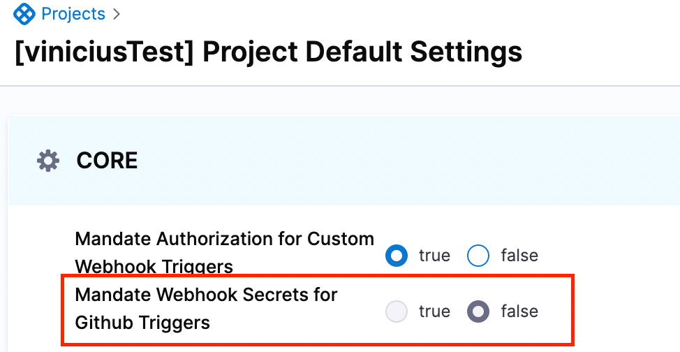
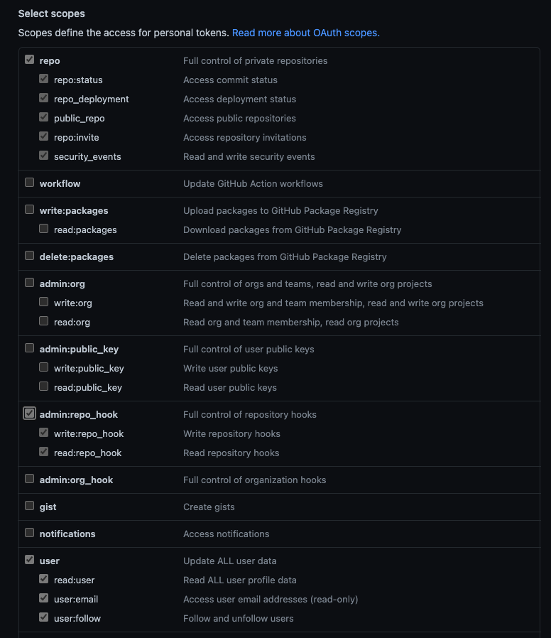
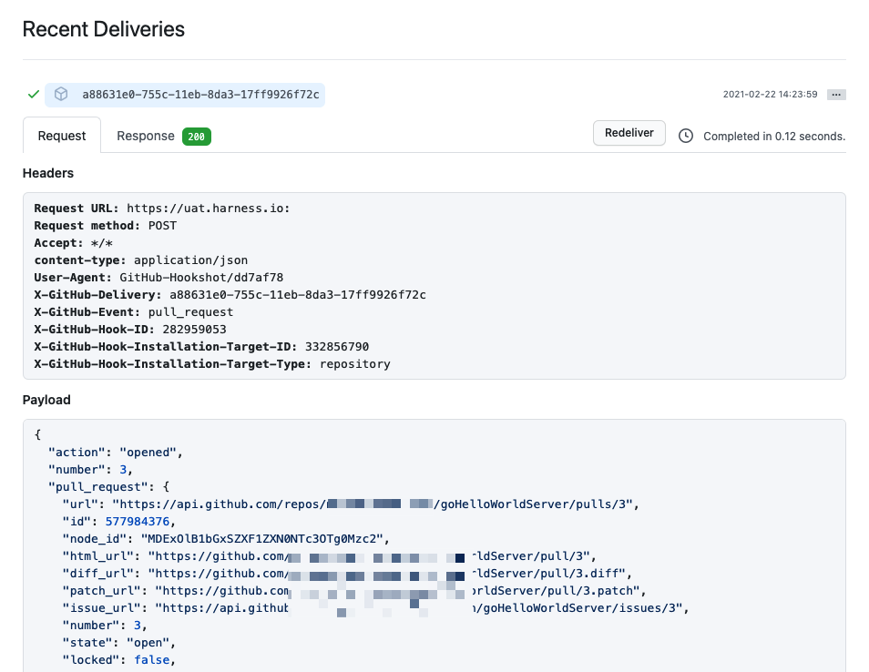

You can trigger pipelines in response to Git events automatically.

For example, when a pull request or push event occurs on a Git repo, a CI or CD pipeline can execute.

Triggers enable event driven CI/CD and support the practice of every commit building and/or deploying to a target environment.

:::note
For general Triggers reference, see [Triggers Reference](../8_Pipelines/w_pipeline-steps-reference/triggers-reference.md).

:::

## Important notes

* Currently, Harness supports Git-based Triggers for the most common Git providers. Harness includes a Custom Trigger for other repo providers.
* In Harness, you can select who is able to create and use Triggers within Harness, but you must use your repos' RBAC to control who can initiate the Git events that start the Harness Trigger.

## Visual summary

Here's a two minute video showing you how to create and run a Trigger in response to Git events.

<!-- Video:
https://www.youtube.com/watch?v=y8s351IJLXw-->
<docvideo src="https://www.youtube.com/watch?v=y8s351IJLXw" />

## Set up your codebase

For a Trigger to process Git events, the pipeline must have a Codebase object that points to the Git repo that sends the events.

The first Build Step in your pipeline specifies the codebase to build. If your pipeline doesn't include a Build Step, click **Add Stage**, select **Build**, and specify the Codebase. Select **Clone Codebase** and specify the Connector and source repo for the events.

To edit an existing Codebase, click **Codebase** on the right side of the pipeline Studio.

See [Create and Configure a Codebase](../../continuous-integration/use-ci/codebase-configuration/create-and-configure-a-codebase.md).

## Add a trigger to a pipeline

You add triggers in the pipeline Studio, in **Triggers**.

1. Open your Harness pipeline in pipeline Studio.
2. Click **Triggers**.
3. Click **New Trigger**.
4. Click one of the Git-based Trigger types. In this example, we'll use GitHub.

## Set up webhook listener

1. Enter a name for the Trigger.
2. In **Payload Type**, select your Git provider. This setting is populated with the provider you selected automatically.
3. Select or create a Connector to the Git account for the Trigger repo. See [Code Repo Connectors](/docs/category/code-repo-connectors).
   
   * **If you set up an account-level Code Repo Connector:** in **Repository Name**, enter the name of the repo in the account in the Connector.
   * **If you set up a repo-level Code Repo Connector:** the repo name cannot be edited.
  
  :::note

  Git webhook triggers do not support generic Git connectors. You must create provider-specific connectors for each provider (Github, GitLab, Bitbucket, etc) to use them with webhook triggers. For information on each Git provider connector, go to [Connect to a Git Repo](https://developer.harness.io/docs/platform/Connectors/Code-Repositories/connect-to-code-repo).

  :::

4. In **Event**, select the Git event for the Webhook.
   
   If the event you select results in the **Actions** settings appearing, select the actions for the Webhook or select **Any Actions**.

For details on these settings, see [Triggers Reference](../8_Pipelines/w_pipeline-steps-reference/triggers-reference.md).

:::note
For details on the payloads of the different repo Webhooks, see GitHub [Event Types & Payloads](https://docs.github.com/en/developers/webhooks-and-events/webhooks/webhook-events-and-payloads), Bitbucket [Event Payloads](https://confluence.atlassian.com/bitbucket/event-payloads-740262817.html), and Gitlab [Events](https://docs.gitlab.com/ee/user/project/integrations/webhooks.html#events).

:::

## Auto abort previous execution

Use this option if you want to override active pipeline executions whenever the branch is updated.

If you select this option, when the branch you specified in the **Connector** is updated, then any active pipeline executions using the branch and this Trigger are cancelled.

The updated branch will initiate a new Trigger execution.

Use the following combinations as criteria to identify similar active pipeline executions for a **Pull Request** event.
* Account identifier
* Org identifier
* Project identfier
* Pipeline identifier
* Repository URL
* PR number
* Source branch
* Target branch

Use the following combinations as criteria to identify similar active pipeline executions for a **PUSH** event.
* Account identifier
* Org identifier
* Project identfier
* Pipeline identifier
* Repository URL
* Ref

Ref is the value of **ref** from the Git push webhook payload.

## Configure secret

In **Configure Secret**, you can select a secret for authenticating the webhook call.

For the secret to work with your webhook, you need to configure the repository webhook with the same secret.

### Enforcing authentication

To enforce authentication for all webhook triggers in this project, you can use the **Default Settings** for the project.

1. In your project, click **Project Setup**, and then click **Default Settings**.
2. In **Core**, set **Mandate Webhook Secrets for Github Triggers** to **true**.

Now all Github webhooks for this project must be authenticated. All Github triggers in the project must be configured with a secret, and the corresponding webhooks in the Github repos must be configured with the corresponding secret. A secret manager with a delegate selector will use the corresponding delegate to decrypt it.

## Polling frequency

:::note
Currently, this feature is only available for Github webhooks and is behind the feature flag `CD_GIT_WEBHOOK_POLLING`. Contact [Harness Support](mailto:support@harness.io) to enable the feature. By default, Harness Git-based triggers listen to Git events using webhooks. 

:::

Sometimes webhook events can be missed due to a firewall or a network issue and cannot reach Harness.

To prevent webhook issues from happening, enter an polling interval in **Polling Frequency**.

Permitted values:

* minimum value: `2m`.
* maxium value: `1h`.

You will also need to enter the Github's webhook Id in **Webhook Id**, which can be found in your Github webhook settings page:

<docimage path={require('./static/752891ea2d0d9bcee2511ad039994271c20f002eb525570b5bc8038915b85da1.png')} width="60%" height="60%" title="Click to view full size image" />  

## Set trigger conditions

Conditions specify criteria in addition to events and actions.

Conditions help to form the overall set of criteria to trigger a pipeline based on changes in a given source.

For example:

* Execute pipeline if the source/target branch name matches a pattern.
* Execute pipeline if the event is sent for file changes from specific directories in the Git repo. This is very useful when working with a monorepo (mono repository). It ensures that only specific pipelines are triggered in response to a change.

Conditions support Harness built-in expressions for accessing Trigger settings, Git payload data and headers.

JEXL expressions are also supported.

For details on these settings, see [Triggers Reference](../8_Pipelines/w_pipeline-steps-reference/triggers-reference.md).

:::note
Conditions are ANDed together (boolean AND operation). All Conditions must match an event payload for it to execute the Trigger.

:::

## Set pipeline input

Pipelines often have [Runtime Inputs](../20_References/runtime-inputs.md) like codebase branch names or artifact versions and tags.

1. Provide values for the inputs. You can also use [Input Sets](../8_Pipelines/input-sets.md).
2. Click **Create Trigger**.

The Trigger is now added to the Triggers page.

## Automatic webhook registration

When you create or edit the Trigger, Harness registers the webhook in your Git provider automatically. You don't need to copy it and add it to your repo webhooks. However, make sure you have the following permission for GitHub Personal Access Token for automatic webhook registration to work:

* **Scopes:** select all the **repo**, **user**, and **admin:repo\_hook** options

You should also be repo admin.

## Test trigger

Make a change on the repo and see if it executes the Trigger. For example, change a file, commit it on a branch, and make a pull request.

1. In your Git provider repo, you can see that the request and response were successful.
   
   
2. In Harness, view the pipeline execution.
3. In Harness CI, click **Builds**.
4. You can see the source and target branches. You can also see the pull request comment and number.
   
   
5. Click the pull request number and it opens the Git provider repo at the pull request.

If you open the Trigger in the pipeline you will see a status in **Last Activation Details**.

Activation means the Trigger was able to request pipeline execution. It does not mean that the Webhook didn't work.

## See also

* [Triggers Reference](../8_Pipelines/w_pipeline-steps-reference/triggers-reference.md)

