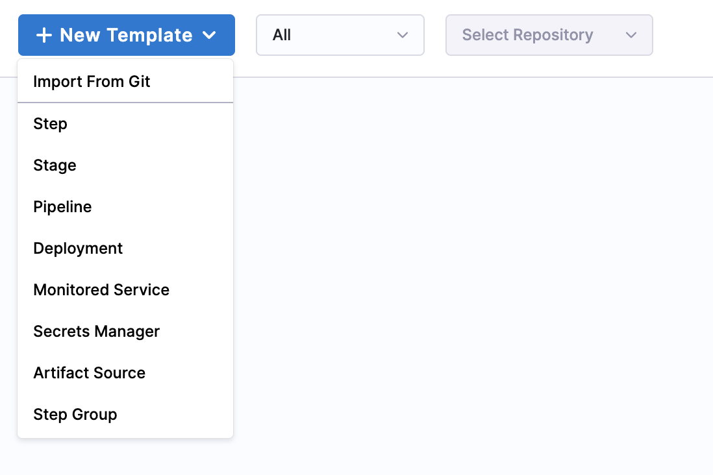
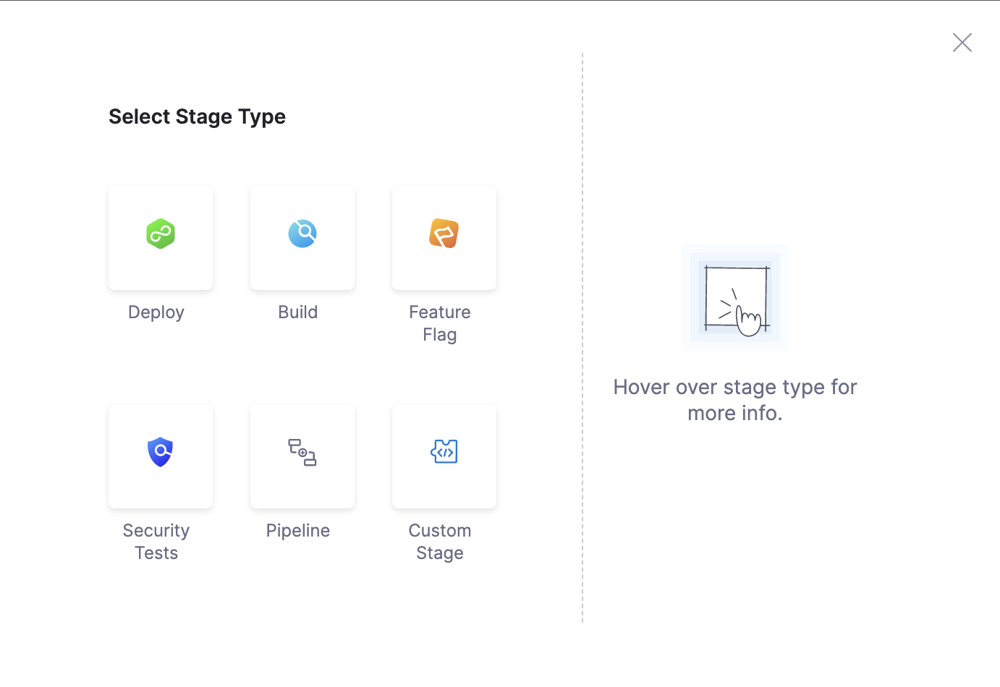

A step group in Harness is a collection of deployment steps that are executed together as a single unit. This allows you to organize and manage complex deployment processes by dividing them into smaller, manageable steps. A step group can contain any type of pipeline step, including script steps, artifact deployment steps, and infrastructure deployment steps. You can also control the order in which the steps in a step group are executed. In addition, you can specify conditions for skipping certain steps based on the outcome of previous steps. Overall, step groups are a useful tool for streamlining and organizing your deployment processes in Harness.

By creating a step group template, you can standardize and simplify your deployment processes, and reduce the time and effort required to create new pipelines and templates. When using in a deployment, you can customize certain aspects of the template. Additionally, you can apply conditions to the steps in a step group template to make it more flexible and reusable in different deployment scenarios. 

You can create a step group template at the project, organization, and account levels.

## Create a step group template

Let us start by creating a template in the project scope within the **Deployments** module.  You can do this in any project.

1. Navigate to the **Deployments** module and in **Projects** select the desired project.
2. Under **Project Setup**, select **Templates**.
3. Click **New Template**.
4. Select **Step Group** to create a stage template.
   
   

   The **Create New Step Group Template** settings appear.

5. In **Name**, enter a name for the template.
6. In **Version Label**, enter the version of the stage. You can enter v1.
7. Select the scope at which you want to save this template in **Save To**.
8. To set up your template, select one of the following: 
   - **Inline**: Save the template in Harness.
   - **Remote**: Save the template in a Git repository.
  
  
### Create a remote template

  1. In **Git Connector**, select or create a Git Connector to the repo for your project.​ For steps, see [Code Repo Connectors](../7_Connectors/connect-to-code-repo.md).
  2. In **Repository**, select your repository.​ If your repository isn't listed, enter its name since only a select few repositories are filled here.​Create the repository in Git before entering it in Select Repository. ​Harness does not create the repository for you.​
  3. In **Git Branch**, select your branch.​ If your branch isn't listed, enter its name since only a select few branches are filled here.Create the branch in your repository before entering it in Git Branch. ​Harness does not create the branch for you​​
  4. ​Harness auto-populates the **YAML Path**.​ You can change this path and the file name.
  5. Click **Start**.

## Select the stage type

1. Select **Deploy**. The deploy stage type is a CD Stage that enables you to deploy any service to your target environment.

   

   You can also select other types of stages. This topic uses the **Deploy** stage type.
   
   The stage type you choose determines where you can reference the step group template in the pipeline. If you select **Deploy** as the stage type, you can reference the template in any pipeline's deploy stage. If you select **Build** as the stage type, you can reference the template in any pipeline's build stage.

2. In your stage, click **Add Step** and then click **Add Step**.

   Select a step type from the step library.

   Let us add a **Canary Deployment** step.

   Enter a name for this step and then click **Apply Changes**.

3. Next, let us add an approval step.

   Click **Add Step** and then click **Add Step**.

   In **Approval**, select **Harness Approval**.

   Enter a name for this step. Select the user groups and then click **Apply Changes**.

   You can add more steps to form a step group.
   

You can also create step group templates through the Harness API or Harness Terraform Provider.

Harness detects the step group object and automatically creates the step group template based on the YAML body. You need not define any additional fields in the API or Terraform provider.

For more information on creating templates through API, see [Create Templates API](https://apidocs.harness.io/tag/Templates#operation/createTemplate).

For more information on creating templates through Terraform Provider, see [Platform Template](https://registry.terraform.io/providers/harness/harness/latest/docs/resources/platform_template).

Here is an example of a step group template YAML.
   
   ```YAML
    template:
    name: Validate Kubernetes Rollout
    type: StepGroup
    projectIdentifier: docproject
    orgIdentifier: docorg
    spec:
        steps:
        - step:
            type: K8sDryRun
            name: Output Servie Manifest
            identifier: Output_Servie_Manifest
            spec: {}
            timeout: 10m
        - step:
            type: HarnessApproval
            name: Approve Harness Manifests
            identifier: Approve_Harness_Manifests
            spec:
                approvalMessage: Please review the following information and approve the pipeline progression
                includePipelineExecutionHistory: true
                approvers:
                userGroups:
                    - account._account_all_users
                minimumCount: 1
                disallowPipelineExecutor: false
                approverInputs: []
            timeout: 1d
        - step:
            type: K8sRollingDeploy
            name: Rolling Deployment
            identifier: Rolling_Deployment
            spec:
                skipDryRun: false
                pruningEnabled: false
            timeout: 10m
        stageType: Deployment
        when:
        stageStatus: Success
        condition: <+input>
    identifier: Validate_Kubernetes_Rollout
    versionLabel: "1.0"
    ```

4. Click **Save** to save the step group template you just created.

## Add details for conditional execution

A step group can have its own **Conditional Execution** settings separate from the Conditional Execution settings for the Stage. The Conditional Execution settings of the step group apply to all of its steps.

See Step Skip Condition Settings.

The Conditional Execution settings of any step in a step group overrides the conditional execution settings of the step group.

If you do not use step group Conditional Execution settings, then the stage's conditional execution settings are used.

## Add a failure strategy

A step group can have its own **Failure Strategy** separate from the failure strategy for the stage.

The failure strategy can execute the rollback steps for the step group.

For more information, see [Step Failure Strategy Settings](../8_Pipelines/w_pipeline-steps-reference/step-failure-strategy-settings.md)

The Failure Strategy of any step in a step group overrides the Failure Strategy of the step group.

If you do not use a step group Failure Strategy, then the Stage's Failure Strategy is used.

## Add looping strategy

Select one of the following **Looping Strategy** to run your step multiple times with different inputs: 
- Matrix
- Repeat
- Parallelism

For more information, see [Looping Strategies Overview](../8_Pipelines/looping-strategies-matrix-repeat-and-parallelism.md)

Click **Save**. Enter a comment for you changes and click **Save**.

## Add the step group template to a pipeline

You can use the step group template in any pipeline in your project now that you have it.

To add a step group template to a pipeline: 

1. Go to the pipeline, and then select the stage where you want to add the template.
2. Click **Add Step**.
3. Select **Use template**.
4. Select your step group template from the list of templates.
5. Click **Use Template**.
6. Enter a name for your template and click **Apply Changes**.
7. Click **Save**.
   The template is now referenced in your pipeline.
