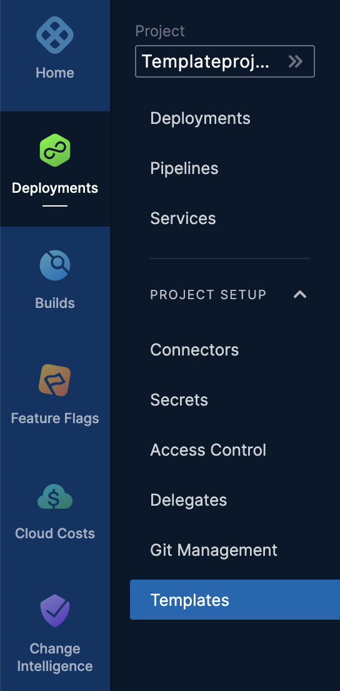
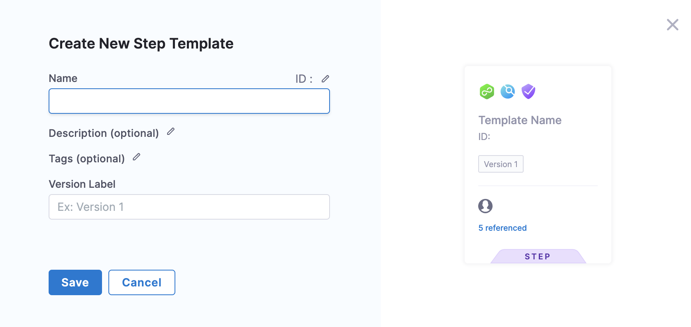
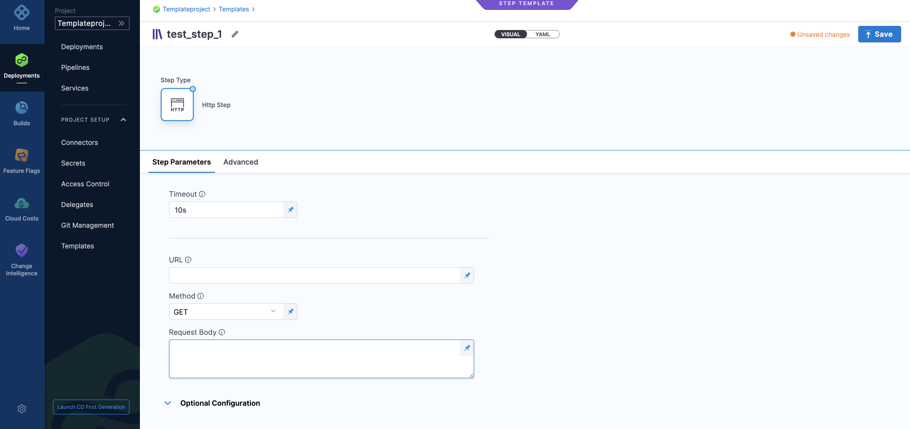
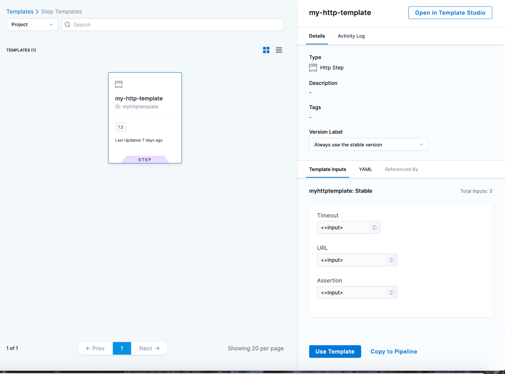

The Harness Template Library enables you to standardize and distribute reusable Step Templates across teams that use Harness.

This topic walks you through the steps to create an HTTP Step template.

### Objectives

You'll learn how to: 

* Create an HTTP Step Template.
* Define Template parameters.
* Use the HTTP Step Template in a Pipeline.

### Before you begin

* Review [Harness Key Concepts](../../first-gen/starthere-firstgen/harness-key-concepts.md) to establish a general understanding of Harness.
* The HTTP template in this quickstart is added to a CD Pipeline. If you are new to Harness CD, see [CD Quickstarts](/tutorials/cd-pipelines).
* See ​[CIE Quickstarts](../../continuous-integration/ci-quickstarts/ci-pipeline-quickstart.md).

### Step 1: Create a Template

First, we'll create a Project-level Template in the Deployments module. You can do this in any Project.

Navigate to the **Deployments** module and in **Projects** select the desired project.

Next select **Templates** under Project Setup.

Click **New Template**.

Select **Step** to create a Step Template**.**

The **Create New Step Template** settings appear.

In **Name**, enter a name for the template. You can enter Quickstart.

In **Version Label**, enter a name for the version of the template. You can enter V1.

Click **Save**. The **Step Library** panel appears.

### Step 2: Add Step Parameters

In **Step Library,** select **HTTP** under **Utilities**.

The **Step Parameters** settings appear.

In **Timeout**, enter a timeout value for this step. You can enter 10s.

In **URL**, enter the URL for the Http call.

In **Method**, select GET.

Click **Save**. The new Template appears under the **Templates** list.

### Step 3: Add the HTTP Step Template to a Pipeline

To add a step template in a Pipeline Execution select the step and click **Add Step**.

The **Step Library** panel appears.

In **Step Library,** select **HTTP** under **Utilities**. The **HTTP Step** settings appear.

Click **Use Template.** The next page lists all the Project-level templates.

Select the Template that you created.

Click the **Activity Log** to track all Template events. It shows you details like who created the Template and Template version changes.

Click **Version Label.**

Select **Stable** version of the template. This ensures that any changes that you make to this version are propagated  automatically to the Pipelines using this template.

Click **Use Template.**

In **Name**, enter Quickstart.

Under **Template Inputs**, click **Timeout** and select **Runtime input**.

Click URL and select **Runtime input**.

**Use Runtime Inputs instead of variable expressions:** when you want to template settings in a Stage or step template, use [Runtime Inputs](../20_References/runtime-inputs.md) instead of variable expressions. When Harness tries to resolve variable expressions to specific Stage-level settings using fully-qualified names, it can cause issues at runtime. Every Pipeline where the Stage or step template is inserted must utilize the exact same names for fully-qualified name references to operate. With Runtime Inputs, you can supply values for a setting at deployment runtime.Click **Apply Changes**.

Click **Save**.

