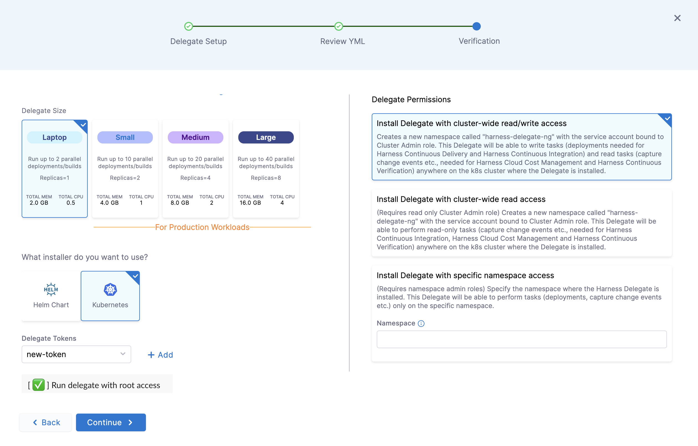
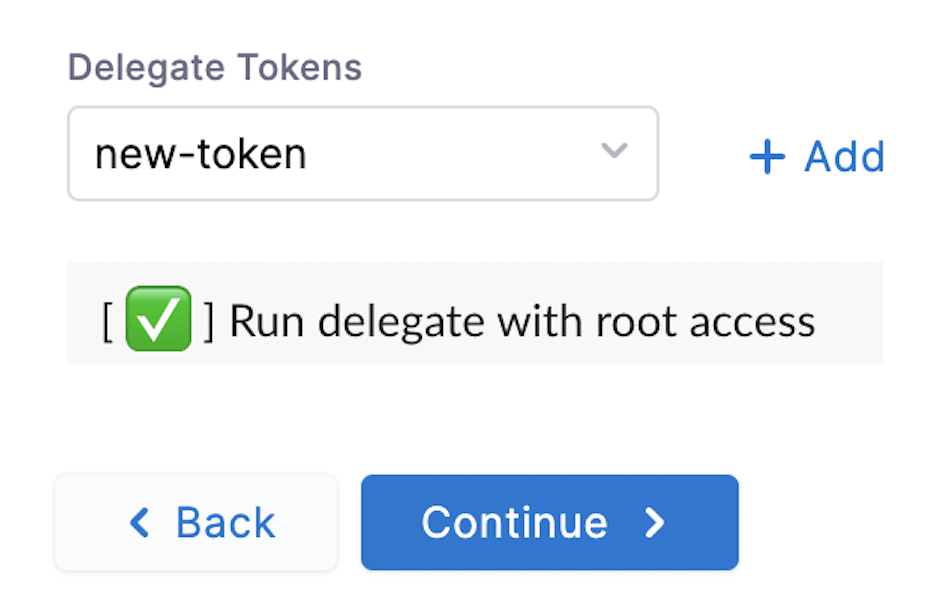

You can install Harness Delegate with or without root user privileges. By default, the Harness Delegate container runs as root user. 

The Delegate installer provides the option to install the Delegate with non-root user privileges. Non-root user access supports the security principle of minimum access. But without root user access, you cannot modify the Delegate image with custom binaries.

This topic explains how to use the Delegate installer to install with or without root user privileges. This topic also explains how to modify an installed Delegate to enable root user privileges and the installation of custom binaries.

### Delegate images

Harness provides the following Delegate images. Each image includes a set of tools that target a particular scenario.


| **Delegate Image**  | **Description** |
| --- | --- |
| harness/delegate:*YY.MM.xxxxx* | Includes the Delegate and its dependencies.Includes client tools such as `kubectl`, Helm, and ChartMuseum. |
| harness/delegate:*YY.MM.xxxxx*.minimal | Includes the Delegate and its dependencies. |

For detailed information on Docker delegate installation, see [Install a Docker delegate](/docs/platform/2_Delegates/install-delegates/overview.md).

### Select user privileges in the installer

The easiest way to set user privileges for the Delegate container is to use the Delegate installer.


**To set container privileges in the Delegate installer**

1. Advance to the **Delegate Setup** page.
2. Clear or select the checkbox as follows:
* To set non-root user privileges, clear **Run delegate with root access**.
* To set root user privileges, select **Run delegate with root access**.

The Delegate is installed with the specified privilege level.

### Specify user privileges in delegate YAML

To add binaries to a Delegate image that was installed without root user privileges, you can change the Delegate manifest file to allow them. To do so, locate the container `spec` and ensure it includes the following `securityContext` object:


```
spec:  
    containers:  
    - image: harness/delegate:ng  
      imagePullPolicy: Always  
      name: harness-delegate-instance  
      securityContext:  
        allowPrivilegeEscalation: false  
        runAsUser: 0
```
### Use INIT\_SCRIPT with the microdnf package manager

To add binaries, you must first install the `microdnf` package manager on the Delegate image. This utility is required to run installations and other operations on images. 

Use the `INIT_SCRIPT` environment variable to specify the custom binaries you want `microdnf` to install.


```
- name: INIT_SCRIPT  
      value: |-  
        microdnf install -y zip unzip
```
In this example, the value of `INIT_SCRIPT` is the `microdnf install` instruction that installs the `zip` and `unzip` packages.

Note that the `apt-get` command-line tool and profile scripts target an earlier Ubuntu-based image and are not supported for these images.

