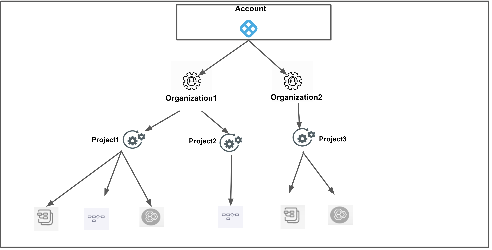
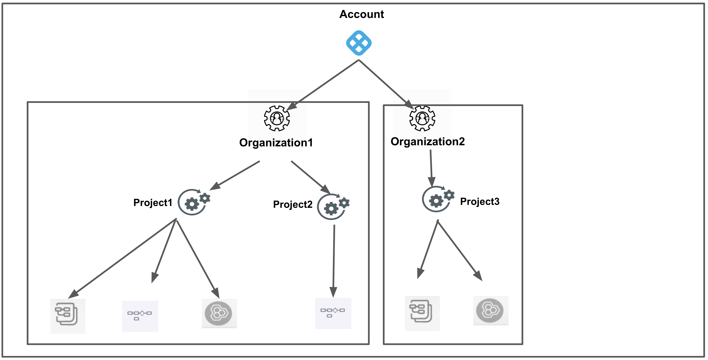
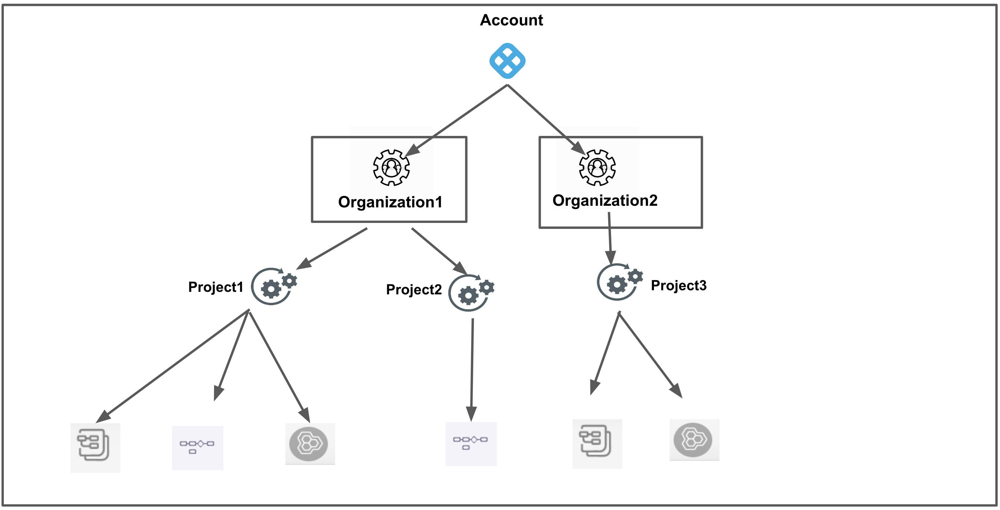
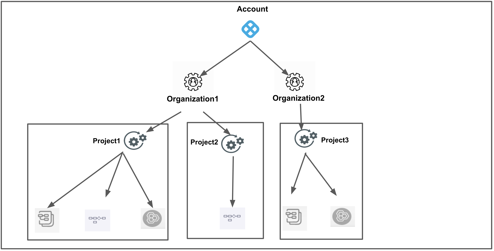
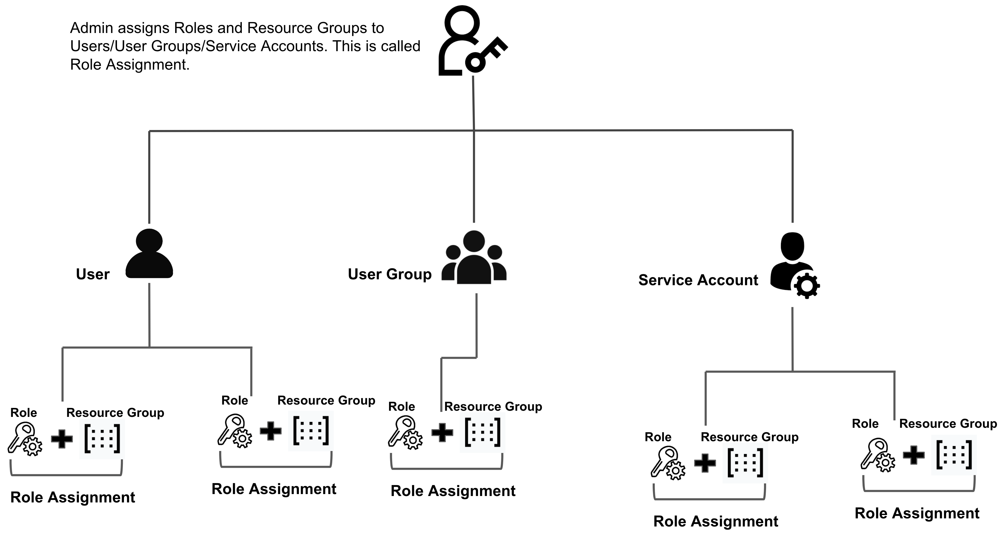

Access management for resources is a critical function for your accounts, organizations, and projects.

Role-based access control is a security model that restricts access to your resources based on the roles assigned to a principal.

It is an authorization system that provides fine-grained access management of Harness resources.

### RBAC scope

Managing access to resources within Harness is determined by the following scopes: 
- Account
- Organization 
- Project

This hierarchical structure allows administrators to apply permissions at different levels, making it easy to delegate responsibilities to different teams. Using this structure, Harness provides a granular approach to access control that is flexible, scalable, and easy to manage.

```mdx-code-block
import Tabs from '@theme/Tabs';
import TabItem from '@theme/TabItem';

<Tabs>
  <TabItem value="account" label="Account" default>
    The scope of an account is at the highest level, encompassing all the resources within the Harness subscription. It provides a way to manage billing, user authentication, and global settings for all the organizations and projects within the account. Users with the appropriate permissions can manage the account-level settings, including billing, subscription, and SSO configuration.
    <p/>
    <h3>When to add users in this scope?</h3>
    To manage administrative functions or have total access and authority over the whole hierarchy, add them to the account scope.
    <p/>
    <h3>When to add resources in this scope?</h3>
    Add resources to the account scope to allow sharing across the entire hierarchy.
  </TabItem>

  <TabItem value="org" label="Organization">
  The scope of an organization is used to group related projects, resources, and users within a specific domain or business unit. It provides a way to manage resources and permissions specific to a particular organization. Users with the appropriate permissions can manage organization-level settings, including the creation of projects and user groups, and assigning access policies to those user groups.
   <p/>
   <h3>When to add users in this scope?</h3>
   To have visibility and control over all the projects within this org, add users to the org scope.
   <p/>
   <h3>When to add resources in this scope?</h3>
   Add resources to the org scope to allow sharing across projects within this org while isolating from other organizations.
  </TabItem>

  <TabItem value="project" label="Project">
  The scope of a project is used to group related resources, such as applications, pipelines, and environments. It provides a way to manage resources and permissions specific to a particular project. Users with the appropriate permissions can manage project-level settings, including the creation of pipelines, environments, and infrastructure definitions.
  <p/>
   <h3>When to add users in this scope?</h3>
   Add resources to the org scope to allow sharing across projects within this org while isolating from other organizations.
   <p/>
   <h3>When to add resources in this scope?</h3>
   Add resources to the project scope to provide total control to the project teams.
  </TabItem>
</Tabs>
```


Scopes are structured in a parent-child relationship. You can assign roles at any of these levels of scope.

To know more about organizations and projects, see [Create Organizations and Projects](../organizations-and-projects/create-an-organization.md).

### RBAC components

#### Principal

  A principal is an entity that can be assigned to a role and subsequently granted permissions to access certain resources or perform specific actions within a system. A principal can be one of the following: 
  * **Users:** These are individual users within the Harness system. A user can belong to many user groups.  
    For more information on creating a new user, see [Add and Manage Users](../4_Role-Based-Access-Control/3-add-users.md).
  * **User Groups:** User groups contain multiple Harness users. Each user group has assigned roles. You can create user Groups at account/org/project scope.  
    For more information on creating a new user group, see [Add and Manage User Groups](../4_Role-Based-Access-Control/4-add-user-groups.md).
  * **Service Account:** A service account is a set of [API Keys](../4_Role-Based-Access-Control/7-add-and-manage-api-keys.md) with a set of permissions assigned to them via role assignment. API keys are used for authenticating and authorizing remote services attempting to perform operations in Harness via our APIs. API keys that are part of a service account are assigned permissions (equivalent to users) that service accounts inherit.  
   For more information on creating a new service account, see [Add and Manage Service Accounts.](../4_Role-Based-Access-Control/6-add-and-manage-service-account.md)
    
    

    [Role assignments](#role-assignment) are done on any of these principals.

#### Resource Groups

A resource-group is a set of Harness resources that a principal can access. You can create resource groups at account/org/project scope.  
For more information on creating a new resource group, see [Add and Manage Resource Groups](../4_Role-Based-Access-Control/8-add-resource-groups.md).

  Resource Groups can be of two types:

  * **All Resources**– Collection of all the resources of a given type.
  * **Named Resources**– Collection of a specific set of individual resources.

    

  Harness includes the following default Resource Groups at each scope:

    |  |  |  |
    | --- | --- | --- | --- |
    | **Scope** | **Resource Group** | **Description** | **Visual summary** |
    | **Account** | **All Resources Including Child Scopes** | Includes all resources within the account's scope, as well as those within the scope of the orgs and projects within the account. |  |
    | **Account** | **All Account Level Resources** | Includes all resources within the account's scope. Excludes resources that are within the scope of an org or project. |  |
    | **Org** | **All Resources Including Child Scopes** | Includes all the resources within the org's scope, as well as those within the scope of all projects within the org. |  |
    | **Org** | **All Organization Level Resources** | Include all resources within the org's scope. Excludes resources that are within the scope of a project. |  |
    | **Project** | **All Project Level Resources** | Includes all resources within the scope of a project. |  |

  You can also create custom resource groups within any scope.

  For more information, see [Add and Manage Resource Groups](../4_Role-Based-Access-Control/8-add-resource-groups.md).

#### Roles

A role is a set of permissions that allow or deny specific operations on a specific set of resources. A Role defines access to resources within a single scope — project/org/account. You can create roles at account/org/project scope.  
  For more information on creating a new role, see [Add and Manage Roles](../4_Role-Based-Access-Control/9-add-manage-roles.md).

  Harness provides the following default roles at the account, org, and project scope:

   |  |  |
   | --- | --- |
   | **Scope** | **Role** |
   | **Account** | Account Admin |
   | **Account** | Account Viewer |
   | **Account** | Feature Flag Manage Role |
   | **Org** | Organization Admin |
   | **Org** | Organization Viewer |
   | **Org** | Feature Flag Manage Role |
   | **Project** | Project Admin |
   | **Project** | Project Viewer |
   | **Project** | Pipeline Executor |
   | **Project** | Feature Flag Manage Role |

  For more information, see [Add and Manage Roles](../4_Role-Based-Access-Control/9-add-manage-roles.md).

## Role assignment

A role assignment consists of the following elements:

* Principal
* Role
* Resource Group
* Scope

Following are a few key points for role assignment in Harness:

* Role assignment is assigning a role and a resource group to a principal.
* The principal gets access to resources through a role assignment.
* Each principal can have multiple role assignments.
* Depending on where you need to set up access control, you may assign roles at the account, org, or project scope.



The following list explains the different role assignments with the default roles and resource groups:


|  |  |
| --- | --- |
| **Role Assignment (Default Role + Default Resource Group)** | **Description** |
| **Account Admin +** **All Resources Including Child Scopes** | A principal with this role assignment has the following permissions:<li> All permissions on all the resources in the account scope as well as organizations and projects scopes within the entire account.</li>
 |
| **Account Admin +** **All Account Level Resources** | A principal with this role assignment has the following permissions:<li> All permissions on all the resources in the account scope only.</li>
 |
| **Account Viewer +** **All Resources Including Child Scopes** | A principal with this role assignment has the following permissions:<li> View permissions on all the resources in the account as well as organizations and projects scopes within the entire account.</li>
 |
| **Account Viewer +** **All Account Level Resources** | A principal with this role assignment has the following permissions:<li>View permissions on all the resources in the account scope only.</li>
 |
| **Feature Flag Manage Role +** **All Resources Including Child Scopes** | A principal with this role assignment has the following permissions:<li> Create/Edit permissions on Feature Flags and Target Management in the account as well as organizations and projects scopes within the entire account.</li>
 |
| **Feature Flag Manage Role +** **All Account Level Resources** | A principal with this role assignment has the following permissions:<li> Create/Edit permissions on Feature Flags and Target Management in the account scope only.</li>
 |
| **Organization Admin +** **All Resources Including Child Scopes** | A principal with this role assignment has the following permissions:<li> All permissions on all the resources in the organization as well as projects within the organization.</li>
 |
| **Organization Admin + All Organization Level Resources** | A principal with this role assignment has the following permissions:<li> All permissions on all the resources in the organization scope only.</li>
 |
| **Organization Viewer +** **All Resources Including Child Scopes** | A principal with this role assignment has the following permissions:<li> View permissions on all the resources in the organization as well as projects within the organization.</li>
 |
| **Organization Viewer + All Organization Level Resources** | A principal with this role assignment has the following permissions:<li> View permissions on all the resources in the organization scope only.</li>
 |
| **Feature Flag Manage Role +** **All Resources Including Child Scopes** | A principal with this role assignment has the following permissions:<li> Create/Edit permissions on Feature Flags and Target Management in the organizations, and projects within the entire organization.</li>
 |
| **Feature Flag Manage Role + All Organization Level Resources** | A principal with this role assignment has the following permissions:<li> Create/Edit permissions for Feature Flags and Target Management in the organization scope only.</li>
 |
| **Project Admin + All Project Level Resources** | A principal with this role assignment has the following permissions:<li> All permissions on all the resources within the project scope.</li>
 |
| **Project Viewer + All Project Level Resources** | A principal with this role assignment has the following permissions:<li> View permissions on all the resources in the Project.</li>
 |
| **Feature Flag Manage + All Project Level Resources** | A principal with this role assignment has the following permissions:<li>Create/Edit permissions for Feature Flags and Target Management within the project scope.</li>
 |
| **Pipeline Executor + All Project Level Resources** | A principal with this role assignment has the following permissions:<li> View permission on resource group, project, users, user groups, and roles</li><li> View and Access permissions on secrets, connectors, environments, services</li><li> View and Execute permissions on pipelines</li>|

### Overlapping role assignments

RBAC is an additive model. When a Harness user is a member of multiple user groups, the union of all the role assignments determines the effective permissions for the user.

For example, let us consider a user with the following role assignments:

* **Account Admin** role for **All Resources Including Child Scopes**.
* **Organization Viewer** role for **All Resources Including Child Scopes**.

The sum of these role assignments is effectively the **Account Admin** role for **All Resources Including Child Scopes.** Therefore, in this case, the **Organization Viewer** role for **All Resources Including Child Scopes** has no impact.

By default, users will have **View** permissions for all resources at all scopes (account/org/project).

## Extending RBAC

You can provide more control by using rules to restrict access based on a combination of attributes, such as type of environments or connectors.

For more information, see [Attribute-Based Access Control](../4_Role-Based-Access-Control/2-attribute-based-access-control.md).

## Blog post

The following blog post walks you through user and role management in Harness:

[User and Role Management in the Harness Software Delivery Platform](https://harness.io/blog/continuous-delivery/user-role-management/)


<details>
<summary>
RBAC setup video
</summary>
<docvideo src="https://www.youtube.com/embed/vIQfpRrES44?feature=oembed"/>
</details>


## Benefits of using RBAC

Using RBAC helps you:

- Ensure that users have access to only the information and resources necessary to perform their tasks. This reduces the risk of security breaches and unauthorized access to sensitive data.

- Create a systematic, repeatable assignment of permissions. RBAC saves time and increases efficiency for administrators who would otherwise need to manage access to individual user accounts. You can quickly add and change roles, as well as implement them across APIs.

- Increase accountability by clearly defining who has access to specific resources and information. This makes it easier to track and audit user activities, helping to identify and prevent misuse or abuse of access privileges. 

- More effectively comply with regulatory and statutory requirements for confidentiality and privacy. It lets you enforce policies related to privacy and data protection.

## RBAC model

Here is a quick overview of Harness RBAC:

* The account administrator invites users to the account.
* The account administrator creates user groups.
* The account administrator creates service accounts.
* Role assignments happen on individual users, user groups, or service accounts.
* Each user can be a member of multiple user groups and hence can have multiple role assignments.
* Each user group and service account can have multiple role assignments.
* You can assign roles at any [scope](#rbac-scope).
  
  

## What can you do with RBAC?

Here are a few examples of what RBAC can be used for:

* Allow users, user groups, or service accounts to manage and access the resources through the account/org/project admin role.
* Allow users, user groups, or service accounts to view the resources through the account/org/project viewer role.
* Allow users, user groups, or service accounts to manage and access specific resources through custom roles.

## How does RBAC work?

To control access to resources using RBAC, you assign permissions to users and groups.

* Permissions that you want to assign to a user or user group or a service account are grouped together in a Role.
* Resources that you want to control access to are grouped together in a resource group.
* An account administrator assigns a role and resource group to a principal - user or user group or service account. This assignment is called [Role Assignment](#role-assignment).
* Role assignment grants the principal the permissions from the role on the set of resources in the resource group.

## Next steps

* [Add and Manage Users](../4_Role-Based-Access-Control/3-add-users.md)
* [Add and Manage User Groups](../4_Role-Based-Access-Control/4-add-user-groups.md)
* [Add and Manage Service Accounts](../4_Role-Based-Access-Control/6-add-and-manage-service-account.md)
* [Add and Manage Resource Groups](../4_Role-Based-Access-Control/8-add-resource-groups.md)
* [Add and Manage Roles](../4_Role-Based-Access-Control/9-add-manage-roles.md)
* [Attribute-Based Access Control](../4_Role-Based-Access-Control/2-attribute-based-access-control.md)
* [Permissions Reference](../4_Role-Based-Access-Control/ref-access-management/permissions-reference.md)

