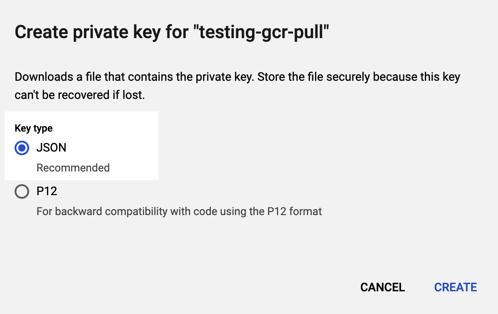

Harness Google Cloud Platform (GCP) Connector connects your Harness account to a GCP account.

You add Connectors to your Harness Account and then reference them when defining resources and environments.

### Limitations

Harness supports GKE 1.19 and later.

If you use a version prior to GKE 1.19, please enable Basic Authentication. If Basic authentication is inadequate for your security requirements, use the [Kubernetes Cluster Connector](../add-a-kubernetes-cluster-connector.md).

### Kubernetes Role Requirements

If you are using the GCP Connector to connect to GKE, the GCP service account used for any credentials requires the **Kubernetes Engine Developer** and **Storage Object Viewer** permissions.

If you use a version prior to GKE 1.19, please enable Basic Authentication. If Basic authentication is inadequate for your security requirements, use the [Kubernetes Cluster Connector](../add-a-kubernetes-cluster-connector.md).

* For steps to add roles to your service account, see [Granting Roles to Service Accounts](https://cloud.google.com/iam/docs/granting-roles-to-service-accounts) from Google. For more information, see [Understanding Roles](https://cloud.google.com/iam/docs/understanding-roles?_ga=2.123080387.-954998919.1531518087#curated_roles) from GCP.

Another option is to use a service account that has only the Storage Object Viewer permission needed to query GCR, and then use either an in-cluster Kubernetes Delegate or a direct [Kubernetes Cluster Connector](kubernetes-cluster-connector-settings-reference.md) with the Kubernetes service account token for performing deployment.

### GCS and GCR Role Requirements

For Google Cloud Storage (GCS) and Google Container Registry (GCR), the following roles are required:

* Storage Object Viewer (roles/storage.objectViewer)
* Storage Object Admin (roles/storage.objectAdmin)

See [Cloud IAM roles for Cloud Storage](https://cloud.google.com/storage/docs/access-control/iam-roles) from GCP.

Ensure the Harness Delegate you have installed can reach to the GCR registry host name you are using in **Registry Host Name** (for example, gcr.io) and storage.cloud.google.com.

### Google Cloud Operations Suite (Stackdriver) Requirements

Most APM and logging tools are added to Harness as Verification Providers. For Google Cloud's operations suite (formerly Stackdriver), you use the GCP Connector.

##### Roles and Permissions

* **Stackdriver Logs** - The minimum role requirement is **Logs Viewer** (logging.viewer)**.**
* **Stackdriver Metrics** - The minimum role requirements are **Compute Network Viewer** (compute.networkViewer) and **Monitoring Viewer** (monitoring.viewer).

See [Access control](https://cloud.google.com/monitoring/access-control) from Google.

### Proxies and GCP with Harness

If you are using a proxy server in your GCP account, but want to use GCP services with Harness, you need to set the following to not use your proxy:

* `googleapis.com`. See [Proxy servers](https://cloud.google.com/storage/docs/troubleshooting#proxy-server) from Google.
* The `token_uri` value from your Google Service Account. See [Creating service account keys](https://cloud.google.com/iam/docs/creating-managing-service-account-keys#creating_service_account_keys) from Google.

### GCP Connector Settings

#### Name

The unique name for this Connector.

#### ID

See [Entity Identifier Reference](../../20_References/entity-identifier-reference.md).

#### Description

Text string.

#### Tags

See [Tags Reference](../../20_References/tags-reference.md).

#### Service Account Key

Select or create a new [Harness Encrypted Text secret](../../6_Security/add-use-text-secrets.md) that contains the Google Cloud's Account Service Key File.

To obtain the Google Cloud's Account Service Key File, see [Creating and managing service account keys](https://cloud.google.com/iam/docs/creating-managing-service-account-keys) from Google (JSON is recommended).

(./static/gcs-connector-settings-reference-00.png)
Once you have the key file from Google, open it, copy it, and paste it into the Harness Encrypted Text secret.

Next, use that Harness Encrypted Text secret in **Service Account Key**.

### See also

* [AWS Connector Settings Reference](aws-connector-settings-reference.md)
* [Kubernetes Cluster Connector Settings Reference](kubernetes-cluster-connector-settings-reference.md)

