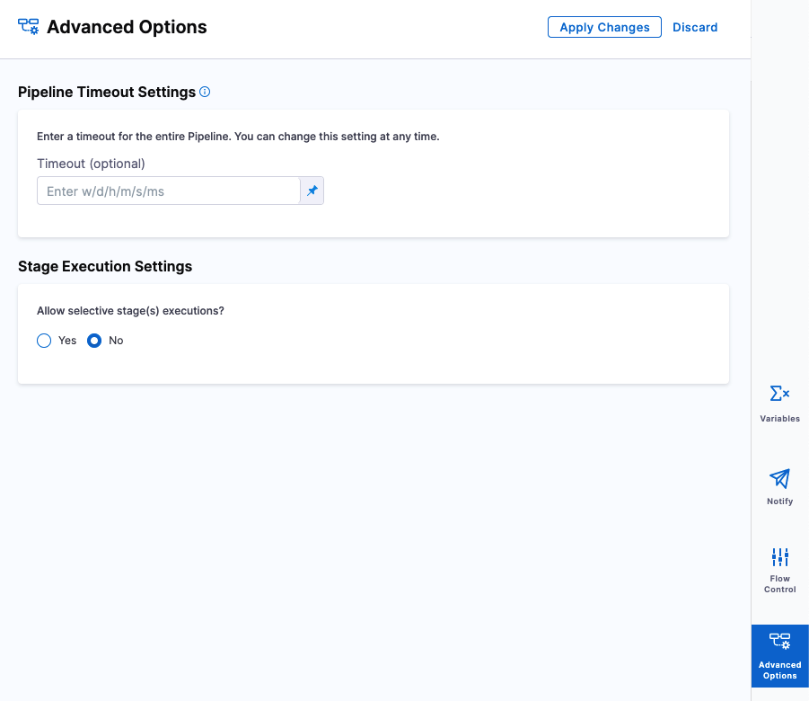
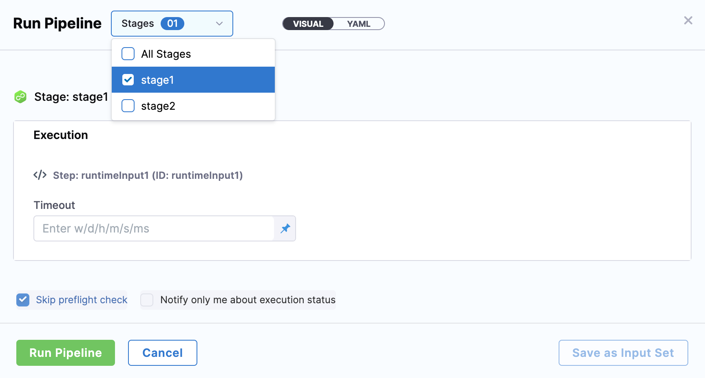
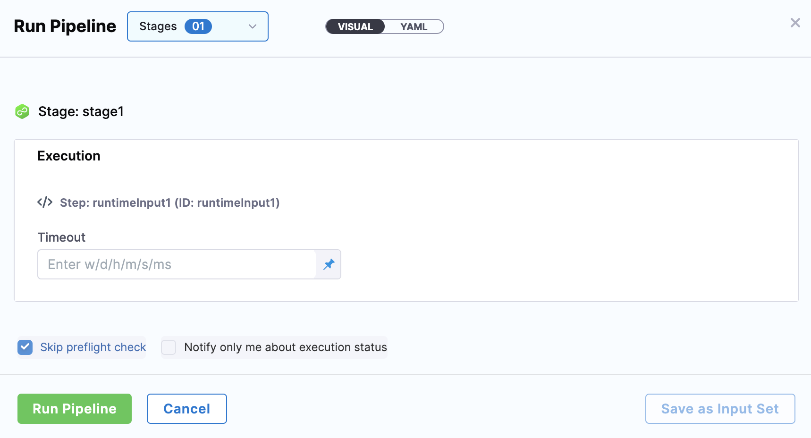
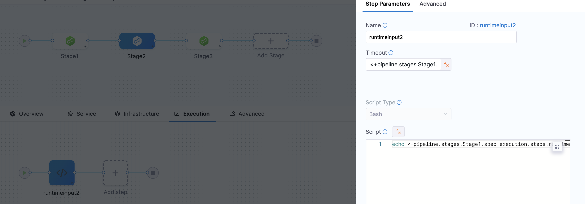
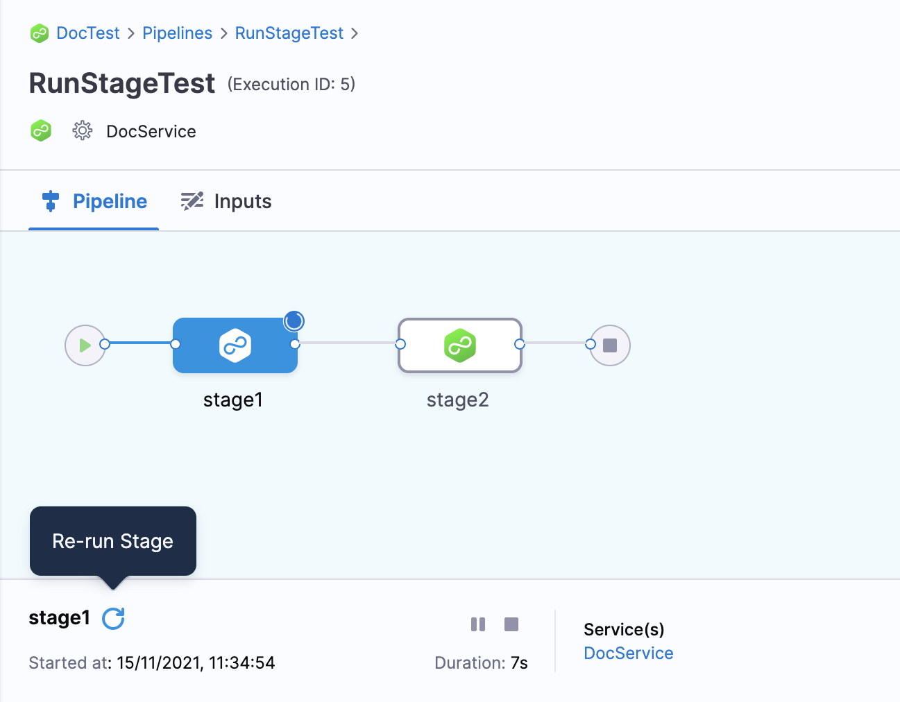

A Pipeline is an end-to-end process that delivers a new version of your software. Each Pipeline has stages that contain the logic to perform one major segment of the Pipeline process.

While executing a Pipeline, you might encounter situations where most of the stages succeed, but a few of them fail. Or you might want to run only specific Stages. In such situations, Harness lets you select specific stages to run instead of executing the entire Pipeline again.

This topic explains how to run specific stages in a Pipeline.

### Before you begin

* [Learn Harness' Key Concepts](https://ngdocs.harness.io/article/hv2758ro4e-learn-harness-key-concepts)
* [Create Organizations and Projects](../1_Organizations and Projects/create-an-organization.md)
* [Add a Stage](add-a-stage.md#add-a-stage)
* Make sure you have **Execute** permissions for Pipeline to run a specific Stage of the Pipeline. For example, the [Pipeline Executor](../4_Role-Based Access Control/ref-access-management/permissions-reference.md) default role in the Project where your Pipeline is located.

### Review: Dependent and Independent Stages

The Services and Environments in a Pipeline stage can be propagated to subsequent Stages. Also, the settings of one stage such as its variables and step inputs and outputs can be referenced in other Stages as expressions.

See [Fixed Values, Runtime Inputs, and Expressions](../20_References/runtime-inputs.md).

If a Stage uses the settings of another Stage, it is a dependent Stage.

If a Stage does not use the settings of any other Stage, it is an independent Stage.

How you run and rerun Stages is different depending on whether the Stage is dependent or independent.

Let's look at the different options.

### Step 1: Select Stage Execution Settings

To run specific stages in your Pipeline, you must allow selective stage(s) execution.

To do this, in your Pipeline click **Advanced Options**.

In **Stage Execution Settings**, set **Allow selective stage(s) executions?** to **Yes**.

### Option: Run Specific Independent Stages

This topic assumes you have a Harness Project set up. If not, see [Create Organizations and Projects](../1_Organizations and Projects/create-an-organization.md).

You can [create a Pipeline](add-a-stage.md#step-1-create-a-pipeline) from any module in your Project, and then [add Stages](add-a-stage.md#add-a-stage) for any module.

In your Pipeline, click Run. The Run Pipeline settings appear.

In Stages, select one or more stages in your Pipeline which are independent of other stages.

If the selected stage requires any [Runtime Inputs](../20_References/runtime-inputs.md#runtime-inputs), you can provide the inputs only for that Stage manually or by selecting an input set.

You can also view the execution details in the Pipeline execution history.

### Option: Run Specific Dependent Stages

If you want to run Stages that propagate settings or need inputs from previous Stages as [expressions](../20_References/runtime-inputs.md#expressions), you can provide the inputs manually while executing this Stage independently.

The below example shows a Pipeline with 3 stages. Stage2 uses the value of timeout in stage1 using an expression. When you run stage2 without executing stage1, this expression is evaluated as a runtime input. You can input the value during execution and run this Stage independently.

### Option: Rerun Stage

You can rerun an executed Stage by clicking the Rerun Stage button and providing any Runtime inputs.

