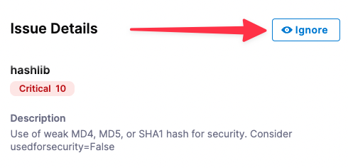
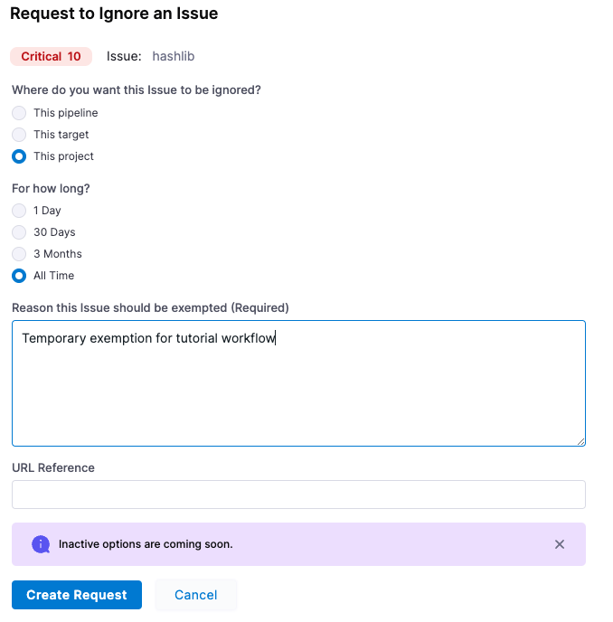

The `fail_on_severity` setting causes a pipeline build to fail if a Security Scan step detects one or more issues with the specified severity (Critical, High, Medium, etc.). You might want to create "ignore rules" for specific issues to override this behavior and ensure that a build proceeds even if the scan detects that issue. This topic describes the workflow for creating and approving ignore rules. 

:::note 
Developers and SecOps users can request ignore rules, but only SecOps users can approve them.
::: 

## Before You Begin

This topic assumes that you have done the following:

* Set up an STO pipeline as described in [Set up Harness for STO](../onboard-sto/20-set-up-harness-for-sto.md).
* Configured `fail_on_severity` on a Security Scan step.
* Run at at least one pipeline build and collected a set of detected security issues.  

## Workflow Description

1. (_Developers or SecOps users_) Create an Ignore Rule request: 
     
  1. Go to the Security Tests page for the build: In the Pipeline studio, click **Execution History** (top right) and then go to a successful build.  

  2. In the **Security Tests** tab, do the following:
  	1. Click in the row to open the **Issue Details** pane. 
    2. If the pane has a Link field, copy the URL into a text editor. 
       It's good practice to include a link to information about the specific issue in your ignore request. This will help the reviewer decide whether to approve your request. 
  	2. Click the **Ignore** button.
    
       
       
  3. In the **Request to Ignore an Issue** popup, configure the Ignore request as follows:
  	1. **Where do you want this issue to be ignored?** (*if available*)
  	2. **For how long?** (*if available*)
  	3. **Reason this issue should be exempted**
    3. **URL Reference** — Paste the link you copied in the previous request, or add a different link that provides information about the specific issue you want the pipeline to ignore. 
  	4. Click **Create Request**.
      
         
         
  4. Send an email or text to the SecOps reviewer 

1. (_SecOps users only_) Review the ignore request: 
       
4. Click **Security Tests** (left menu) and then **Security Review** (second-from-left menu).
5. In the Security Review page, click the "thumbs-up" buttons to approve both exemptions.

   
   
6. Go back to your pipeline and run another build with the **DEMO-001** branch. When the build finishes, go to the **Security Tests** page.
7. In the issues table (bottom), each section has a set of show/hide buttons for different issue types: Critical, High, Medium. Low, and Info. Note that each section now includes an **Ignored** button. Also note that the ignored issues are hidden by default.

   

8. Click the **Ignored** buttons (right) and the expand/contract buttons (left) so that both ignored issues are visible.

   

9. Go to **Security Tests** > **Security Review**. Then click **Approved** to show the Ignore rules you created and approved.
10. Click the Delete (**X**) buttons on the right to delete both rules.

    
