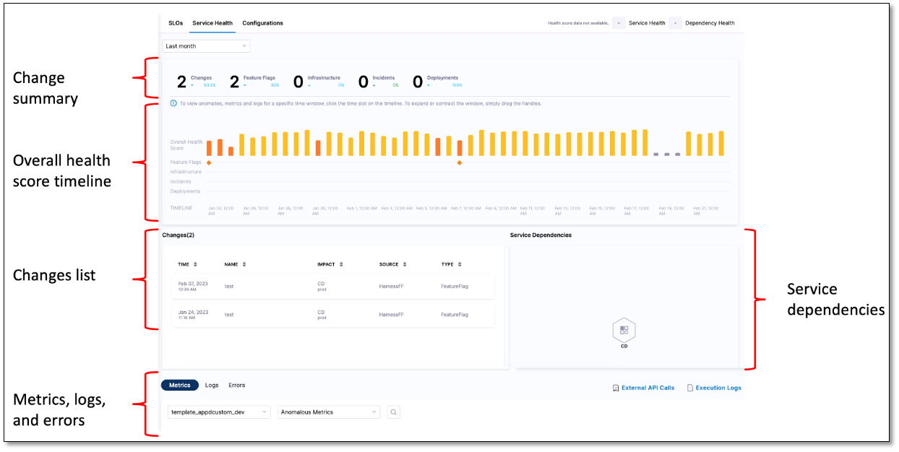

The Service Health dashboard enables you to observe and track the health of monitored services.

The Service Health dashboard helps you:

- Track the overall health of your services, spot anomalies, and take timely action.
- Track change events that impact your monitored service.
- Observe and analyze dependencies between applications, infrastructure, and data.
- View metrics to analyze patterns, historic trends, performance changes, and correlate factors of your services over a period.
- View log data required for debugging issues.

To view the Service Health dashboard:

1. In your Harness project, navigate to the **Service Reliability Management** module, and then select **Monitored Services**.
   A list of all the monitored services appears.
2. Choose the monitored service for which you want to see the health data.
3. Select the **Service Health** tab.  
   The Service Health dashboard appears.
   

The **Service Health** tab is divided into the following sections:

- Change Summary 
- Overall health score timeline
- Changes list
- Service dependencies

### Change summary 

Change summary displays the number of changes in deployments, infrastructure, and incidents for specific time period. You can set the time period based the period of length for which you want to see the data. The available options are:

- Last 24 hours: this is the default setting
- Last 4 hours
- Last 3 days
- Last 7 days
- Last month

### Overall health score timeline

The overall health score timeline provides a graphical representation of the high level overview of a service health for the time period that you have selected. The graph is divided into time slots of equal length based on the time period setting. The graph also displays the changes in deployment, infrastructure, and feature flag, and incidents. This helps you correlate the data over a time period and analyze the impact of change on the reliability of the service.

The overall health score is computed based on the change events such as deployments, infrastructure changes, and incidents. The health score ranges between 0 and 100. The color of the graph represents the severity level of the service health. Following table lists the severity level associated with each color code:

#### Time Window

The Overall Health Score graph has a **Time Window** which displays granular details such as health score incident count, metrics, and logs for specific timeline on the graph. You can move the Time Window along the graph to choose a specific timeline. You can increase or decrease the timeline using the handles.

### Changes list

The **Changes** section displays a detailed breakdown of all the changes occurred in deployment, infrastructure, and feature flag during the selected time period. It also displays the incidents from PagerDuty during the selected time period. The Changes list displays the following:

- Deployments such as ECS, Kubernetes, and Helm from Harness Deployment module.
- Infrastructure changes such as Kubernetes events, Terraform audit logs, MongoDB audit events, AWS CloudTrail, GCP audit logs and Azure audit logs.
- Incidents from PagerDuty.

You can customize the Changes list using the following filters:

- Time: Date and time of the event
- Name: Name of the event 
- Impact: Name of the impacted monitored service
- Source: Name of the source where the change originated
- Type: Change event type

### Service dependencies

The **Service Dependency** section displays a graphical representation of the dependencies between applications, infrastructure, and data.

### Metrics, logs, and errors

The Metrics, Logs, and Errors tabs displays the metrics, log, and error data collected at regular intervals.

#### Metrics tab

The Metrics tab displays the metrics collected at regular intervals.

You can customize the metrics list using the following filters:

- **All Metrics**: Displays all the metrics captured by the health sources.
- **Anomalous Metrics**: Displays the anomalous metrics captured by the health sources.

#### Logs tab
You can drill down log data using the following filters:

- **Known**
- **Unknown**
- **Unexpected Frequency**
