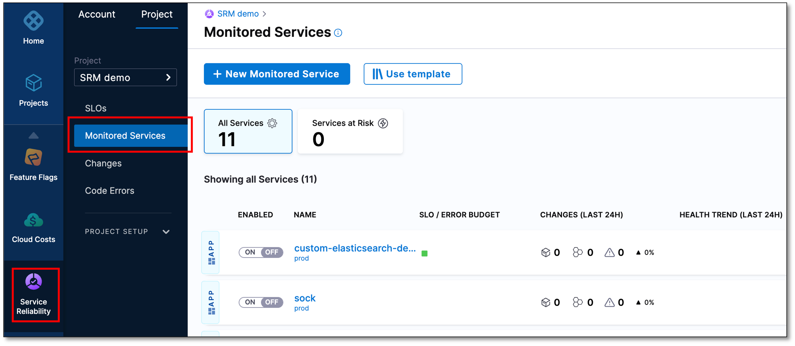

# **Error Tracking**

:::note
Currently, this feature is behind the feature flag `SRM_ET_EXPERIMENTAL`. Contact [Harness Support](mailto:support@harness.io) to enable the feature.
:::

Error Tracking is a developer-first observability solution in the Harness [Service Reliability Management (SRM)](https://developer.harness.io/docs/service-reliability-management/howtos-service-reliability-management/service-reliability-management-basics#sort=relevancy&f:@commonsource=%5BNextGen%20Docs%5D) module that enables developers to identify, triage, and resolve errors in applications. This helps in implementing rapid code changes by ensuring that the code is always in a deployable state.

## Overview

With the increase in release velocity, the risk to code quality also increases. Using Harness Error Tracking, as a developer, you can:

* Quickly identify and address any critical issues during each release with real-time notifications sent to email and Slack channels - ensuring that the right people can make the right decisions fast.
* Deepen understanding of your Java applications in all environments, from production to development, testing, and staging, through code level visibility.
* Automate issue root cause analysis at runtime, eliminating the need for manual log analysis to identify critical errors.
* Quickly and accurately identify and fix detected issues with Automated Root Cause Analysis (ARC) screen, leveraging source code, variable values, environment state of the host/container, and DEBUG level logs to get the full context.
* Integrate the ARC screen with existing tools including APMs, log analyzers, and issue tracking software.

Harness Error Tracking consists of an Error Tracking Agent that runs on a Java Virtual Machine (JVM). It monitors the Java applications for run-time exceptions, log events, and the custom events that you set up. When an exception or an event occurs, the Agent sends the statistics and snapshots to a monitored service on Harness SRM. SRM analyzes the data using Machine Learning (ML) and provides deep insights via comprehensive dashboards such as the Event List and ARC.

This quickstart describes how to set up a monitored service in Harness and install an Error Tracking Agent on a JVM to identify and troubleshoot errors and exceptions in your code.

## Add a monitored service

A Harness Monitored Service is a combination of service and environment. Harness monitors the following via a monitored service:

* Code-level exceptions and errors from the data collected by the Error Tracking Agent.
* Changes such as deployments, incidents such as PagerDuty, and infrastructure changes such as Kubernetes events and auditing.
* Health trend deviations using logs and metrics obtained from the APM and logging tools.

The following steps explain how to create a monitored service, and define service and environments for tracking code errors and exceptions: 

1. In your Harness project, navigate to the **Service Reliability Management** module, and then select **Monitored Services**.

    

2. Select **+ New Monitored Service**. 

    The Create new monitored service settings page appears.

3. In the **Overview** section, enter the following information:
    * **Type**: Select **Application**.
    * **Create or select a Service**: Select a Harness service that you want to monitor. A Harness service is a logical representation of your microservices and other workloads that you want to monitor.

      To create a new service, perform the following steps:
        
      1. Select **+ Add New**.
        
            The New Service dialog appears.
      2. Enter the following information, and then select **Save**:
       
          *  **Name** : Enter a name for the service. For example, _sample_service_.
          *  **Description (Optional)**
          *  **Tag (Optional)** 

    * **Create or Select an Environment**: Choose an appropriate environment. Environments represent your deployment targets such as QA, Prod, and so on.
  
        To create a new environment, perform the following steps:
    
      1. Select **+ Add New**. 
     
         The New Environment dialog appears.
      2. Enter the following information and then select **Save**:

            * **Name**: Enter a name for the environment.
            * **Description (Optional)**
            * **Tag (Optional)**
            * **Environment Type**: Select an environment type. The available options are **Production** and **Non-Production**.

    Harness autopopulates the **Monitored Service Name** field by combining the **Service** and **Environment** names.

4. Select **Save**.
 
   You can view the new monitored service in the **Monitored Services** list. 

    

## Create a token for the Error Tracking Agent

To create a token, perform the following steps:

1. Expand **PROJECT SETUP** and then select **Code Error Settings**.
   
2. On the top right-hand corner, select **Tokens**.
       
     

3. Select **Generate New Token**. 
    
    The New Token dialog appears. 

4. Enter a **Name** for the token.

5. Select **Generate**.
   A new authentication token is generated and displayed in the **Key** field.

6. Copy the token to clipboard. This token is used in the Error Tracking Agent configuration file.  

    

7. Select **Close**.

   The newly created token is added to the list of tokens.

:::note
You can copy the token anytime by selecting the clipboard icon.
:::

## Install an Error Tracking Agent

The Harness Error Tracking Agent should be installed on a Java application to capture program code and variables. This native agent library is attached to the Java Virtual Machine (JVM)/Common Language Runtime (CLR) during runtime. It can be deployed into any Kubernetes container without altering the image. The Agent fingerprints the program code loaded into the JVM/CLR and captures the complete state of the code and the host/container in order to identify anomalies.

For more information on installing the error tracking agent, go to [Install an Error Tracking Agent](https://developer.harness.io/docs/service-reliability-management/use-service-reliability-management/error-tracking-category/install-the-error-tracking-agent).

## Verify Agent connection

After installing Error Tracking Agent, you should verify that it is connected to Harness SRM. To verify the Error Tracking Agent connection, do the following:

1. Expand **PROJECT SETUP** and then select **Code Error Settings**.  
   
   
 
    A comprehensive list of Error Tracking Agents is displayed along with the information such as service name, environment, deployment version, Agent version, Agent status, token name, and so on. Ensure that the Agent that you installed is listed, and the status is **CONNECTED**.

   

