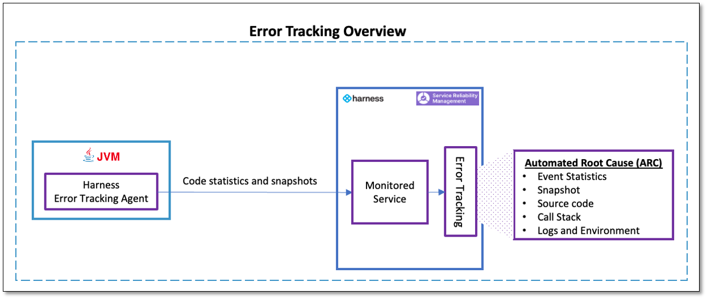
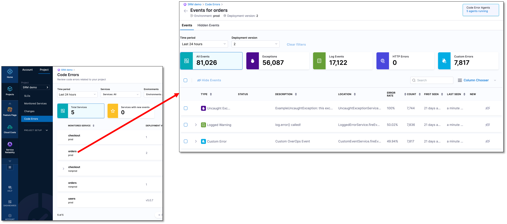
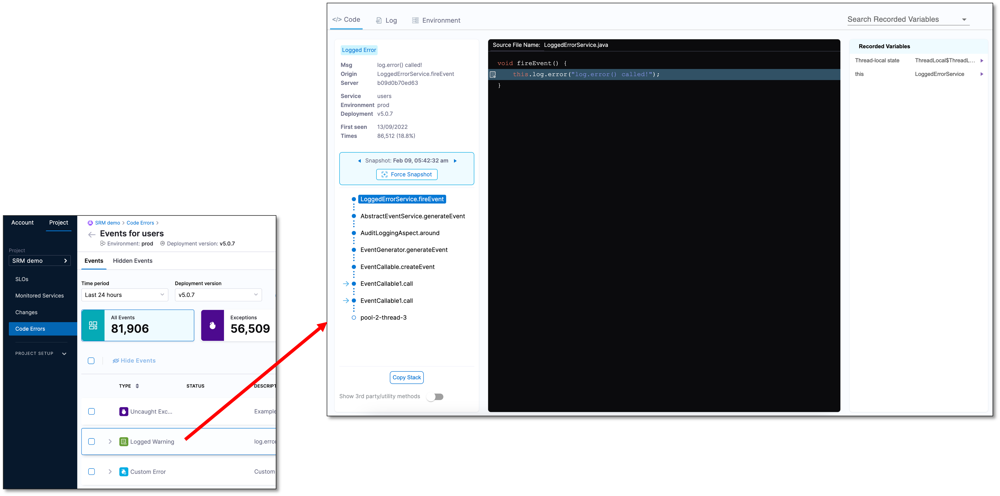
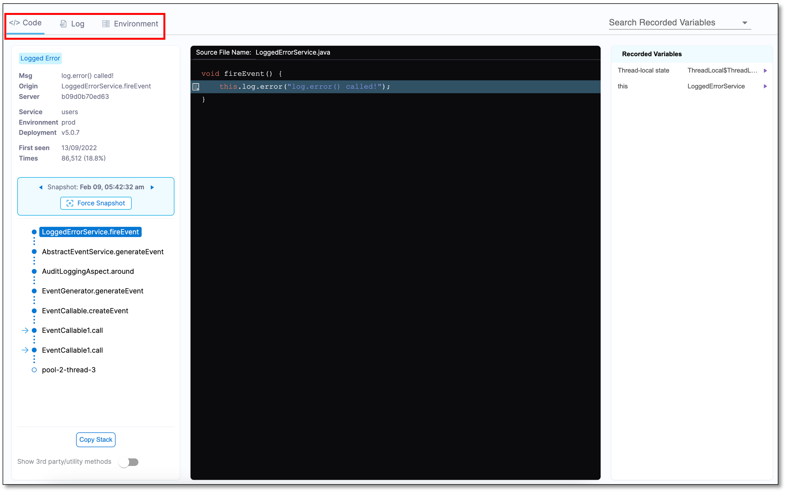
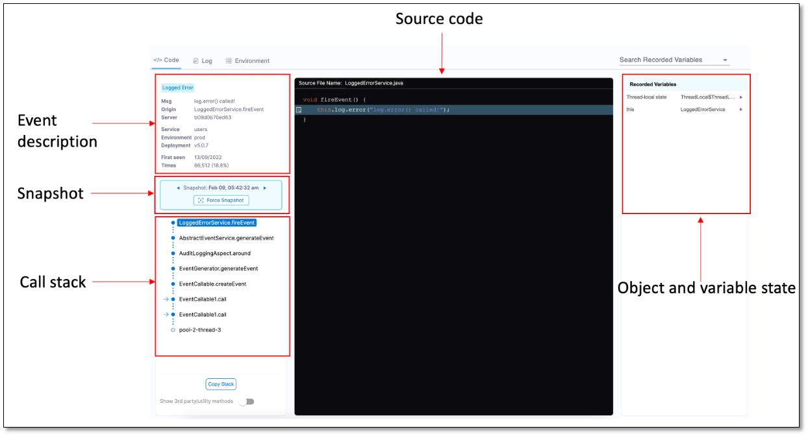
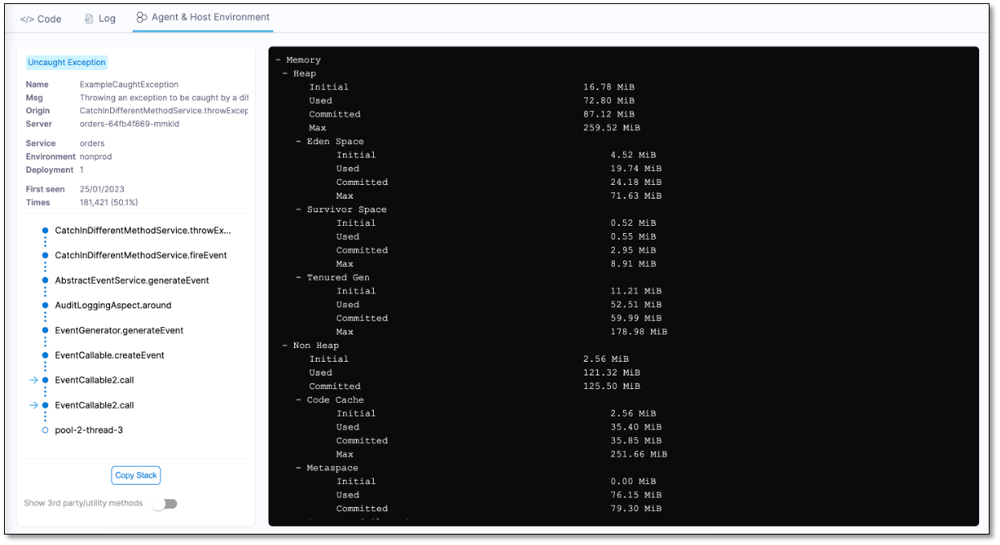

# **Error Tracking**

:::note
Currently, this feature is behind the feature flag `SRM_ET_EXPERIMENTAL`. Contact [Harness Support](mailto:support@harness.io) to enable the feature.
:::

Error Tracking is a continuous reliability solution in the Harness [Service Reliability Management (SRM)](https://developer.harness.io/docs/service-reliability-management/howtos-service-reliability-management/service-reliability-management-basics#sort=relevancy&f:@commonsource=%5BNextGen%20Docs%5D) module that enables developers to identify, triage, and resolve errors in applications. This helps in implementing rapid code changes by ensuring that the code is always in a deployable state.

## Overview

With the increase in release velocity, the risk to code quality also increases. Using Harness Error Tracking, as a developer, you can:

* Quickly identify and address any critical issues during each release with real-time notifications sent to email and Slack channels - ensuring that the right people can make the right decisions fast.
* Deepen understanding of your Java applications in all environments, from production to development, testing, and staging, through code level visibility.
* Automate issue root cause analysis at runtime, eliminating the need for manual log analysis to identify critical errors.
* Quickly and accurately identify and fix detected issues with Automated Root Cause Analysis (ARC) screen, leveraging source code, variable values, environment state of the host/container, and DEBUG level logs to get the full context.
* Integrate the ARC screen with existing tools including APMs, log analyzers, and issue tracking software.

Harness Error Tracking consists of an Error Tracking Agent that runs on a Java Virtual Machine (JVM). It monitors the Java applications for run-time exceptions, log events, and the custom events that you set up. When an exception or an event occurs, the Agent sends the statistics and snapshots to a monitored service on Harness SRM. SRM analyzes the data using Machine Learning (ML) and provides deep insights via comprehensive dashboards such as the Event List and ARC.

This quickstart describes how to set up a monitored service in Harness and install an Error Tracking Agent on a JVM to identify and troubleshoot errors and exceptions in your code.

## Add a monitored service

A Harness Monitored Service is a combination of service and environment. Harness monitors the following via a monitored service:

* Code-level exceptions and errors from the data collected by the Error Tracking Agent.
* Changes such as deployments, incidents such as PagerDuty, and infrastructure changes such as Kubernetes events and auditing.
* Health trend deviations using logs and metrics obtained from the APM and logging tools.

The following steps explain how to create a monitored service, and define service and environments for tracking code errors and exceptions: 

1. In your Harness project, navigate to the **Service Reliability Management** module, and then select **Monitored Services**.

    

2. Select **+ New Monitored Service**. 

    The Create new monitored service settings page appears.

3. In the **Overview** section, enter the following information:
    * **Type**: Select **Application**.
    * **Create or select a Service**: Select a Harness service that you want to monitor. A Harness service is a logical representation of your microservices and other workloads that you want to monitor.

      To create a new service, perform the following steps:
        
      1. Select **+ Add New**.
        
            The New Service dialog appears.
      2. Enter the following information, and then select **Save**:
       
          *  **Name** : Enter a name for the service. For example, _sample_service_.
          *  **Description (Optional)**
          *  **Tag (Optional)** 

    * **Create or Select an Environment**: Choose an appropriate environment. Environments represent your deployment targets such as QA, Prod, and so on.
  
        To create a new environment, perform the following steps:
    
      1. Select **+ Add New**. 
     
         The New Environment dialog appears.
      2. Enter the following information and then select **Save**:

            * **Name**: Enter a name for the environment.
            * **Description (Optional)**
            * **Tag (Optional)**
            * **Environment Type**: Select an environment type. The available options are **Production** and **Non-Production**.

    Harness autopopulates the **Monitored Service Name** field by combining the **Service** and **Environment** names.

4. Select **Save**.
 
   You can view the new monitored service in the **Monitored Services** list. 

    

## Create a token for the Error Tracking Agent

To create a token, perform the following steps:

1. Expand **PROJECT SETUP** and then select **Code Error Settings**.
   
2. On the top right-hand corner, select **Tokens**.
       
     

3. Select **Generate New Token**. 
    
    The New Token dialog appears. 

4. Enter a **Name** for the token.

5. Select **Generate**.
   A new authentication token is generated and displayed in the **Key** field.

6. Copy the token to clipboard. This token is used in the Error Tracking Agent configuration file.  

    

7. Select **Close**.

   The newly created token is added to the list of tokens.

:::note
You can copy the token anytime by selecting the clipboard icon.
:::

## Install an Error Tracking Agent

The Harness Error Tracking Agent should be installed on a Java application to capture program code and variables. This native agent library is attached to the Java Virtual Machine (JVM)/Common Language Runtime (CLR) during runtime. It can be deployed into any Kubernetes container without altering the image. The Agent fingerprints the program code loaded into the JVM/CLR and captures the complete state of the code and the host/container in order to identify anomalies.

For more information on installing the error tracking agent, go to [Install an Error Tracking Agent](https://developer.harness.io/docs/service-reliability-management/use-service-reliability-management/error-tracking-category/install-the-error-tracking-agent).

## Verify Agent connection

After installing Error Tracking Agent, you should verify that it is connected to Harness SRM. To verify the Error Tracking Agent connection, do the following:

1. Expand **PROJECT SETUP** and then select **Code Error Settings**.  
   
   
 
    A comprehensive list of Error Tracking Agents is displayed along with the information such as service name, environment, deployment version, Agent version, Agent status, token name, and so on. Ensure that the Agent that you installed is listed, and the status is **CONNECTED**.

   

## View Error Tracking dashboard

The Error Tracking dashboard displays a comprehensive list of all the monitored services. To go to the Error Tracking dashboard, in Harness, go to **Service Reliability Management**, and then select **Code Errors**.

By default, the dashboard displays the data for the last 24 hours time period. You can customize the dashboard using the following filters:

* **Time period**: Choose a period for which you want to see the data. The default option is **Last 24 hours**.
* **Services**: Choose a service to see its data. You can select multiple services. The default option is **All**.
* **Environment**: Choose an environment to see its data. You can select multiple environments. The default option is **All**.
* **Deployment version**: Choose a deployment version in order to view the data associated with the monitored services of that specific version. You can select multiple deployment versions. The default option is **All**.

Based on the filter settings, the dashboard displays the total number of services being monitored by Error Tracking and the number of services that have generated new events. An event is considered as new if it is observed for the first time in a monitored service.

## View Event List

The Event List screen displays a summary of the total events, exceptions, log events, HTTP errors, and custom errors. It also displays a list of all the events. Each row provides deep contextual information about the event type, its location in the code, and impact in terms of volume and spread across the service. You can customize the Event List screen using the following filters:

* **Time period**: Choose a period for which you want to see the events. The default option is **Last 24 hours**.
* **Deployment version**: Choose a deployment version in order to view the events associated with that specific version.

To view the Event List, do the following:

1. On the Error Tracking dashboard, select a monitored service. The list of events captured by that monitored service is displayed.

The Event List displays the following information:

* **Type**: Displays the event type. The event type can be one of the following:
  * Caught Exception - Exceptions captured and handled by the user’s service.
  * Uncaught Exception - Exceptions that were not captured by the user’s service.
  * Swallowed Exception - Exceptions that were captured but ignored by the user’s service.
  * Log Error	- Events logged as errors in the user’s service.
  * Log Warning - Events logged as warnings in the user’s service.
  * HTTP Error - HTTP communication errors.
  * Custom Errors - Events that occur in the custom SDK. 

* **Description:** Name of the event. In case of an exception, this is the exception class name. For example, AmazonException, NullPointerException, and so on. You can see the complete exception message of an event by hovering over the **Description** field.

* **Location**: Service class and method in which the event occurred. You can also view the actual line of code in which the error occurred even if the error was caused by a third party or core JDK framework. This can help you quickly identify the root cause of the error. Event location can also be filtered according to packages.

* **Count**: Number of times the event has occurred in the selected time period. This value indicates the severity of the event.

* **Error Rate**: Percentage of time the event occurs in comparison to all the calls made to the event's location. This is calculated by dividing the number of occurrences by the total number of calls to that location.

* **First Seen**: Time when the event was first detected in the environment.

* **Last Seen**: Last time this event was detected in the environment. This value indicates whether the event is still impacting your application.

* **Impacted Services**: List of monitored services in which the event was detected. For example, Producer-Service, Consumer-Service, Web-frontend, and so on.

## Automated Root Cause (ARC) screen

The Automated Root Cause (ARC) screen provides a powerful mechanism to get to the root of events in production and staging environments. 

To view the ARC screen, do the following:

1. On the Events List, select an event. The ARC screen for that event appears.

The ARC screen is divided into following tabs to help you create a complete picture of the event.

* Code
* Log
* Environment

## Understand ARC screen
import Tabs from '@theme/Tabs';
import TabItem from '@theme/TabItem';

<Tabs>
  <TabItem value="code" label="Code" default>

Information displayed in the Code view is divided into following categories:

#### Event description

ARC displays the following information related to an event:

* Origin of the error and the error message it throws.
* Date on which the error was first identified and the number of times it appeared.
* Type of event.
* Number of times the event occurred. 
* Source code, which is a decompiled Java version of the bytecode, being executed in the JVM when the event occurred.

#### Snapshot

Error Tracking captures snapshots when events, application errors (exceptions), and logs (warnings and errors) occur according to a defined algorithm.

An Error Tracking snapshot contains valuable information about events in the monitored application. This includes:

* Date and time of the snapshot
* The server and application where the event occurred
* The deployment where the event was captured
* The full call stack
* The source code

#### Forced snapshot

You can use the **Force Snapshot** option to take a snapshot the next time the same event occurs.

#### Call stack

To understand and resolve errors, it is important to be able to trace their path through the code. The ARC screen provides a comprehensive call stack trace, covering the entry point to the method in which the event occurred, even if the source code spans across multiple machines.

Error Tracking enables tracing of the code and variable state associated with the event all the way back to the initiation point, where the parameters were passed. If the event involves calls across multiple machines, ARC displays a unified call stack. 

Select a method in the call stack to see its source code.

The call stack displays the chain of methods within the environment leading up to the event. The first method in the line is the last method on a non-third party code within your application.

When an exception is caught and re-thrown once or multiple times within the thread, the **Related Errors** dropdown displays the error analysis. This feature is available only when such exceptions exist.

#### Third party utilities and methods

At the bottom of the stack, the machine name and the environment thread name in which the error occurred are displayed. By default, the third party code is hidden. To display the third party code, turn on the **Show 3rd party/utility methods** option. To copy the full stack to the clipboard, select **Copy Stack**.

#### Source code

The source code pane displays a decompiled Java version of the bytecode being executed within the JVM when the event occurred. The row in which the event occurred is highlighted.

#### Object and variable state

The **Recorded Variables** section displays the variable values and objects accessible from the method. It displays all the local variables and parameters including `this` in the non-static methods. The first method also contains thread-local variables defined for this thread as well as SLF4J and Log4J Mapped Diagnostics Context (MDC) values. The MDC objects are often too large for the full set of data to be available in the log. However, the Error Tracking Agent is capable of capturing and recording the entire object.

In some scenarios, such as asynchronous message passing, the MDC objects contain a key-value map of the recorded requests, initial servlet information, and much more. However, back tracing the source of a bad request in an asynchronous environment is a known challenge. Error Tracking helps you overcome this challenge by providing extended visibility into MDC.

The choice of the collected variables most relevant within an allocated timeframe is determined by the Error Tracking Agent using an adaptive machine learning algorithm. The selection process is based on which and how many variables to collect, the number of items to collect, the length of string to capture, and so on.

</TabItem>

<TabItem value="log" label="Log">
    

#### Log level

The Log view displays the last 250 log statements leading up to the event. The log statements are collected directly from JVM/CLR memory. This ensures that DEBUG, TRACE, and INFO statements are visible even when they are not logged to a file.  

The error or exception lines are displayed first, followed by the Stack Trace. Error Tracking also displays the context of the event, by highlighting the beginning of the relevant transaction in which the event occurred.

:::note
Log4j2 allows you to create custom log levels and names, however, Error Tracking reports only on log levels that are equal to or less than 300 (&#8804; 300).
:::

#### Missing log statements

The table bellow describes the various missing log statement you may come across in the Log tab.

| Message                                                                                                                                                                                | Cause                                    |
| :------------------------------------------------------------------------------------------------------------------------------------------------------------------------------------- | :--------------------------------------- |
| This snapshot was taken before log views were introduced. Please try viewing a more recent snapshot.                                                                                   | The snapshot is out-of-date.             |
| No log messages have been recorded for this snapshot.                                                                                                                                  | No Log messages were detected.           |
| Log view is not available due to Storage Server error at the time of this snapshot. Please check storage server connectivity and status                                                | Storage server error.                    |
| No supported Logging framework was detected. Check out our documentation for supported frameworks list                                                                                 | Supported log provider was not detected. |
| Ooops, something went wrong… An error has occurred while recording log messages for this snapshot. Please try viewing another snapshot.                                                | Cerebro exception or Unknown error.      |
| No log messages were detected for current entry point. This might also occur during new event initialization - in this case log messages will be captured starting from next snapshot. | Context or transaction data is missing.  |

  </TabItem>

  <TabItem value="environment" label="Environment">
    
    The Environment view displays the internal environment state when the event occurred. This includes memory usage (heap and non-heap), basic system information, CPU usage, and so on.

  </TabItem>
</Tabs>