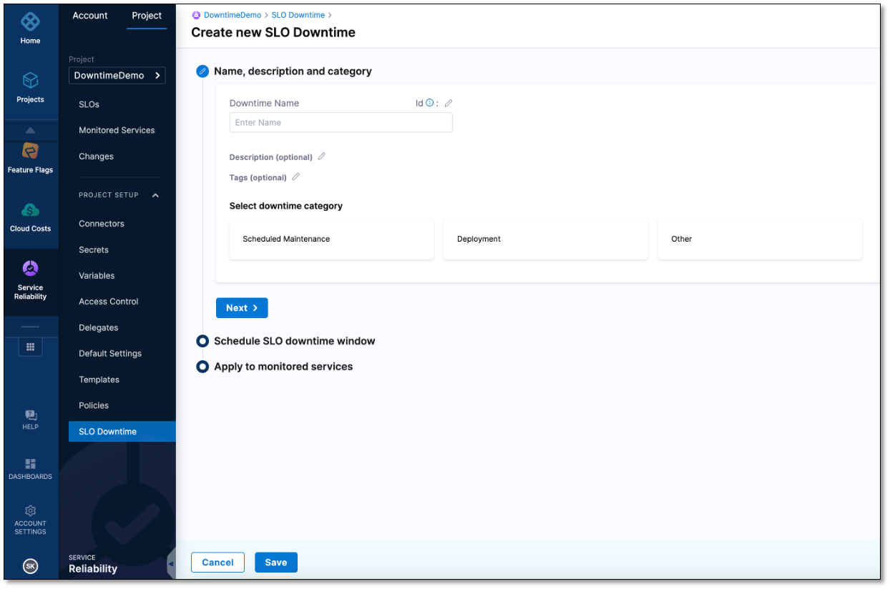
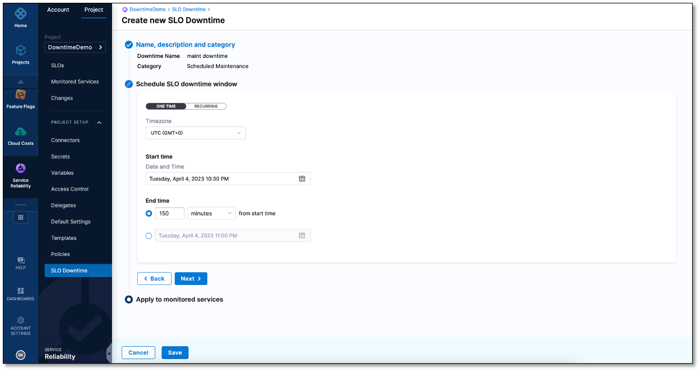

:::info note
Currently, this feature is behind the feature flag `SRM_DOWNTIME`. Contact [Harness Support](mailto:support@harness.io) to enable the feature.
:::

## Create new SLO downtime

To configure downtime for an SLO:

1. In your Harness project, navigate to the **Service Reliability Management** module, expand **PROJECT SETUP**, and then select **SLO Downtime**.  
   The SLO Downtime page appears.
2. Select **+ Downtime**.  
   The Create new SLO Downtime page appears.
   
   

### Name, description, and category

In the **Name, description and category** section, enter the following information:

1. In **Downtime Name**, enter a name for the downtime.
2. Optionally, you can add a description in the **Description (Optional)** field. You can also attach a tag to the downtime. To attach a tag, select the pencil icon next to the **Tags (Optional)** field, type a tag name, and then press enter.
3. In the **Select downtime category** section, chose a category that suits the reason for downtime. Available options are:
   
    - **Scheduled Maintenance**
    - **Deployment**
    - **Other**

4. Select **Next** to go to the **Schedule SLO downtime window** section.

### Schedule SLO downtime window

Specify the start and end time for the downtime. You can choose to set the downtime for a single, **ONE TIME** event, or for a **RECURRING** schedule, such as daily, weekly, or monthly. 

1. Select the scheduling type. You can choose one of the following options:
   - **ONE TIME**: Select this option to set the downtime for a single, one time event.
   - **RECURRING**: Select this option to set the downtime for a recurring schedule, such as daily, weekly, or monthly.

2. Based on the downtime scheduling type you select, perform the following steps:
   

#### ONE TIME

1. From the **Timezone** dropdown list, select the timezone in which you want to schedule SLO maintenance.
2. Under **Start time**, configure the start date and time for the SLO downtime.
3. Under **End time**, you can configure when the SLO downtime should end in one of the following ways:

- **End after a certain length of time**  
  To set this, under **End time**, select the **From Start Time** option. Then, choose the unit of time (minutes, hours, days, or weeks) and the duration you want to set for the downtime to end.
  
  Let's say you want to schedule a one-time SLO downtime for 2 hours and 30 minutes. You have already specified the start time for the downtime in the **Start time** field. In the **From Start Time** field, you would select or enter 150 and then select **minutes** from the dropdown menu next to it. The end time for the SLO downtime will be automatically calculated based on the duration you set and the start time you specified.

  

- **End on a specific date and time**  
  To set this, under **End time** select the radio button for the **Date and Time** option. Then, select the calendar icon to choose the date and time on which the SLO downtime should end.
  
  Let's say you want to schedule a one-time SLO downtime that ends on April 15, 2023 at 6:00 PM UTC. You have already specified the start time for the downtime in the Start time field. Under **End time**, select the radio button for the **Date and Time** option. Then, select the calendar icon next to the field to open the calendar picker. In the calendar picker, navigate to April 15, 2023 and select the date. Then, select 6:00 PM from the time picker.

  

#### RECURRING

1. From the **Timezone** dropdown list, select the timezone in which you want to schedule SLO maintenance.
2. Under **Start time**, set the start date and time for the SLO downtime.
3. Under **Duration**, enter the duration of each downtime window and choose the unit of time (minutes, hours, days, or weeks).
4. Under **Repeat every**, select how frequently you want the downtime to repeat (daily, weekly, or monthly).
5. In the **Repeat ends on** section, select the calendar icon to choose the date and time on which you want the recurring downtime to end. This is the date and time when the recurring downtime will stop repeating.

Let's say you want to schedule recurring SLO downtime every week between 10 PM and 6 AM for a period of one month, starting on April 1st, 2023. You can configure it as follows:

1. **Timezone**: Choose your timezone, for example, "Eastern Standard Time".
2. **Start time**: Set the start date and time to April 1st, 2023, at 10 PM.
3. **Duration**: Set the duration of each downtime window to 8 hours (since the downtime will occur between 10 PM and 6 AM).
4. **Repeat every**: Enter 1 in the text field and then select **weekly**.
5. **Repeat ends on**: Set the end date to April 30th, 2023, at 6 AM. This is the date and time when the recurring downtime will stop repeating.

### Apply to monitored services

You can apply the SLO downtime to all existing monitored services, including services that will be created in the future, or to specific monitored services.

#### Apply SLO downtime to specific monitored services

To apply SLO downtime to specific monitored services:

1. Select the **Select Monitored Services** button.  
   The Select Monitored Services dialog appears.
2. Choose the monitored services to which you want to apply the SLO downtime from the list.
   You can filter the monitored services list by using the **Environment** filter.
3. Select **Apply**.

#### Apply to all monitored services
To apply SLO downtime to all existing and future monitored services, select the **Apply the downtime to all existing and future services** option.

### Save

Select the **Save** button to save the SLO downtime configuration.  
The SLO down appears on the SLO Downtime page.

## Next steps

[View all your configured SLO downtimes and history.](./slo-downtime-page.md)