# Build, test, and publish a NodeJS app

```mdx-code-block
import Tabs from '@theme/Tabs';
import TabItem from '@theme/TabItem';
import DelegateInstall from '/tutorials/platform/install-delegate.md';
import CISignupTip from '/tutorials/shared/ci-signup-tip.md';
```

In this tutorial, you will create a Harness CI pipeline that does the following:

1. Test a NodeJS application.
2. Build and publish a Docker image of that app.

<CISignupTip />

<details>
<summary>What is Continuous Integration?</summary>

[Continuous Integration](https://harness.io/blog/continuous-integration/what-is-continuous-integration/) is a DevOps process based on automated builds that are be triggered by some sort of event, such as a code check-in, merge, or a time schedule. According to [Paul Duvall](https://www.oreilly.com/library/view/continuous-integration-improving/9780321336385/), co-author of Continuous Integration, CI should improve quality and reduce risk. Having a Continuous Integration approach removes the burden of manual builds and also makes builds more repeatable, consistent, and available.

#### Manual vs CI builds

When you build without a CI platform, you deliberately run commands to clone the codebase, install or configure dependencies, compile the code, run tests, and then, usually, package and publish an image to a container registry. When you need to build multiple times per day or you have tens, hundreds, or even thousands of developers running builds, you need the ability to run builds quickly and automatically on build infrastructure that is more substantial and diverse than a single developer's machine.

In a CI platform, such as Harness CI, you create a workflow or pipeline that includes the steps to build and package your application or service. You also specify where your source code exists (such as an SCM repo), and you ensure that the build infrastructure, such as a virtual machine or Kubernetes cluster, has all the required dependencies to build your code. The CI pipeline can then use this information to run builds automatically.

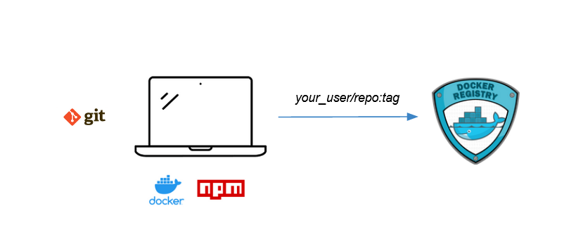

#### Sharing images

Eventually, the products of your builds are deployed somewhere, and the main goal of Continuous Integration is to build and publish a deployable unit, which can be referred to as an image, artifact, or release candidate.

A release candidate is the final form of an artifact to be deployed, and this often includes more than compiled source code. For example, there could be quality steps taken to produce the artifact, such as finding and fixing bugs. Additionally, packaging, distribution, and configuration all go into a release candidate.

Once you've prepared a release candidate, you want to share it with your teammates or customers. Like any file you want to share with the world, storing it externally makes it more accessible. There are many options for packaging and sharing images, such as Docker. A big benefit to the Docker packaging format is the broad ecosystem of Docker registries. Your organization might have a registry provider, or your can use a free registry, such as [Docker Hub](https://hub.docker.com/).


</details>

<details>
<summary>Optional exercise: Build locally</summary>

As an optional exercise, you can build the app used in this tutorial locally before creating a Harness CI pipeline to build and test it automatically.

The codebase used in this tutorial is a [simple NodeJS app](https://github.com/harness-apps/easy-node-docker) that can be built into a Docker image. The Dockerfile has specifics on building and packaging the app.


To build this app locally:

1. Clone the [easy node docker repo](https://github.com/harness-apps/easy-node-docker) to your local machine.
2. Create a Docker Hub account, if you don't already have a Docker registry account.
3. Create a repo in your Docker registry account where you can push your app image.
4. Make sure your local machine has [NPM](https://nodejs.org/en/download/package-manager) and [Docker](https://docs.docker.com/engine/install/).
5. Use [docker build](https://docs.docker.com/build/building/context/) to call the underlying NPM install and start the build process. In the following example commands, replace the bracketed values with your Docker Hub or Docker registry username, the name of the repo where you want to push the image, and an appropriate image tag, such as `latest`.

   ```
   docker build --tag [your_docker_username]/[your-docker-repo-name]:[tag] .
   docker push [your_docker_username]/[your-docker-repo-name]:[tag]
   ```

6. After the build and push commands run, you can verify that the image has been uploaded to your Docker repo.
Can validate that this has been placed into the Docker Registry.


If you took a closer look at what your machine was doing during the local build, the machine was bogged down for a few moments. When building once, for yourself, that is fine, but the resource burden explodes when running multiple concurrent builds at scale to support tens, hundreds, or thousands of developers. Modern Continuous Integration platforms are designed to scale with distributed nodes. Harness CI is designed to scale and simplify the process of externalizing your build process into a CI pipeline. Replicating your workflows into Harness CI pipelines creates repeatable, consistent, and distributed build processes.

The remainder of this tutorial walks you through the process of creating a Harness CI pipeline that builds, tests, and publishes the NodeJS app that you just built manually.

</details>

## Prepare the codebase

1. Fork the [easy node docker tutorial repo](https://github.com/harness-apps/easy-node-docker) into your GitHub account.
2. Create a GitHub personal access token with the `repo`, `admin:repo_hook`, and `user` scopes. For instructions, go to the GitHub documentation on [creating a personal access token](https://docs.github.com/en/authentication/keeping-your-account-and-data-secure/creating-a-personal-access-token). For information about the token's purpose in Harness, go to the [GitHub connector settings reference](/docs/platform/Connectors/Code-Repositories/ref-source-repo-provider/git-hub-connector-settings-reference#personal-access-token).

   

3. Copy the token so you can use it when you create the GitHub connector in the next steps.
4. In Harness, select the **Continuous Integration** module and then switch to the **Project** you want to use for this tutorial or create a project.

<details>
<summary>Create a project</summary>

Use these steps to create a project in your Harness account.

1. Select **Projects**, select **All Projects**, and then select **New Project**.
2. Enter a **Name**, such as `CI tutorials`.
3. Leave the **Organization** as **default**.
4. Select **Save and Continue**.
5. On **Invite Collaborators**, you can add others to your project, if desired. You don't need to add yourself.
6. Select **Save and Continue**.
7. On the Modules page, select **Continuous Integration**, and then select **Go to Module**.

If this is your first project with CI, the CI pipeline wizard starts after you select **Go to Module**. You'll need to exit the wizard to create the GitHub connector.

</details>

### Create the GitHub connector

Next, you'll create a _connector_ that allows Harness to connect to your Git codebase. A connector is a configurable object that connects to an external resource automatically while the pipeline runs. For detailed instructions on creating GitHub connectors, go to [Add a GitHub connector](/docs/platform/Connectors/Code-Repositories/add-a-git-hub-connector). For details about GitHub connector settings, go to the [GitHub connector settings reference](/docs/platform/Connectors/Code-Repositories/ref-source-repo-provider/git-hub-connector-settings-reference).

1. Under **Project Setup**, select **Connectors**.
2. Select **New Connector**, and then select **GitHub** under **Code Repositories**.
3. Enter a **Name**, and select **Continue**.
4. Configure the **Details** as follows, and then select **Continue**:

   * **URL Type:** Select **Repository**.
   * **Connection Type:** Select **HTTP**.
   * **GitHub Repository URL:** Enter the URL to your fork of the tutorial repo.

5. Configure the **Credentials** as follows, and then select **Continue**:

   * **Username:** Enter the username for the GitHub account where you forked the tutorial repo.
   * **Personal Access Token:** Create a secret for the personal access token you created earlier. Harness secrets are safe; they're stored in the [Harness Secret Manager](/docs/platform/Secrets/Secrets-Management/harness-secret-manager-overview). You can also use your own Secret Manager with Harness.
   * **Enable API access:** Select this option and select the same personal access token secret.

6. For **Select Connectivity Mode**, select **Connect through Harness Platform**, and then select **Save and Continue**.
7. Wait while Harness tests the connection, and then select **Finish**.

## Prepare the Docker registry

For this tutorial, you'll need a Docker connector to allow Harness to authenticate and publish the NodeJS app image to a Docker registry repository. This tutorial uses Docker Hub for the Docker registry, but you can use other Docker registries with Harness.

1. Create a [Docker Hub](https://hub.docker.com/) account if you don't have one already.
2. Create a repo called `samplejs` in your Docker Hub account.
3. Create a Docker Hub personal access token with **Read, Write, Delete** permissions. Copy the token; you need it when you create the Docker Hub connector in the next steps.
4. In Harness, select the **Continuous Integration** module, and then select your project.
5. Under **Project Setup**, select **Connectors**.
6. Select **New Connector**, and then select **Docker Registry**.
7. Configure the [Docker connector settings](/docs/platform/Connectors/Cloud-providers/ref-cloud-providers/docker-registry-connector-settings-reference) as follows:

   * **Name:** Enter a name.
   * **Provider Type:** Select **DockerHub**.
   * **Docker Registry URL:** Enter `https://index.docker.io/v2/`.
   * **Username:** Enter the username for your Docker Hub account.
   * **Password:** Create a [secret](/docs/platform/Secrets/add-use-text-secrets) for your Docker Hub personal access token.
   * **Select Connectivity Mode:** Select **Connect through Harness Platform**.
   * Select **Save and Continue**, wait for the connectivity test to run, and then select **Finish**.

8. In the list of connectors, make a note of your Docker connector's ID.

## Create the Java starter pipeline

1. Under **Project Setup**, select **Get Started**.
2. When prompted to select a repository, search for **easy-node-docker**, select the repository that you forked earlier, and then select **Configure Pipeline**.
3. Under **Choose a Starter Configuration**, select **Java with Maven** and then select **Create a Pipeline**.

<details>
<summary>Java with Maven starter pipeline YAML</summary>

The YAML for the **Java with Maven** starter pipeline is as follows. To switch to the YAML editor, select **YAML** at the top of the Pipeline Studio.

```yaml
pipeline:
  name: Build Java with Maven
  identifier: Build_Java_with_Maven
  projectIdentifier: [your-project-ID]
  orgIdentifier: default
  properties:
    ci:
      codebase:
        connectorRef: [your-github-connector]
        repoName: [your-github-account]/easy-node-docker
        build: <+input>
  stages:
    - stage:
        name: Build Java App with Maven
        identifier: Build_Java_App_with_Maven
        description: ""
        type: CI
        spec:
          cloneCodebase: true
          platform:
            os: Linux
            arch: Amd64
          runtime:
            type: Cloud
            spec: {}
          execution:
            steps:
              - step:
                  type: Run
                  name: Build Java App
                  identifier: Build_Java_App
                  spec:
                    shell: Sh
                    command: |-
                      echo "Welcome to Harness CI"
                      mvn -B package --file pom.xml
```

</details>


### Understand build infrastructure

This pipeline uses a Linux AMD64 machine on Harness Cloud build infrastructure, as declared in the stage's `platform` specifications.

```yaml
    - stage:
        ...
        spec:
          cloneCodebase: true
          platform:
            os: Linux
            arch: Amd64
          runtime:
            type: Cloud
            spec: {}
```

You can change the build infrastructure if you want to use a different OS, arch, or infrastructure. With Harness Cloud build infrastructure, your builds run on pre-configured machines provided by Harness. You can also run builds locally or bring your own VMs or Kubernetes cluster build infrastructure. For more information on build infrastructure options, go to [Which build infrastructure is right for me](/docs/continuous-integration/use-ci/set-up-build-infrastructure/which-build-infrastructure-is-right-for-me).

Regardless of the build infrastructure you choose, you must ensure the build farm can run the commands required by your pipeline. For example, this tutorial uses tools that are publicly available through Docker Hub or already installed on [Harness Cloud's preconfigured machines](/docs/continuous-integration/use-ci/set-up-build-infrastructure/use-harness-cloud-build-infrastructure#platforms-and-image-specifications).

In contrast, if you choose to [use a Kubernetes cluster build infrastructure](/docs/continuous-integration/use-ci/set-up-build-infrastructure/k8s-build-infrastructure/set-up-a-kubernetes-cluster-build-infrastructure) and your pipeline requires a tool that is not already available in the cluster, you can configure your pipeline to load those prerequisite tools when the build runs. There are several ways to do this in Harness CI, including:

* [Background steps](/docs/continuous-integration/use-ci/manage-dependencies/dependency-mgmt-strategies) for running dependent services.
* [Plugin steps](/docs/continuous-integration/use-ci/use-drone-plugins/explore-ci-plugins) to run templated scripts, such as GitHub Actions, BitBucket Integrations, or any Drone plugin.
* [Various caching options](/docs/continuous-integration/use-ci/caching-ci-data/share-ci-data-across-steps-and-stages) to load dependency caches.
* [Run steps](/docs/category/run-scripts) for running all manner of scripts and commands.


## Create Your First Pipeline

In the Build Module [Harness Continuous Integration], walking through the wizard is the fastest path to get your build running. Click Get Started. This will create a basic Pipeline for you.


Once you click Get Started, select GitHub as the repository you use, and then you can enter your GitHub Access Token that was created or being leveraged for the example.


Click Continue. Then click Select Repository to select the Repository that you want to build [the sample is called *easy-node-docker*].


Select the repository, then click Create Pipeline. The next step to focus on will be where you want to run the build by configuring the Pipeline. 

```mdx-code-block
<Tabs>
<TabItem value="Harness Hosted Build Infrastructure">
```
Can leverage one of the Starter Configs or create a Starter Pipeline. In this case if leveraging the example app which is NodeJS based, leveraging the Node.js Starter Configuration works fine. 


Click Continue to define what infrastructure to run the build on. To run on Harness Hosted Infrastructure, first change the Infrastructure to “Cloud”.

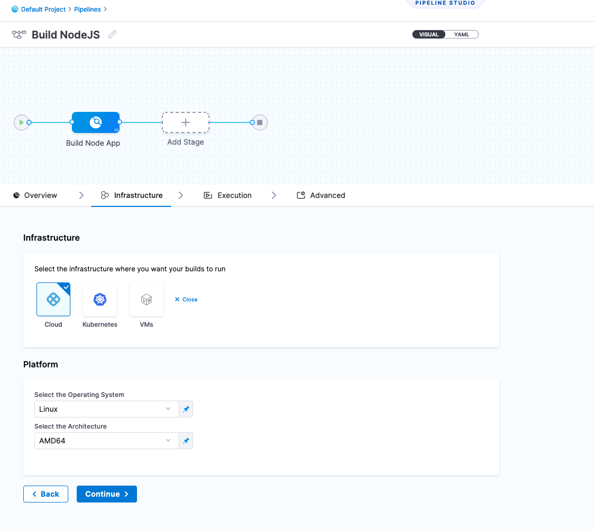

The scaffolding will take care of the NPM install for you. End goal would be to have a published Docker Image of your artifact. Can add an additional Step to take care of the Docker Push. 


Select “Build and Push” image to Docker Registry.


Next, create a new Docker Connector by clicking on + New Connector. 

* Name: `my_docker_hub_account`


Next fill out the details of your account credentials for a Docker Push. 


* Registry URL: https://index.docker.io/v2/
* Authentication: Username and Password
* Provider Type: DockerHub
* Username: `your_docker_hub_user`
* Password: `your_docker_hub_pw`

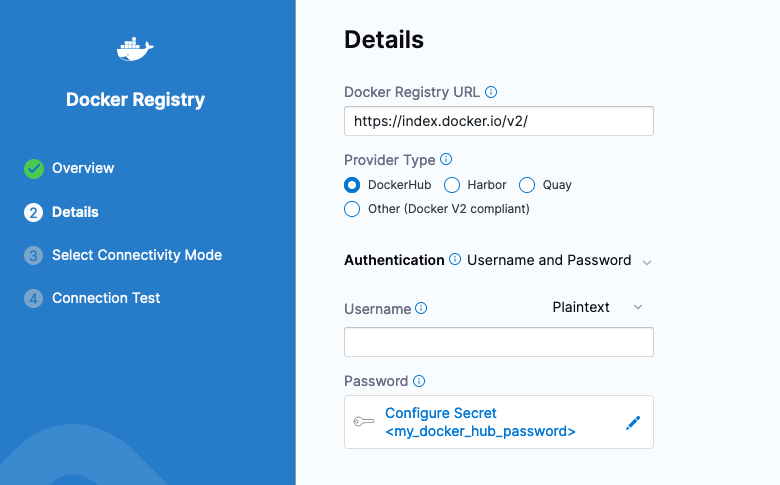

For sensitive items such as your Docker Hub password, these can be stored as a Harness Secret. 

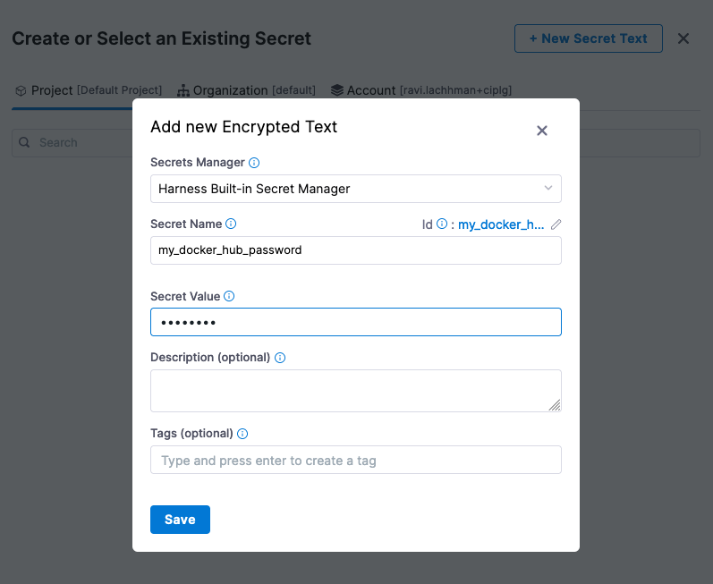

Click Save and Continue. You can run this connection directly from the Harness Platform. 


Once selected, you can run a connectivity test and you are ready to provide the registry details. 

* Name: docker_build_and_push
* Docker Connector: `my_docker_hub_account`
* Docker Repository: `<your_user>/<your_repository>`
* Tags: cibuilt

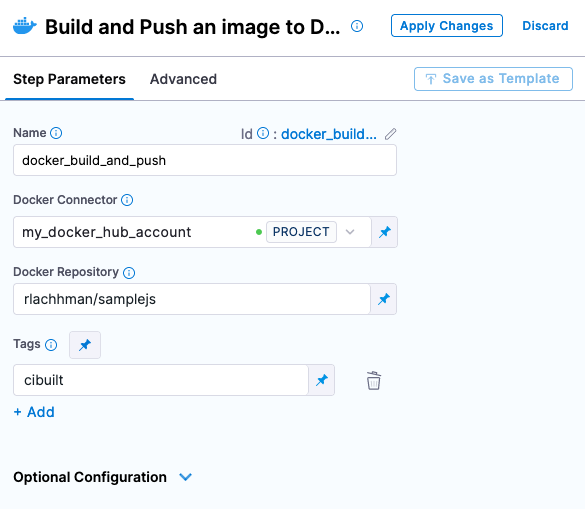

Click Apply Changes then Save. 


Now you are ready to run once saved. 

```mdx-code-block
</TabItem>
<TabItem value="Self-Managed Build Infrastructure">
```

If you want to use your own self-managed build infrastructure, then you should install the [Kubernetes Delegate](/tutorials/platform/install-delegate) in the Kubernetes cluster of your choice. 

<details>
<summary>Install Delegate</summary>
<DelegateInstall />
</details>

For the self-managed infrastructure, can leverage one of the Starter Configs or create a Starter Pipeline. In this case, can run the Starter Pipeline. 


Click Continue to start to build out the Pipeline. 


Click Continue to define what infrastructure to run the build on.

First change the infrastructure to “Kubernetes”.

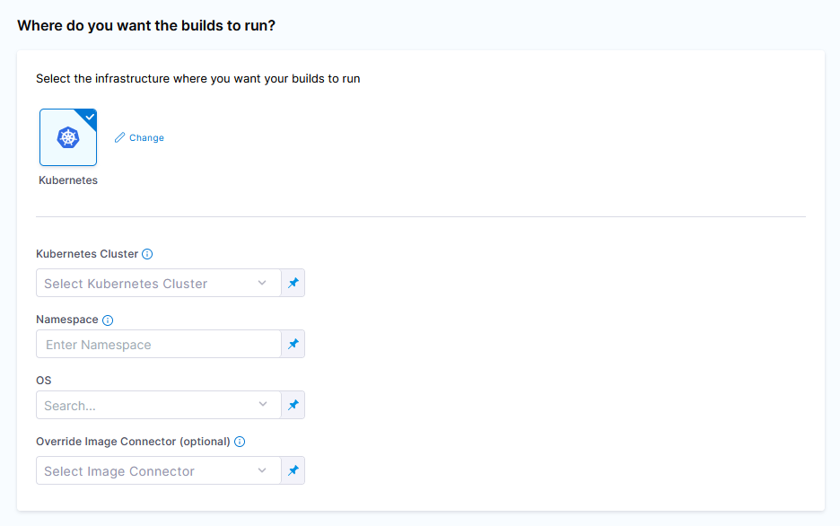

Then select the drop-down “Select Kubernetes Cluster”. Then + New Connector.


In the wizard, name the Kubernetes connection “myfirstcinode”.


Click continue. With Harness, you can use the same cluster the Harness Delegate is running on by selecting “Use Credentials of a specific Harness Delegate”. The Harness Delegate will facilitate all needed work on the Kubernetes cluster.


Click continue. Now select the Harness Delegate that corresponds to your Kubernetes cluster.


Click “Save and Continue” and the connection will be validated.
Back in the Pipeline Builder, “myfirstcinode” will be listed.

Provide a Namespace and OS to run.

- Namespace: default
- OS: Linux [if using Windows WSL, Linux is the correct setting].


After the Build Infrastructure is set, now time to set up the Push step to push the artifact to a Docker Registry. In the Pipeline View, click + Add Stage and create a Staged called “Push”.Then click on “Set Up Stage”.


Click on “Set Up Stage”.


In the setup of the Stage, can leverage the infrastructure that the previous artifact build was run on by selecting “Propagate from an existing stage”.


Click Continue now, you can add a Step to represent the Docker Push. Click “Add Step”.


Select “Build and Push” image to Docker Registry.

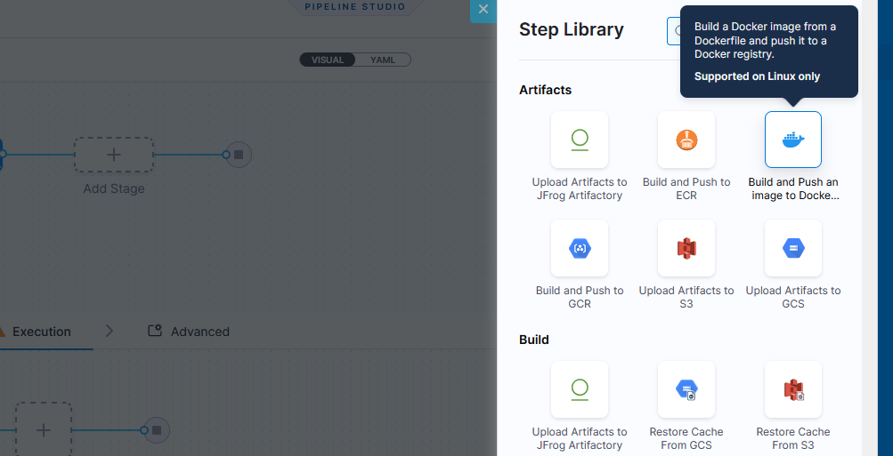

Can create a new Push connector.

Name: pushtodockerhub

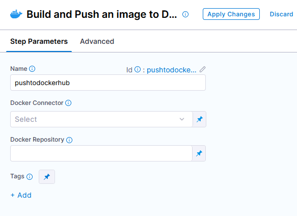

Next, set up the Docker Connector by clicking on the dropdown for Docker Connector.
Then create a new connector.


Can name the new docker registry connector “dockerhub”.

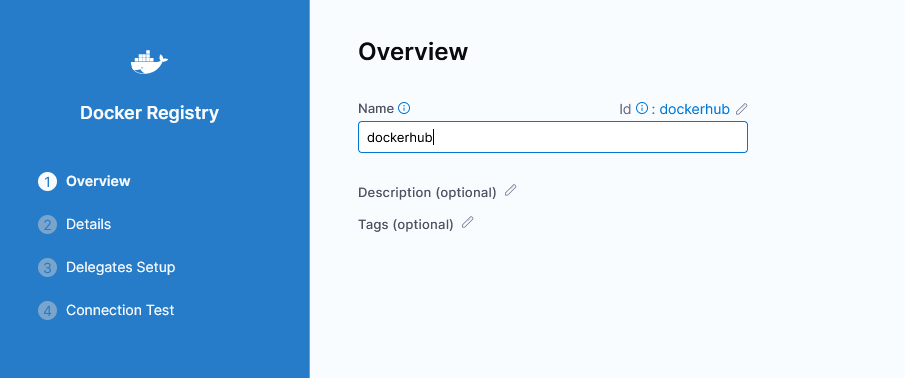

Click continue and can enter your credentials to Docker Hub.

- Provider Type: Docker Hub
- Docker Registry URL: https://registry.hub.docker.com/v2/
- Authentication: your_user
- Password: your_password [Will be saved as a Harness Secret]

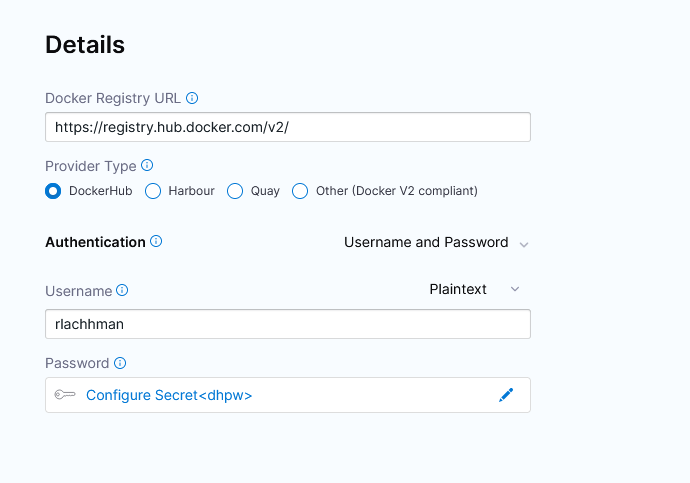

Click Continue and select the Harness Delegate to execute on. This will be your Kubernetes infrastructure.


Click Save and Continue, and the connection will validate.
Then click Finish. Lastly, enter your Docker Repository and Tag information.

- Docker Repository: `your_account/your_registry`
- Tags: cibuilt

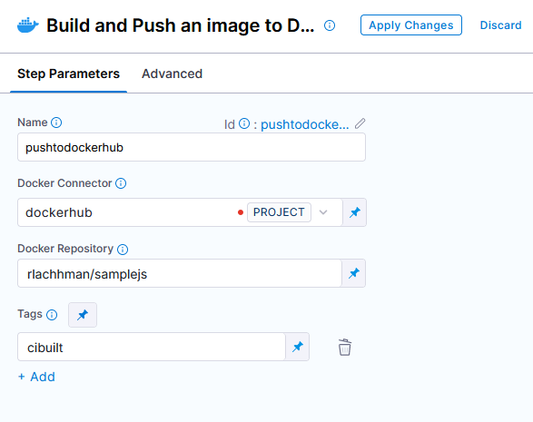

Then click “Apply Changes” and Save the Changes.


With those changes saved, you are ready to execute your first CI Pipeline.

```mdx-code-block
</TabItem>
</Tabs>
```
## Running Your First CI Pipeline

Executing is simple. Head back to your pipeline and click on “Run”. Unlike your local machine, where you had to wire in NPM and Docker dependencies, Harness CI will resolve these by convention.


Then you can select a branch to run off of and execute a step.
Branch Name: main [if using the example repo]


Now you are ready to execute. Click “Run Pipeline”.


Once a successful run, head back to Docker Hub, and `cibuilt` is there!


This is just the start of your Continuous Integration journey. It might seem like multiple steps to get your local build in the platform, but it unlocks the world of possibilities.

## Continuing on Your Continuous Integration Journey

You can now execute your builds whenever you want in a consistent fashion. Can modify the trigger to watch for SCM events so upon commit, for example, the Pipeline gets kicked off automatically. All of the objects you create are available for you to re-use. One part we did not touch upon in this example is executing your test suites, such as demonstrated in the [build and test on a Kubernetes cluster build infrastructure tutorial](/tutorials/ci-pipelines/build/kubernetes-build-farm). Lastly, you can even save your backing work / have it as part of your source code. Everything that you do in Harness is represented by YAML; feel free to store it as part of your project.

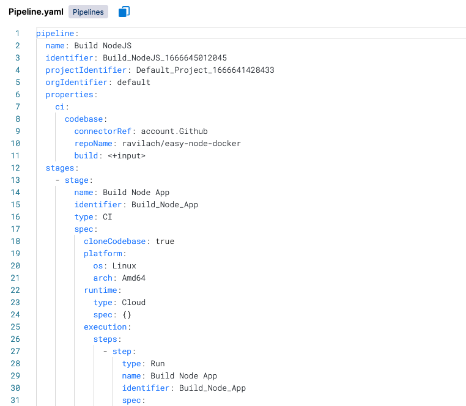

After you have built your artifact, the next step is to deploy your artifact. This is where Continuous Delivery steps in and make sure to check out some other [CD Tutorials](/tutorials/cd-pipelines#all-tutorials).
